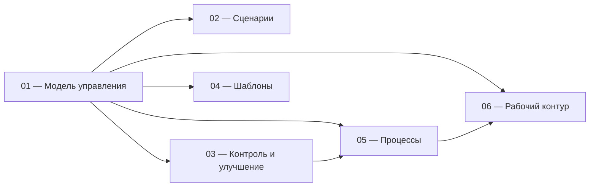

# Методика организации и управления рабочими процессами

Порядок управления обязательствами: от возникновения потребности до результата, контроля отклонений и изменения процесса.

**[Начать с модели управления →](docs/01-methodology.md)**

## Задача

Для каждого обязательства должно быть понятно:

- какой результат нужен;
- кто отвечает;
- какой срок;
- что выполняется сейчас;
- что находится в очереди или ожидании;
- где возникло отклонение;
- какие повторяющиеся или системные отклонения требуют изменения процесса.

## Разделы

| Раздел | Что внутри |
|---|---|
| **[01 — Модель управления](docs/01-methodology.md)** | единица работы, роли, состояния, сроки, приоритеты и границы решений |
| **[02 — Рабочие сценарии](docs/02-scripts.md)** | действия в типовых ситуациях |
| **[03 — Контроль и улучшение](docs/03-control.md)** | контроль отклонений и изменение процессов |
| **[04 — Шаблоны](docs/04-templates.md)** | формы карточек и рабочих комментариев |
| **[05 — Описание процессов](docs/05-processes.md)** | единая форма описания реальных процессов |
| **[06 — Настройка рабочего контура](docs/06-workspace.md)** | типы, состояния, категории, очереди, представления и связи |

## Как связаны документы

## Границы

Методика не задаёт:

- организационную структуру;
- внешние нормативы и сроки;
- содержание процессов конкретного подразделения;
- техническую матрицу прав;
- локальные значения правил.

Они определяются при внедрении.

---

**[Начать с модели управления →](docs/01-methodology.md)**

## Лицензия

[CC BY 4.0](LICENSE). Материалы можно использовать и адаптировать при указании источника.
