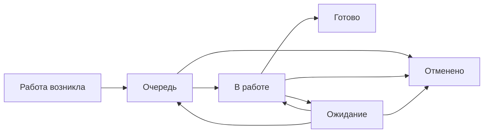

# Управление работой подразделения

Этот репозиторий описывает единый и обезличенный порядок управления работой в OpenProject Community.

Цель простая: **обязательная работа не теряется, её состояние видно без опроса людей, исключения быстро обнаруживаются, а повторяющиеся проблемы превращаются в улучшения**.

## Базовый поток

Для исполнителя смысл состояний буквальный:

- **Очередь** — сделать нужно, но сейчас работу никто не выполняет;
- **В работе** — работу реально выполняют сейчас;
- **Ожидание** — продолжать невозможно из-за внешней причины;
- **Готово** — обязательных действий по результату больше нет;
- **Отменено** — результат больше не требуется.

## Откуда появляется работа

Общий поток используется независимо от источника:

- входящий документ, письмо или обращение;
- самостоятельно инициированный запрос;
- плановая или периодическая работа;
- разовое поручение;
- задача внутри настоящего проекта;
- решение реализовать улучшение.

Идеи и предложения не смешиваются с обязательной работой и ведутся отдельно.

## Документы

1. [Правила управления работой](docs/01-methodology.md) — единица работы, роли, статусы, сроки, очередь, передача и проекты.
2. [Скрипты типовых ситуаций](docs/02-scripts.md) — что делать от появления работы до закрытия, ожидания, возврата и передачи.
3. [Контроль и управляемость](docs/03-control.md) — что смотреть исполнителю и руководителю, какие сигналы считаются проблемой.
4. [Шаблоны](docs/04-templates.md) — только те форматы, которые реально нужны в работе.
5. [Настройка OpenProject Community](docs/05-openproject.md) — минимальная конфигурация под эту методику.
6. [Каталог бизнес-процессов](docs/06-processes.md) — как одинаково описывать реальные процессы.

## Правила, которые не трактуются свободно

1. Одна работа — один самостоятельно контролируемый результат.
2. Письмо, файл, звонок или технический шаг сами по себе не являются отдельной работой.
3. После разбора обязательное действие не должно оставаться только в почте, чате или устной договорённости.
4. У открытой работы есть исполнитель или контролируемая групповая очередь.
5. `В работе` не используется как склад назначенных задач.
6. `Ожидание` применяется только при реальной внешней блокировке; владелец работы сохраняется.
7. Срок означает дату требуемого результата. Его нельзя переносить только для сокрытия просрочки.
8. Обычную работу исполнитель закрывает самостоятельно. Обязательной проверки перед `Готово` нет.
9. Ошибка первоначального результата — возврат исходной работы. Новый объём — новая работа.
10. Приоритет не заменяет срок. Критичность используется только для реального изменения порядка очереди.
11. Количество закрытых карточек не является рейтингом сотрудников.
12. Идея не является обязательством, пока не принято решение о реализации.

## Главный принцип

> **Минимум действий исполнителя — максимум достоверности состояния работы.**

Если новое правило, поле, статус, отчёт или шаблон не предотвращает потерю работы, не проясняет состояние или не сокращает ручной труд — оно не добавляется.