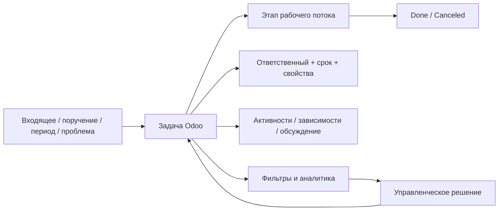

# Управление работой отдела в Odoo 19 Community

Практическая методика ведения операционной работы, контроля и аналитики в **стандартном Odoo 19 Community**.

Методика строится не вокруг абстрактной идеальной системы, а вокруг штатных возможностей, которые можно настроить и поддерживать через интерфейс Odoo без собственного модуля, Studio и обязательных сторонних дополнений.

**[Сначала — граница возможностей Odoo →](docs/00-odoo19-community.md)**  
**[Затем — модель управления →](docs/01-methodology.md)**

## Что должна давать система

Для каждой контролируемой работы должно быть понятно:

- какой результат нужен;
- кто отвечает за результат;
- какой конечный срок;
- где работа находится сейчас;
- что готово к выполнению;
- что ждёт внешнего действия;
- что заблокировано другой задачей;
- что просрочено или зависло;
- где возникает системная проблема процесса.

При этом данные должны повторно использоваться для контроля и аналитики, а не переноситься вручную в отдельный отчёт.

## Базовая архитектура

Основной объект учёта — **задача Odoo**. Один устойчивый операционный контур обычно ведётся в одном проекте. Отдельные проекты создаются не для каждого процесса, а только когда действительно нужна самостоятельная граница управления.

## Разделы

| Раздел | Что внутри |
|---|---|
| **[00 — Возможности Odoo 19 Community](docs/00-odoo19-community.md)** | что штатно используется, что не используется и где проходит техническая граница |
| **[01 — Модель управления](docs/01-methodology.md)** | задача, ответственность, этапы, статусы, сроки, приоритет, ожидание, периодика и масштаб работы |
| **[02 — Рабочие сценарии](docs/02-scripts.md)** | действия в типовых рабочих ситуациях |
| **[03 — Контроль и аналитика](docs/03-control.md)** | оперативные представления, показатели и разбор отклонений |
| **[04 — Шаблоны](docs/04-templates.md)** | минимальные формы задачи, ожидания и описания процесса |
| **[05 — Описание процессов](docs/05-processes.md)** | как описывать реальный процесс и отражать его в задачах |
| **[06 — Настройка Odoo](docs/06-workspace.md)** | конкретная конфигурация проекта, этапов, свойств, фильтров и функций |

## Главный принцип

Методика не пытается превратить Community в BPM-систему.

Если требование нельзя устойчиво реализовать штатными объектами Odoo и затем использовать в контроле или аналитике, оно не становится обязательным полем, статусом или ручным ритуалом только ради формального соответствия схеме.

Сначала используется стандартный механизм Odoo. Доработка появляется только после подтверждённого ограничения, а не заранее.

## Где хранится что

- **Odoo** — фактическая работа, ответственность, сроки, состояние, взаимодействие и операционная аналитика.
- **Этот репозиторий** — методика, правила и описание процессов.

Не нужно дублировать регламент в полях каждой задачи, а историю фактической работы — в отдельном Excel-реестре.

## Границы

Методика не задаёт заранее:

- организационную структуру подразделения;
- внешние нормативы;
- техническую матрицу доступа;
- обязательный набор процессов;
- кастомную автоматизацию.

Они добавляются только при реальной необходимости и после проверки, что выбранный механизм соответствует Odoo 19 Community.

---

**[Перейти к возможностям Odoo →](docs/00-odoo19-community.md)**

## Лицензия

[CC BY 4.0](LICENSE). Материалы можно использовать и адаптировать при указании источника.
