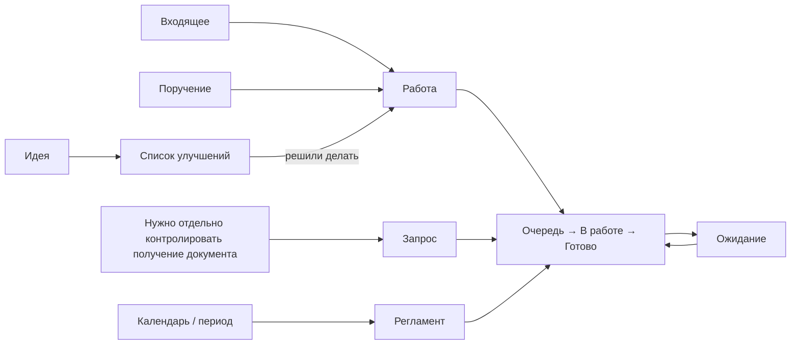

# Управление работой подразделения

Обезличенный регламент работы в OpenProject Community.

## Зачем нужен этот порядок

Регламент нужен, чтобы обязательная работа не оставалась только в почте, чатах и памяти сотрудников.

По системе должно быть видно:

- что нужно сделать;
- кто отвечает;
- к какому сроку нужен результат;
- что выполняется сейчас;
- что остановлено внешней причиной;
- какие запросы документов и периодические работы требуют внимания.

Руководитель работает с исключениями и зависаниями, а не собирает статус вручную у сотрудников.

## Контур

Полная схема состояний и переходов — в [Правилах управления](docs/01-methodology.md).

## Как пользоваться документацией

| Если нужно | Открыть |
|---|---|
| понять правило, термин или границу применения | [01 — Правила управления](docs/01-methodology.md) |
| понять, что делать в конкретной ситуации | [02 — Скрипты типовых ситуаций](docs/02-scripts.md) |
| понять, что и когда контролировать | [03 — Контроль](docs/03-control.md) |
| взять готовую форму или текст | [04 — Шаблоны](docs/04-templates.md) |
| собрать рабочий контур в OpenProject | [05 — Рабочий контур OpenProject](docs/05-openproject.md) |
| описать реальный бизнес-процесс | [06 — Каталог процессов](docs/06-processes.md) |

## Базовые правила

1. Одна карточка — один самостоятельно контролируемый результат.
2. Письмо, файл, звонок и технический шаг сами по себе не создают новую карточку.
3. `Очередь` — работу нужно сделать, но сейчас её не выполняют.
4. `В работе` — результат реально делают сейчас.
5. `Ожидание` — продолжать нельзя из-за внешней причины; владелец сохраняется.
6. Срок — дата конечного результата, а не напоминания.
7. После регистрации исполнитель ведёт состояние; параметры исправляются по установленному порядку.
8. Старший исправляет факт. Руководитель меняет решение.
9. Ошибка результата — вернуть исходную карточку. Новый объём — новая карточка.
10. `Запрос` контролирует получение результата, а не отправку письма.
11. Идеи не смешиваются с обязательной работой.

## Что этот регламент не определяет

- техническую матрицу прав пользователей;
- конкретную организационную структуру;
- содержание бизнес-процессов конкретного подразделения;
- внешние нормативы и сроки;
- значения локальных правил отдельных направлений.

Эти данные задаются при внедрении, но не должны противоречить [основным правилам](docs/01-methodology.md).

## Источник правил

`docs/01-methodology.md` — единственный источник общих правил. Остальные документы показывают их применение и не вводят отдельные нормы.

## Лицензия

[CC BY 4.0](LICENSE). Материалы можно использовать и адаптировать при указании источника.
