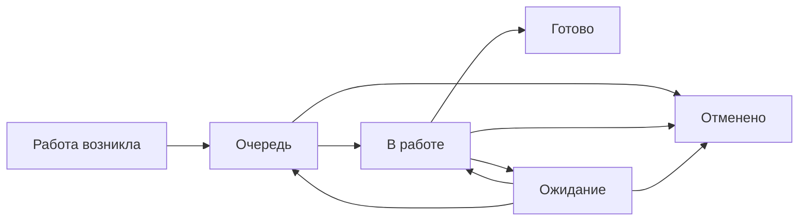

# Управление работой подразделения

Этот репозиторий описывает единый и обезличенный порядок управления работой в OpenProject Community.

Цель простая: **обязательная работа не теряется, её состояние видно без опроса людей, исключения быстро обнаруживаются, а повторяющиеся проблемы превращаются в улучшения**.

## Базовый поток

Для исполнителя смысл состояний буквальный:

- **Очередь** — сделать нужно, но сейчас работу никто не выполняет;
- **В работе** — работу реально выполняют сейчас;
- **Ожидание** — продолжать невозможно из-за внешней причины;
- **Готово** — обязательных действий по результату больше нет;
- **Отменено** — результат больше не требуется.

## Как живут параметры работы

При создании карточки её автор задаёт известные параметры: что нужно сделать, к какому процессу относится работа, кто отвечает, к какому сроку нужен результат и насколько работа критична.

После регистрации эти параметры считаются **исходной постановкой работы**.

Дальше исполнитель ведёт жизненный цикл: начинает работу, ставит на ожидание, возвращает в очередь, завершает, оставляет существенные комментарии и прикладывает материалы.

Если после регистрации нужно изменить срок, категорию, исполнителя, приоритет или исправить постановку, исполнитель сообщает старшему. Старший корректирует параметр по реальному основанию. Если изменение уже является управленческим решением, вопрос передаётся руководителю.

Старший не является обязательным согласующим и не проверяет каждую обычную работу перед закрытием.

## Откуда появляется работа

Общий поток используется независимо от источника:

- входящий документ, письмо или обращение;
- необходимость по нашей инициативе получить важный документ или материал, который нельзя потерять после отправки запроса;
- плановая или периодическая работа;
- разовое поручение;
- задача внутри настоящего проекта;
- решение реализовать улучшение.

Идеи и предложения не смешиваются с обязательной работой и ведутся отдельно.

## Что в методике называется запросом

`Запрос` — это не любое исходящее письмо и не обычное уточнение внутри текущей работы.

Отдельная карточка типа `Запрос` создаётся, когда подразделению **самому нужен важный документ, материал или подтверждение**, получение которого надо довести до результата и нельзя оставить на уровне переписки.

Ключевое правило:

> **Запрос считается выполненным не тогда, когда его отправили, а когда требуемый документ или материал реально получен.**

После отправки запрос обычно находится в `Ожидание`, но владелец, срок получения и контроль сохраняются. Открытые запросы должны быть видны отдельным списком, чтобы сценарий «запросили и забыли» был невозможен.

## Документы

1. [Правила управления работой](docs/01-methodology.md) — единица работы, роли, статусы, параметры, сроки, очередь, передача и проекты.
2. [Скрипты типовых ситуаций](docs/02-scripts.md) — что делать от появления работы до закрытия, ожидания, корректировки параметров, возврата и передачи.
3. [Контроль и управляемость](docs/03-control.md) — что смотреть исполнителю, старшему и руководителю, какие сигналы считаются проблемой.
4. [Шаблоны](docs/04-templates.md) — только те форматы, которые реально нужны в работе.
5. [Настройка OpenProject Community](docs/05-openproject.md) — минимальная конфигурация под эту методику.
6. [Каталог бизнес-процессов](docs/06-processes.md) — как одинаково описывать реальные процессы.

## Правила, которые не трактуются свободно

1. Одна работа — один самостоятельно контролируемый результат.
2. Письмо, файл, звонок или технический шаг сами по себе не являются отдельной работой.
3. После разбора обязательное действие не должно оставаться только в почте, чате или устной договорённости.
4. У открытой работы есть исполнитель или контролируемая групповая очередь.
5. При создании автор задаёт известные параметры работы; после регистрации они считаются зафиксированной исходной постановкой.
6. Исполнитель после регистрации ведёт состояние работы, а корректировку зафиксированных параметров передаёт старшему.
7. Старший может исправлять срок, категорию, исполнителя, приоритет и постановку по реальному основанию, но не является обязательным согласующим.
8. `В работе` не используется как склад назначенных задач.
9. `Ожидание` применяется только при реальной внешней блокировке; владелец работы сохраняется.
10. Срок означает дату требуемого результата. Его нельзя переносить только для сокрытия просрочки.
11. Обычную работу исполнитель закрывает самостоятельно. Обязательной проверки перед `Готово` нет.
12. Ошибка первоначального результата — возврат исходной работы. Новый объём — новая работа.
13. Приоритет не заменяет срок. Критичность используется только для реального изменения порядка очереди.
14. Отдельный `Запрос` закрывается только после фактического получения требуемого документа или материала либо после явной отмены потребности.
15. Количество закрытых карточек не является рейтингом сотрудников.
16. Идея не является обязательством, пока не принято решение о реализации.

## Главный принцип

> **Минимум действий исполнителя — максимум достоверности состояния работы.**

Если новое правило, поле, статус, отчёт или шаблон не предотвращает потерю работы, не проясняет состояние или не сокращает ручной труд — оно не добавляется.