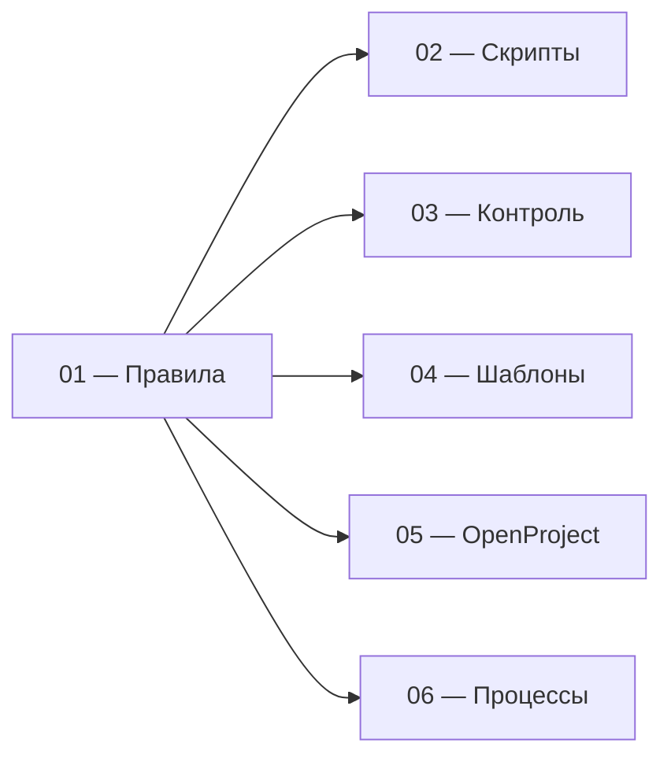

# Регламент постановки, выполнения и контроля работ

Единый порядок работы в OpenProject Community: от появления обязательства до результата, контроля отклонений и описания процессов.

**[Начать с правил управления →](docs/01-methodology.md)**

## Назначение

Регламент задаёт общий способ фиксировать, выполнять и контролировать обязательную работу. По системе должно быть понятно, какой результат требуется, кто отвечает, к какому сроку он нужен, в каком состоянии находится работа и где требуется вмешательство.

Конкретные бизнес-процессы и локальные значения настраиваются отдельно; этот комплект задаёт общий каркас, по которому они ведутся.

## Разделы

| Раздел | Что внутри | Когда открывать |
|---|---|---|
| **[01 — Правила управления](docs/01-methodology.md)** | термины, роли, состояния, сроки, приоритет, границы решений | нужно понять правило или определить, как трактовать ситуацию |
| **[02 — Скрипты типовых ситуаций](docs/02-scripts.md)** | готовые алгоритмы действий | нужно быстро понять, что делать в конкретном случае |
| **[03 — Контроль](docs/03-control.md)** | кто, что и когда проверяет; показатели и действия при отклонениях | нужно организовать ежедневный и периодический контроль |
| **[04 — Шаблоны](docs/04-templates.md)** | формы карточек, комментариев, процессов и локальных правил | нужно зафиксировать информацию единообразно |
| **[05 — Рабочий контур OpenProject](docs/05-openproject.md)** | типы, состояния, поля, списки, антипримеры и проверка готовности | нужно настроить или проверить OpenProject |
| **[06 — Каталог процессов](docs/06-processes.md)** | форма описания процесса и заполненные примеры | нужно описать конкретный бизнес-процесс |

## Как связаны документы

`01 — Правила управления` — единственный источник общих правил. Остальные страницы применяют эти правила к конкретным задачам и не вводят самостоятельных норм.

## Границы применения

Регламент не задаёт:

- техническую матрицу прав пользователей;
- конкретную организационную структуру;
- содержание процессов конкретного подразделения;
- внешние нормативы и сроки;
- локальные значения отдельных направлений.

Эти параметры определяются при внедрении и не должны противоречить [Правилам управления](docs/01-methodology.md).

---

**[Начать с правил управления →](docs/01-methodology.md)**

## Лицензия

[CC BY 4.0](LICENSE). Материалы можно использовать и адаптировать при указании источника.
