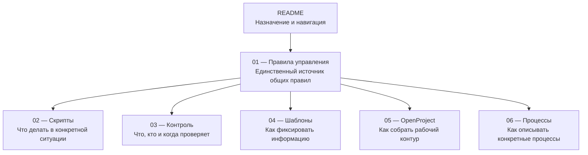

# Регламент постановки, выполнения и контроля работ

Единый порядок работы в OpenProject Community.

## Назначение

Документация задаёт общий способ фиксировать, выполнять и контролировать обязательную работу так, чтобы по системе было понятно:

- какой результат требуется;
- кто за него отвечает;
- к какому сроку он нужен;
- в каком состоянии находится работа;
- где требуется вмешательство.

Регламент описывает не конкретные бизнес-процессы подразделения, а общий порядок, по которому такие процессы ведутся в OpenProject.

## Как устроена документация

`01-methodology.md` — единственный источник общих правил. Остальные документы не вводят самостоятельных норм, а показывают, как применять эти правила.

## Как пользоваться документацией

| Если нужно | Открыть |
|---|---|
| понять правило, термин или границу применения | [01 — Правила управления](docs/01-methodology.md) |
| понять, что делать в конкретной ситуации | [02 — Скрипты типовых ситуаций](docs/02-scripts.md) |
| понять, что и когда контролировать | [03 — Контроль](docs/03-control.md) |
| взять готовую форму или текст | [04 — Шаблоны](docs/04-templates.md) |
| собрать рабочий контур в OpenProject | [05 — Рабочий контур OpenProject](docs/05-openproject.md) |
| описать реальный бизнес-процесс | [06 — Каталог процессов](docs/06-processes.md) |

## Что входит в регламент

- постановка и регистрация обязательной работы;
- роли и границы решений;
- состояния, сроки и приоритет;
- передача работы между исполнителями;
- запросы документов и периодические работы;
- исправление ошибок, отмена и новый объём;
- контроль отклонений и качество;
- правила описания процессов и настройки OpenProject.

## Что регламент не определяет

- техническую матрицу прав пользователей;
- конкретную организационную структуру;
- содержание бизнес-процессов конкретного подразделения;
- внешние нормативы и сроки;
- значения локальных правил отдельных направлений.

Эти параметры задаются при внедрении и не должны противоречить [Правилам управления](docs/01-methodology.md).

## Лицензия

[CC BY 4.0](LICENSE). Материалы можно использовать и адаптировать при указании источника.
