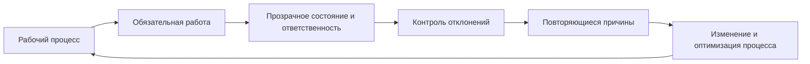
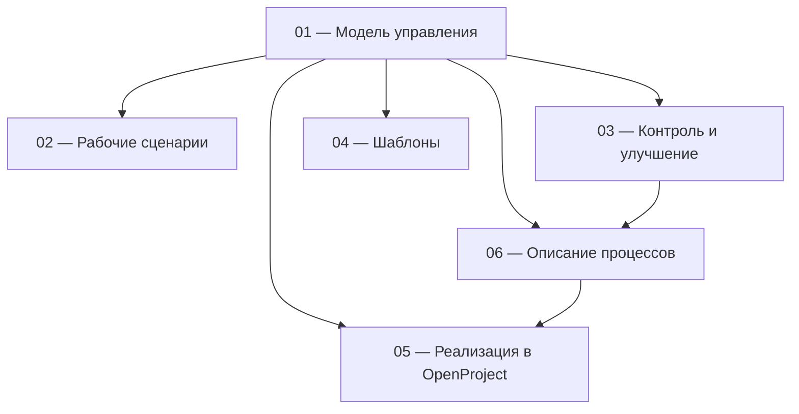

# Методика организации и управления рабочими процессами

Практическая модель построения прозрачной, управляемой и улучшаемой работы в OpenProject Community.

**[Начать с модели управления →](docs/01-methodology.md)**

## Задача методики

Методика нужна, чтобы перевести разрозненную работу из почты, чатов, файлов и устных договорённостей в единый управляемый контур.

В результате должно быть видно:

- какой результат требуется;
- кто за него отвечает;
- к какому сроку он нужен;
- что реально выполняется сейчас;
- что находится в очереди или заблокировано внешней причиной;
- где накапливаются просрочки, возвраты, ожидания и другие отклонения;
- какие повторяющиеся проблемы требуют изменения процесса.

Цель — не увеличить количество карточек и отчётов, а сделать работу прозрачной, контролируемой и пригодной для последовательного улучшения.

## Логика

## Разделы

| Раздел | Что внутри | Когда открывать |
|---|---|---|
| **[01 — Модель управления](docs/01-methodology.md)** | единица работы, роли, состояния, сроки, приоритеты и границы решений | нужно понять, как устроена управляемая работа |
| **[02 — Рабочие сценарии](docs/02-scripts.md)** | алгоритмы действий в типовых ситуациях | нужно быстро определить следующий шаг |
| **[03 — Контроль и улучшение](docs/03-control.md)** | контроль отклонений, показатели, системные дефекты и действия по улучшению | нужно понять, где вмешиваться и что менять |
| **[04 — Шаблоны](docs/04-templates.md)** | формы карточек, комментариев, процессов и локальных правил | нужно фиксировать информацию единообразно |
| **[05 — Реализация в OpenProject](docs/05-openproject.md)** | типы, состояния, поля, списки, антипримеры и проверка готовности | нужно настроить систему под методику |
| **[06 — Описание процессов](docs/06-processes.md)** | единая форма описания процессов и заполненные примеры | нужно перенести реальный процесс в рабочую модель |

## Как связаны документы

`01 — Модель управления` задаёт базовую конструкцию. Остальные разделы показывают, как применять её в работе, контроле, настройке OpenProject и описании конкретных процессов.

## Границы применения

Методика не задаёт:

- техническую матрицу прав пользователей;
- конкретную организационную структуру;
- содержание процессов конкретного подразделения;
- внешние нормативы и обязательные сроки;
- локальные значения отдельных направлений.

Эти параметры определяются при внедрении. Конкретные процессы описываются по общей модели и затем реализуются в OpenProject.

---

**[Начать с модели управления →](docs/01-methodology.md)**

## Лицензия

[CC BY 4.0](LICENSE). Материалы можно использовать и адаптировать при указании источника.
