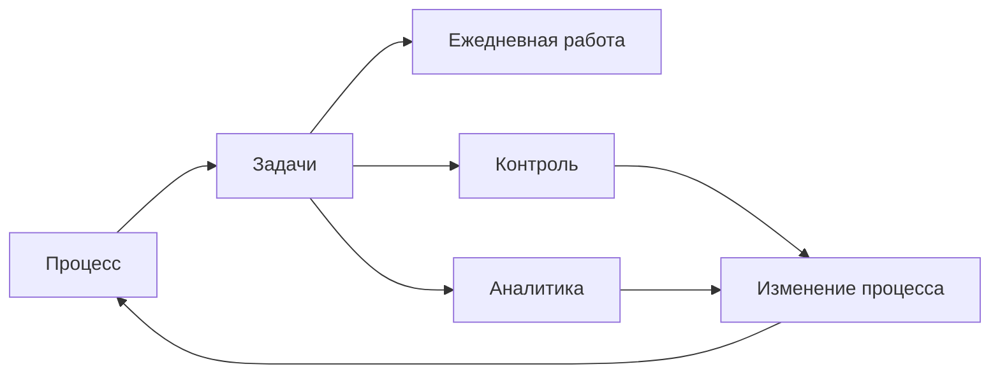

# Методика организации и управления рабочими процессами

Практическая модель ежедневной работы, контроля и анализа на базе **русской Odoo Community 19.0**.

**[Начать с модели управления →](docs/01-methodology.md)**

## Принцип

Методика и Odoo настраиваются вместе: не подгонять работу под инструмент любой ценой, но и не строить поверх Odoo второй собственный продукт там, где штатная механика уже решает задачу.

Порядок решений:

1. использовать штатную возможность Odoo;
2. настроить её под рабочий смысл;
3. изменить локальное правило, если это упрощает работу без потери управленческой или аналитической ценности;
4. принять небольшое ограничение, если его устранение кодом почти ничего не даёт;
5. дорабатывать только то, что заметно улучшает ежедневную работу, качество данных или контроль.

Кастомизация не входит в базовую архитектуру. Она появляется только как вывод из пилота.

## Что должна давать система

Одна и та же Задача должна одновременно отвечать на три группы вопросов:

| Контур | Вопрос |
|---|---|
| Ежедневная работа | что нужно получить, кто отвечает, какой крайний срок и что мешает |
| Управление | где просрочка, очередь, внешнее ожидание, внутренняя блокировка или неназначенная работа |
| Аналитика | какие процессы и виды работ формируют поток, где накапливается остаток и какие проблемы повторяются |

Отдельный ручной реестр или отчёт не создаётся, если нужный факт уже есть в Odoo.

## Базовая конструкция

- один рабочий **Проект** для постоянной операционной работы;
- одна **Задача** = один самостоятельно контролируемый результат;
- **Тип задачи**: `Работа` или `Запрос`;
- **Процесс** и **Вид работы** — основные предметные аналитические признаки;
- общий ход работы задают **Этапы**: `Очередь / В работе / Внешнее ожидание`;
- завершение и отмена выполняются штатными **Состояниями** `Готово / Отменено`;
- внутренние зависимости, подзадачи, вехи, повторяемость, активности, теги и личное планирование используются штатно;
- **Свойства задачи** и штатные справочники применяются раньше собственных моделей и полей.

## Разделы

| Раздел | Что внутри |
|---|---|
| **[01 — Модель управления](docs/01-methodology.md)** | единица работы, классификация, этапы, состояния, ответственность и сроки |
| **[02 — Рабочие сценарии](docs/02-scripts.md)** | действия в типовых ежедневных ситуациях |
| **[03 — Контроль и аналитика](docs/03-control.md)** | оперативный контроль, показатели и улучшение процессов |
| **[04 — Шаблоны](docs/04-templates.md)** | минимальные формы рабочих записей |
| **[05 — Описание процессов](docs/05-processes.md)** | как описывать и улучшать реальные процессы |
| **[06 — Реализация в Odoo](docs/06-workspace.md)** | настройка штатной Odoo 19 и границы, после которых оправдана доработка |

## Лицензия

[CC BY 4.0](LICENSE). Материалы можно использовать и адаптировать при указании источника.
