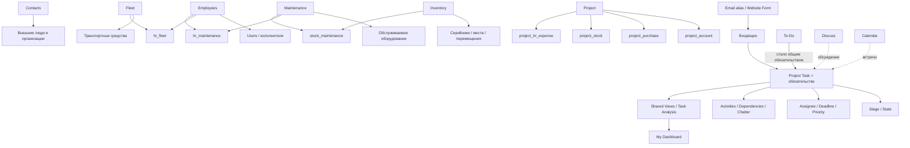

# Управление работой отдела в Odoo 19 Community

Практическая методика управления операционной работой, справочниками, контролем и аналитикой в **стандартном Odoo 19 Community**.

Методика строится не вокруг абстрактной идеальной системы и не вокруг одного приложения `Project`. Сначала используются штатные предметные сущности Odoo, а Project отвечает именно за **обязательства и контролируемые результаты**.

**[Сначала — проверенная граница возможностей Odoo 19 Community →](docs/00-odoo19-community.md)**  
**[Углублённый аудит штатных мостов и скрытых возможностей →](docs/07-deep-community-audit.md)**  
**[Аудит штатных интеграций Project →](docs/08-project-integrations.md)**  
**[Затем — модель управления →](docs/01-methodology.md)**

## На каких источниках основана методика

Для функций Odoo действует правило двойной проверки:

1. поведение функции сверяется с актуальной официальной документацией **Odoo 19.0**;
2. если документация не отделяет Community от Enterprise, наличие функции дополнительно проверяется в публичной ветке **`odoo/odoo:19.0`**.

Функция не включается в базовую методику только потому, что она показана на странице документации Odoo.

Отдельно проверяются штатные **bridge modules** между приложениями. Наличие двух моделей ещё не означает отсутствия штатной связи между ними.

## Что должна давать система

По работе отдела должно быть понятно:

- какой результат нужен;
- кто владелец результата;
- какой конечный срок;
- что готово к выполнению;
- что выполняется сейчас;
- что ждёт внешнего действия;
- что заблокировано другой задачей;
- что просрочено или залежалось;
- где копится операционный хвост;
- где находится источник истины по сотрудникам, ТС, оборудованию и внешним субъектам;
- какие требования действительно не закрываются штатно.

Данные должны повторно использоваться для контроля и аналитики, а не переноситься вручную в параллельный Excel-реестр.

## Главная архитектура



Ключевой принцип:

> **Task — не универсальная карточка объекта. Task — контролируемый результат.**

Поэтому:

- сотрудник живёт в Employees;
- внешний человек/организация — в Contacts;
- автомобиль/ТС сначала проверяется на пригодность штатной модели Fleet;
- обслуживаемое оборудование — в Maintenance;
- серийный объект, остаток, место хранения и перемещение — в Inventory, если нужен именно складской/трассировочный контур;
- встреча — в Calendar;
- личная мысль — в To-Do;
- обязательство — в Project Task.

Attendances, Time Off, Surveys, Skills, eLearning, Recruitment, Expenses, Purchase и другие подтверждённые Community-приложения не включаются автоматически: они используются только если их предметная модель отвечает реальной задаче управления.

## Базовый операционный контур

Для постоянной работы одного отдела обычно достаточно одного основного Project:

```text
Входящие
→ Очередь
→ В работе
→ Ожидание внешнего
→ На проверке   [только если реально нужно]
```

Закрытие выполняется штатными `Done` / `Canceled`.

Внутренняя блокировка оформляется через `Blocked by`; computed `Waiting` не считается отдельным обычным ручным статусом.

## Рабочее место без разработки

Odoo 19 Community позволяет собрать общий рабочий контур кликами:

- Shared Favorites;
- Project Top Bar → `Save View` → `Shared`;
- List / Kanban / Calendar;
- Deadline filters;
- Rotting;
- Activities;
- Task Dependencies;
- **Task Templates** для одинаковых разовых задач;
- Recurring Tasks для календарной периодики;
- Project Templates для повторяемой структуры проектов;
- Task Analysis / Pivot / Graph;
- My Dashboard.

То есть основные очереди `Входящие`, `Очередь`, `Просрочено`, `Ожидание`, `Критичные` не должны каждый пользователь собирать вручную.

## Перед любой доработкой — проверить штатный мост

Подтверждены auto-install связи:

```text
Employees + Fleet        → hr_fleet
Employees + Maintenance  → hr_maintenance
Inventory + Maintenance  → stock_maintenance
Skills + Surveys         → hr_skills_survey
Skills + eLearning       → hr_skills_slides
Employees + Calendar     → hr_calendar
Project + Accounting     → project_account
Project + Purchase       → project_purchase
Project + Inventory      → project_stock
Project + Stock Account  → project_stock_account
Project + Expenses       → project_hr_expense
```

Поэтому разрыв модели фиксируется только после проверки:

1. правильной предметной сущности;
2. стандартного Community-приложения;
3. штатного bridge module;
4. прямых связей и встроенной аналитики;
5. фактического остаточного ограничения.

## Где штатной модели уже недостаточно

Методика не маскирует реальные ограничения.

Например, Community штатно имеет одновременно:

- `project.task`;
- `fleet.vehicle`.

`hr_fleet` связывает Employees и Fleet, но стандартный Project Task по-прежнему не имеет строгого Many2one-поля на Fleet Vehicle.

Если пилот докажет, что массовая аналитика задач по ТС обязательна, это нормальный кандидат на **минимальную доработку одного связанного поля**, а не повод писать собственную систему задач.

То же правило применяется к любому будущему gap.

## Разделы

| Раздел | Что внутри |
|---|---|
| **[00 — Возможности Odoo 19 Community](docs/00-odoo19-community.md)** | базовая проверенная карта Project, Employees, Contacts, Fleet, Maintenance, Inventory, Attendances, Time Off, Surveys, Discuss, Calendar, Dashboards, импорта/экспорта, прав и реальных CE-ограничений |
| **[01 — Модель управления](docs/01-methodology.md)** | какая сущность для чего используется, задача, ответственность, этапы, сроки, ожидание, периодика и границы click-only |
| **[02 — Рабочие сценарии](docs/02-scripts.md)** | действия в типовых ситуациях: входящие, очередь, зависимости, ТС, сотрудники, оборудование, email/form intake, импорт и gaps |
| **[03 — Контроль и аналитика](docs/03-control.md)** | Shared Views, Task Analysis, My Dashboard, предметная аналитика Fleet/Maintenance и минимальные управленческие показатели |
| **[04 — Шаблоны](docs/04-templates.md)** | минимальные формы Task, запроса, Activities и описания процесса без дублирования справочников |
| **[05 — Описание процессов](docs/05-processes.md)** | как определить штатные сущности процесса, единицу Task, источник истины и click-only gaps |
| **[06 — Настройка Odoo](docs/06-workspace.md)** | последовательная click-only настройка пилота, импорт, Shared Views, My Dashboard и критерии будущей доработки |
| **[07 — Углублённый аудит Community](docs/07-deep-community-audit.md)** | Task Templates, stage duration, рабочие календари, Skills/eLearning/Certifications, штатные bridge modules, Data Recycle, Contacts dedupe, Canned Responses и дополнительные границы CE |
| **[08 — Интеграции Project](docs/08-project-integrations.md)** | Project ↔ Analytic Account, Purchase, Inventory, Expenses, profitability, relational import, access rights и уточнённые cross-model gaps |

## Что методика сознательно не делает

Она не пытается:

- превратить Project в BPM-движок;
- создать отдельный Project на каждый процесс;
- хранить тысячи ТС/сотрудников в Properties;
- заменить Fleet, Maintenance или Inventory Kanban-задачами;
- использовать Discuss как журнал незавершённой работы;
- использовать Timesheets, Attendances или Presence Control как средство дисциплинарного рейтинга;
- оценивать сотрудников простым числом закрытых Tasks;
- строить Dashboard раньше достоверных данных;
- автоматизировать хаос через Automation Rules;
- использовать Gamification для рейтинга операционной производительности;
- зависеть от Gantt, Studio, Helpdesk, Approvals, Documents, Knowledge или Planning;
- обещать Enterprise-функцию только потому, что она есть в общей документации Odoo.

## Порядок развития

```text
штатные сущности
→ штатные bridge modules
→ качественные master data
→ Project workflow
→ Task Templates / Activities / Dependencies / Recurrence
→ Shared Views
→ Task Analysis
→ My Dashboard
→ при необходимости analytic / purchase / stock integrations
→ стабильные KPI
→ точечная Automation
→ подтверждённые gaps
→ минимальный custom module только на gaps
```

## Где хранится что

- **Odoo** — сотрудники, контакты, ТС, оборудование, фактическая работа, ответственность, сроки, коммуникации и аналитика.
- **Этот репозиторий** — методика, правила процессов, результаты аудита и зафиксированные ограничения.

Не нужно дублировать историю работы в Excel, а методику — в каждом описании Task.

---

Работа над текущей переработкой ведётся на уровне Pull Request. Merge в `main` выполняется только по отдельному явному согласованию.

## Лицензия

[CC BY 4.0](LICENSE). Материалы можно использовать и адаптировать при указании источника.
