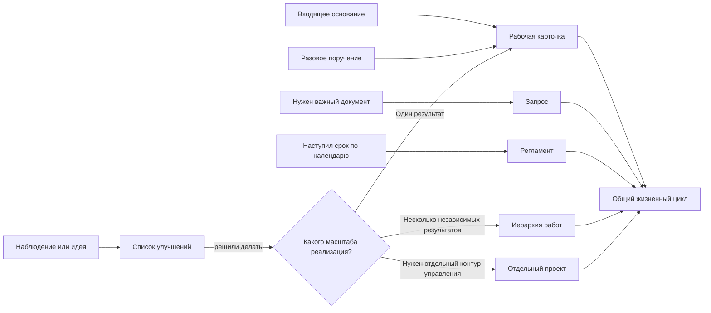
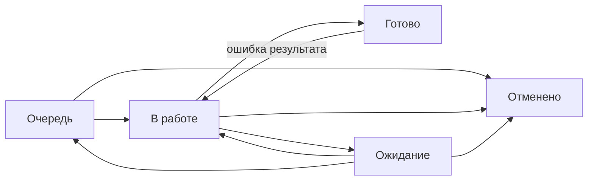

# Управление работой подразделения

Этот репозиторий описывает единый обезличенный порядок управления работой в OpenProject Community.

Цель простая: **обязательная работа не теряется, её состояние видно без опроса людей, исключения быстро обнаруживаются, а повторяющиеся проблемы превращаются в улучшения**.

## Как устроен рабочий контур

Обязательная работа, запросы важных документов и регламентные работы используют один набор состояний:

Смысл состояний буквальный:

- **Очередь** — сделать нужно, но сейчас работу никто не выполняет;
- **В работе** — работу реально выполняют сейчас;
- **Ожидание** — продолжать невозможно из-за внешней причины;
- **Готово** — обязательных действий по этому результату больше нет;
- **Отменено** — сам результат больше не требуется.

## Два слоя одной карточки

У карточки есть:

1. **параметры** — что нужно сделать, кто отвечает, к какому процессу относится работа, срок и приоритет;
2. **состояние** — очередь, работа, ожидание, готовность или отмена.

Автор задаёт известные параметры при создании. После регистрации они считаются исходной постановкой. Исполнитель дальше ведёт состояние работы. Если параметр нужно исправить после регистрации, применяется отдельный порядок корректировки через старшего. Старший исправляет факт; руководитель подключается, когда нужно изменить управленческое решение.

## Что называется запросом

`Запрос` — отдельная карточка только тогда, когда подразделению **самому нужен важный документ, материал или подтверждение**, получение которого нельзя потерять после отправки.

> **Запрос выполнен только после фактического получения нужного результата. Отправленное письмо не является завершением.**

Обычные уточнения и переписка внутри уже открытой работы отдельными запросами не становятся.

## Документы

1. [Правила управления работой](docs/01-methodology.md) — единые правила, роли, состояния, параметры, сроки, передача и масштаб работы.
2. [Скрипты типовых ситуаций](docs/02-scripts.md) — что делать в конкретных рабочих сценариях.
3. [Контроль и управляемость](docs/03-control.md) — что смотреть исполнителю, старшему и руководителю и какие отклонения требуют вмешательства.
4. [Шаблоны](docs/04-templates.md) — только те форматы, которые реально нужны в работе.
5. [Настройка OpenProject Community](docs/05-openproject.md) — минимальный рабочий контур, который поддерживает методику.
6. [Каталог бизнес-процессов](docs/06-processes.md) — единый способ описывать реальные процессы.

## Правила, которые не трактуются свободно

1. Одна карточка — один самостоятельно контролируемый результат.
2. Письмо, файл, звонок или технический шаг сами по себе не являются отдельной работой.
3. После разбора обязательное действие не остаётся только в почте, чате или устной договорённости.
4. У открытой работы есть конкретный исполнитель или контролируемая групповая очередь.
5. `В работе` не используется как склад назначенных задач.
6. `Ожидание` применяется только при реальной внешней блокировке; владелец сохраняется.
7. Из `Ожидание` работа сначала возвращается в `В работе` или `Очередь`; напрямую закрывать её из ожидания не нужно.
8. Срок означает дату требуемого результата. Его нельзя переносить только для сокрытия просрочки.
9. Старший исправляет параметры по факту, но не согласует каждую обычную работу.
10. Руководитель принимает решения, когда меняется обязательство, приоритет между конфликтующими работами или распределение ресурса.
11. Ошибка первоначального результата — возврат исходной работы. Новый результат — новая карточка.
12. `Запрос` закрывается только после фактического получения требуемого документа или материала либо после явной отмены потребности.
13. Количество закрытых карточек не является рейтингом сотрудников.
14. Идея не является обязательством, пока не принято решение о реализации.

## Главный принцип

> **Минимум действий исполнителя — максимум достоверности состояния работы.**

Если новое правило, поле, статус, отчёт или шаблон не предотвращает потерю работы, не проясняет состояние или не сокращает ручной труд — оно не добавляется.

## Лицензия

Материалы распространяются по лицензии [Creative Commons Attribution 4.0 International (CC BY 4.0)](LICENSE). Их можно использовать и адаптировать при указании источника.