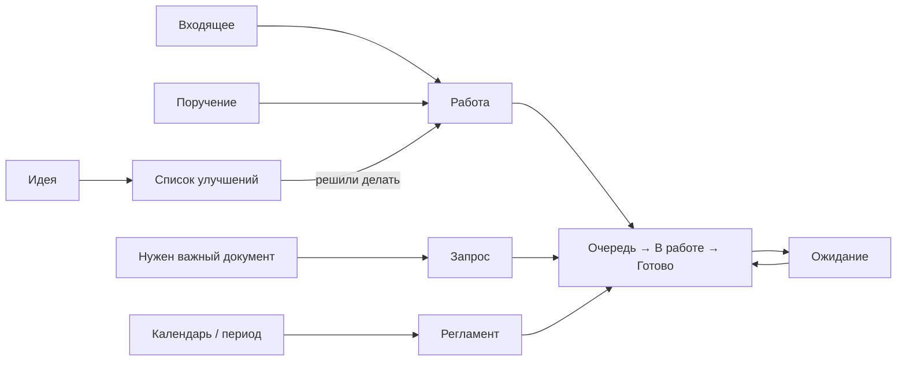

# Управление работой подразделения

Обезличенный регламент работы в OpenProject Community.

## Контур

## Базовые правила

1. Одна карточка — один самостоятельно контролируемый результат.
2. Письмо, файл, звонок и отдельный технический шаг сами по себе не создают новую карточку.
3. `Очередь` — работа существует, но сейчас не выполняется.
4. `В работе` — результат реально делают сейчас.
5. `Ожидание` — продолжать нельзя из-за внешней причины; владелец сохраняется.
6. `Готово` — обязательных действий по результату больше нет.
7. Срок — дата конечного результата, а не напоминания.
8. После регистрации исполнитель меняет состояние работы. Параметры исправляет старший по основанию.
9. Старший исправляет факт. Руководитель меняет решение.
10. Ошибка результата — вернуть исходную карточку. Новый объём — новая карточка.
11. `Запрос` закрывается только после получения и проверки нужного документа или материала.
12. Идеи не смешиваются с обязательной работой.

## Документы

- [Правила управления](docs/01-methodology.md)
- [Скрипты типовых ситуаций](docs/02-scripts.md)
- [Контроль](docs/03-control.md)
- [Шаблоны](docs/04-templates.md)
- [Рабочий контур OpenProject](docs/05-openproject.md)
- [Каталог процессов](docs/06-processes.md)

## Лицензия

[CC BY 4.0](LICENSE). Материалы можно использовать и адаптировать при указании источника.
