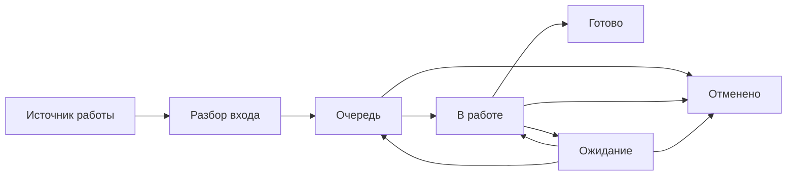

# Система управления работой подразделения

Методический репозиторий описывает единый порядок управления операционной, регламентной, запросной, проектной работой и улучшениями подразделения.

Материалы обезличены: в документах не используются реальные наименования организаций, подразделений, информационных систем, площадок, должностей или сотрудников.

## Цель

Система управления должна обеспечивать четыре свойства:

1. **Полнота** — обязательная работа не существует только в почте, чате или устной договорённости.
2. **Наблюдаемость** — в любой момент видно, что находится в очереди, что выполняется, что заблокировано и что просрочено.
3. **Управляемость** — работа имеет владельца, срок, приоритет и однозначное состояние; руководство работает по исключениям, а не вручную контролирует каждую операцию.
4. **Улучшение** — повторяющиеся задержки, возвраты и ручные операции превращаются в backlog улучшений и кандидатов на автоматизацию.

## Базовый поток

Ключевой принцип: **минимум действий исполнителя — максимум достоверности состояния работы**.

## Контуры работы

| Контур | Что входит | Где управляется |
|---|---|---|
| Операционная работа | входящие основания, обязательные корректировки, разовые рабочие действия | общий поток работ |
| Исходящие запросы | самостоятельные запросы, по которым требуется отдельно контролировать получение результата | общий поток работ, тип `Запрос` |
| Регламентные работы | ежедневные, недельные, месячные и иные периодические обязательства | отдельный контур регламентных работ |
| Поручения и проекты | разовые поручения и настоящие проекты | работа, иерархия работ или отдельный проект |
| Развитие и автоматизация | идеи, узкие места, улучшения и инициативы | отдельный backlog |

## Нормативное ядро

1. [Методика управления работой](docs/01-methodology.md)
2. [Роли, ответственность и управленческий ритм](docs/02-governance.md)
3. [Жизненный цикл и правила состояний](docs/03-workflow.md)
4. [Скрипты бизнес-процессов](docs/04-process-scripts.md)
5. [Контроль, метрики и управленческие обзоры](docs/05-control.md)
6. [Строгие шаблоны](docs/06-templates.md)
7. [Настройка рабочего контура в OpenProject Community](docs/07-openproject-community.md)
8. [Аудит соблюдения методики](docs/08-audit-checklists.md)
9. [Каталог и стандарт описания бизнес-процессов](docs/09-process-catalog.md)

## Что считается системой истины

До регистрации работа может возникнуть в любом внешнем канале. После регистрации **состояние обязательной работы определяется только рабочей системой**.

Почта, мессенджеры, документы и устные поручения остаются источниками информации и доказательной базой, но не являются реестром состояния работы.

## Что запрещено методикой

- создавать отдельную работу на каждое письмо, файл, звонок или технический шаг;
- использовать статус `В работе` как склад назначенных задач;
- переводить работу в `Ожидание` без сохранения владельца и объяснения причины;
- вводить обязательное согласование обычной рутины перед закрытием;
- удалять рабочие записи вместо отмены или фиксации дубликата;
- смешивать обязательную работу и необязательные идеи;
- использовать количество закрытых карточек как прямой рейтинг сотрудников;
- создавать отдельный проект для любого разового поручения;
- добавлять новые статусы, категории, поля и обязательные действия без конкретной управленческой необходимости.

## Правило изменения методики

Любое изменение должно отвечать хотя бы на один вопрос:

- какую потерю работы оно предотвращает;
- какую управленческую неопределённость устраняет;
- какую ручную операцию сокращает;
- какую метрику делает достовернее.

Если изменение не даёт одного из этих эффектов, оно не включается в стандарт.