# Граница возможностей Odoo 19 Community

[Главная](../README.md) · **00 Возможности** · [01 Модель](01-methodology.md) · [02 Сценарии](02-scripts.md) · [03 Аналитика](03-control.md) · [04 Шаблоны](04-templates.md) · [05 Процессы](05-processes.md) · [06 Настройка](06-workspace.md) · [07 Углублённый аудит](07-deep-community-audit.md) · [08 Интеграции Project](08-project-integrations.md) · [09 Project и безопасность](09-project-productivity-security.md) · [10 API](10-external-integrations.md)

---

Этот документ — **авторитетная граница методики** для Odoo 19 Community.

Если более ранний текст PR противоречит этому документу, используется эта версия.

## 1. Правило проверки

Для каждой функции:

1. пользовательское поведение сверяется с актуальной официальной документацией **Odoo 19.0**;
2. если документация не разделяет редакции, наличие функции проверяется в публичной ветке [`odoo/odoo:19.0`](https://github.com/odoo/odoo/tree/19.0);
3. для связей между приложениями отдельно проверяются auto-install **bridge modules**;
4. функция не считается базовой только потому, что она существует.

Не используем сторонние статьи как основание архитектуры.

## 2. Главный архитектурный принцип

Odoo не нужно превращать ни в один гигантский Project, ни в набор несвязанных приложений.

Используется три уровня:

```text
предметная сущность
→ лёгкая связь с обязательством
→ управленческий контроль
```

### Предметная сущность

| Реальный объект | Штатная модель |
|---|---|
| обязательство / результат | `project.task` |
| сотрудник | `hr.employee` |
| пользователь-исполнитель | `res.users` |
| внешний человек / организация | `res.partner` |
| ТС | `fleet.vehicle` — после проверки пригодности Fleet для реального парка |
| обслуживаемое оборудование | `maintenance.equipment` |
| обслуживание | `maintenance.request` |
| serial / lot / location / движение | Inventory (`stock.*`) |
| встреча | `calendar.event` |
| личная мысль | To-Do |
| следующее действие | `mail.activity` |
| обсуждение записи | Chatter |
| командное обсуждение | Discuss |
| присутствие | Attendances |
| отсутствие | Time Off |
| рабочие интервалы HR | Work Entries |
| навык / сертификат | Skills / Certifications |
| обучение | eLearning |
| тест / анкета | Surveys |
| закупка | Purchase |

**Task остаётся обязательством, а не карточкой ТС, сотрудника или оборудования.**

Но Task может штатно **ссылаться** на эти сущности через relational Properties.

## 3. Ключевое уточнение: Properties умеют настоящие relational ссылки

Ранее в PR Properties были слишком сильно ограничены небольшими Selection-признаками. Это было неверно.

Официальная документация Odoo 19 и публичный Community source подтверждают типы Property:

- Text / Multiline / HTML;
- Checkbox;
- Integer / Decimal / Monetary;
- Date / Date & Time;
- Selection;
- Tags;
- **Many2one**;
- **Many2many**;
- Separator.

Для Many2one/Many2many в интерфейсе можно указать:

- **Model**;
- **Domain**;
- default value.

Источник: [Property fields](https://www.odoo.com/documentation/19.0/applications/essentials/property_fields.html), [`fields_properties.py`](https://github.com/odoo/odoo/blob/19.0/odoo/orm/fields_properties.py).

Публичный web-клиент содержит `ModelSelector`, `Many2XAutocomplete`, Domain selector и переход к выбранной записи.

Источник: [`property_definition.js`](https://github.com/odoo/odoo/blob/19.0/addons/web/static/src/views/fields/properties/property_definition.js), [`property_value.js`](https://github.com/odoo/odoo/blob/19.0/addons/web/static/src/views/fields/properties/property_value.js).

### Практическое следствие

В операционном Project можно **кликами** создать, например:

```text
Property: ТС
Type: Many2one
Model: fleet.vehicle
Domain: <при необходимости>
```

или:

```text
Property: Сотрудник
Type: Many2one
Model: hr.employee
```

или:

```text
Property: Оборудование
Type: Many2one
Model: maintenance.equipment
```

Это лучше, чем:

- текстовое поле;
- вручную поддерживаемый Selection на тысячи записей;
- дублирование справочника внутри Project.

## 4. Relational Property не заменяет предметную модель

Правильная схема:

```text
Fleet Vehicle = источник истины по ТС
Task Property[ТС] = ссылка на Fleet Vehicle
```

Не копировать в Task:

- госномер;
- модель;
- водителя;
- пробег;
- сервисы;

если эти данные уже живут во Fleet.

Аналогично для Employee и Equipment.

## 5. Что умеют Properties в Project

Публичный `project.task` имеет:

```text
task_properties = fields.Properties(...)
```

Стандартный Search View Project Task содержит:

- поиск по `task_properties`;
- `Group By → Properties`.

Источник: [`project_task_views.xml`](https://github.com/odoo/odoo/blob/19.0/addons/project/views/project_task_views.xml).

Property также может отображаться на карточках List/Kanban/Calendar через `Show in cards`.

### Поэтому базово можно

- выбрать ТС/Employee/Equipment из штатного справочника;
- фильтровать Tasks по Property;
- группировать по Properties;
- показывать Property в рабочих карточках;
- открывать связанную запись;
- ограничивать выбор Domain.

## 6. Ограничения Properties

Properties — **псевдополя**, а не отдельные колонки таблицы `project_task`.

Значения хранятся внутри JSONB, а definition зависит от parent container — для Task это Project.

Это удобно для click-only кастомизации, но имеет другие свойства, чем обычный schema field.

Поэтому custom Many2one рассматривается только если пилот докажет конкретную проблему, например:

- недостаточная производительность на реальном объёме;
- нужная интеграция требует обычного model field;
- внешний API/отчёт неудобно строить по Property;
- нужна жёсткая серверная constraint/обязательность;
- нужна связь, одинаковая независимо от Project;
- нужен специальный индекс или сложная автоматизация.

**Сам факт большого справочника больше не является основанием писать custom field.**

## 7. Важное ограничение relational Property: создание связанных records

Стандартный Many2one/Many2many Property использует обычный autocomplete и технически допускает create/create-edit, если у пользователя есть права на целевую модель.

Следовательно, если пользователи должны **только выбирать** существующий Fleet/Employee/Equipment, права на создание master data нужно проектировать отдельно.

Нельзя считать Domain механизмом безопасности: Domain помогает ограничить выбор, а реальная защита определяется ACL/record rules целевой модели.

## 8. Project: подтверждённая база управления обязательствами

В Community подтверждены:

- Projects / Tasks;
- Task Stages;
- Task State;
- Assignees;
- Deadline;
- Allocated Time;
- Priority 0–3;
- Tags;
- Properties;
- Chatter / followers / attachments;
- Activities;
- Activity Types и chaining;
- Activity Plans;
- Subtasks;
- Dependencies / Blocked by;
- Recurring Tasks;
- Task Templates;
- Project Templates;
- Project Roles;
- Milestones;
- Project Updates;
- Project Dashboard / Burndown;
- Project Stages;
- Project-level Activities;
- Rotting / Days to rot;
- email alias;
- Website Form → Task;
- Project sharing/collaboration;
- Task Analysis;
- List/Kanban/Calendar/Activity/Pivot/Graph.

Стандартный Community action Tasks не включает Gantt, поэтому методика от него не зависит.

Источник: [`addons/project`](https://github.com/odoo/odoo/tree/19.0/addons/project), [Project documentation](https://www.odoo.com/documentation/19.0/applications/services/project.html).

## 9. Task State

Обычные пользовательские состояния:

- `In Progress`;
- `Changes Requested`;
- `Approved`;
- `Done`;
- `Canceled`.

`Waiting` вычисляется Odoo при Task Dependencies и не является шестым обычным ручным статусом.

Источники: [Task stages and statuses](https://www.odoo.com/documentation/19.0/applications/services/project/tasks/task_stages_statuses.html), [Task dependencies](https://www.odoo.com/documentation/19.0/applications/services/project/tasks/task_dependencies.html).

## 10. Priority: четыре уровня действительно доступны

Community model содержит:

```text
Low
Medium
High
Urgent
```

Стандартный priority widget умеет выбирать все четыре значения.

Это возможность, а не требование использовать четыре смысловых уровня.

Для начала достаточно обычной работы и `Urgent`; Medium/High вводятся только при понятных критериях.

## 11. Deadline, Activity, Allocated Time и Timesheet

| Механизм | Что означает |
|---|---|
| Deadline | срок результата |
| Activity Due Date | срок следующего действия |
| Allocated Time | ожидаемая трудоёмкость |
| Timesheet | фактически заявленное время работы |
| Attendances | присутствие/check-in/out |
| Work Entries | рабочие интервалы HR-контура |

Не смешивать их в один показатель.

## 12. Шаблоны: четыре разных механизма

```text
типовая разовая Task по событию
→ Task Template

одна Task по расписанию
→ Recurring Task

типовой набор follow-up действий
→ Activity Plan / Activity chaining

повторяемая структура целого проекта
→ Project Template + Project Roles
```

Это предпочтительнее Automation Rules, если штатный шаблон уже решает задачу.

## 13. Task Templates

Community source подтверждает шаблонные Tasks внутри проекта.

Из Task Template создаётся обычная Task; subtasks шаблона могут копироваться; template Tasks не входят в обычный open backlog.

Источники: [`project_task_template_dropdown.js`](https://github.com/odoo/odoo/blob/19.0/addons/project/static/src/views/components/project_task_template_dropdown.js), [`test_task_templates.py`](https://github.com/odoo/odoo/blob/19.0/addons/project/tests/test_task_templates.py).

## 14. Время в Stage уже видно на карточке

`project.task` наследует `mail.tracking.duration.mixin` и отслеживает длительность по `stage_id`.

Стандартный statusbar показывает время, проведённое в каждом Task Stage.

Это полезно для диагностики конкретной Task.

Но стандартный Pivot/Graph не подтверждён как готовый агрегированный SLA-отчёт по каждому Stage. Такой отчёт остаётся отдельной потребностью.

## 15. Project Stages — отдельный портфельный уровень

Community имеет включаемые **Project Stages** для самих проектов.

Не смешивать:

```text
Project Stage          = этап целого проекта
Project Update Status  = On Track / At Risk / Off Track / On Hold / Done
Task Stage             = этап конкретной работы
Task State             = системное состояние Task
```

Для одного постоянного операционного Project Project Stages почти не нужны.

Для портфеля инициатив могут быть полезны.

## 16. Shared Views и рабочее место

Community подтверждает:

- Search / Filter / Group By;
- Favorites;
- shared/default favorites;
- Project Top Bar `Save View → Shared`;
- List/Kanban/Calendar/Pivot/Graph/Activity;
- Task Analysis;
- My Dashboard;
- Spreadsheet Dashboard.

Рекомендуемый порядок:

```text
Shared Views
→ Task Analysis
→ My Dashboard
→ только затем устойчивый Spreadsheet Dashboard
```

## 17. Предметные Community-модули

### Employees

Источник истины по сотрудникам.

Дополнительно подтверждены:

- departments;
- org chart;
- Skills;
- certifications;
- working schedules;
- Remote Work;
- Attendances;
- Time Off;
- Work Entries.

Не использовать эти HR-механизмы как рейтинг Task productivity.

### Contacts

Источник истины по внешним людям/организациям.

Имеет штатный Merge/Deduplicate.

### Fleet

Имеет vehicles, drivers, contracts, services, odometer, costs и reporting.

Но пригодность модели Fleet для специальной/промышленной техники проверяется пилотом.

### Maintenance

Equipment + preventive/corrective maintenance + requests + teams + stages + calendar.

### Inventory

Serial/lot/location/movement/traceability.

Для серийного оборудования сначала пилотировать Inventory + Maintenance, а не писать новый asset registry.

### Purchase / Expenses / Recruitment / Surveys

Использовать только когда процесс действительно является закупкой, расходом, наймом или опросом.

Не использовать специализированное приложение как псевдо-BPM для чужого процесса.

## 18. Штатные bridge modules

Подтверждены:

```text
Employees + Fleet        → hr_fleet
Employees + Maintenance  → hr_maintenance
Inventory + Maintenance  → stock_maintenance
Skills + Surveys         → hr_skills_survey
Skills + eLearning       → hr_skills_slides
Employees + Calendar     → hr_calendar
Project + Accounting     → project_account
Project + Purchase       → project_purchase
Project + Inventory      → project_stock
Project + Stock Account  → project_stock_account
Project + Expenses       → project_hr_expense
```

Перед custom integration всегда проверять bridge modules.

## 19. Project ↔ предметные объекты: новый baseline

Базовый click-only вариант теперь такой:

```text
Project Task
├── Property[ТС]          → Many2one(fleet.vehicle)
├── Property[Сотрудник]   → Many2one(hr.employee)
├── Property[Оборудование]→ Many2one(maintenance.equipment)
└── Property[Контрагент]  → Many2one(res.partner), если стандартного Customer недостаточно по смыслу
```

Добавлять Property только там, где этот разрез реально нужен процессу и аналитике.

Не делать все четыре поля обязательными для каждой Task.

## 20. Analytic / Purchase / Stock integrations

Base Project уже связан с `account.analytic.account`.

Штатные bridges могут связать Project с:

- Vendor Bills / analytic costs/revenues;
- Purchase Orders;
- Stock Pickings;
- Expenses;
- stock accounting analytics.

Это полезно для отдельных инициатив с экономическим контуром.

Для обычной операционной очереди отдела не устанавливать финансовые приложения только ради наличия интеграции.

## 21. Import / Export

Odoo 19 поддерживает:

- CSV/XLSX import;
- `Test`;
- relational fields;
- External ID;
- повторное массовое обновление;
- Many2many / One2many import;
- import-compatible export;
- export templates.

Для master data использовать стабильный External ID.

Import заполняет существующую relation, но не создаёт отсутствующую model relationship.

Источник: [Export and import data](https://www.odoo.com/documentation/19.0/applications/essentials/export_import_data.html).

## 22. API и webhooks

Public Community source Odoo 19 подтверждает:

- JSON-2 `/json/2/<model>/<method>`;
- bearer API-key auth;
- dynamic `/doc`;
- inbound Automation webhook `/web/hook/<uuid>`;
- outbound `Send Webhook Notification` server action.

Для новых интеграций JSON-2 предпочтительнее legacy XML-RPC/JSON-RPC.

Подробно: [10 — API и интеграции](10-external-integrations.md).

## 23. Automation Rules

Public `base_automation` Community подтверждает triggers по:

- Stage;
- User;
- Tag;
- State;
- Priority;
- create/edit/delete/archive;
- date/time;
- incoming/outgoing message;
- webhook.

Также доступны server actions, включая outgoing webhook.

Но автоматизация остаётся **последним слоем**, а не способом заменить хорошую модель данных.

## 24. Аутентификация Community

Подтверждены публичные модули:

- LDAP;
- OAuth2;
- TOTP 2FA;
- Passkeys.

Это инфраструктурные возможности production-стенда, а не workflow Project.

## 25. Что не считаем гарантированной Community-базой

Не строим методику на:

- Gantt Project;
- Studio;
- Helpdesk;
- Approvals;
- Documents;
- Knowledge;
- Planning;
- Sign;
- Appointments;
- полноценном Quality app;
- полном Enterprise Data Cleaning/Data Merge;
- полном Inventory Barcode UI;
- Budget Management без отдельной редакционной проверки.

Если общая документация показывает такую функцию, это ещё не подтверждает её наличие в public Community.

## 26. Реальные остаточные gaps после углублённого аудита

После обнаружения relational Properties список gaps стал значительно меньше.

### Не считать gap без пилота

- Task → Vehicle;
- Task → Employee;
- Task → Equipment;

Эти связи сначала реализуются Many2one Property.

### Возможные реальные gaps

- агрегированный time-in-stage/SLA reporting;
- произвольное capacity/shift planning;
- жёсткая BPM-матрица переходов по ролям;
- связь, которой недостаточно Property из-за производительности/интеграции/constraints;
- специализированная бизнес-логика предметного процесса;
- cross-model BI, который не покрывается стандартными reports/dashboard/API.

## 27. Решение о custom module

Custom module появляется только после последовательной проверки:

```text
1. правильная предметная модель
2. relational Property
3. стандартный bridge module
4. стандартный view/report
5. Import/External ID
6. API/Automation
7. реальный тестовый объём
8. подтверждённый остаточный gap
```

Только затем проектируется минимальная доработка.

## 28. Итог

Оптимальная архитектура Community теперь выглядит так:

```mermaid
flowchart TB
    MD[Master Data models] --> RP[Relational Properties]
    RP --> T[Project Tasks]
    T --> W[Stages / State / Activities / Dependencies]
    T --> V[Shared Views]
    V --> A[Task Analysis / My Dashboard]

    MD --> B[Bridge modules]
    B --> P[Project / Analytic integrations]

    API[JSON-2 / Webhooks / Import] --> MD
    API --> T

    A --> D[Управленческое решение]
    D --> T
```



Главный вывод: **Odoo 19 Community значительно гибче click-only, чем мы предполагали в первой итерации PR.** Relational Properties позволяют связывать Tasks со штатными справочниками без дублирования master data и без немедленного custom module.

---

[← Главная](../README.md) · [01 — Модель управления →](01-methodology.md)
