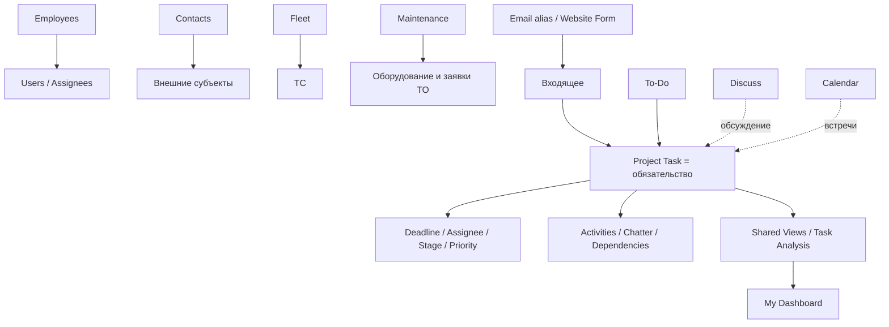

# Граница возможностей Odoo 19 Community

[Главная](../README.md) · **00 Возможности Odoo** · [01 Модель](01-methodology.md) · [02 Сценарии](02-scripts.md) · [03 Контроль и аналитика](03-control.md) · [04 Шаблоны](04-templates.md) · [05 Процессы](05-processes.md) · [06 Настройка](06-workspace.md)

---

Этот документ задаёт техническую границу методики.

Методика строится под **Odoo 19 Community** и использует только функции, которые одновременно:

1. подтверждаются актуальной документацией Odoo 19.0;
2. для спорных случаев подтверждаются публичной веткой [`odoo/odoo:19.0`](https://github.com/odoo/odoo/tree/19.0);
3. могут быть настроены штатным интерфейсом либо являются штатной моделью установленного Community-модуля.

Документация Odoo описывает продукт в целом и не всегда отделяет Community от Enterprise. Поэтому наличие функции в документации само по себе не считается доказательством её доступности в Community.

## 1. Область аудита

Под «возможностями Odoo 19 Community» в этой методике понимаются **все штатные Community-возможности, которые могут materially повлиять на управление работой одного отдела, его справочники, коммуникации и аналитику**.

Не анализируются как рабочий инструмент отдела приложения, не связанные с этой задачей: POS, eCommerce, Manufacturing, Accounting и другие предметные контуры, пока для них не появляется отдельная потребность.

Проверены следующие слои:

- Project и To-Do;
- Chatter, Discuss, Activities и Activity Plans;
- Search, Favorites, Project Top Bar и представления;
- Dashboards и My Dashboard;
- Employees;
- Contacts;
- Fleet;
- Maintenance и связка Maintenance ↔ Employees;
- Calendar;
- Timesheets;
- Email alias и Website Form как входящие каналы;
- Import / Export;
- Users / Access Rights / Project sharing;
- Automation Rules;
- ограничения стандартной Community-модели.

## 2. Главный архитектурный принцип

**Project Task — это объект обязательства, а не универсальный реестр всего на свете.**

Если Odoo уже имеет штатную предметную сущность, данные должны жить в ней:

| Что учитываем | Штатная сущность |
|---|---|
| обязательство / результат | `project.task` |
| сотрудник | `hr.employee` |
| внешний человек / организация | `res.partner` / Contacts |
| транспортное средство | `fleet.vehicle` |
| оборудование / инструмент / внутреннее железо | `maintenance.equipment` |
| обслуживание оборудования | `maintenance.request` |
| встреча | `calendar.event` |
| личное напоминание / черновая мысль | To-Do / private task |
| следующее действие по записи | `mail.activity` |
| обсуждение конкретной записи | Chatter |
| командное обсуждение | Discuss channel |

Не нужно копировать штатные справочники в Properties задач.

## 3. Матрица возможностей и решений

Обозначения:

- **База** — используем в основном контуре;
- **По потребности** — включаем только при конкретной управленческой задаче;
- **После стабилизации** — добавляем после накопления достоверных данных;
- **Не использовать как основу** — функция существует, но для нашей модели не является правильным фундаментом;
- **Разрыв модели** — штатной click-only связи не хватает, это кандидат на минимальную доработку после подтверждения потребности.

| Возможность | Community 19 | Решение | Комментарий |
|---|---:|---|---|
| Project / Tasks | да | **База** | учёт обязательств и результатов |
| Task Stages | да | **База** | рабочий поток |
| Task State | да | **База** | системное состояние задачи |
| Assignees | да | **База** | технически несколько; методика требует одного владельца результата |
| Deadline | да | **База** | конечный срок результата |
| Allocated Time | да | По потребности | оценка трудоёмкости, не факт времени |
| Priority 0–3 | да | **База**, но без лишней градации | исходный код содержит Low / Medium / High / Urgent |
| Tags | да | По потребности | лёгкая классификация |
| Properties | да | **База только для малых признаков** | не заменяют большие связанные справочники |
| Chatter / attachments / followers | да | **База** | контекст и история записи |
| Activities | да | **База** | следующее действие и его срок |
| Activity Types | да | **База** | могут Suggest/Trigger следующую Activity |
| Activity Plans | да | По потребности | пакет типовых follow-up действий |
| Subtasks | да | По потребности | отдельные результаты внутри более крупного |
| Dependencies / Blocked by | да | По потребности | реальная внутренняя блокировка |
| Recurring Tasks | да | **База для периодики** | новый экземпляр после закрытия предыдущего |
| Milestones | да | Для инициатив | контрольные точки отдельного проекта |
| Project Templates | да | Для повторяемых инициатив | повтор структуры проекта |
| Project Roles | да | Для шаблонов | назначение ролей при создании проекта |
| Project Updates | да | Для инициатив | управленческий снимок проекта |
| Project Dashboard / Burndown | да | Для инициатив | не ежедневная операционная очередь |
| To-Do | да | По потребности | личный буфер до появления общего обязательства |
| Convert To-Do to Task | да | По потребности | перевод личного в общий контур |
| Personal Stages | да | Личное | не общий статус отдела |
| Search / Filter / Group By | да | **База** | основа рабочих представлений |
| Favorites | да | **База** | личные, shared и default фильтры |
| Project Top Bar / Save View | да | **База для общих очередей** | можно сохранять Shared-кнопки проекта |
| List / Kanban / Calendar / Activity / Pivot / Graph | да | **База по назначению** | стандартный набор Community action задач |
| Gantt в стандартном Project action | нет | Не использовать как основу | документация может показывать Gantt, Community action задач его не включает |
| Task Analysis | да | **База аналитики** | агрегированная аналитическая модель Project |
| My Dashboard (`board`) | да | **База руководителя после настройки представлений** | собирает динамические Odoo views без Spreadsheet |
| Spreadsheet Dashboard | да | После стабилизации | для устойчивых KPI и интерактивных дашбордов |
| Employees | да | **База справочника сотрудников** | штатный `hr.employee` вместо текстового справочника |
| Departments | да | По потребности | для этой методики не дробим рабочий контур на множество департаментов |
| Contacts | да | **База внешних контрагентов/инициаторов** | `res.partner` вместо текстовых ФИО и организаций |
| Fleet | да | **База, если ТС участвуют в процессах** | штатный реестр ТС, водителей, сервисов, одометра и затрат |
| Fleet reporting | да | По потребности | анализ стоимости и одометра |
| Maintenance | да | **База, если учитывается оборудование** | отдельный контур оборудования и заявок обслуживания |
| Maintenance ↔ Employees | да | По потребности | `hr_maintenance` автоматически связывает HR и оборудование |
| Calendar | да | По потребности | встречи и события; не замена Deadline/Activity |
| Discuss channels | да | По потребности | командные обсуждения, не реестр обязательств |
| Timesheets | да | Только при управленческой задаче | факт трудозатрат; не включать ради контроля присутствия |
| Import CSV/XLSX | да | **База внедрения** | загрузка и массовое обновление справочников |
| Export CSV/XLS | да | **База контроля данных** | шаблоны экспорта и import-compatible export |
| Email alias → Project Task | да | После стабилизации входящего | автоматическое создание задач из почты |
| Website Form → Project Task | да при Website | По потребности | простой внешний/внутренний intake без Helpdesk |
| Project sharing / portal | да | По потребности | Read / limited edit / Edit для collaborators |
| Users / Access Rights | да | **База администрирования** | права по приложениям и группам |
| Automation Rules (`base_automation`) | да | После стабилизации | точечная no-code автоматизация |
| Customer Rating | да | Только внешний сервис | не рейтинг сотрудников |
| Rotting / Days to rot | да | По потребности | сигнал отсутствия смены этапа |
| Studio | нет | За границей CE | не является зависимостью методики |
| Helpdesk / Approvals / Documents / Knowledge / Planning как обязательная база | не используем | За границей базовой методики | методика должна работать без них |

## 4. Project Task: что именно считаем штатным

Публичный Community-модуль [`project`](https://github.com/odoo/odoo/blob/19.0/addons/project/__manifest__.py) содержит Project, задачи, роли, milestone, project updates, task templates, отчёты, Activity Plans и sharing.

В `project.task` публичной ветки 19.0 подтверждены:

- `priority` с четырьмя значениями: Low, Medium, High, Urgent;
- `stage_id`;
- `state`;
- `date_deadline`;
- `task_properties`;
- `allocated_hours`;
- `user_ids`;
- `partner_id`;
- subtasks;
- dependencies;
- recurrence;
- вычисляемое время до назначения и закрытия.

### Статусы: исправленная трактовка

Официальная документация описывает пять обычных пользовательских статусов:

- `In Progress`;
- `Changes Requested`;
- `Approved`;
- `Canceled`;
- `Done`.

При включённых Dependencies Odoo дополнительно вычисляет `Waiting` для заблокированной задачи.

Поэтому **не описываем Waiting как шестой обычный пользовательский статус**.

Источник: [Task stages and statuses](https://www.odoo.com/documentation/19.0/applications/services/project/tasks/task_stages_statuses.html), [Task dependencies](https://www.odoo.com/documentation/19.0/applications/services/project/tasks/task_dependencies.html).

## 5. Deadline, Allocated Time, Activity и Timesheet — четыре разных измерения

Не смешивать:

| Поле / объект | Отвечает на вопрос |
|---|---|
| Deadline | когда должен быть готов результат |
| Allocated Time | сколько времени ожидаемо потребуется |
| Activity Due Date | когда нужно совершить следующее действие |
| Timesheet | сколько времени фактически потрачено |

Allocated Time присутствует в стандартной задаче. Timesheets включаются только если фактические трудозатраты нужны для управленческого решения.

Источник: [Task creation](https://www.odoo.com/documentation/19.0/applications/services/project/tasks/task_creation.html), [Timesheets](https://www.odoo.com/documentation/19.0/applications/services/timesheets.html).

## 6. Properties: применять узко

Properties полезны для нескольких небольших аналитических признаков проекта, например:

- `Вид работы`;
- `Процесс`;
- `Контур` — только если реально нужен.

Не делать Property-справочник на сотни/тысячи ТС, сотрудников, объектов или оборудования.

Причина: такие данные уже имеют либо должны иметь собственную связанную модель. Текстовое/selection-поле не обеспечивает нормальную ссылочную целостность и быстро превращается в новый Excel внутри задачи.

Источник: [Property fields](https://www.odoo.com/documentation/19.0/applications/essentials/property_fields.html).

## 7. Activities: сначала цепочки, потом Automation Rules

Activity — следующее действие вокруг существующей записи.

Activity Type штатно умеет:

- назначать default user;
- задавать срок;
- `Suggest Next Activity`;
- `Trigger Next Activity`;
- вычислять срок от deadline или фактического completion предыдущей Activity.

Это означает, что простую цепочку follow-up нужно сначала пытаться собрать через Activity Types / Activity Plans, а не сразу через Automation Rules.

Источник: [Activities](https://www.odoo.com/documentation/19.0/applications/essentials/activities.html).

## 8. Shared Favorites и Project Top Bar — штатное рабочее место отдела

Odoo 19 позволяет:

- сохранить фильтр в Favorites;
- сделать его default;
- расшарить выбранным пользователям;
- в Project сохранить настроенное представление как кнопку Top Bar;
- включить `Shared`, чтобы кнопка была общей.

Это меняет базовую методику: основные очереди не должны каждый сотрудник собирать вручную.

Для операционного проекта достаточно централизованно подготовить кнопки/представления:

- `Входящие`;
- `Очередь`;
- `В работе`;
- `Просрочено`;
- `Ожидание внешнего`;
- `Блокировки`;
- `Критичные`;
- `Залежавшиеся`.

Источники: [Search, filter, and group records](https://www.odoo.com/documentation/19.0/applications/essentials/search.html), [Project management](https://www.odoo.com/documentation/19.0/applications/services/project/project_management.html).

## 9. My Dashboard и Spreadsheet Dashboard

Это два разных механизма.

### My Dashboard

Модуль `board` в Community зависит от `spreadsheet_dashboard`, но **My Dashboard сам не является Spreadsheet-дашбордом**. Он собирает живые Odoo-представления: List, Kanban, Pivot, Graph и другие доступные виды.

Для руководителя это первый выбор после настройки рабочих фильтров:

```text
Просрочено | Неназначено | Ожидание | Pivot по процессам
```

### Spreadsheet Dashboard

Использовать позже, когда KPI и разрезы устоялись.

Community-проверка:

- [`board`](https://github.com/odoo/odoo/blob/19.0/addons/board/__manifest__.py) — LGPL-3;
- [`spreadsheet_dashboard`](https://github.com/odoo/odoo/blob/19.0/addons/spreadsheet_dashboard/__manifest__.py) — LGPL-3.

Источник: [Dashboards](https://www.odoo.com/documentation/19.0/applications/productivity/dashboards.html), [My Dashboard](https://www.odoo.com/documentation/19.0/applications/productivity/dashboards/my_dashboard.html).

## 10. Employees — штатный справочник сотрудников

Community-модуль [`hr`](https://github.com/odoo/odoo/blob/19.0/addons/hr/__manifest__.py) — устанавливаемое приложение Employees.

Использовать для:

- ФИО сотрудника;
- рабочей информации;
- должности;
- подразделения;
- руководителя;
- рабочего местоположения;
- связанного пользователя Odoo.

Не заводить отдельный Property `Сотрудник`, если речь идёт о реальном сотруднике и его уже можно хранить в `hr.employee`.

Ограничение: Assignee задачи — `res.users`, а не произвольный `hr.employee`. Если сотрудник должен быть исполнителем задачи, ему нужен пользователь Odoo. Если нужно **ссылаться в задаче на сотрудника как на объект анализа, но он не пользователь**, штатной Many2one-связи Project Task → Employee нет — это отдельный разрыв модели.

Источники: [Employees](https://www.odoo.com/documentation/19.0/applications/hr/employees.html), [Departments](https://www.odoo.com/documentation/19.0/applications/hr/employees/departments.html).

## 11. Fleet — ТС не должны быть текстовым Property

Community-модуль [`fleet`](https://github.com/odoo/odoo/blob/19.0/addons/fleet/__manifest__.py) содержит:

- автомобили;
- модели и производителей;
- водителей;
- договоры;
- сервисные записи;
- одометр;
- затраты;
- графический анализ.

Если ТС являются значимым справочником отдела, **источником карточки ТС должен быть Fleet**, а не список в Property задачи.

Источник: [Fleet](https://www.odoo.com/documentation/19.0/applications/hr/fleet.html), [Odometer analysis](https://www.odoo.com/documentation/19.0/applications/hr/fleet/odometers.html).

### Важное ограничение

В стандартном Project Task нет поля `fleet.vehicle`.

Значит, штатно можно иметь правильный реестр ТС в Fleet, но нельзя получить строгую Many2one-связь `Задача → ТС` кликами через Project Properties.

Если аналитика задач **обязательно** должна строиться по тысячам ТС, минимальное поле `vehicle_id = Many2one('fleet.vehicle')` становится обоснованной будущей доработкой. До подтверждения этой потребности модуль не пишем.

## 12. Maintenance — оборудование и заявки обслуживания отдельно от Project

Community-модуль [`maintenance`](https://github.com/odoo/odoo/blob/19.0/addons/maintenance/__manifest__.py) имеет отдельные сущности оборудования и maintenance requests.

Штатно поддерживаются:

- карточки оборудования;
- категории;
- corrective / preventive maintenance;
- команды и ответственные;
- Scheduled Date;
- Duration;
- Priority;
- Kanban stages;
- Maintenance Calendar;
- показатели отказов и ремонта.

Модуль [`hr_maintenance`](https://github.com/odoo/odoo/blob/19.0/addons/hr_maintenance/__manifest__.py) автоматически устанавливается как мост HR ↔ Maintenance при наличии обеих сторон и поддерживает allocation tracking оборудования сотрудникам.

Источники: [Maintenance](https://www.odoo.com/documentation/19.0/applications/inventory_and_mrp/maintenance.html), [Add new equipment](https://www.odoo.com/documentation/19.0/applications/inventory_and_mrp/maintenance/add_new_equipment.html), [Maintenance requests](https://www.odoo.com/documentation/19.0/applications/inventory_and_mrp/maintenance/maintenance_requests.html).

Не использовать Project Task для заявки на ремонт оборудования, если Maintenance уже полностью описывает этот процесс. Project нужен только если вокруг обслуживания возникает отдельное управленческое обязательство, выходящее за рамки maintenance request.

## 13. Contacts — внешний субъект должен быть записью, а не строкой

Community-приложение [`contacts`](https://github.com/odoo/odoo/blob/19.0/addons/contacts/__manifest__.py) хранит Person / Company, контакты, адреса, телефоны, email, tags и заметки.

Использовать для внешних:

- организаций;
- подрядчиков;
- заявителей;
- контактных лиц.

Источник: [Contacts](https://www.odoo.com/documentation/19.0/applications/essentials/contacts.html).

## 14. Discuss и Calendar

### Discuss

Community-модуль [`mail`](https://github.com/odoo/odoo/blob/19.0/addons/mail/__manifest__.py) включает Discuss, Chatter, channels, followers, email gateway и Activities.

Discuss channel подходит для:

- командных объявлений;
- быстрых обсуждений;
- общего контекста смены/команды.

Не использовать канал как единственный журнал обязательств: сообщение в чате не имеет нормального Deadline, владельца результата и task analytics.

Источник: [Use channels for team communication](https://www.odoo.com/documentation/19.0/applications/productivity/discuss/team_communication.html).

### Calendar

Community-модуль [`calendar`](https://github.com/odoo/odoo/blob/19.0/addons/calendar/__manifest__.py) поддерживает события и повторяемые события.

Использовать для встреч и календарных событий. Не заменять им Deadline задачи или Activity.

Источник: [Calendar](https://www.odoo.com/documentation/19.0/applications/productivity/calendar.html).

## 15. Входящие каналы

### Email alias → Task

Project штатно может создавать задачи из писем.

Odoo переносит в задачу:

- отправителя;
- тему;
- тело;
- письмо в Chatter;
- внутренних получателей в Followers.

Можно ограничивать допустимых отправителей.

### Website Form → Task

При установленном Community-модуле [`website`](https://github.com/odoo/odoo/blob/19.0/addons/website/__manifest__.py) Form building block может выполнять действие `Create a Task`.

Это потенциальный простой intake для внутренних/внешних заявителей без Helpdesk.

Источник: [Task creation](https://www.odoo.com/documentation/19.0/applications/services/project/tasks/task_creation.html).

Оба канала включаются **после** определения правил триажа и дублей. Автоматическое создание карточек без владельца входящего только ускоряет захламление очереди.

## 16. Import / Export — обязательная часть внедрения

Odoo 19 штатно поддерживает:

- импорт CSV и XLSX;
- тестирование импорта до применения;
- сопоставление колонок с полями;
- relational fields;
- External ID;
- массовое обновление существующих записей;
- экспорт CSV/XLS;
- import-compatible export;
- сохранение export templates.

Источник: [Export and import data](https://www.odoo.com/documentation/19.0/applications/essentials/export_import_data.html).

Правило методики:

- первичную загрузку Employees / Contacts / Fleet / Equipment выполнять импортом, где модель и поля это позволяют;
- массовое обновление делать через стабильный External ID;
- перед массовым импортом использовать `Test`;
- большие наборы грузить партиями;
- импорт не является заменой владельца справочника и правил качества данных.

## 17. Права и видимость

Odoo имеет уровни прав приложений и группы пользователей. Изменение технических Access Rights — административная операция и не должно становиться частью ежедневного процесса.

Project дополнительно имеет штатную visibility/collaboration модель. Для external collaborators доступны режимы:

- Read;
- Edit with limited access;
- Edit.

Источник: [Users](https://www.odoo.com/documentation/19.0/applications/general/users.html), [Access rights](https://www.odoo.com/documentation/19.0/applications/general/users/access_rights.html), [Project management](https://www.odoo.com/documentation/19.0/applications/services/project/project_management.html).

Базовый пилот одного отдела не требует сложной самодельной матрицы record rules.

## 18. Automation Rules

Публичный Community-модуль [`base_automation`](https://github.com/odoo/odoo/blob/19.0/addons/base_automation/__manifest__.py) реализует Automation Rules.

Использовать только после появления устойчивого правила вида:

```text
если однозначное событие X → всегда выполнить однозначное действие Y
```

Не автоматизировать:

- неоднозначный триаж;
- управленческое решение;
- хаотично меняющийся процесс;
- правила, которые невозможно проверить по данным.

Перед Automation Rules проверять, не решается ли задача проще через:

1. Activity Type;
2. Activity Plan;
3. Recurring Task;
4. saved/shared view;
5. штатную предметную модель.

## 19. Подтверждённые разрывы click-only модели

### 19.1 Задача ↔ ТС

Fleet есть, но штатного `project.task.vehicle_id` нет.

### 19.2 Задача ↔ произвольный сотрудник как объект анализа

Исполнитель задачи — user. Штатного поля Task → `hr.employee` для аналитической ссылки на любого сотрудника нет.

### 19.3 Задача ↔ крупный специализированный справочник

Properties не являются полноценным динамическим Many2one к произвольной модели.

### 19.4 Жёсткая матрица переходов

Project не является BPM-движком с настраиваемой click-only матрицей переходов этапов по ролям.

Эти разрывы **не маскируются ручными строками и сотнями значений Property**. Если потребность доказана пилотом, для неё проектируется минимальная доработка, а не переписывается вся система.

## 20. Что методика сознательно не делает

Не используем:

- CRM как псевдо-case-management, если это не продажи;
- Maintenance Request как обычную рабочую задачу отдела;
- Discuss как реестр задач;
- Calendar как очередь работ;
- Fleet как менеджер задач;
- Properties как замену базе справочников;
- Timesheets как средство дисциплинарного наблюдения;
- Customer Rating как рейтинг сотрудников;
- число созданных/закрытых задач как прямую оценку производительности человека;
- Gantt как обязательную Community-функцию;
- Enterprise-приложения как скрытую зависимость.

## 21. Итоговая архитектура



Главный эффект этой архитектуры: **Odoo не превращается в один гигантский Kanban с текстовыми справочниками**. Каждая штатная модель отвечает за свою предметную сущность, а Project связывает управляемые обязательства и результаты.

---

[← Главная](../README.md) · [01 — Модель управления →](01-methodology.md)
