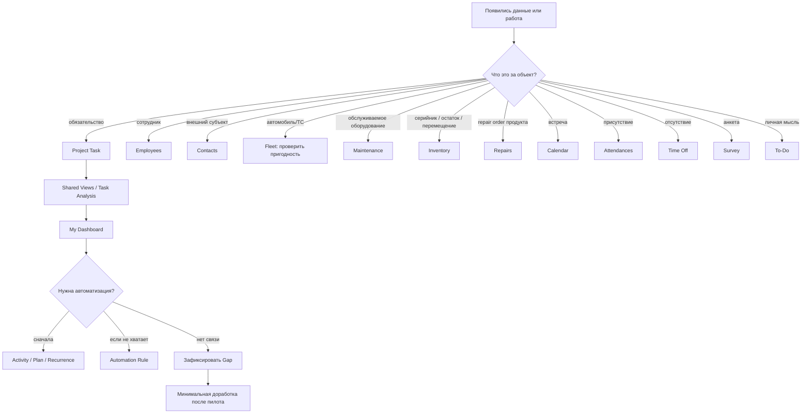

# Граница возможностей Odoo 19 Community

[Главная](../README.md) · **00 Возможности Odoo** · [01 Модель](01-methodology.md) · [02 Сценарии](02-scripts.md) · [03 Контроль и аналитика](03-control.md) · [04 Шаблоны](04-templates.md) · [05 Процессы](05-processes.md) · [06 Настройка](06-workspace.md)

---

Этот документ фиксирует техническую границу методики и результаты аудита штатных возможностей **Odoo 19 Community**, которые могут существенно влиять на управление работой отдела, справочники, коммуникации и аналитику.

## 1. Как проверяется Community

Для каждой значимой функции действует двойная проверка:

1. **поведение** сверяется с актуальной официальной документацией Odoo 19.0;
2. если документация описывает Odoo в целом и не отделяет Community от Enterprise, **наличие функции в Community** дополнительно проверяется в публичной ветке [`odoo/odoo:19.0`](https://github.com/odoo/odoo/tree/19.0).

Не используем сторонние статьи как основание методики.

Наличие функции в документации Odoo само по себе не означает, что она является базовой Community-функцией.

## 2. Что означает «аудит возможностей»

Цель — не перечислить каждый бухгалтерский, торговый или производственный экран Odoo.

Проверяются все штатные Community-приложения и механизмы, которые могут реально изменить архитектуру управления одним рабочим подразделением:

- обязательства и проекты;
- сотрудники и доступность людей;
- внешние контакты;
- транспорт;
- оборудование, внутренние активы и их движение;
- обслуживание и ремонт;
- коммуникации;
- встречи;
- входящие каналы;
- опросы и стандартизированный сбор ответов;
- импорт и экспорт;
- представления и аналитика;
- дашборды;
- учёт времени;
- автоматизация;
- права и внешний доступ.

Приложения, не имеющие отношения к этой модели — например POS или eCommerce — не включаются в рабочую методику только ради формального охвата продукта.

## 3. Главный архитектурный принцип

**Project Task — объект обязательства, а не универсальный реестр всех данных.**

Сначала выбирается правильная предметная модель Odoo, затем решается, нужно ли поверх неё отдельное обязательство.

| Что учитываем | Предпочтительная штатная сущность |
|---|---|
| обязательство / результат | `project.task` |
| сотрудник | `hr.employee` |
| пользователь-исполнитель | `res.users` |
| внешний человек / организация | `res.partner` / Contacts |
| автомобиль / транспортное средство | `fleet.vehicle` — после проверки пригодности модели для конкретного парка |
| обслуживаемое оборудование / внутренний актив | `maintenance.equipment` |
| обслуживание оборудования | `maintenance.request` |
| товарный/серийный объект, остаток, место хранения, перемещение | Inventory (`stock.*`, lots/serials, locations, moves) |
| ремонт продукта со складскими операциями | Repairs — только если процесс действительно соответствует repair order |
| встреча | `calendar.event` |
| личная мысль / напоминание | To-Do / private task |
| следующее действие | `mail.activity` |
| обсуждение конкретной записи | Chatter |
| командное обсуждение | Discuss channel |
| опрос / анкета / проверка знаний | Survey |
| присутствие | Attendances |
| отпуск / отсутствие | Time Off |

Нельзя копировать штатный справочник в Project Properties только потому, что Task удобно фильтровать.

## 4. Матрица возможностей

Обозначения:

- **База** — используется в основном контуре;
- **По потребности** — включается при конкретном кейсе;
- **После стабилизации** — полезно только поверх уже качественных данных;
- **Предметный контур** — отдельное приложение является источником истины для своей сущности;
- **Не фундамент** — функция существует, но методика от неё не зависит;
- **Gap** — штатной click-only модели не хватает.

### 4.1 Project и управление обязательствами

| Возможность | Community 19 | Решение |
|---|---:|---|
| Projects / Tasks | да | **База** |
| настраиваемые Task Stages | да | **База** |
| Task State | да | **База** |
| Assignees | да | **База** |
| Deadline | да | **База** |
| Allocated Time | да | По потребности |
| Priority 0–3 | да | **База без обязательного использования всех уровней** |
| Tags | да | По потребности |
| Properties | да | **База только для малых аналитических признаков** |
| Chatter / attachments / followers | да | **База** |
| Activities | да | **База** |
| Activity Types | да | **База** |
| Activity chaining | да | По потребности |
| Activity Plans | да | По потребности |
| Subtasks | да | По потребности |
| Task Dependencies / Blocked by | да | По потребности |
| Recurring Tasks | да | **База для устойчивой периодики** |
| Milestones | да | Для отдельных инициатив |
| Project Templates | да | Для повторяемых инициатив |
| Project Roles | да | Для шаблонов проектов |
| Project Updates | да | Для инициатив |
| Project Dashboard / Burndown | да | Для инициатив |
| Customer Rating | да | Только для реального внешнего сервиса |
| Rotting / Days to rot | да | По потребности |
| Project sharing / collaborators | да | По потребности |
| email alias → Task | да | После стабилизации intake |
| Website Form → Task | да при Website | По потребности |
| Gantt в стандартном Community action задач | нет | **Не фундамент** |

Публичный Community-модуль: [`addons/project`](https://github.com/odoo/odoo/tree/19.0/addons/project).

Документация: [Project](https://www.odoo.com/documentation/19.0/applications/services/project.html).

## 5. Task State: исправленная трактовка

Официальная документация описывает пять обычных пользовательских состояний задачи:

- `In Progress`;
- `Changes Requested`;
- `Approved`;
- `Canceled`;
- `Done`.

При Task Dependencies Odoo дополнительно вычисляет `Waiting` для заблокированной задачи.

Следовательно, **Waiting не является шестым обычным ручным статусом**.

Источники:

- [Task stages and statuses](https://www.odoo.com/documentation/19.0/applications/services/project/tasks/task_stages_statuses.html);
- [Task dependencies](https://www.odoo.com/documentation/19.0/applications/services/project/tasks/task_dependencies.html).

## 6. Priority

Публичная модель `project.task` в ветке 19.0 содержит четыре значения:

- Low;
- Medium;
- High;
- Urgent.

Это техническая возможность, а не требование методики использовать четыре уровня.

На пилоте рекомендуется минимальная семантика: обычная работа и действительно Urgent; промежуточные уровни вводятся только при устойчивых критериях.

Источник Community: [`project_task.py`](https://github.com/odoo/odoo/blob/19.0/addons/project/models/project_task.py).

## 7. Deadline, Allocated Time, Activity и Timesheet

Эти механизмы отвечают на разные вопросы:

| Механизм | Вопрос |
|---|---|
| Deadline | когда должен быть готов результат |
| Allocated Time | сколько времени ожидаемо потребуется |
| Activity Due Date | когда совершить следующее действие |
| Timesheet | сколько времени фактически потрачено |

Не использовать один механизм вместо другого.

## 8. Activities до Automation Rules

Activity Type штатно может:

- задавать тип следующего действия;
- иметь default user;
- задавать срок;
- `Suggest Next Activity`;
- `Trigger Next Activity`;
- рассчитывать следующую дату относительно deadline либо фактического completion предыдущей Activity.

Поэтому типовой follow-up сначала собирается через Activity Types / Activity Plans.

Automation Rule нужен только если задача действительно шире.

Источник: [Activities](https://www.odoo.com/documentation/19.0/applications/essentials/activities.html).

## 9. Recurring Task и Project Template

### Recurring Task

Для одного повторяемого результата.

Следующая occurrence создаётся после закрытия текущей.

### Project Template

Для повторяемого набора:

- задач;
- ролей;
- зависимостей;
- этапов;
- контрольных точек.

Не заменять одно другим.

Источники:

- [Recurring tasks](https://www.odoo.com/documentation/19.0/applications/services/project/tasks/recurring_tasks.html);
- [Project templates](https://www.odoo.com/documentation/19.0/applications/services/project/project_management/project_templates.html).

## 10. To-Do

Публичный Community-модуль `project_todo` доступен как отдельное приложение.

Использовать для личных:

- мыслей;
- напоминаний;
- черновиков;
- наблюдений до решения.

После появления общего обязательства использовать Convert to Task.

Источник: [To-do](https://www.odoo.com/documentation/19.0/applications/productivity/to_do.html).

## 11. Search, Favorites и Project Top Bar

Обычные фильтры и группировки являются частью рабочего места, а не временной настройкой.

Odoo поддерживает Favorites, в том числе default/shared варианты.

Project дополнительно позволяет:

1. открыть нужный view;
2. применить search/filter/grouping;
3. `Save View`;
4. включить `Shared`;
5. получить общую кнопку в Top Bar проекта.

Для операционного Project это лучший штатный способ опубликовать общие очереди:

- `Входящие`;
- `Очередь`;
- `В работе`;
- `Просрочено`;
- `Ожидание внешнего`;
- `Блокировки`;
- `Критичные`;
- `Залежавшиеся`.

Источник: [Project management — Top bar](https://www.odoo.com/documentation/19.0/applications/services/project/project_management.html).

## 12. Представления Project Community

Публичное действие задач Community включает:

```text
kanban
list
form
calendar
pivot
graph
activity
```

Gantt в стандартное Community action задач не входит.

Методика не должна зависеть от Gantt даже если общая документация Odoo показывает его в отдельных примерах.

Источник Community: [`project_task_views.xml`](https://github.com/odoo/odoo/blob/19.0/addons/project/views/project_task_views.xml).

## 13. Task Analysis

Штатная аналитическая модель Project содержит, в частности:

- creation date;
- assignment date;
- closing date;
- Deadline;
- Project;
- Stage;
- State;
- Assignees;
- Priority;
- Tags;
- Milestone;
- task count;
- working time to assign;
- working time to close.

Это достаточная база для первоначальной операционной аналитики без отдельного BI.

## 14. Dashboards

### My Dashboard

Это не Spreadsheet Dashboard.

My Dashboard собирает живые Odoo views и сохраняет их интерактивность.

Официальная документация прямо указывает, что для доступа должны быть установлены:

- `board`;
- `spreadsheet_dashboard`.

Добавление view:

```text
Actions → Dashboard → Add to my Dashboard
```

Для руководителя это рекомендуемый первый dashboard после стабилизации Shared Views.

### Spreadsheet Dashboard

Использовать позднее для устойчивых KPI.

Community-проверка:

- [`board`](https://github.com/odoo/odoo/blob/19.0/addons/board/__manifest__.py);
- [`spreadsheet_dashboard`](https://github.com/odoo/odoo/blob/19.0/addons/spreadsheet_dashboard/__manifest__.py).

Источник: [My Dashboard](https://www.odoo.com/documentation/19.0/applications/productivity/dashboards/my_dashboard.html).

## 15. Employees

Community-модуль [`hr`](https://github.com/odoo/odoo/blob/19.0/addons/hr/__manifest__.py) является штатным приложением Employees.

Использовать как источник истины по сотрудникам.

Здесь живут, в зависимости от включённых функций:

- employee record;
- должность;
- department;
- manager;
- work location;
- связанный user;
- оборудование сотрудника и другие HR-данные.

Не создавать Property `Сотрудник` как замену Employees.

### Ограничение для Project

Assignee задачи — `res.users`, а не произвольный `hr.employee`.

Если нужно анализировать Task по сотруднику, который не является User, штатной Many2one-связи Task → Employee нет.

Это **Gap**, а не повод назначать неправильного Assignee.

Источник: [Employees](https://www.odoo.com/documentation/19.0/applications/hr/employees.html).

## 16. Attendances

Community-модуль [`hr_attendance`](https://github.com/odoo/odoo/blob/19.0/addons/hr_attendance/__manifest__.py) доступен штатно.

Он предназначен для:

- check-in / check-out;
- факта присутствия;
- отработанных часов;
- overtime;
- attendance reporting.

**Не включать в базовую task-методику**, если задача системы — управление обязательствами, а не табель присутствия.

Он может быть полезен отдельным HR/операционным контуром, если требуется реальная информация о присутствии и переработках.

Источник: [Attendances](https://www.odoo.com/documentation/19.0/applications/hr/attendances.html).

## 17. Time Off

Community-модуль [`hr_holidays`](https://github.com/odoo/odoo/blob/19.0/addons/hr_holidays/__manifest__.py) штатно управляет:

- requests;
- balances;
- allocations;
- approvals;
- public holidays;
- reports.

Для методики задач Time Off — **контекст доступности ресурса**, а не рабочая очередь.

Не пытаться моделировать отпуск отдельными Project Tasks.

Если управление отсутствиями уже ведётся в другой корпоративной системе, не дублировать его в Odoo только ради полноты.

Источник: [Time Off](https://www.odoo.com/documentation/19.0/applications/hr/time_off.html).

## 18. Contacts

Community-приложение Contacts — нормальный источник истины для внешних:

- организаций;
- физических лиц;
- подрядчиков;
- заявителей;
- контактных лиц.

Не хранить одно и то же название организации строкой в каждой задаче, если оно должно быть master data.

Community source: [`contacts`](https://github.com/odoo/odoo/blob/19.0/addons/contacts/__manifest__.py).

## 19. Fleet

Community-модуль [`fleet`](https://github.com/odoo/odoo/blob/19.0/addons/fleet/__manifest__.py) содержит:

- vehicles;
- models / manufacturers;
- drivers;
- services;
- contracts;
- odometer;
- costs;
- cost analysis;
- odometer analysis.

Поэтому Fleet **нужно сначала проверить как кандидат на master data ТС**, прежде чем писать свой справочник.

### Ограничение предметной модели

Fleet не нужно принимать без проверки только потому, что модуль существует.

Официальная документация, например, имеет фиксированные model vehicle types `Car` / `Bike`. Для промышленного или специализированного парка это может оказаться слишком узкой семантикой.

Следовательно:

1. провести пилот на реальных типах ТС;
2. проверить обязательные поля и классификацию;
3. только затем признать Fleet источником истины для всего парка.

### Gap Project ↔ Fleet

Стандартный `project.task` не имеет Many2one на `fleet.vehicle`.

Если массовая аналитика Tasks по конкретным ТС обязательна, это кандидат на минимальную доработку `vehicle_id`.

Источники:

- [Fleet](https://www.odoo.com/documentation/19.0/applications/hr/fleet.html);
- [Odometer analysis](https://www.odoo.com/documentation/19.0/applications/hr/fleet/odometers.html).

## 20. Maintenance

Community-модуль [`maintenance`](https://github.com/odoo/odoo/blob/19.0/addons/maintenance/__manifest__.py) предназначен для оборудования и maintenance requests.

Использовать, когда ключевой вопрос:

> какое оборудование обслуживается, что сломалось, что нужно ремонтировать или обслужить профилактически?

Штатно есть:

- Equipment;
- categories;
- Maintenance Teams;
- corrective/preventive requests;
- responsible;
- scheduled dates;
- stages;
- calendar;
- maintenance metrics.

Мост [`hr_maintenance`](https://github.com/odoo/odoo/blob/19.0/addons/hr_maintenance/__manifest__.py) связывает Employees и Equipment и поддерживает allocation tracking.

Источник: [Maintenance](https://www.odoo.com/documentation/19.0/applications/inventory_and_mrp/maintenance.html).

## 21. Inventory — важная альтернатива Maintenance для реестра оборудования

Community-модуль [`stock`](https://github.com/odoo/odoo/blob/19.0/addons/stock/__manifest__.py) — штатный Inventory.

Он нужен не для «управления задачами», а когда ключевой вопрос:

> где физически находится серийный объект, сколько его, куда и когда он перемещался?

Inventory поддерживает предметные сущности для:

- products;
- lots / serial numbers;
- locations;
- stock moves;
- transfers;
- traceability;
- inventory adjustments.

Поэтому выбор для внутреннего оборудования выглядит так:

```text
нужно обслуживание / ответственность за оборудование
→ Maintenance Equipment

нужны остатки / серийники / места / перемещения
→ Inventory

нужно и то и другое
→ сначала проверить штатную интеграцию моделей и не дублировать карточки вручную
```

Не использовать Inventory для обычных Project Tasks.

Источник: [Inventory](https://www.odoo.com/documentation/19.0/applications/inventory_and_mrp/inventory.html).

## 22. Repairs

Community-модуль [`repair`](https://github.com/odoo/odoo/blob/19.0/addons/repair/__manifest__.py) существует, но ориентирован на repair orders продуктов и связан со stock/sales.

Для обычного внутреннего preventive/corrective обслуживания оборудования **Maintenance предпочтительнее**.

Repairs включать только если фактический процесс соответствует его предметной модели:

- product repair;
- add/remove components;
- stock impact;
- warranty;
- repair order / quotation.

Не ставить Repairs только потому, что в названии есть «ремонт».

## 23. Discuss и Chatter

Community-модуль Mail содержит Discuss, Chatter, Followers и Activities.

### Chatter

История конкретной записи.

### Discuss

Командные каналы, объявления, быстрые обсуждения.

Правило:

> сообщение может породить обязательство, но само сообщение не заменяет Project Task.

Источник: [Discuss](https://www.odoo.com/documentation/19.0/applications/productivity/discuss.html).

## 24. Calendar

Community Calendar используется для встреч и событий во времени.

Не заменяет:

- Task Deadline;
- Activity;
- Recurring Task.

Календарное событие нужно, когда действительно нужна встреча с участниками или отдельное событие.

Источник: [Calendar](https://www.odoo.com/documentation/19.0/applications/productivity/calendar.html).

## 25. Surveys

Community-модуль [`survey`](https://github.com/odoo/odoo/blob/19.0/addons/survey/__manifest__.py) доступен штатно.

Он умеет:

- surveys;
- questionnaires;
- assessments;
- scoring;
- invitations;
- response analysis.

Для ежедневной операционной работы **не нужен**.

Он становится полезен, если появляется конкретный процесс:

- стандартизированный опрос;
- сбор обратной связи;
- проверка знаний;
- оценочный тест;
- массовая анкета.

Не использовать Survey как замену форме регистрации рабочей заявки, если результат должен дальше управляться как Task.

Источник: [Surveys](https://www.odoo.com/documentation/19.0/applications/marketing/surveys.html).

## 26. Входящие каналы Project

### Email alias

Project может создавать Tasks из email.

Перед включением определить:

- кто делает triage;
- какие письма не являются задачами;
- как выявлять дубли;
- кого принимать как sender.

### Website Form

При установленном Website Form может выполнять `Create a Task`.

Это простой intake, а не полноценный Helpdesk/BPM.

Источник: [Task creation](https://www.odoo.com/documentation/19.0/applications/services/project/tasks/task_creation.html).

## 27. Import / Export

Штатный механизм Odoo 19 поддерживает:

- CSV/XLSX import;
- `Test` до применения;
- mapping полей;
- relational fields;
- External ID;
- повторное массовое обновление;
- CSV/XLS export;
- import-compatible export;
- export templates.

Это обязательная часть внедрения больших справочников.

Правило:

```text
справочник большой
→ правильная штатная модель
→ External ID
→ Test
→ Import
```

Не создавать тысячи значений руками.

Источник: [Export and import data](https://www.odoo.com/documentation/19.0/applications/essentials/export_import_data.html).

## 28. Timesheets

Community-модуль [`hr_timesheet`](https://github.com/odoo/odoo/blob/19.0/addons/hr_timesheet/__manifest__.py) доступен штатно.

Включать только если есть вопрос:

- сколько фактически потрачено времени;
- какова трудоёмкость процесса;
- каков план/факт;
- какова стоимость времени.

Не включать только для наблюдения за присутствием — для присутствия существует Attendances.

Не использовать число часов как автоматический рейтинг сотрудника.

Источник: [Timesheets](https://www.odoo.com/documentation/19.0/applications/services/timesheets.html).

## 29. KPI Digests

Публичный Community-модуль [`digest`](https://github.com/odoo/odoo/blob/19.0/addons/digest/__manifest__.py) умеет периодически отправлять KPI digests.

Но это **не универсальный конструктор управленческой аналитики**.

Не включать Digest в базовую методику только ради ежедневной рассылки цифр.

Рассматривать после стабилизации KPI и только если требуемые показатели реально доступны Digest-механизму без искусственных обходов.

## 30. Automation Rules

Публичный Community-модуль [`base_automation`](https://github.com/odoo/odoo/blob/19.0/addons/base_automation/__manifest__.py) существует.

Но автоматизация — поздний слой.

Порядок выбора:

1. правильная предметная модель;
2. штатное поле / Stage / State;
3. Activity Type chaining;
4. Activity Plan;
5. Recurring Task;
6. Shared View;
7. только потом Automation Rule.

Автоматизировать можно только правило вида:

```text
однозначное событие X
→ всегда однозначное действие Y
```

## 31. Access Rights и Project sharing

Использовать штатные application access rights и Project visibility.

Не строить сложные custom record rules до появления конкретного требования.

Для external collaboration Project поддерживает отдельные режимы доступа.

Права должны ограничивать данные, а не пытаться реализовать BPM-переходы.

Источники:

- [Users](https://www.odoo.com/documentation/19.0/applications/general/users.html);
- [Access rights](https://www.odoo.com/documentation/19.0/applications/general/users/access_rights.html);
- [Project management](https://www.odoo.com/documentation/19.0/applications/services/project/project_management.html).

## 32. Что не включаем в базу методики

### Attendances

Не нужен, если не ведём факт присутствия.

### Time Off

Не нужен, если отпуска и отсутствия уже являются master data другой корпоративной системы и нет смысла дублировать их в Odoo.

### Surveys

Не нужен без стандартизированного сбора ответов.

### Inventory

Не нужен, если нет задач складского/серийного учёта и перемещений.

### Repairs

Не нужен для обычного внутреннего обслуживания оборудования.

### Timesheets

Не нужен без управленческого вопроса о фактическом времени.

### Website

Не нужен без web-intake.

### Customer Rating

Не нужен без внешнего получателя сервиса.

### Spreadsheet Dashboard

Не нужен до стабилизации KPI.

### Automation Rules

Не нужны до стабилизации процесса.

## 33. Enterprise-функции не являются скрытой зависимостью

Базовая методика не должна требовать:

- Studio;
- Helpdesk;
- Planning;
- Approvals;
- Documents;
- Knowledge;
- Sign;
- других функций, отсутствующих в публичной Community-базе либо не подтверждённых как CE-основа.

Если общая документация Odoo показывает такую функцию рядом с Community-функцией, это не делает её частью нашей методики.

## 34. Подтверждённые click-only gaps

### 34.1 Project Task → Fleet Vehicle

Штатного Many2one нет.

### 34.2 Project Task → произвольный Employee

Assignee = User. Аналитической Many2one-ссылки на любого Employee нет.

### 34.3 Project Task → произвольный большой предметный справочник

Properties не являются динамическим Many2one к произвольной модели.

### 34.4 Жёсткие переходы по ролям

Project не является BPM-движком с click-only матрицей разрешённых переходов Stage/State.

### 34.5 Общая аналитика между независимыми предметными моделями

Наличие Fleet, Maintenance, Inventory и Project не означает, что Odoo автоматически даёт нужную cross-model аналитику между ними.

Если руководитель требует один разрез `Tasks × Vehicle × Employee × Equipment`, сначала нужно проверить наличие штатной связи. Если её нет, нужен минимальный интеграционный слой, а не текстовые поля.

## 35. Правило выбора минимальной доработки

Custom module оправдан только если:

1. потребность регулярна;
2. она влияет на управление;
3. штатная модель уже выбрана правильно;
4. отсутствует конкретное поле/связь/действие;
5. click-only workaround создаёт дубли или ложную аналитику;
6. доработка может быть узкой и проверяемой.

Хороший пример:

```python
vehicle_id = fields.Many2one('fleet.vehicle')
```

если Task действительно должен системно ссылаться на Vehicle.

Плохой пример:

```text
написать свою систему задач
```

когда Project уже решает управление обязательством.

## 36. Итоговая карта выбора



Главный результат аудита: **Odoo Community не нужно насильно сводить к Project и не нужно насильно включать все приложения.** Оптимальная методика выбирает штатную модель только там, где она действительно совпадает с предметом управления.

---

[← Главная](../README.md) · [01 — Модель управления →](01-methodology.md)
