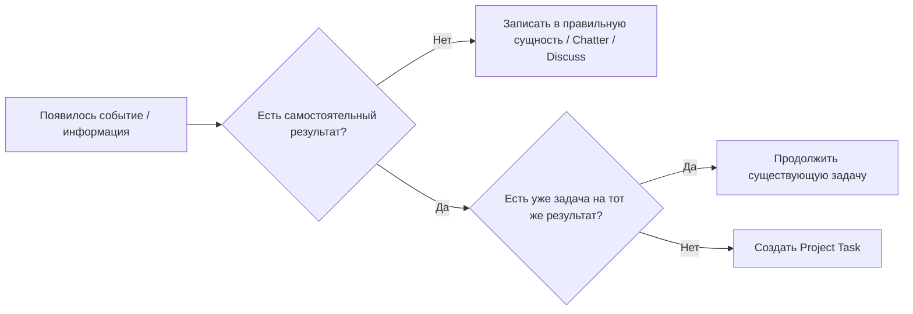
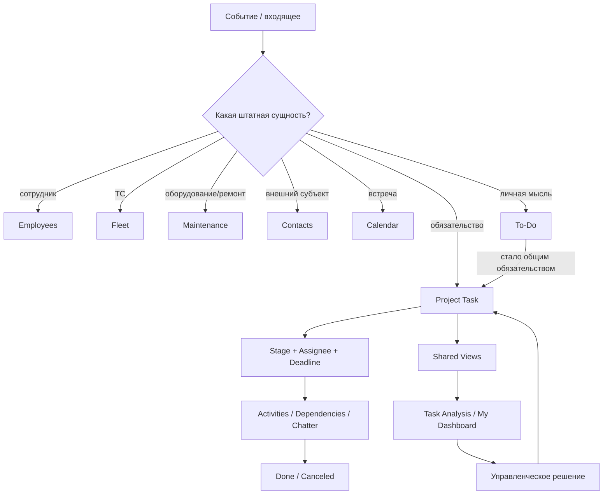

# Модель управления

[Главная](../README.md) · [00 Возможности Odoo](00-odoo19-community.md) · **01 Модель** · [02 Сценарии](02-scripts.md) · [03 Контроль и аналитика](03-control.md) · [04 Шаблоны](04-templates.md) · [05 Процессы](05-processes.md) · [06 Настройка](06-workspace.md)

---

## 1. Не всё является задачей

Главная ошибка, которую методика должна предотвращать: превращение Project в универсальную таблицу для любых данных.

В Odoo сначала выбирается **правильная штатная сущность**, и только потом решается, нужна ли задача.

| Реальный объект | Штатная сущность Odoo |
|---|---|
| обязательство / результат | Project Task |
| сотрудник | Employee |
| пользователь-исполнитель | User / Assignee |
| внешний человек или организация | Contact |
| транспортное средство | Fleet Vehicle |
| оборудование | Maintenance Equipment |
| ремонт / обслуживание оборудования | Maintenance Request |
| встреча | Calendar Event |
| личная заметка до постановки работы | To-Do |
| следующее действие по записи | Activity |
| обсуждение записи | Chatter |
| командное обсуждение | Discuss Channel |

**Project Task создаётся не потому, что появилась информация, а потому, что появился отдельно контролируемый результат.**

## 2. Единица управления — один контролируемый результат

Одна задача Odoo = один результат, который нужно отдельно:

- выполнить;
- назначить;
- ограничить сроком;
- провести через рабочий поток;
- не потерять;
- увидеть в контроле и аналитике.

Не создавать отдельную задачу на каждый файл, письмо, звонок, комментарий или технический шаг, если это части одного результата.



## 3. Project — контур обязательств, а не каталог процессов

Для постоянной операционной работы одного отдела по умолчанию создаётся **один основной операционный проект**.

Отдельный проект не нужен только потому, что отличается:

- процесс;
- вид работы;
- участок;
- исполнитель;
- тип входящего;
- источник данных.

Эти различия отражаются полями, Properties, Tags и представлениями только там, где это действительно нужно.

Отдельный проект создаётся, когда есть самостоятельная граница управления:

- отдельная инициатива с началом и завершением;
- отдельный набор Milestones;
- самостоятельный Project Update;
- отдельная visibility-модель;
- отдельный повторяемый Project Template;
- существенно отличающийся рабочий поток, который нельзя разумно совместить.

## 4. Базовый состав задачи

Для обычной операционной задачи достаточно:

- **Title** — результат, а не тема переписки;
- **Assignee** — владелец результата, когда задача взята в работу;
- **Deadline** — конечный срок результата;
- **Stage** — положение в рабочем потоке;
- **State** — системное состояние;
- **Priority** — только когда приоритет реально меняет порядок действий;
- **Property `Вид работы`** — небольшой устойчивый аналитический признак;
- **Property `Процесс`** — только если разрез реально используется в контроле;
- **Chatter** — история и контекст;
- **Activities** — следующие действия.

Не дублировать в описании задачи данные, которые уже являются полями Odoo.

## 5. Справочники не копируются в Properties

Properties оставляем для небольших проектно-зависимых признаков.

Не создавать через Property длинные списки:

- сотрудников;
- автомобилей;
- оборудования;
- организаций;
- других крупных постоянно меняющихся справочников.

Правильная схема:

```text
сотрудник → Employees
внешний субъект → Contacts
ТС → Fleet
оборудование → Maintenance
```

Если Project Task должен иметь **строгую аналитическую ссылку** на такую сущность, а штатного поля нет, это фиксируется как разрыв модели.

Нельзя маскировать отсутствие Many2one сотнями вручную заведённых значений Selection.

## 6. Исполнитель и сотрудник — не одно и то же

В Project Task поле Assignees связано с пользователями Odoo.

Поэтому:

- человек, который **исполняет задачу в Odoo**, должен иметь пользователя;
- запись Employee может существовать без необходимости ставить этому человеку задачи;
- если сотрудник нужен только как предмет проверки или аналитический объект, не надо назначать его исполнителем ради ссылки.

Если потребуется отдельное поле `Сотрудник` для анализа задач по работникам, не являющимся пользователями, это отдельная подтверждаемая потребность в доработке.

## 7. Один владелец результата, даже если Odoo допускает нескольких Assignees

Odoo технически допускает несколько исполнителей.

Методика для операционного контура использует **одного владельца конечного результата**.

Причина: несколько равноправных Assignees размывают ответ на вопрос «кто отвечает за то, что задача не закрыта».

Если внутри одной работы есть части с самостоятельными владельцами, это:

- subtasks;
- отдельные tasks;
- либо зависимости между задачами.

Дополнительных участников можно держать Followers и подключать через Chatter/Activities.

## 8. Этап и State — разные вещи

### Stage

Stage отвечает на вопрос:

> Где работа находится в нашем процессе?

Базовый операционный набор:

1. `Входящие`;
2. `Очередь`;
3. `В работе`;
4. `Ожидание внешнего`;
5. `На проверке` — только если реальная проверка обязательна.

Не добавлять этап, если он не меняет управленческое решение.

### State

Обычные пользовательские состояния Odoo:

- `In Progress`;
- `Changes Requested`;
- `Approved`;
- `Done`;
- `Canceled`.

При включённых Dependencies состояние `Waiting` вычисляется Odoo для заблокированной задачи.

То есть `Waiting` **не является шестым обычным ручным статусом**.

`Done` и `Canceled` закрывают задачу независимо от рабочего Stage.

## 9. Что означает каждый базовый этап

### `Входящие`

Работа зарегистрирована, но ещё не принято решение:

- это вообще задача или нет;
- нет ли дубля;
- хватает ли данных;
- какой результат нужен;
- кто и когда должен делать.

`Входящие` — зона триажа, а не бесконечный склад.

### `Очередь`

Результат понятен, работа готова к выполнению, но сейчас не находится в активном исполнении.

Задача может быть неназначенной.

**Общая очередь = неназначенные готовые задачи**, а не искусственный «групповой исполнитель».

### `В работе`

Исполнитель действительно работает над результатом.

Переход сюда означает не «когда-нибудь буду делать», а фактическое начало активной работы.

### `Ожидание внешнего`

Продолжение зависит от ответа/действия вне контролируемой цепочки задач Odoo.

Обязательно:

- зафиксировать, чего ждём;
- поставить Activity на дату проверки / напоминания / эскалации.

Ожидание без следующего действия превращается в забытый хвост.

### `На проверке`

Используется только там, где независимая проверка результата действительно нужна.

Не создавать универсальное согласование ради красивой схемы.

## 10. Внешнее ожидание и внутренняя зависимость принципиально различаются

### Внешнее ожидание

```text
Stage = Ожидание внешнего
+ Activity = когда проверить / напомнить
```

### Внутренняя зависимость

```text
Blocked by = другая Project Task
→ Odoo вычисляет Waiting
```

Не использовать один общий этап `Ожидание` для обеих причин: руководителю нужны разные решения.

## 11. Deadline, Activity, Allocated Time и Timesheet не взаимозаменяемы

| Механизм | Что означает |
|---|---|
| Deadline | когда должен быть готов результат |
| Activity Due Date | когда выполнить следующее действие |
| Allocated Time | ожидаемая трудоёмкость |
| Timesheet | фактически потраченное время |

Примеры:

- задача должна быть готова 20 августа → Deadline = 20 августа;
- ответ контрагента проверяем 15 августа → Activity = 15 августа;
- ожидаем 4 часа работы → Allocated Time = 4 часа;
- реально потратили 6 часов → Timesheet = 6 часов, если учёт времени включён.

Не ставить Deadline как напоминание.

## 12. Приоритет не должен заменять срок и очередь

В Community-модели Project есть четыре значения priority: Low, Medium, High, Urgent.

Но наличие четырёх уровней не означает, что отдел обязан использовать все четыре.

Начальный принцип:

- обычная работа — базовый уровень;
- действительно критичная работа — `Urgent`;
- промежуточные уровни вводятся только если сотрудники могут одинаково трактовать разницу и она меняет порядок выполнения.

Не использовать Priority вместо Deadline.

## 13. Вид работы — классификация, а не отдельный жизненный цикл

Базовые значения Property `Вид работы`:

- `Работа`;
- `Запрос`;
- `Улучшение`.

Они нужны для аналитики и фильтрации, а не для трёх отдельных систем управления.

### Работа

Непосредственный внутренний результат.

### Запрос

Результат требует отправки обращения и получения внешнего ответа.

Типовая схема:

```text
подготовить / отправить
→ Ожидание внешнего + Activity
→ получить / проверить
→ Done
```

### Улучшение

Подтверждённая работа по изменению процесса, инструмента или правила.

Идея до решения «делаем» может жить в To-Do или обсуждении. После решения становится обычной контролируемой задачей `Улучшение`.

## 14. Activity — не задача

Activity описывает **следующее действие вокруг существующего объекта**:

- позвонить;
- проверить ответ;
- напомнить;
- провести встречу;
- сделать follow-up.

Если действие само имеет самостоятельный результат, собственный срок и владельца — это Task/Subtask, а не Activity.

### Цепочки Activities

Перед Automation Rules использовать штатные возможности Activity Type:

- Suggest Next Activity;
- Trigger Next Activity;
- срок от deadline предыдущей Activity;
- срок от фактического completion предыдущей Activity.

Если нужен типовой пакет нескольких follow-up действий — использовать Activity Plan.

## 15. Периодика

Если регулярно повторяется **один контролируемый результат**, использовать Recurring Task.

Не создавать руками карточки на несколько месяцев вперёд.

Если регулярно повторяется **целая структурированная инициатива** из нескольких задач, ролей и контрольных точек — использовать Project Template + Project Roles.

Это разные задачи управления.

## 16. Subtask создаётся только при самостоятельном управлении частью результата

Subtask оправдана, если у части работы есть хотя бы несколько из признаков:

- отдельный ответственный;
- отдельный результат;
- отдельный срок;
- отдельная блокировка;
- отдельная необходимость контроля.

Если это просто чек-лист действий одного исполнителя — оставить в описании или Activities.

## 17. Project Template — не замена Recurring Task

Использовать:

```text
один повторяемый результат → Recurring Task
повторяемый набор задач / ролей / вех → Project Template
```

Не плодить новые проекты для обычной ежедневной периодики.

## 18. Milestones и Project Updates — только для инициатив

Операционная очередь не требует Milestones.

Для отдельной проектной инициативы:

- Milestone = значимая контрольная точка;
- Project Update = управленческий снимок состояния;
- Dashboard / Burndown = обзор проекта.

Не заставлять ежедневную операционную работу изображать проект с вехами.

## 19. Fleet: ТС ведётся как ТС, а не как атрибут карточки

Если транспортные средства участвуют в работе отдела, основной справочник — Fleet.

Project Task не становится карточкой ТС.

Правильная логика:

```text
Fleet Vehicle = сведения о ТС
Project Task = что нужно сделать
```

Пока нет штатной Many2one связи между этими моделями, на пилоте нельзя создавать псевдосвязь из тысяч значений Property.

Если аналитика `задачи по конкретному ТС` окажется обязательной, это один из наиболее обоснованных кандидатов на минимальное кастомное поле после пилота.

## 20. Maintenance Request не нужно дублировать Project Task

Если событие полностью является обслуживанием оборудования:

- оборудование;
- preventive/corrective request;
- команда обслуживания;
- ответственный;
- scheduled date;
- duration;
- stages;

используется Maintenance.

Project Task создаётся только если поверх обслуживания есть другой самостоятельный результат: например, провести разбор причин серии отказов или организовать изменение процесса.

## 21. Contacts и внешние участники

Внешний человек или организация хранится в Contacts.

Не вводить вручную название организации в каждой задаче, если существует нормальная карточка Contact.

Project sharing/portal использовать только там, где внешний участник должен видеть или редактировать проектные задачи.

Для простой коммуникации достаточно Chatter/email.

## 22. Discuss не заменяет систему задач

Discuss channel полезен для:

- быстрого обмена информацией;
- объявлений;
- обсуждения смены;
- временной координации.

Но обязательство, которое нельзя потерять, должно стать Task.

Правило:

> Чат может породить задачу, но сам чат не является реестром незавершённой работы.

## 23. Calendar не заменяет Deadline и Activity

Calendar Event = встреча или событие во времени.

Использовать Calendar для:

- совещаний;
- встреч;
- общих календарных событий.

Не заводить календарное событие только чтобы напомнить о Deadline задачи — для этого есть Activities и task deadline.

## 24. Входящие: ручной триаж остаётся важнее автоматического создания

Входящая работа может появляться:

- вручную;
- из email alias;
- из Website Form;
- из To-Do после Convert to Task.

Но любой автоматический канал должен попадать в `Входящие`, пока не определены:

- результат;
- дубль / не дубль;
- необходимость работы;
- Deadline;
- маршрут дальнейшего исполнения.

Автоматическое создание задачи не является автоматическим управленческим решением.

## 25. To-Do — личный буфер, а не скрытый второй реестр отдела

To-Do подходит для:

- личной мысли;
- личного напоминания;
- наблюдения до решения;
- черновой формулировки задачи.

После появления обязательства перед отделом использовать Convert to Task.

Не оставлять реальную общую работу только в личной To-Do доске.

## 26. Представления — часть методики, а не личная настройка каждого

Основные рабочие очереди должны быть централизованно подготовлены через:

- Shared Favorites;
- Project Top Bar `Save View` + `Shared`.

Минимум:

- `Входящие`;
- `Очередь`;
- `В работе`;
- `Просрочено`;
- `Ожидание внешнего`;
- `Блокировки`;
- `Критичные`;
- `Залежавшиеся`.

Сотруднику не нужно каждый день заново собирать фильтр руками.

## 27. My Dashboard — рабочее место руководителя, а не новая база данных

После стабилизации shared views руководитель может собрать My Dashboard из живых Odoo views.

Например:

```text
List: Просрочено
List: Неназначенная очередь
List: Просроченные Activities
Pivot: открытый хвост по процессам
Graph: закрытие по периодам
```

My Dashboard не создаёт новые данные и не заменяет дисциплину ведения задач.

Spreadsheet Dashboard нужен только когда вопросы и KPI действительно устоялись.

## 28. Import / Export — штатный механизм работы со справочниками

Для первичной загрузки и массовых изменений использовать стандартные:

- Import CSV/XLSX;
- Test;
- External ID;
- import-compatible export;
- export templates.

Не вводить тысячи строк вручную.

Но импорт не отменяет ответственность за качество и владельца справочника.

## 29. Права: сначала штатная видимость, потом технические record rules

Для одного отдела не строить заранее сложную кастомную security-модель.

Сначала использовать:

- application access rights;
- project visibility;
- followers;
- portal/collaborator access — если действительно нужен внешний участник.

К ручной настройке групп/record rules переходить только при конкретном доказанном ограничении. Ошибка в правах потенциально опаснее лишнего этапа Kanban.

## 30. Automation Rules — последний слой, а не фундамент

Перед автоматизацией задаём пять вопросов:

1. Событие однозначно?
2. Действие всегда одинаково?
3. Есть данные для условия?
4. Можно проверить результат?
5. Не решается ли это Activity / Recurrence / shared view / штатной предметной моделью?

Если хотя бы один ответ «нет», Automation Rule пока не нужен.

## 31. Повторно открывать или создавать новую задачу

### Ошибка обнаружена в исходном результате

Открыть ту же задачу и вернуть в работу.

### Появился новый самостоятельный объём

Создать новую задачу и при необходимости связать контекстом.

Не растягивать старую закрытую карточку бесконечно.

## 32. Закрытие

### Done

Ожидаемый результат достигнут.

### Canceled

Работа больше не требуется, является дублем либо была прекращена решением.

Причину отмены коротко фиксировать в Chatter, если она не очевидна.

Не создавать отдельный обязательный Stage `Готово`, если системного Done достаточно.

## 33. Что методика запрещает не потому, что «так нельзя», а потому что это ломает модель

Не делаем:

- отдельный проект на каждый процесс;
- фальшивого группового исполнителя;
- один общий `Ожидание` для внешних и внутренних причин;
- ручную периодику на месяцы вперёд;
- сотни ТС/сотрудников в Properties;
- Discuss как журнал задач;
- Calendar как планировщик обязательств;
- Timesheets как обязательный надзор за всеми;
- Customer Rating как рейтинг работников;
- закрытые task counts как прямую производительность сотрудника;
- Automation Rules до стабилизации процесса;
- Gantt как обязательную Community-функцию;
- CRM как псевдо-case management для непредметных процессов;
- BPM-матрицу переходов, которой штатный Project не обеспечивает.

## 34. Когда возникает основание для собственного модуля

Доработка допустима только после пилота, если одновременно выполняются условия:

1. потребность регулярна и управленчески значима;
2. штатной сущности или связи нет;
3. ручной обход создаёт ошибку, дублирование или невозможность анализа;
4. доработка минимальна;
5. данные будут реально поддерживаться;
6. понятно, какое решение строится на новом поле/объекте.

Пример обоснованной минимальной доработки:

```text
Project Task.vehicle_id → Many2one(fleet.vehicle)
```

если задачи действительно массово должны анализироваться по ТС.

Пример необоснованной доработки:

```text
собственная система задач, этапов и комментариев
```

когда всё это уже есть в Project.

## 35. Итоговый цикл управления



Главная цель методики — не заполнить Odoo максимальным количеством сущностей. Цель — чтобы **каждый тип данных жил там, где Odoo умеет им управлять, а каждое обязательство было видно до результата**.

---

[← 00 — Возможности Odoo](00-odoo19-community.md) · [02 — Рабочие сценарии →](02-scripts.md)
