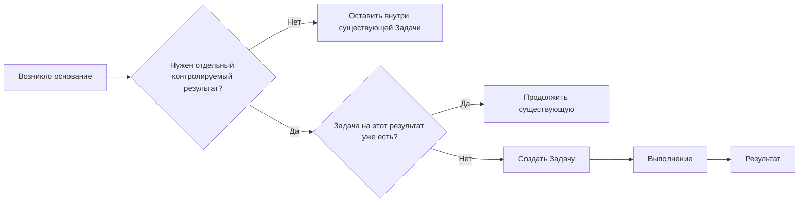

# Модель управления

[Главная](../README.md) · **01 Модель** · [02 Сценарии](02-scripts.md) · [03 Контроль и аналитика](03-control.md) · [04 Шаблоны](04-templates.md) · [05 Процессы](05-processes.md) · [06 Odoo](06-workspace.md)

---

## 1. Единица управления

Система фиксирует не каждое действие сотрудника, а **самостоятельно контролируемый результат**.

Отдельная Задача нужна, если результат можно самостоятельно:

- назначить ответственному;
- ограничить крайним сроком;
- поставить в очередь или ожидание;
- связать зависимостью с другой работой;
- завершить или отменить;
- найти и проверить позже.

Если это письмо, звонок, комментарий, файл или следующий шаг внутри уже открытой работы — отдельная Задача не нужна.

## 2. Основные понятия

| Понятие | Смысл |
|---|---|
| Обязательство | результат, который нельзя потерять и который контролируется Задачей |
| `Работа` | Задача на получение результата своими действиями |
| `Запрос` | Задача на получение конкретного документа, данных, материала или подтверждения, если само получение требует отдельного контроля |
| Процесс | устойчивый рабочий поток, в рамках которого возникла Задача |
| Вид работы | характер конечного результата `Работы` |
| Ответственный | текущий владелец результата; в Odoo поле называется `Ответственные` |
| Крайний срок | дата, к которой нужен конечный результат |
| Этап | управленческое положение открытой Задачи |
| Состояние | штатное состояние Задачи Odoo: выполнение, ожидание, проверка, завершение или отмена |
| Активность | следующее действие или напоминание внутри существующей записи |
| Блокирующая задача | внутренняя зависимость, без закрытия которой работа не может продолжиться |
| Подзадача | самостоятельная часть общего результата |
| Веха | общая контрольная точка для нескольких Задач |
| Тег | дополнительная поперечная метка, не заменяющая Процесс и Вид работы |
| Личный этап | персональный способ планировать свои Задачи без изменения общего управленческого положения |

## 3. Тип задачи

Используются два значения.

### `Работа`

Самостоятельный результат, который нужно получить своими действиями: внести, проверить, сверить, исправить, промониторить, проанализировать, подготовить и т. п.

### `Запрос`

Используется только когда **получение само является самостоятельным обязательством**:

- нужен конкретный результат получения;
- есть срок или риск потерять ответ;
- за получением нужно повторно следить;
- получение можно отдельно завершить.

Если нужно просто написать, позвонить или напомнить в рамках открытой Задачи — используется Активность и история общения, а не новая Задача типа `Запрос`.

## 4. Процесс и Вид работы

### Процесс

Процесс отвечает на вопрос:

> в рамках какого устойчивого рабочего потока возникла Задача?

Процесс не равен Odoo Проекту и не создаёт отдельную доску.

### Вид работы

Для `Работы` выбирается один вид по **конечному результату**:

| Вид | Конечный результат |
|---|---|
| `Внесение` | новые данные или документ впервые зафиксированы в целевой системе |
| `Проверка` | получен вывод о корректности, полноте или соответствии правилу |
| `Сверка` | независимые источники сопоставлены, расхождения выявлены или подтверждено их отсутствие |
| `Исправление` | существующие данные или результат приведены в корректное состояние |
| `Мониторинг` | зафиксировано состояние, событие или отклонение в наблюдаемом потоке |
| `Анализ` | сформирован вывод о причинах, зависимостях, тенденциях или последствиях |
| `Подготовка` | сформирован самостоятельный материал, готовый к использованию или передаче |

У `Запроса` Вид работы можно не указывать: сам Тип задачи уже описывает характер результата.

Процесс и Вид работы — разные аналитические измерения. Один Вид работы может встречаться в разных Процессах, а один Процесс — включать несколько Видов работы.

Допустимые сочетания можно фиксировать в описании Процесса. На старте это **методическое правило, а не программный запрет**. Жёсткое ограничение имеет смысл только если реальные ошибки заполнения начинают портить аналитику.

## 5. Этапы и Состояния

Этап и Состояние решают разные задачи и не должны дублировать друг друга.

### Рабочие Этапы

| Этап | Смысл |
|---|---|
| `Очередь` | Задача принята, но не находится в активном исполнении |
| `В работе` | результат находится в активном исполнении текущего Ответственного |
| `Внешнее ожидание` | продолжение зависит от внешнего ответа, документа, доступа, решения или события |

`В работе` не означает поминутный фокус. Не нужно двигать карточку при каждом коротком переключении.

### Штатные Состояния Odoo

| Состояние | Как используется |
|---|---|
| `В процессе` | обычное открытое состояние |
| `В ожидании` | Odoo автоматически ставит его при незавершённой внутренней зависимости |
| `Требуются изменения` | только если конкретному процессу действительно нужна проверка результата |
| `Одобрено` | только если конкретному процессу действительно нужна фиксация одобрения |
| `Готово` | результат получен, обязательных действий больше нет |
| `Отменено` | подтверждено, что результат больше не требуется |

Отдельный Этап `Готово` не нужен. Иначе пользователь будет вынужден одновременно двигать Задачу в колонку и менять её Состояние.

### Внутренняя зависимость

Если Задачу блокирует другая самостоятельная Задача, указывается **Блокирующая задача**. Odoo сама переводит зависимую Задачу в `В ожидании` до закрытия блокировки.

В этом случае не нужно дополнительно переводить Задачу во `Внешнее ожидание`.

## 6. Ответственность и общая очередь

У Задачи должен быть понятен текущий владелец результата.

Штатное поле `Ответственные` допускает нескольких пользователей. Рабочее правило по умолчанию — **один основной Ответственный**. Несколько Ответственных допустимы, только если совместная ответственность действительно понятна и не размывает владельца результата.

Если работа фактически делится между людьми на самостоятельные результаты, лучше использовать Подзадачи.

Обычная саморегистрация:

1. сотрудник увидел или получил основание;
2. понял, что нужен отдельный результат;
3. проверил отсутствие дубля;
4. создал Задачу;
5. назначил себя Ответственным;
6. указал Тип задачи и Процесс, для `Работы` — Вид работы;
7. поставил Крайний срок, если он известен;
8. начал работу либо оставил Задачу в `Очереди`.

Задача без Ответственного в `Очереди` может использоваться как общая очередь. Отдельная сущность для этого не нужна.

## 7. Крайний срок и Приоритет

**Крайний срок = дата конечного результата.**

Он не используется как дата следующего звонка, повторного письма или проверки ответа. Для этого есть Активности.

Если известен внешний срок — используется он. Если внешнего срока нет, применяется внутреннее правило Процесса, если оно определено.

`Не успеваем` само по себе не является основанием для переноса срока.

Приоритет помогает выбирать порядок работы, но не заменяет Крайний срок.

Штатные уровни Odoo используются без собственного поля:

| Приоритет | Рабочий смысл |
|---|---|
| `Низкий` | обычная работа без дополнительного сигнала |
| `Средний` | работу желательно поднять выше обычной очереди |
| `Высокий` | задержка создаёт заметный риск для срока, связанной работы или результата |
| `Срочно` | нужна немедленная реакция |

Если промежуточные уровни не дают команде понятной разницы, достаточно `Низкий` и `Срочно`. Не нужно искусственно использовать все четыре только ради заполнения.

## 8. Внешнее ожидание и следующие действия

Если продолжать нельзя из-за внешнего ответа, документа, доступа, согласования или события:

- Этап → `Внешнее ожидание`;
- Ответственный сохраняется;
- в истории общения фиксируется только необходимый контекст;
- если к вопросу нужно вернуться в конкретную дату — создаётся Активность.

Крайний срок Задачи автоматически не переносится.

После снятия причины:

- продолжаем сейчас → `В работе`;
- продолжим позже → `Очередь`.

## 9. Личное планирование

Odoo 19 даёт каждому пользователю собственные Личные этапы: `Входящие`, `Сегодня`, `На этой неделе`, `В этом месяце`, `Позже`, `Готово`, `Отменено`.

Их можно использовать для персонального планирования:

- что сделать сегодня;
- что оставить на неделю;
- что можно отложить.

Личный этап **не заменяет общий Этап** и не используется как управленческий статус. Руководитель контролирует `Очередь / В работе / Внешнее ожидание`, сроки, блокировки и Состояния; сотрудник может дополнительно организовывать свою работу Личными этапами.

## 10. Составная работа

Используются разные механизмы по смыслу:

| Ситуация | Механизм |
|---|---|
| часть общего результата со своим Ответственным или сроком | Подзадача |
| одна Задача должна завершиться раньше другой | Блокирующая задача |
| несколько Задач имеют общую контрольную дату | Веха |
| Задачи просто относятся к одной теме | Тег, ссылка в истории общения или другой штатный контекст |

Сложность работы сама по себе не является причиной создавать отдельный Odoo Проект.

## 11. Периодическая работа

Стабильная периодика ведётся через **Повторяющуюся задачу**.

Каждый период остаётся отдельной Задачей и отдельным фактом выполнения.

У штатной повторяемости Odoo 19 есть важные особенности:

- следующий экземпляр создаётся только после закрытия предыдущего состоянием `Готово` или `Отменено`;
- новая Задача попадает в первый Этап Проекта;
- Приоритет нового экземпляра сбрасывается на низкий.

Поэтому повторяемость подходит для последовательной периодики. Если будущая Задача должна появляться по календарю независимо от состояния предыдущей, штатного механизма уже недостаточно — это отдельный кандидат на автоматизацию.

## 12. Связанные объекты

Если работу регулярно ищут по человеку, организации, оборудованию, технике, участку или другому объекту, связь должна быть структурированной, если это можно сделать без лишней сложности.

Приоритет:

1. подходящая штатная модель Odoo;
2. Свойство задачи со ссылкой на штатную модель;
3. Свойство типа `Выбор` или Теги для небольшого стабильного списка;
4. собственная модель — только если предыдущие варианты заметно мешают работе или аналитике.

## 13. Теги и дополнительные признаки

Теги используются только для поперечных признаков, которые не должны быть единственным источником обязательной классификации.

Не создавать новый классификатор, если вопрос уже закрывается Типом задачи, Процессом, Видом работы, Этапом, Состоянием, Приоритетом, Вехой или связанной записью.

## 14. Правило изменения системы

Новое обязательное поле, сущность или доработка добавляются только если подтверждено хотя бы одно:

- без этого теряется важный управленческий смысл;
- пользователи системно делают лишнюю повторяющуюся работу;
- данные регулярно становятся непригодны для контроля или аналитики;
- штатный механизм создаёт устойчивую ошибку или неоднозначность;
- эффект доработки заметно выше стоимости её сопровождения.

---

[Главная](../README.md) · [02 — Рабочие сценарии →](02-scripts.md)
