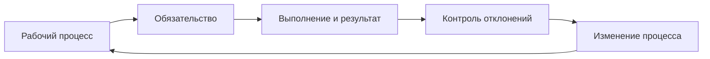
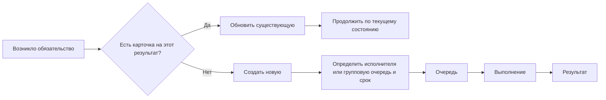
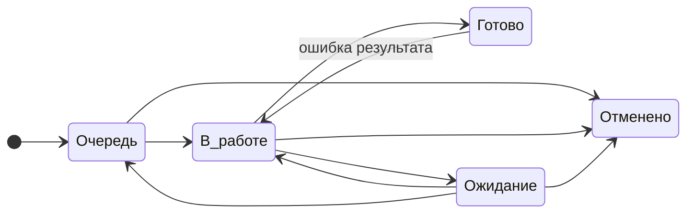
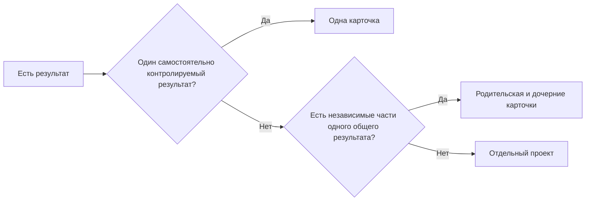
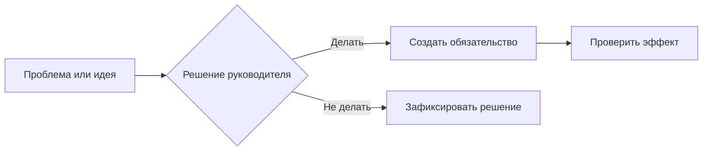

# Модель управления

[Главная](../README.md) · **01 Модель** · [02 Сценарии](02-scripts.md) · [03 Контроль и улучшение](03-control.md) · [04 Шаблоны](04-templates.md) · [05 Процессы](05-processes.md) · [06 Контур](06-workspace.md)

---

## Как устроена модель

## Как появляется работа

- карточка создаётся, когда появилось обязательство, которое нужно отдельно контролировать;
- если карточка на тот же результат уже есть — новая не создаётся;
- источник обязательства неважен: входящее, поручение, период, событие или выявленная необходимость.

## 1. Термины

| Термин | Значение |
|---|---|
| Обязательство | обязательный результат, который контролируется в системе; оформляется карточкой типа `Работа` или `Запрос` |
| `Работа` | тип карточки для обычного обязательства, в том числе периодического |
| Карточка | запись об обязательстве |
| Основание | событие, документ, поручение или условие, из-за которого появилось обязательство |
| Тип обязательства | `Работа`, `Запрос` |
| `Идея` | необязательная запись проблемы или предложения до управленческого решения; не является обязательством и не входит в обязательную очередь |
| Категория | необязательная метка устойчивого вида работ для фильтрации, группировки или анализа; не определяет процесс или жизненный цикл карточки |
| Исполнитель | человек, отвечающий за результат |
| Групповая очередь | обязательство, ещё не взятое конкретным исполнителем |
| Срок | дата, к которой нужен конечный результат |
| Состояние | очередь, выполнение, ожидание, готовность или отмена |
| `Запрос` | отдельная карточка для контролируемого получения документа, материала или подтверждения |

## 2. Роли и решения

| Роль | Что делает | Решения |
|---|---|---|
| Исполнитель | выполняет работу и ведёт состояние | рабочие переходы состояний |
| Старший | управляет очередью, назначением и передачей | оперативное распределение и эскалация |
| Руководитель | разбирает управленческие исключения | конфликт приоритетов, изменение обязательства, ресурса, срока, правил и процессов |

Один человек может совмещать несколько ролей.

## 3. Единица работы

Одна карточка = один самостоятельно контролируемый результат.

Разделять на несколько карточек, если части:

- имеют разных исполнителей;
- имеют разные сроки;
- могут отдельно зависнуть;
- могут отдельно завершиться.

Письмо, файл, звонок, строка данных или технический шаг сами по себе отдельной карточки не требуют.

## 4. Параметры карточки

При создании:

- название;
- тип;
- категория — при необходимости;
- исполнитель или групповая очередь;
- срок;
- приоритет;
- описание и материалы — при необходимости.

После регистрации изменения параметров сохраняются в истории.

- очевидная фактическая ошибка исправляется напрямую с указанием основания;
- подтверждённое внешнее изменение обновляется с сохранением основания;
- назначение и передача выполняются по правилам разделов 6 и 11;
- изменение результата, приоритета или срока без фактического основания решает руководитель.

Новый результат = новая карточка.

## 5. Состояния обязательств

Состояния этого раздела применяются к карточкам типов `Работа` и `Запрос`. Для `Идеи` отдельный набор состояний не задаётся.

| Состояние | Когда использовать |
|---|---|
| `Очередь` | работу нужно сделать, но сейчас её никто не выполняет |
| `В работе` | исполнитель реально занимается результатом |
| `Ожидание` | продолжать нельзя из-за зависимости вне контроля исполнителя |
| `Готово` | результат достигнут, обязательных действий нет |
| `Отменено` | результат больше не требуется |

`Ожидание → Готово` не используется.

### Пограничные случаи

| Ситуация | Что ставить |
|---|---|
| работу ещё не начали | `Очередь` |
| реально выполняем сейчас | `В работе` |
| ждём ответ, документ, доступ или другое действие вне контроля исполнителя | `Ожидание` |
| ждём другую внутреннюю карточку | `Ожидание`; карточки связать |
| у исполнителя много другой работы | `Очередь` |
| пока не дошли руки | `Очередь` |
| переключились на критичную работу | прежняя работа → `Очередь`, если её никто не продолжает |
| не понимаем, что делать дальше | уточнение / эскалация, не `Ожидание` |
| результат достигнут | `Готово` |

## 6. Исполнитель и групповая очередь

Открытая карточка имеет:

- конкретного исполнителя; или
- контролируемую групповую очередь.

Карточка без исполнителя или групповой очереди — краткое исключение и попадает в отдельный контрольный список.

Для групповой очереди используется один режим:

- самоназначение;
- контролируемое назначение старшим.

При самоназначении карточка получает исполнителя в момент фактического взятия и переводится в `В работе`.

При контролируемом назначении старший может назначить исполнителя заранее. Пока выполнение не началось, карточка остаётся в `Очередь`; при фактическом начале переводится в `В работе`.

Передачу назначенной карточки выполняет старший, если локальным правилом не установлен другой порядок.

## 7. Порядок очереди и критичность

Порядок:

1. критичные — ближайший срок, затем более старая карточка;
2. обычные — ближайший срок, затем более старая карточка.

Если несколько критичных работ нельзя упорядочить без управленческого решения — решает руководитель.

`Критичный` ставится, если задержка:

- останавливает обязательный процесс;
- срывает внешнее обязательство;
- блокирует другие обязательные работы;
- требует немедленного управленческого вмешательства.

Важность сама по себе не делает работу критичной.

Тип `Запрос` сам по себе не означает критичность.

## 8. Срок

Срок = дата конечного результата.

Не использовать срок как дату напоминания, звонка или проверки ответа.

Если внешний срок известен — ставится он.

Если внешнего срока нет — используется внутренний срок процесса.

Если внутреннего срока ещё нет или возникает конфликт ресурсов и обязательств — решает руководитель.

Срок меняется только если:

- исходная дата была ошибочной;
- внешние условия изменились;
- руководитель изменил обязательство.

`Не успеваем` — не основание для переноса.

## 9. Ожидание

При переводе в `Ожидание`:

- исполнитель сохраняется;
- указать, что блокирует продолжение и что уже сделано;
- внутреннюю блокирующую карточку связать с текущей;
- срок не переносить автоматически.

Когда препятствие снято:

- продолжаем сейчас → `В работе`;
- продолжим позже → `Очередь`.

## 10. Новая карточка или существующая

| Ситуация | Действие |
|---|---|
| продолжение по тому же результату | обновить существующую карточку |
| новый файл по той же работе | обновить существующую карточку |
| повторное напоминание по запросу | та же карточка `Запрос` |
| исходный результат выполнен неправильно | `Готово → В работе` |
| исходный результат был правильным, появился новый результат | новая карточка |
| независимая часть со своим сроком/исполнителем/результатом | дочерняя карточка |
| несколько результатов, участников, этапов и зависимостей | отдельный проект |

## 11. Передача работы

| Факт | Действие |
|---|---|
| следующий исполнитель продолжает сразу | назначить его, статус остаётся `В работе` |
| продолжение будет позже | `Очередь` |
| есть блокирующая зависимость | `Ожидание` |
| результат достигнут | `Готово` |

Не оставлять `В работе` за человеком, который работу больше не выполняет.

## 12. Ошибка, новый объём, отмена

| Ситуация | Действие |
|---|---|
| исходный результат выполнен неправильно | `Готово → В работе` |
| исходный результат был правильным, появился новый объём | новая карточка; при необходимости связать с исходной |
| подтверждено, что результат больше не нужен | старший фиксирует `Отменено` и основание |
| отмена является новым управленческим решением | решает руководитель |

Историю не удалять.

## 13. Запрос документа или материала

`Запрос` создаётся, если одновременно:

- нужен конкретный документ, материал или подтверждение;
- получение имеет самостоятельный срок или ценность;
- после отправки нужно отдельно контролировать получение;
- потеря ответа оставит незакрытое обязательство.

Не создавать отдельный `Запрос`, если:

- это уточнение внутри текущей работы;
- нужен небольшой материал для открытой карточки;
- это повторное письмо по существующему `Запросу`;
- получение не требует отдельного контроля.

Путь:

Правила:

- срок = дата получения;
- до отправки возможна групповая очередь;
- после отправки — конкретный исполнитель;
- отправка не означает `Готово`;
- просрочка требует повторного действия или эскалации;
- после получения результат проверяется;
- повторное письмо остаётся в той же карточке.

## 14. Периодическая работа

Каждый период = отдельная карточка типа `Работа`.

Будущие карточки создаются заранее на установленный горизонт.

## 15. Одна карточка, иерархия или проект

Отдельный проект нужен, когда есть несколько результатов, участников, этапов и зависимостей.

## 16. Идеи и улучшения

`Идея` — необязательная запись проблемы или предложения до управленческого решения. Она не является обязательством и не входит в обязательную очередь.

Если идеи фиксируются в рабочем контуре, для них используется отдельный тип записи `Идея`. Если они фиксируются вне рабочего контура, отдельный тип не требуется.

Основание для улучшения: ошибка, задержка, лишняя передача, ручной труд, узкое место или критичный случай с системной причиной.

После решения `делаем` создаётся связанное обязательство. После реализации проверяется эффект.

После решения `не делаем` фиксируются решение и основание.

## 17. Локальные правила

При необходимости фиксируются:

- контрольное время разбора входящих;
- внутренний срок процесса;
- категории — если используются;
- режим групповой очереди;
- горизонт периодических работ;
- периодичность контроля качества.

Изменение локальных правил утверждает руководитель.

Форма — в [Шаблонах](04-templates.md).

## 18. Границы модели

Модель не задаёт:

- техническую матрицу прав;
- организационную структуру;
- внешние нормативы и сроки;
- содержание конкретных процессов;
- локальные значения правил.

## 19. Не усложнять без необходимости

Не добавлять без подтверждённой потребности:

- новые статусы;
- новые типы;
- новые категории;
- обязательные согласования;
- дополнительные поля;
- отдельные отчёты;
- карточки на технические шаги.

---

[← Главная](../README.md) · [02 — Рабочие сценарии →](02-scripts.md)
