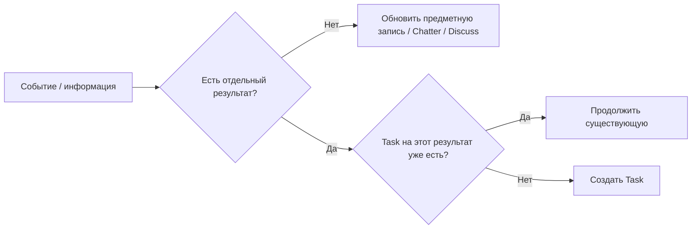
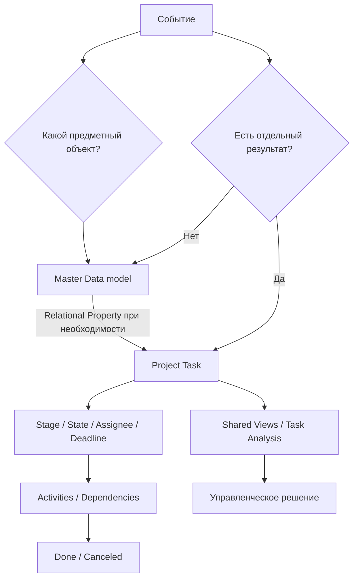

# Модель управления

[Главная](../README.md) · [00 Возможности](00-odoo19-community.md) · **01 Модель** · [02 Сценарии](02-scripts.md) · [03 Аналитика](03-control.md) · [04 Шаблоны](04-templates.md) · [05 Процессы](05-processes.md) · [06 Настройка](06-workspace.md)

---

## 1. Что мы управляем

Методика разделяет:

1. **объект** — сотрудник, ТС, оборудование, организация;
2. **обязательство** — что нужно получить или изменить;
3. **следующее действие** — что сделать дальше;
4. **контроль** — где есть исключение и какое решение нужно принять.

Odoo уже имеет разные сущности для этих уровней.

## 2. Task = один контролируемый результат

Project Task создаётся, если результат нужно отдельно:

- назначить;
- ограничить Deadline;
- провести через поток;
- не потерять;
- контролировать до Done/Canceled;
- анализировать как единицу работы.

Не создавать Task на каждое письмо, файл, звонок или строку данных.



## 3. Предметный объект живёт в своей модели

| Объект | Источник истины |
|---|---|
| сотрудник | Employees |
| внешний субъект | Contacts |
| ТС | Fleet, если его модель подходит парку |
| оборудование | Maintenance Equipment |
| serial/location/movement | Inventory |
| ремонт/ТО оборудования | Maintenance Request |

Task не дублирует карточку объекта.

## 4. Но Task может ссылаться на объект без кода

Odoo 19 Properties поддерживают Many2one/Many2many к выбранной модели.

Поэтому для процессов, где объект нужен в работе и аналитике, в основном Project можно добавить relational Properties:

```text
ТС           → Many2one → fleet.vehicle
Сотрудник    → Many2one → hr.employee
Оборудование → Many2one → maintenance.equipment
```

Это **ссылка на master data**, а не копия справочника.

### Что это меняет

Больше не нужно заранее писать custom `vehicle_id` только потому, что стандартного schema field в `project.task` нет.

Сначала проверяется relational Property на реальном объёме.

## 5. Какие Properties создавать

Property добавляется только если выполняются два условия:

1. значение реально нужно при ведении Task;
2. по нему есть рабочий фильтр, группировка, шаблон или аналитический вопрос.

### Базовые классификационные Properties

```text
Вид работы → Selection
Процесс    → Selection, только если этот разрез используется
```

### Предметные relational Properties

Добавляются **не глобально**, а для тех процессов, где связь нужна:

```text
ТС
Сотрудник
Оборудование
Контрагент
```

Не делать все возможные свойства обязательными для каждой задачи.

## 6. Domain relational Property

Для Many2one/Many2many Property можно задать Domain.

Это полезно, например, чтобы показывать:

- только активные записи;
- только нужный тип объектов;
- только записи определённого контура.

Domain помогает пользователю выбирать корректные записи, но **не заменяет ACL/record rules**.

## 7. Права на master data важнее самого Property

Relational Property использует права целевой модели.

Если пользователю нельзя создавать новые Fleet Vehicles, Employees или Equipment, это должно быть ограничено правами соответствующего приложения.

Нельзя надеяться, что Property само запретит создание master data.

## 8. Один основной операционный Project

Для постоянной работы одного отдела по умолчанию используется один Project.

Отдельный Project не создаётся только потому, что отличается:

- процесс;
- вид работы;
- ТС;
- сотрудник;
- объект;
- источник входящего.

Для этих различий используются Properties, Tags и views.

## 9. Когда отдельный Project оправдан

Отдельный Project нужен, если появляется самостоятельная граница управления:

- инициатива с началом/завершением;
- отдельные Milestones;
- Project Updates;
- отдельный Project Stage lifecycle;
- отдельная visibility-модель;
- повторяемая структура через Project Template;
- существенно другой workflow.

## 10. Базовые Task Stages

Для операционного Project:

```text
Входящие
Очередь
В работе
Ожидание внешнего
На проверке   [опционально]
```

### Входящие

Зарегистрировано, но ещё не разобрано.

### Очередь

Результат понятен, работа готова к исполнению.

Task может быть неназначенной.

### В работе

Исполнитель реально занимается результатом сейчас.

### Ожидание внешнего

Продолжение зависит от внешнего события.

Обязательна Activity следующего контроля.

### На проверке

Только когда независимая проверка — реальная часть процесса.

## 11. State и Stage — разные измерения

Обычные пользовательские State:

- In Progress;
- Changes Requested;
- Approved;
- Done;
- Canceled.

При Dependencies Odoo вычисляет Waiting.

`Waiting` не является отдельным обычным ручным статусом.

## 12. Внешнее ожидание ≠ внутренняя зависимость

### Внешнее

```text
Stage = Ожидание внешнего
+ Activity = следующий контроль
```

### Внутреннее

```text
Blocked by = другая Task
→ computed Waiting
```

Разделение нужно потому, что управленческие действия разные.

## 13. Assignee = владелец результата

Odoo допускает нескольких Assignees.

В операционном контуре методика использует **одного владельца конечного результата**.

Если части имеют самостоятельных владельцев — использовать Subtasks/отдельные Tasks.

Followers не являются ответственными.

## 14. Employee Property ≠ Assignee

Не смешивать:

```text
Assignee = кто отвечает за результат
Property[Сотрудник] = сотрудник, которого касается работа
```

Это особенно важно, когда работа выполняется аналитиком по данным другого сотрудника.

## 15. Deadline, Activity и время

```text
Deadline        = когда нужен результат
Activity        = когда сделать следующий шаг
Allocated Time  = ожидаемая трудоёмкость
Timesheet       = фактически заявленное время
```

Не переносить Deadline только для очистки просрочки.

## 16. Priority

Community поддерживает Low / Medium / High / Urgent.

На старте:

- обычная работа — default/Low;
- реально критичная — Urgent.

Medium/High вводятся только при понятной разнице действий.

## 17. Общая очередь

Общая очередь — не отдельный пользователь.

```text
Stage = Очередь
Assignees = empty
```

При взятии Task пользователь назначает себя и переводит её в `В работе` только при фактическом начале.

## 18. Task Templates

Если один и тот же тип разовой работы возникает по событию, использовать Task Template.

```text
одинаковый тип Task по событию → Task Template
```

Не заставлять пользователя каждый раз вручную копировать описание и subtasks.

## 19. Recurring Task

Если один и тот же результат повторяется по календарю:

```text
Recurring Task
```

Следующая occurrence создаётся после закрытия текущей.

Не создавать руками годовой горизонт одинаковых Tasks без необходимости.

## 20. Project Template

Если повторяется целая структура инициативы:

- несколько Tasks;
- роли;
- зависимости;
- milestones;
- stages/configuration;

использовать Project Template + Project Roles.

## 21. Activity Plan

Если повторяется набор follow-up действий вокруг одной записи, использовать Activity Plan или chaining Activity Types.

Не делать Tasks из каждого напоминания.

## 22. Subtask

Subtask нужна, если часть результата имеет самостоятельное управление:

- отдельного владельца;
- Deadline;
- зависимость;
- самостоятельный результат.

Простой чек-лист одного человека не требует дерева Tasks.

## 23. Project-level управление инициативами

Для самостоятельных инициатив Odoo Community дополнительно имеет:

- Project Manager;
- Project Start/End Date;
- Project Stages;
- Milestones;
- Project Updates;
- Project Dashboard/Burndown;
- Project-level Activities.

Не тянуть эти механизмы в ежедневную операционную очередь без необходимости.

## 24. Project Stage ≠ Project Update Status

```text
Project Stage
= где проект находится в портфельном процессе

Project Update Status
= управленческая оценка On Track / At Risk / Off Track / On Hold / Done
```

Оба не заменяют Task Stages.

## 25. Discuss, Calendar и To-Do

### Discuss

Для коммуникации.

Если из сообщения появляется обязательство → Task.

### Calendar

Для встречи/события.

Не заменяет Task Deadline.

### To-Do

Для личного буфера.

Если появляется обязательство отдела → Convert to Task.

## 26. Специализированный workflow не дублируется Task

Если процесс полностью ведётся штатным предметным приложением:

```text
Maintenance Request
Time Off
Expense
Purchase Order
Recruitment Applicant
Survey
```

не создавать параллельную Project Task только ради статуса.

Task появляется только для **отдельного результата поверх предметного workflow**.

## 27. Связи Project с другими приложениями

Перед custom code проверить штатные bridges.

Подтверждены, например:

```text
Project + Purchase   → Purchase Order.project_id
Project + Inventory  → Stock Picking.project_id
Project + Accounting → profitability / analytic layer
Project + Expenses   → analytic integration
```

Поэтому Project может быть управленческим контуром инициативы без ручного дублирования связанных документов.

## 28. Контрольные views — часть методики

Основные очереди должны быть опубликованы централизованно через Shared Favorites / Shared Top Bar Views.

Минимум:

- Входящие;
- Очередь;
- В работе;
- Просрочено;
- Ожидание внешнего;
- Waiting/Blocking;
- Urgent;
- Rotting.

Если используются relational Properties, добавить рабочие views по нужным объектам.

Например:

```text
Открытые по ТС
Открытые по сотруднику
Открытые по оборудованию
```

только если эти вопросы реально нужны.

## 29. Время в Stage

Odoo уже показывает время нахождения конкретной Task в каждом Stage.

Использовать это для разбора зависшей карточки.

Не считать, что штатный Pivot автоматически даёт агрегированный SLA по всем Stage — это отдельный аналитический вопрос.

## 30. Automation — после модели

Порядок:

```text
обычный field / Property
→ Task Template
→ Activity / Activity Plan
→ Recurrence
→ Shared View
→ bridge module
→ Automation Rule
→ API/Webhook
→ custom module
```

Не начинать с Automation, если проблема вызвана плохой структурой данных.

## 31. Когда relational Property уже недостаточно

Custom schema field оправдан, если пилот доказал хотя бы одну конкретную проблему:

- Property плохо работает на нужном объёме;
- требуется серверная constraint;
- нужна специальная автоматизация/интеграция по обычному field;
- поле должно быть единым во всех Projects;
- нужен специализированный индекс;
- API/BI существенно осложняется Property;
- нужен обратный relation на предметной модели.

Только тогда появляется минимальная доработка.

## 32. Итоговый цикл



Главная цель: **не максимальная кастомизация Odoo, а минимальная модель, в которой объект не дублируется, обязательство не теряется, а данные сразу пригодны для контроля.**

---

[← 00 — Возможности](00-odoo19-community.md) · [02 — Сценарии →](02-scripts.md)
