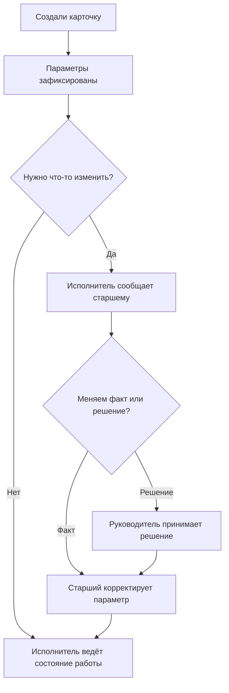
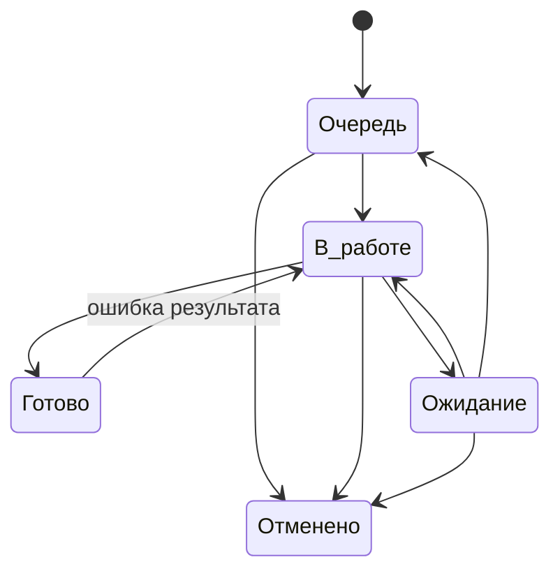
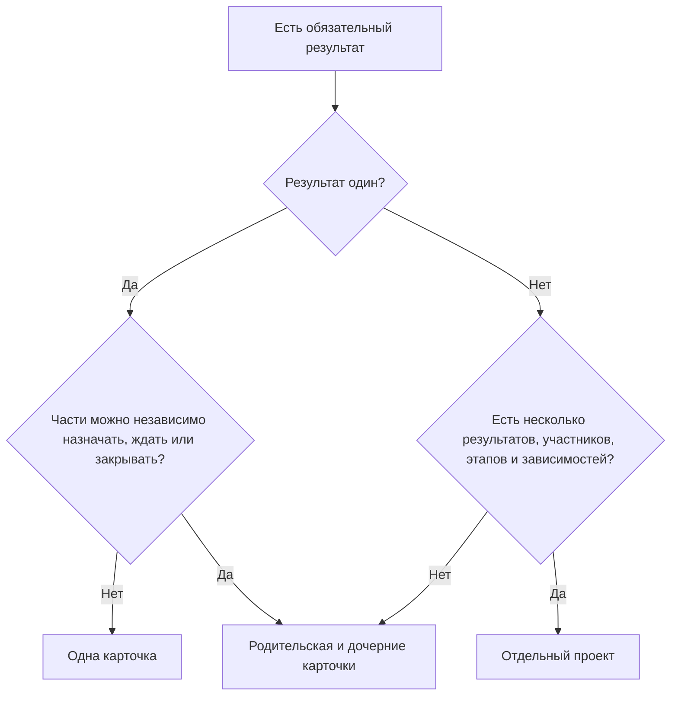

# Правила управления работой

Этот документ — основной источник правил. Остальные документы не меняют смысл этих правил, а показывают, как применять их в конкретной ситуации.

## 1. Что считается работой

Работа — это обязательный результат, который можно отдельно:

- назначить;
- ограничить сроком;
- поставить на ожидание;
- завершить;
- отменить;
- вернуть в работу, если результат оказался неверным.

**Одна карточка = один самостоятельно контролируемый результат.**

Письмо, файл, звонок, строка данных или технический шаг сами по себе не являются отдельной работой.

Карточку делят на несколько только тогда, когда части имеют разных исполнителей, разные сроки, могут независимо зависнуть или независимо завершиться.

## 2. Кто за что отвечает

Один человек может совмещать несколько функций.

### Автор карточки

Автор — тот, кто регистрирует новую работу. Это может быть исполнитель, дежурный по входящим, старший или другой участник рабочего контура.

При создании автор задаёт известные на этот момент параметры:

- понятное название результата;
- тип работы;
- категорию процесса;
- исполнителя или групповую очередь;
- срок;
- приоритет;
- только необходимое описание и материалы.

Автор отвечает за корректную первичную постановку, но не становится владельцем работы автоматически.

### Исполнитель

Исполнитель доводит результат до конца и поддерживает **фактическое состояние** карточки.

Он обязан:

- переводить работу в `В работе` только после реального начала;
- переводить внешне заблокированную работу в `Ожидание`;
- коротко фиксировать существенный контекст ожидания;
- закрывать работу после достижения результата;
- перед окончанием своего рабочего периода привести активные карточки к фактическому состоянию;
- заранее сообщать о риске срока;
- сообщать старшему, если после регистрации нужно исправить зафиксированный параметр.

Исполнитель не обязан получать отдельное разрешение на обычное закрытие.

### Старший

Старший поддерживает достоверность уже зарегистрированных карточек и помогает с оперативным перераспределением.

Главное правило:

> **Старший исправляет факт. Руководитель меняет решение.**

Старший может:

- исправить ошибочно указанный срок;
- зафиксировать новый срок, если внешние условия действительно изменились;
- исправить категорию;
- изменить исполнителя при передаче или перераспределении;
- исправить ошибочно установленный приоритет;
- уточнить название или описание, если исходный результат не меняется.

Старший не может под видом корректировки заменить исходный результат другим. Если появился новый самостоятельно контролируемый результат — создаётся новая карточка.

Старший **не является обязательным согласующим** и не проверяет каждую обычную работу перед закрытием.

### Дежурный по входящим

Разбирает входящие основания и определяет их судьбу:

- новая работа;
- продолжение существующей;
- действий не требуется;
- требуется отдельное контролируемое уточнение.

Неразобранное обязательное действие не должно исчезать между почтой и рабочей системой.

### Ответственный за направление

Отвечает за то, чтобы устойчивый процесс был описан и оставался управляемым.

Он поддерживает карточку процесса и определяет:

- что считается одной работой;
- когда её можно закрыть;
- как определяется срок;
- какой внутренний срок используется, если внешнего срока нет;
- когда нужно делить работу;
- на какой горизонт заранее создаются регламентные работы;
- какие причины задержек и ошибок повторяются;
- какие локальные правила процесса нужно пересмотреть.

Он не проверяет вручную каждую карточку и не является дополнительной стадией согласования.

### Руководитель

Руководитель вмешивается в исключения и принимает решения, которые меняют исходное обязательство или распределение ресурса.

К нему относятся:

- конфликт нескольких критичных работ;
- решение отложить обязательный результат;
- существенное изменение внутреннего обязательного срока по нашей инициативе;
- перераспределение ограниченного ресурса между направлениями;
- отмена потребности без уже имеющегося явного основания;
- другое изменение, где недостаточно просто исправить карточку по факту.

## 3. Параметры и состояние — разные вещи

У карточки есть два слоя:

1. **параметры** — что нужно сделать, кто отвечает, к какому процессу относится работа, срок и приоритет;
2. **состояние** — `Очередь`, `В работе`, `Ожидание`, `Готово`, `Отменено`.

Изменение параметра само по себе не создаёт новый статус.



### Что считается обычной корректировкой

Старший исправляет параметр без отдельного управленческого решения, если:

- при регистрации допущена ошибка;
- внешняя сторона официально сообщила новый срок;
- категория выбрана неверно;
- исполнитель меняется из-за обычной передачи работы;
- приоритет был установлен ошибочно и фактическая ситуация однозначна.

### Что уже является управленческим решением

Нужен руководитель, если требуется выбрать между несколькими допустимыми вариантами и это влияет на обязательство или ресурс.

Примеры:

- самим перенести срок, потому что не хватает людей;
- выбрать, какую из двух критичных работ делать первой;
- снять обязательную работу без явного внешнего основания;
- перераспределить ресурс между направлениями с последствиями для сроков.

## 4. Состояния работы

### Очередь

Работу нужно выполнить, но сейчас её никто не делает.

### В работе

Исполнитель реально занимается результатом сейчас.

Назначенная на человека карточка не становится `В работе` автоматически.

### Ожидание

Продолжать невозможно из-за внешней причины, которую исполнитель сейчас сам снять не может.

При переходе в `Ожидание`:

- владелец сохраняется;
- фиксируется, что именно ждём и какое действие уже выполнено;
- срок автоматически не переносится.

После снятия блокировки карточка сначала возвращается в `В работе` или `Очередь`. Прямое закрытие из `Ожидание` не используется: сначала подтверждается, что требуемый результат действительно достигнут.

### Готово

Конечный результат достигнут, и по карточке больше нет обязательных действий.

### Отменено

Сам результат больше не требуется.

Рабочую историю вместо отмены не удаляют.

## 5. Разрешённые переходы



Дополнительные статусы и переходы не вводятся без отдельного методического решения.

## 6. Владелец и групповая очередь

Открытая работа принадлежит:

- конкретному исполнителю; или
- контролируемой групповой очереди.

Карточка без владельца допустима только как короткое исключение после регистрации и должна попадать в контрольный список.

### Как работает групповая очередь

Если направление использует общую очередь, назначение себя исполнителем **в момент фактического взятия работы** является частью нормального рабочего цикла, а не корректировкой через старшего.

```text
Групповая очередь → исполнитель берёт работу → назначает себя → В работе
```

Если уже назначенную конкретному человеку карточку нужно передать другому исполнителю, это корректировка параметра и её выполняет старший.

## 7. Как выбирается следующая работа

Внутри каждого уровня работа выбирается одинаково: сначала ближайший срок, затем более старая карточка.

Порядок:

1. критичные — ближайший срок → более старая;
2. обычные — ближайший срок → более старая.

Нельзя постоянно выбирать только удобные или быстрые карточки.

Если несколько критичных работ требуют взаимоисключающего немедленного исполнения и порядок нельзя определить по сроку, решение принимает руководитель.

## 8. Приоритет

Используются два смысловых уровня:

- **Обычный** — работа идёт по сроку и возрасту очереди;
- **Критичный** — задержка создаёт существенное последствие и работу нужно поднять над обычной очередью.

Критичность не заменяет срок и не используется как декоративная отметка «важно».

## 9. Срок

Срок — дата, к которой нужен конечный результат.

Это не дата напоминания, следующего звонка или повторной проверки ответа.

После регистрации срок является контрольной точкой.

### Если внешний срок известен

Используется фактическая дата, к которой требуется результат.

### Если внешнего срока нет

Используется внутренний срок процесса, установленный ответственным за направление.

Если для процесса внутренний срок ещё не определён, автор карточки не придумывает дату произвольно: срок определяет ответственный за направление. Если выбор срока связан с ресурсом или изменением обязательств между направлениями, решение принимает руководитель.

Постоянное существование обязательных работ без осмысленного срока не считается нормой.

### Когда срок можно изменить

Срок меняется только если:

- исходная дата была ошибочной;
- реальные внешние условия изменились;
- руководитель принял отдельное решение изменить обязательство.

Формулировка `не успеваем` сама по себе не является основанием для переноса.

## 10. Когда работу можно закрыть

Для каждого устойчивого процесса кратко определяется конечный результат.

Обычно достаточно нескольких условий:

> Требуемый результат достигнут, сохранён или передан по принятому порядку, открытых обязательных действий больше нет.

Обычную работу исполнитель закрывает самостоятельно.

## 11. Передача работы

Перед окончанием рабочего периода активная карточка приводится к факту:

| Факт | Действие |
|---|---|
| Следующий исполнитель продолжает сразу | старший меняет исполнителя, статус остаётся `В работе` |
| Продолжение будет позже | `В работе → Очередь` |
| Есть внешняя блокировка | `В работе → Ожидание` |
| Результат достигнут | `В работе → Готово` |

Нельзя оставлять `В работе` за отсутствующим человеком, если фактическое выполнение остановилось.

## 12. Ошибка результата и новый объём

Если первоначальный результат выполнен неверно или не полностью — исходная карточка возвращается `Готово → В работе`.

Если первоначальный результат был выполнен правильно, но позже появился новый самостоятельный результат — создаётся новая карточка и при необходимости связывается с предыдущей.

Корректировка названия или описания не используется для подмены этого правила.

## 13. Отмена

Исполнитель не отменяет работу только потому, что считает её неактуальной.

Если есть явное подтверждение, что результат больше не нужен, старший фиксирует отмену и её основание.

Если отмена является новым управленческим решением, а не фиксацией уже состоявшегося факта, решение принимает руководитель.

## 14. Возврат после закрытия

Если исполнитель сам обнаружил ошибку первоначального результата, он возвращает исходную карточку в работу и исправляет её.

Если ошибку обнаружили при выборочном или риск-контроле, карточку возвращает старший или руководитель, проводивший разбор.

Новый объём не оформляется возвратом.

## 15. Запрос важного документа или материала

`Запрос` создаётся, когда подразделению по собственной инициативе нужен важный документ, материал или подтверждение и получение нельзя потерять после отправки.

Запрос контролирует **получение**, а не отправку.

До отправки карточка при необходимости может находиться в контролируемой групповой очереди. В момент фактической подготовки запроса она получает конкретного исполнителя.

После отправки у `Запроса` обязательно остаётся **конкретный владелец сопровождения**. Групповая очередь после отправки не используется.

Обязательные правила:

- срок означает дату получения результата;
- после отправки запрос переводится в `Ожидание`;
- конкретный владелец сохраняется;
- отправка письма не означает `Готово`;
- просроченный запрос требует повторного действия или решения;
- после получения запрос возвращается в `В работе`, результат проверяется и только затем закрывается.

Типовой путь:

`Очередь → В работе → Ожидание → В работе → Готово`.

Обычное уточнение внутри уже открытой работы отдельным `Запросом` не является.

## 16. Регламентная работа

Плановая или периодическая работа создаётся отдельной карточкой на каждый период.

Будущие экземпляры создаются заранее на горизонт, установленный для конкретного процесса ответственным за направление.

Ответственный за направление следит, чтобы следующий период существовал в системе до наступления срока.

Одна вечная карточка на несколько периодов не используется.

## 17. Одна карточка, несколько карточек или проект



Разовое поручение по умолчанию остаётся одной карточкой.

Проект создаётся только когда обычной карточки или простой иерархии действительно недостаточно.

## 18. Идеи и улучшения

Идеи не смешиваются с обязательной очередью.

Путь идеи:

`Входящие идеи → Наблюдаем → Кандидат → Готово к решению`.

После решения `делаем` создаётся обязательная работа, и её масштаб определяется обычным правилом: одна карточка, иерархия работ или отдельный проект.

До этого идея не конкурирует за срок с обязательной работой.

## 19. Локальные правила рабочего контура

Методика не задаёт одинаковые цифры для всех процессов. Локально определяются только значения, которые действительно нужны в конкретной работе:

- контрольное время разбора входящих;
- внутренний срок процесса, если нет внешнего;
- горизонт предварительного создания регламентных работ;
- периодичность обычной выборочной проверки качества.

Процессные значения поддерживает ответственный за направление. Если значение влияет сразу на несколько направлений, общий ресурс или обязательства подразделения, решение принимает руководитель.

Локальное правило должно быть закреплено один раз и использоваться одинаково, а не определяться заново для каждой карточки.

## 20. Как меняется сама методика

Новое поле, статус, роль, отчёт, шаблон или правило добавляется только если оно:

- предотвращает потерю работы;
- делает состояние понятнее;
- помогает контролировать срок или владельца;
- сокращает ручной труд;
- устраняет подтверждённую неоднозначность.

Если пользы нет, усложнение не вводится.