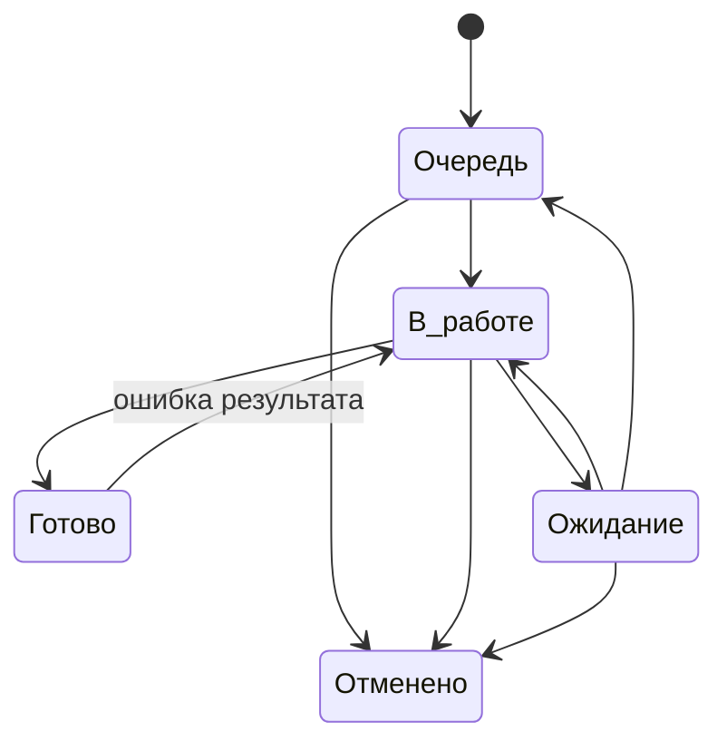

# Правила управления работой

## 1. Что считается работой

Работа — это обязательный результат, который можно отдельно:

- назначить;
- ограничить сроком;
- поставить на ожидание;
- завершить;
- отменить;
- вернуть в работу, если результат оказался неверным.

Одна карточка = один такой результат.

Не создаются отдельные карточки на каждое письмо, файл, звонок, строку данных или технический шаг. Если несколько действий выполняет один человек ради одного результата, это обычно одна работа.

Работу делят на несколько карточек только если части имеют разных исполнителей, разные сроки, могут независимо зависнуть или независимо завершиться.

## 2. Кто за что отвечает

Функций немного. Один человек может совмещать несколько из них.

### Исполнитель

Берёт работу, выполняет её и поддерживает **фактическое состояние** карточки.

Исполнитель обязан:

- переводить работу в `В работе` только после реального начала;
- переводить заблокированную работу в `Ожидание`;
- коротко фиксировать, что именно ожидается;
- закрывать работу после достижения результата;
- перед окончанием своего рабочего периода привести активные карточки к фактическому состоянию;
- заранее сообщать, если срок находится под угрозой.

Исполнитель не обязан получать отдельное разрешение на обычное закрытие и не ведёт второй ручной реестр уже зарегистрированной работы.

### Дежурный по входящим

Разбирает рабочий вход и определяет судьбу каждого сообщения или основания:

- новая работа;
- дополнение к существующей;
- действий не требуется.

Если смысл нельзя выяснить сразу и вопрос требует продолжения позже, создаётся контролируемая работа на уточнение. Неопределённый вход не должен исчезать между почтой и рабочей системой.

### Ответственный за направление

Поддерживает правила устойчивого процесса:

- когда работу можно закрыть;
- как определяется срок;
- когда одну работу нужно делить;
- какие ошибки повторяются;
- какие причины задержек становятся системными.

Он не проверяет вручную каждую обычную карточку.

### Руководитель

Смотрит не весь поток поштучно, а исключения:

- просрочку;
- старые работы;
- длительное ожидание;
- критичные работы;
- бесхозные карточки;
- перегруз;
- возвраты после закрытия;
- повторяющиеся проблемы.

## 3. Состояния работы

### Очередь

Работа обязательна, но прямо сейчас её никто не выполняет.

Здесь находятся как новые работы, так и ранее начатые, которые будут продолжены позже.

### В работе

Исполнитель реально занимается результатом сейчас.

Назначенная на человека работа не становится `В работе` автоматически. Пока к ней фактически не приступили, она остаётся в `Очередь`.

### Ожидание

Продолжать невозможно из-за внешней причины: не хватает данных, документа, ответа, доступа или другого условия, которое исполнитель сам сейчас снять не может.

При переходе в `Ожидание`:

- исполнитель сохраняется;
- коротко фиксируется, что ждём и что уже сделано для снятия блокировки;
- срок не переносится автоматически.

Когда препятствие снято, работа возвращается либо в `В работе`, либо в `Очередь`.

### Готово

Результат достигнут, и по этой карточке больше нет обязательных действий.

Отправленный запрос, промежуточный файл или частично выполненная операция не являются `Готово`, если работа должна продолжаться.

### Отменено

Результат больше не требуется. Причина отмены фиксируется одной понятной фразой.

Удаление рабочей истории вместо отмены не используется.

## 4. Разрешённые переходы

Дополнительный переход добавляется только если без него нельзя корректно описать реальный процесс.

## 5. Владелец работы

Открытая работа должна принадлежать:

- конкретному исполнителю; или
- контролируемой групповой очереди.

Карточка без владельца допустима только как короткое исключение после регистрации и должна попадать в отдельный контрольный список.

## 6. Как выбирается следующая работа

Исполнитель не выбирает только удобные карточки.

Порядок:

1. `Критичная` работа;
2. обычные работы с ближайшим сроком;
3. при одинаковом сроке — более старая;
4. остальные.

Если производственная ситуация требует другого порядка, причина должна быть понятна руководителю без отдельного расследования.

## 7. Приоритет

Методика использует два смысла:

- **Обычный** — работа идёт по сроку и возрасту очереди;
- **Критичный** — задержка создаёт существенное последствие и работа должна быть поднята над обычной очередью.

Критичность не используется как декоративная отметка «важно» и не заменяет срок.

## 8. Срок

Срок — дата, к которой нужен конечный результат.

Он не используется как дата напоминания, следующего звонка или повторной проверки ответа.

Исполнитель не переносит срок только потому, что не успевает. Если срок под угрозой, это управленческое исключение.

Срок меняется, когда:

- изменился реальный требуемый срок результата;
- первоначальный срок был установлен ошибочно;
- принято отдельное управленческое решение.

Причина изменения должна быть понятна из истории карточки.

## 9. Когда работу можно закрыть

Для каждого устойчивого процесса должно быть коротко определено, какой конечный результат означает `Готово`.

Это не многостраничный чек-лист. Обычно достаточно нескольких условий.

Пример логики:

> Требуемое изменение выполнено, результат сохранён или передан по принятому порядку, открытых обязательных действий больше нет.

## 10. Передача работы

Перед окончанием рабочего периода активная карточка приводится к факту:

| Факт | Что сделать |
|---|---|
| Следующий исполнитель продолжает сразу | сменить исполнителя, оставить `В работе` |
| Работа будет продолжена позже | вернуть в `Очередь` |
| Продолжать невозможно | `Ожидание` + причина |
| Результат достигнут | `Готово` |

Нельзя оставлять карточку `В работе` за отсутствующим человеком, если фактическое выполнение остановилось.

## 11. Ошибка и новый объём

Если первоначальный результат оказался неправильным или неполным — исходная карточка возвращается `Готово → В работе`.

Если первоначальный результат был выполнен корректно, но позже появилось новое требование — создаётся новая работа. При необходимости она связывается с предыдущей.

Это правило защищает историю и сроки от искажения.

## 12. Самостоятельный исходящий запрос

Отдельный запрос создаётся, когда получение ответа само нужно контролировать: есть собственный срок, отдельный владелец, несколько адресатов или результат используется независимо от одной текущей работы.

Обычное уточняющее письмо внутри уже открытой работы отдельной карточкой не становится.

Типовой путь запроса:

`Очередь → В работе → Ожидание → В работе/Готово`.

## 13. Регламентная работа

Плановая или периодическая работа создаётся отдельной карточкой на каждый период.

Нельзя использовать одну вечную карточку на все месяцы, недели или циклы.

Будущие экземпляры создаются заранее на принятый горизонт планирования, чтобы работа существовала в системе до наступления дедлайна.

## 14. Поручение и настоящий проект

Разовое поручение по умолчанию — одна работа.

Если внутри несколько самостоятельно контролируемых результатов, используются родительская и дочерние карточки.

Отдельный проект создаётся только когда реально нужны несколько результатов, несколько участников, этапность, зависимости и отдельный управленческий обзор.

## 15. Идеи и улучшения

Идеи не смешиваются с обязательной очередью.

Идея проходит простой путь:

`Inbox → Наблюдаем → Кандидат → Готово к решению`.

После решения «делаем» создаётся обязательная работа или настоящий проект. До этого идея остаётся вариантом изменения, а не обязательством.

## 16. Как меняется сама методика

Новое поле, статус, роль, отчёт, шаблон или правило добавляется только если оно:

- предотвращает потерю работы;
- делает состояние понятнее;
- помогает контролировать срок или владельца;
- сокращает ручной труд;
- устраняет подтверждённую неоднозначность.

Если пользы нет, усложнение не вводится.