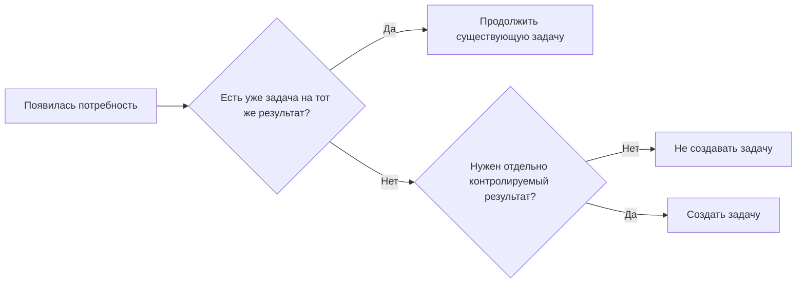
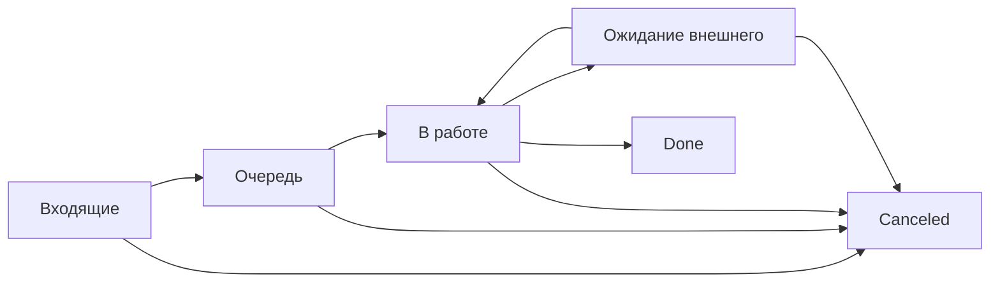
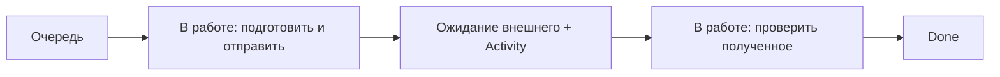
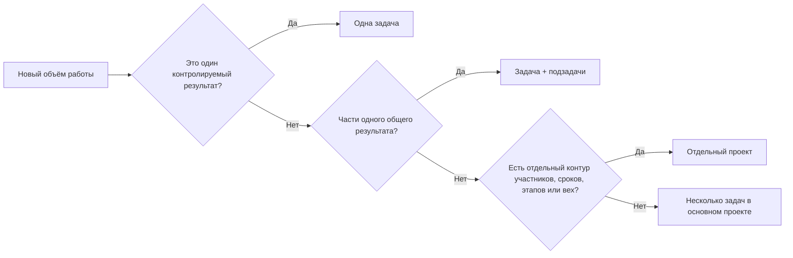

# Модель управления

[Главная](../README.md) · [00 Возможности Odoo](00-odoo19-community.md) · **01 Модель** · [02 Сценарии](02-scripts.md) · [03 Контроль и аналитика](03-control.md) · [04 Шаблоны](04-templates.md) · [05 Процессы](05-processes.md) · [06 Настройка](06-workspace.md)

---

## 1. Что является единицей управления

Основная единица работы — **задача Odoo**.

Одна задача = один самостоятельно контролируемый результат.

Задача создаётся, если результат нужно отдельно:

- выполнить;
- назначить;
- ограничить сроком;
- не потерять в очереди или ожидании;
- увидеть при контроле.

Не создавать отдельную задачу на каждый файл, письмо, звонок или технический шаг, если они являются частью одного результата.

## 2. Проект — это контур, а не вид работы

По умолчанию операционная работа одного подразделения ведётся в **одном рабочем проекте**.

Не создавать отдельный проект только потому, что отличается:

- процесс;
- категория работы;
- исполнитель;
- источник поручения;
- участок;
- период.

Для таких различий используются свойства задач, теги, фильтры и группировки.

Отдельный проект нужен, если появляется реальная отдельная граница хотя бы по одному из признаков:

- отдельный состав участников или права видимости;
- самостоятельная инициатива с началом и окончанием;
- несколько взаимосвязанных результатов и вех;
- свой собственный набор этапов, свойств или правил работы;
- необходимость отдельно контролировать проект как целое.

Не использовать проекты как папки-категории.

## 3. Минимальные данные задачи

Для обычной контролируемой задачи достаточно:

- понятного названия результата;
- ответственного — когда работа взята или назначена;
- конечного срока;
- этапа;
- приоритета;
- свойства `Вид работы`;
- свойства `Процесс` — если оно нужно для устойчивого анализа;
- описания и материалов — только когда без них непонятен результат или основание.

Чем больше обязательных ручных признаков, тем быстрее учёт становится отдельной работой. Новое свойство добавляется только если по нему реально фильтруют, группируют или принимают решение.

## 4. Этап и статус нельзя смешивать

В Odoo у задачи одновременно есть **этап** и **системный статус**.

### Этап

Этап — положение задачи в нашем рабочем потоке. Он настраивается кликами и отображается колонкой Kanban.

Базовые этапы:

1. `Входящие`;
2. `Очередь`;
3. `В работе`;
4. `Ожидание внешнего`.

При реальной потребности можно добавить `На проверке`, но он не является обязательным для всех процессов.

### Системный статус

Статусы Odoo фиксированы и не переименовываются методикой:

- `In Progress`;
- `Changes Requested`;
- `Approved`;
- `Waiting`;
- `Done`;
- `Canceled`.

`Done` и `Canceled` закрывают задачу независимо от этапа.

`Waiting` используется Odoo автоматически для задач, заблокированных внутренними зависимостями.

`Changes Requested` и `Approved` применяются только там, где есть реальная проверка результата. Не нужно превращать их в обязательный маршрут каждой задачи.

### Важное следствие

Системный `In Progress` **не означает**, что сотрудник прямо сейчас физически выполняет задачу. Для оперативного смысла используется этап.

Поэтому:

- этап `Очередь` + статус `In Progress` = открытая задача, готовая к выполнению;
- этап `В работе` + статус `In Progress` = результат сейчас выполняется;
- этап `Ожидание внешнего` + статус `In Progress` = ждём внешнее действие;
- любой этап + статус `Waiting` = выполнение заблокировано другой задачей Odoo;
- `Done` = результат завершён;
- `Canceled` = результат больше не требуется.

## 5. Как работает поток

### `Входящие`

Используется для уже зарегистрированной, но ещё не разобранной работы.

Задача может быть без исполнителя и без окончательного набора признаков только на время разбора.

После разбора она:

- удаляется как ошибочно созданная только если ещё не стала частью фактической работы и история не нужна;
- закрывается `Canceled`, если обязательство было зарегистрировано, но подтверждено, что выполнять его не надо;
- переводится в `Очередь`;
- либо сразу назначается и переводится в `В работе`, если выполнение начинается немедленно.

### `Очередь`

Результат понятен и готов к выполнению, но сейчас не выполняется.

Задача в очереди может быть:

- без исполнителя — общая очередь;
- с исполнителем — заранее назначенная работа.

Неназначенная задача здесь **не является ошибкой сама по себе**. Это штатный способ общей очереди.

### `В работе`

У задачи есть один ответственный за конечный результат, и работа фактически выполняется.

Если человек больше не выполняет задачу, нельзя оставлять её в `В работе` просто потому, что она «ещё не закрыта».

### `Ожидание внешнего`

Используется только когда продолжение зависит от ответа, документа, доступа, согласования или иного действия **вне управляемой очереди Odoo**.

У задачи остаётся ответственный. Одновременно планируется активность следующего контроля: проверить ответ, напомнить, позвонить или эскалировать.

`Ожидание внешнего` без следующей активности допустимо только когда дата следующего действия объективно не нужна и работа будет возобновлена внешним событием, которое гарантированно попадёт в карточку. По умолчанию активность нужна.

## 6. Внутренняя блокировка — не этап ожидания

Если задача не может продолжаться до завершения другой задачи в Odoo:

1. связать её через `Blocked by`;
2. не имитировать зависимость текстом в комментарии;
3. не переносить срок автоматически;
4. Odoo сам покажет системный статус `Waiting`.

Когда блокирующая задача закрывается допустимым статусом, зависимая задача снова становится доступной к выполнению.

Внешнее ожидание и внутренняя зависимость разделяются специально: это разные причины задержки и разные управленческие действия.

## 7. Ответственный и общая очередь

В стандартном Project нет отдельного «группового исполнителя», поэтому методика его не выдумывает.

### Общая очередь

Общая очередь = открытые неназначенные задачи в `Входящие` или `Очередь`, доступные нужной команде.

Для контроля используется сохранённый фильтр `Без исполнителя`.

### Взятая работа

Когда сотрудник фактически берёт результат:

1. назначает себя или назначается старшим;
2. переводит задачу в `В работе`;
3. становится **единственным ответственным за конечный результат** по методике.

Odoo технически позволяет назначить нескольких пользователей. Не использовать множественное назначение только для обозначения всех участников: это размывает ответственность.

Если у разных частей действительно разные ответственные и они могут отдельно завершиться — создавать подзадачи.

## 8. Срок и активность — разные даты

**Deadline задачи = дата конечного результата.**

Не менять её на дату:

- напоминания;
- звонка;
- проверки почты;
- промежуточного контроля.

Для следующего действия используется `Activity`.

### Когда менять Deadline

Допустимые основания:

- исходный срок введён ошибочно;
- изменилось подтверждённое внешнее требование;
- руководитель принял новое решение об обязательстве или сроке.

`Не успеваем` само по себе не является основанием для скрытого переноса. Если срок прошёл — задача должна стать видимой как просроченная.

## 9. Приоритет

Odoo имеет четыре штатных уровня приоритета. Базовая методика **не создаёт искусственную четырёхуровневую управленческую шкалу**, если она не нужна.

По умолчанию используются два края штатной шкалы:

- минимальный приоритет Odoo — обычная работа;
- `Urgent` — критичная работа.

Средние уровни не используются, пока не появится доказанная необходимость различать дополнительные классы.

`Urgent` ставится, если задержка:

- останавливает обязательный процесс;
- срывает внешнее обязательство;
- блокирует другие обязательные результаты;
- создаёт существенный риск, требующий немедленного вмешательства.

«Важно» и «руководитель спросил» сами по себе не делают задачу критичной.

Срок остаётся основным инструментом календарной очередности; приоритет показывает исключение.

## 10. Вид работы

Вместо искусственных системных типов задач используется свойство `Вид работы`.

Базовые значения:

- `Работа` — обычный обязательный результат;
- `Запрос` — отдельно контролируемое получение документа, материала, ответа или подтверждения;
- `Улучшение` — принятое к реализации изменение процесса или способа работы.

Все три значения живут в одной модели задачи и используют один базовый поток.

Это аналитический признак, а не отдельный workflow.

## 11. Запрос

`Запрос` нужен, если получение результата действительно должно контролироваться самостоятельно.

Пример потока:

Правила:

- Deadline = когда результат должен быть получен;
- после отправки остаётся конкретный ответственный;
- следующее напоминание = Activity, а не новый Deadline;
- повторное письмо не создаёт новую задачу;
- полученный материал проверяется до `Done`.

Не создавать `Запрос`, если это обычное уточнение внутри текущей задачи и потерять его отдельно невозможно.

## 12. Периодическая работа

Для регулярного результата используется штатная рекуррентность Odoo.

Каждое фактически возникшее повторение остаётся отдельной задачей, но следующую карточку создаёт Odoo после закрытия предыдущей.

Это означает:

- не создавать вручную задачи на несколько месяцев вперёд только ради контроля горизонта;
- не закрывать текущую периодическую задачу до фактического результата лишь ради появления следующей;
- контролировать просрочку текущей задачи и корректность настройки рекуррентности.

При создании следующего повторения Odoo копирует не всё. Поэтому сведения, которые должны переходить из периода в период, нужно хранить в тех полях, которые штатная рекуррентность переносит, либо проверять при создании следующего экземпляра.

## 13. Подзадача или отдельная задача

Создавать подзадачу, если часть общего результата:

- имеет отдельного ответственного;
- имеет отдельный срок;
- может отдельно зависнуть;
- имеет самостоятельный проверяемый результат.

Не дробить работу на технические чекбоксы только ради ощущения контроля.

Если часть полностью самостоятельна и связь с родителем нужна только как контекст, допустима отдельная задача с обычной связью/описанием вместо глубокой иерархии.

## 14. Когда нужен отдельный проект

Проект — управленческая граница, а не способ разложить операционку по папкам.

## 15. Проверка результата

Не вводить обязательное согласование каждой задачи.

Если конкретному процессу реально нужна проверка:

- можно добавить этап `На проверке`;
- проверяющему назначить Activity;
- использовать `Approved` или `Changes Requested` по смыслу;
- после принятия результата закрыть задачу `Done`.

Если проверка нужна лишь отдельным рискованным случаям, лучше назначать Activity проверяющему выборочно, а не заставлять весь поток проходить лишнюю колонку.

## 16. Ошибка после закрытия и новый объём

### Ошибка результата

Если исходный результат оказался неверным, существующая задача открывается снова и исправляется. История остаётся в той же карточке.

### Новый результат

Если исходный результат был правильным, но появилось новое требование — создаётся новая задача. Старую не переоткрывать ради нового объёма.

## 17. Улучшение процесса

Наблюдение или идея без решения о реализации **не должна засорять обязательную операционную очередь**.

До решения её можно держать в личном `To-Do`, в обсуждении или в отдельном списке наблюдений вне основной очереди.

После решения `делать` создаётся обычная задача с `Вид работы = Улучшение`, ответственным и Deadline.

Результатом такой задачи должно быть не «обсудили», а конкретное изменение и проверяемый эффект.

## 18. Роли

Роли методики задают ответственность, но не обещают несуществующую матрицу технических переходов.

| Роль | Что делает |
|---|---|
| Исполнитель | ведёт свои задачи, фактический этап, активности и результат |
| Старший | разбирает общую очередь, назначение, перегруз, просрочки и исключения |
| Руководитель | принимает решения по конфликтам приоритетов, ресурсов, сроков и изменению процесса |

Один пользователь может совмещать роли.

Не строить процесс на предположении, что Odoo Community кликами запретит конкретной роли каждый отдельный переход этапа.

## 19. Что не усложнять

Не добавлять без доказанной потребности:

- новые проекты;
- новые этапы;
- новые свойства;
- новые уровни приоритета;
- обязательные проверки;
- множественных исполнителей;
- ручные дубли справочных данных;
- отдельные отчёты, если вопрос решается сохранённым фильтром или Pivot/Graph;
- автоматизацию только ради замены простой дисциплины.

## 20. Проверка любого нового правила

Перед добавлением правила ответить:

1. Какую реальную ошибку или потерю оно предотвращает?
2. Какой штатный объект Odoo для этого существует?
3. Кто будет поддерживать данные?
4. Где это будет видно при ежедневном контроле?
5. Какое решение принимается по этому признаку?

Если ответа нет — правило пока не нужно.

---

[← 00 — Возможности Odoo](00-odoo19-community.md) · [02 — Рабочие сценарии →](02-scripts.md)
