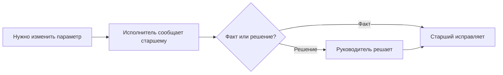
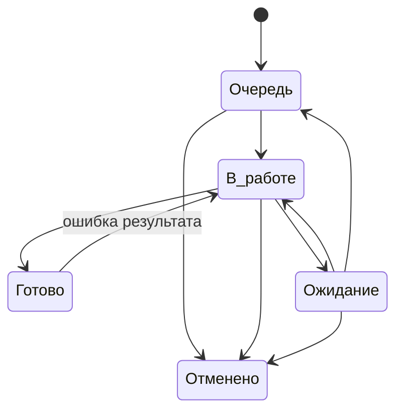
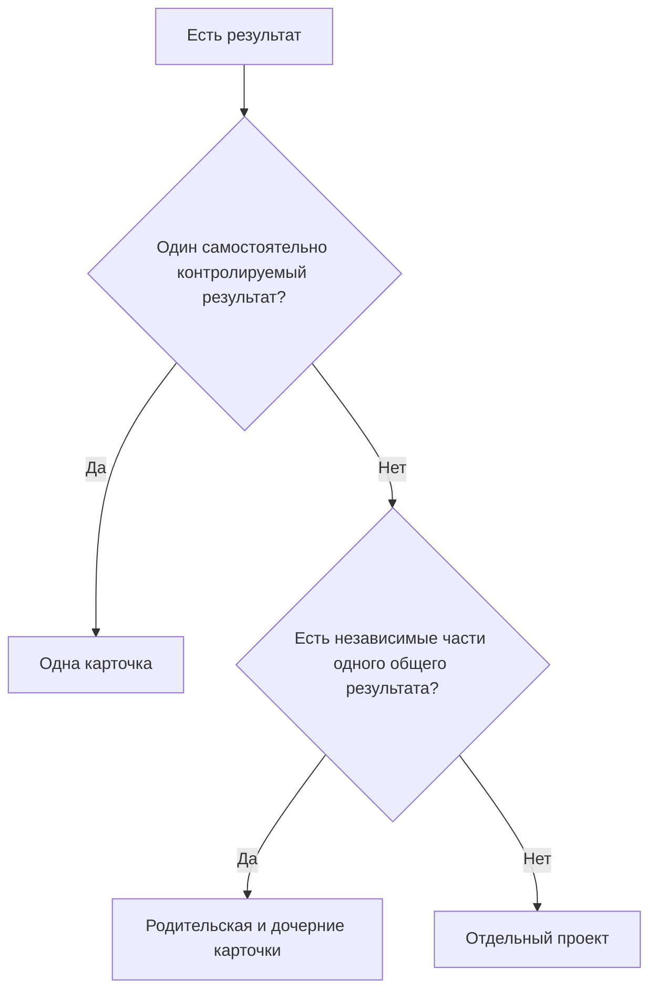

# Правила управления

Этот файл — основной источник правил.

## 1. Единица работы

Одна карточка = один самостоятельно контролируемый результат.

Разделять на несколько карточек нужно, если части:

- имеют разных исполнителей;
- имеют разные сроки;
- могут отдельно зависнуть;
- могут отдельно завершиться.

Не создавать отдельную карточку на письмо, файл, звонок, строку данных или технический шаг.

## 2. Роли

| Роль | Что делает |
|---|---|
| Автор карточки | создаёт работу и задаёт исходные параметры |
| Исполнитель | выполняет работу и ведёт её состояние |
| Старший | исправляет параметры по факту, передаёт работу, фиксирует подтверждённую отмену |
| Дежурный по входящим | разбирает входящие и не оставляет обязательное действие вне системы |
| Ответственный за направление | задаёт правила процесса: срок, готовность, разбиение, горизонт регламентов |
| Руководитель | решает конфликты приоритетов, ресурсов, сроков и отмену по управленческому решению |

Один человек может совмещать несколько ролей.

**Старший исправляет факт. Руководитель меняет решение.**

## 3. Параметры карточки

При создании указываются:

- название;
- тип;
- категория;
- исполнитель или групповая очередь;
- срок;
- приоритет;
- описание и материалы — только если нужны.

После регистрации параметры считаются исходной постановкой.

Исполнитель не переписывает их по своему усмотрению. Если параметр указан неверно или условия изменились:



Корректировка не может заменить исходный результат новым. Новый результат = новая карточка.

## 4. Состояния

| Состояние | Когда использовать |
|---|---|
| `Очередь` | работу нужно сделать, но сейчас её никто не выполняет |
| `В работе` | исполнитель реально занимается результатом |
| `Ожидание` | продолжать нельзя из-за внешней причины |
| `Готово` | результат достигнут, обязательных действий больше нет |
| `Отменено` | результат больше не требуется |



`Ожидание → Готово` не используется. После снятия блокировки карточка сначала возвращается в `В работе` или `Очередь`.

## 5. Владелец и групповая очередь

Открытая работа должна иметь:

- конкретного исполнителя; или
- контролируемую групповую очередь.

Карточка без владельца — только краткое исключение и должна попадать в отдельный контрольный список.

Из групповой очереди сотрудник назначает себя только в момент фактического взятия работы и сразу переводит её в `В работе`.

Передачу уже назначенной карточки другому исполнителю делает старший.

## 6. Порядок очереди

1. Критичные — ближайший срок, затем более старая карточка.
2. Обычные — ближайший срок, затем более старая карточка.

Если несколько критичных работ нельзя упорядочить без управленческого решения — решает руководитель.

## 7. Приоритет

Используются два значения:

- `Обычный`;
- `Критичный`.

`Критичный` ставится только если задержка создаёт существенное последствие и работа должна подняться над обычной очередью.

Тип `Запрос` сам по себе не означает критичность.

## 8. Срок

Срок = дата конечного результата.

Не использовать срок как дату напоминания, следующего звонка или проверки ответа.

Если внешний срок известен — ставится он.

Если внешнего срока нет — используется внутренний срок процесса, установленный ответственным за направление.

Если внутреннего срока ещё нет — автор не придумывает дату; срок определяет ответственный за направление. Если вопрос связан с ресурсом или обязательствами нескольких направлений — руководитель.

Срок меняется только если:

- исходная дата была ошибочной;
- внешние условия реально изменились;
- руководитель изменил обязательство.

`Не успеваем` — не основание для переноса.

## 9. Ожидание

При переводе в `Ожидание`:

- исполнитель сохраняется;
- в комментарии указывается, что ждём и что уже сделано;
- срок автоматически не переносится.

Когда препятствие снято:

- продолжаем сейчас → `В работе`;
- продолжим позже → `Очередь`.

## 10. Передача работы

Перед окончанием рабочего периода карточка должна соответствовать факту:

| Факт | Действие |
|---|---|
| следующий исполнитель продолжает сразу | старший меняет исполнителя, статус остаётся `В работе` |
| продолжение будет позже | `Очередь` |
| есть внешняя блокировка | `Ожидание` |
| результат достигнут | `Готово` |

Не оставлять `В работе` за человеком, который работу больше не выполняет.

## 11. Ошибка, новый объём, отмена

**Ошибка исходного результата:** `Готово → В работе`.

**Новый объём после правильного закрытия:** новая карточка, при необходимости связанная с исходной.

**Отмена:**

- если есть явное подтверждение, что результат больше не нужен — старший фиксирует `Отменено` и основание;
- если отмена является новым управленческим решением — решает руководитель.

Рабочую историю не удалять.

## 12. Запрос важного документа

`Запрос` используется, когда подразделению нужно получить важный документ, материал или подтверждение и нельзя потерять контроль после отправки.

Не использовать `Запрос` для обычной переписки и уточнений внутри текущей работы.

Путь:

```text
Очередь → В работе → Ожидание → В работе → Готово
```

Правила:

- срок = дата получения;
- до отправки карточка может быть в групповой очереди;
- после отправки обязательно остаётся конкретный владелец;
- отправка письма не означает `Готово`;
- просрочка требует повторного действия или эскалации;
- после получения документ проверяется и только затем запрос закрывается;
- повторное письмо остаётся в той же карточке.

## 13. Регламентная работа

Каждый период = отдельная карточка типа `Регламент`.

Будущие карточки создаются заранее на горизонт, установленный ответственным за направление.

Ответственный за направление следит, чтобы следующий период появился в системе до срока.

## 14. Одна карточка, иерархия или проект



Отдельный проект нужен, когда есть несколько результатов, участников, этапов и зависимостей и требуется отдельный контур управления.

Сложность сама по себе не делает работу проектом.

## 15. Идеи

Идеи ведутся отдельно от обязательной работы:

```text
Входящие идеи → Наблюдаем → Кандидат → Готово к решению
```

После решения `делаем` создаётся обязательная работа. Её масштаб определяется по разделу 14.

## 16. Локальные правила процесса

Для каждого направления при необходимости фиксируются:

- контрольное время разбора входящих;
- внутренний срок процесса;
- горизонт создания регламентных работ;
- периодичность выборочного контроля качества.

Процессные значения поддерживает ответственный за направление. Общие для нескольких направлений решения принимает руководитель.

## 17. Не добавлять без необходимости

- новые статусы;
- новые типы;
- новые категории;
- обязательные согласования;
- дополнительные поля;
- отдельные отчёты поверх данных системы;
- карточки на технические шаги.
