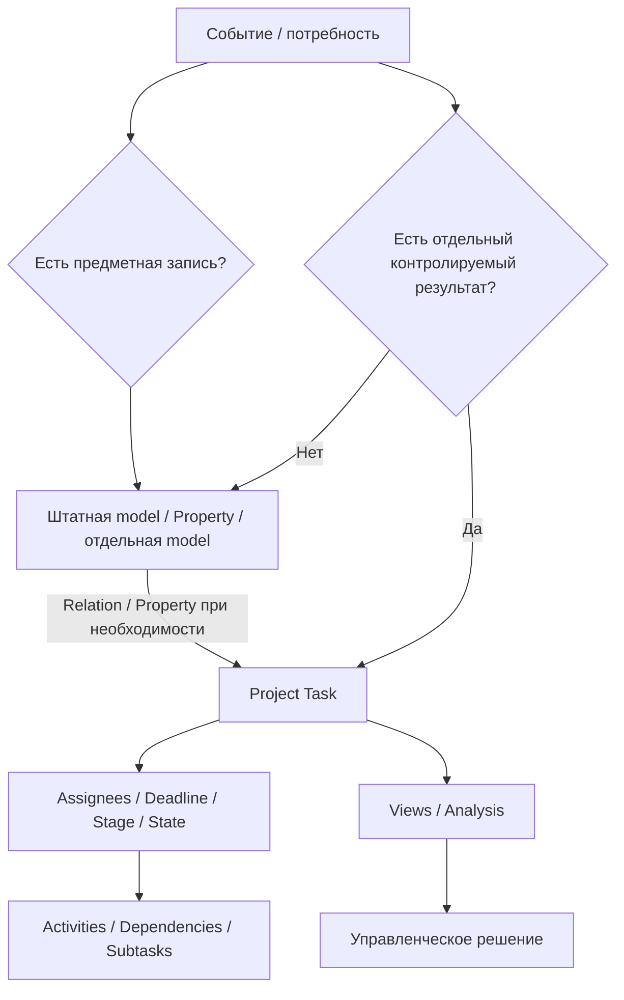

# Модель управления

[Главная](../README.md) · [00 Возможности](00-odoo19-community.md) · **01 Модель** · [02 Сценарии](02-scripts.md) · [03 Аналитика](03-control.md) · [04 Шаблоны](04-templates.md) · [05 Процессы](05-processes.md) · [06 Настройка](06-workspace.md) · [17 Люди](17-master-data-people.md)

---

## 1. Что фиксирует базовая методика

Базовая методика описывает только соответствие управленческого смысла штатным сущностям Odoo.

Она **не задаёт заранее** конкретную оргструктуру, роли, смены, порядок назначения, правила приёмки и фиксированный набор Stages.

```text
предмет работы
→ контролируемый результат
→ выполнение
→ контроль
```

## 2. Три разных уровня

### Предметная сущность

То, к чему относится работа:

- сотрудник;
- организация;
- ТС;
- оборудование;
- документ;
- иная предметная запись.

Если Odoo имеет подходящую штатную модель, предметная сущность живёт в ней.

Для людей текущего контура уже принято отдельное решение: единая запись человека — `res.partner`; `res.users` добавляется только при необходимости доступа. Подробно: [17 — Master data: люди](17-master-data-people.md).

### Task

Task используется для результата, который нужно отдельно вести и контролировать.

### Activity

Activity используется для следующего действия или follow-up внутри существующей записи.

## 3. Когда нужна Task

Task создаётся, если результат нужно отдельно:

- назначить одному или нескольким Assignees;
- ограничить сроком;
- провести через workflow;
- не потерять среди других работ;
- связать с другими Tasks;
- анализировать как отдельную единицу работы.

Не создавать Task только потому, что появилось письмо, файл, звонок или строка данных.

Если самостоятельного результата нет, обновляется предметная запись, Chatter или другой профильный объект.

## 4. Предметные данные не дублируются в Task

Примеры штатных источников истины:

| Предмет | Модель / приложение |
|---|---|
| сотрудник / человек | Contacts / `res.partner` |
| пользователь с доступом | `res.users` |
| ТС | Fleet, если модель подходит |
| оборудование | Maintenance Equipment |
| обслуживание | Maintenance Request |
| serial / lot / location / movement | Inventory |
| встреча | Calendar |
| закупка | Purchase |
| расход сотрудника | Expenses |

Employees / `hr.employee` не используется в текущем baseline только ради справочника сотрудников. Он рассматривается отдельно только при появлении реального HR-контура.

Task хранит работу над предметом, а не копию его карточки.

## 5. Связь Task с объектом

Odoo 19 Properties поддерживают Many2one/Many2many к выбранной модели.

Поэтому первой проверяется штатная связь:

```text
Task Property[ТС]           → fleet.vehicle
Task Property[Сотрудник]    → res.partner
Task Property[Оборудование] → maintenance.equipment
```

Property добавляется только если эта связь нужна для работы, фильтрации, группировки или аналитики.

## 6. Если штатной модели нет

Не все предметные сущности обязаны быть стандартными Odoo records.

```text
Есть предметная сущность
        ↓
Есть подходящая штатная model?
        │
     да ───→ использовать её
        │
       нет
        ↓
Нужна ли самостоятельная жизнь объекта?
        │
        ├─ нет → Property / Tag / данные Task / Chatter
        │
        └─ да  → кандидат на отдельную model
```

Отдельная model оправдана, если объекту нужны собственный реестр, уникальность, lifecycle, права, связи с множеством records или самостоятельная аналитика.

## 7. Project — граница управления, а не категория

Project создаётся там, где существует реальная отдельная граница, например:

- своя visibility;
- самостоятельный lifecycle;
- отдельные milestones;
- отдельный project-level контроль;
- существенно отличающийся workflow;
- повторяемая структура инициативы.

Разные виды работ, ТС, сотрудники или категории сами по себе не требуют разных Projects.

Один общий Project допустим, если процессы действительно могут жить в одном workflow и одной области доступа. Несколько Projects допустимы, если появляются реальные границы.

## 8. Stage и State

```text
Stage = положение Task в настроенном workflow
State = системное состояние Task
```

Конкретные Stages определяются процессом.

Не нужно заводить отдельный Stage только ради дублирования штатного `Done`, `Canceled` или dependency-driven `Waiting`, если процессу это ничего не даёт.

## 9. Assignees

Odoo поддерживает несколько Assignees.

Базовая методика не устанавливает, должен ли процесс использовать одного или нескольких исполнителей и кто имеет право назначать работу.

Процесс должен лишь позволять однозначно понять, кто отвечает за выполнение в рамках принятой локальной схемы.

Followers не являются Assignees.

## 10. Assignee и предметный сотрудник — разные связи

```text
Assignee
= кто выполняет Task
= res.users

Property[Сотрудник]
= человек, которого касается работа
= res.partner
```

Эти значения могут относиться к одному человеку, но методически отвечают на разные вопросы. Если сотрудник получает доступ в Odoo, его `res.users` связывается с той же записью `res.partner`; отдельная карточка человека не создаётся.

## 11. Deadline и Activity

```text
Deadline
= когда нужен результат Task

Activity Due Date
= когда нужно выполнить следующее действие
```

Не использовать Activity вместо Task, если появился самостоятельный результат.

Не использовать Deadline только как напоминание о следующем контакте.

Кто и на каких основаниях может менять Deadline — локальное правило конкретного процесса.

## 12. Внутренняя зависимость

Если продолжение Task зависит от результата другой Task:

```text
Blocked by = другая Task
→ computed Waiting
```

Dependencies могут связывать Tasks разных Projects.

Если ожидание связано не с другой Task, а с внешним событием, конкретный способ его отражения определяется workflow процесса: Stage, Activity, Chatter или их сочетание.

## 13. Priority

Odoo поддерживает:

```text
Low
Medium
High
Urgent
```

Методика не задаёт обязательную локальную шкалу использования этих уровней.

Процесс должен определить Priority только если разные значения реально меняют порядок или способ обработки работы.

## 14. Subtasks

Subtask полезна, если часть результата имеет самостоятельный смысл, например:

- отдельного Assignee;
- свой Deadline;
- отдельную dependency;
- самостоятельный результат.

Простой список технических шагов не обязан становиться деревом Tasks.

## 15. Повторяемость

Использовать механизм по назначению:

```text
типовая Task по событию
→ Task Template

календарно повторяемая Task
→ Recurring Task

повторяемый набор follow-up
→ Activity Plan / chaining

повторяемая структура инициативы
→ Project Template + Roles
```

Не строить сложную Automation Rule там, где задачу решает более простой штатный механизм.

## 16. Специализированный workflow остаётся специализированным

Если процесс уже ведётся в штатном предметном приложении, не дублировать его Project Task только ради статуса.

Примеры:

```text
Maintenance Request
Purchase Order
Expense
Time Off
Recruitment Applicant
Survey
```

Task создаётся только если поверх профильного workflow существует отдельный контролируемый результат.

## 17. Bridge modules проверяются до custom integration

Перед собственной связью проверить штатные bridges между установленными приложениями.

Примеры доступных bridge-модулей:

```text
Employees + Fleet        → hr_fleet
Employees + Maintenance  → hr_maintenance
Inventory + Maintenance  → stock_maintenance
Project + Purchase       → project_purchase
Project + Inventory      → project_stock
Project + Accounting     → project_account
```

Но bridge используется только если соответствующие приложения реально входят в наш контур. Поскольку Employees / HR сейчас не используется, `hr_fleet` и `hr_maintenance` не являются baseline.

Если bridge уже отвечает на тот же вопрос, не дублировать связь Property или custom field без причины.

## 18. Права не выводятся из методики автоматически

Методика не определяет роли `исполнитель / старший / руководитель` как обязательную структуру Odoo.

Сначала конкретный процесс определяет фактические полномочия, затем они реализуются средствами:

```text
Groups
Access Rights
Record Rules
Project visibility
```

## 19. Контроль строится из тех же records

Для контроля используются штатные Views и отчёты Odoo:

- List;
- Kanban;
- Activity;
- Search / Group By;
- Shared Views;
- Task Analysis;
- Pivot / Graph;
- My Dashboard.

Конкретный набор контрольных представлений определяется вопросами процесса, а не фиксируется для всех процессов заранее.

## 20. Где заканчивается адаптация и начинается gap

Менять привычный порядок работы под штатную модель Odoo допустимо, если не теряется управляемость.

Критический gap возникает, если штатными средствами невозможно обеспечить требуемую возможность:

- однозначно определить предмет работы;
- зафиксировать контролируемый результат;
- определить ответственных;
- контролировать срок;
- сохранить необходимую историю;
- обеспечить требуемые права;
- получить достоверные данные для контроля.

Только доказанный gap является основанием для минимальной доработки.

## 21. Итоговая схема



Главная цель — использовать Odoo как готовый инструмент и добавлять только те правила и сущности, которые реально нужны конкретному процессу.

---

[← 00 — Возможности](00-odoo19-community.md) · [02 — Сценарии →](02-scripts.md) · [17 — Master data: люди](17-master-data-people.md)
