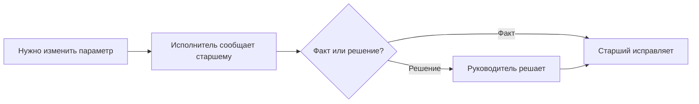
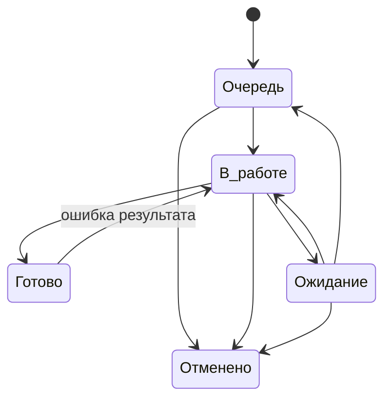
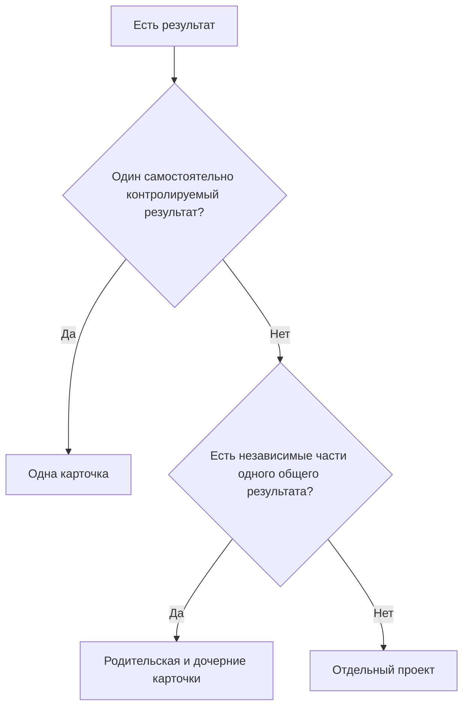

# Правила управления

[Главная](../README.md) · **01 Правила** · [02 Скрипты](02-scripts.md) · [03 Контроль](03-control.md) · [04 Шаблоны](04-templates.md) · [05 OpenProject](05-openproject.md) · [06 Процессы](06-processes.md)

---

Этот файл содержит общие правила. Остальные документы показывают их применение и не вводят самостоятельных норм.

## 1. Термины

| Термин | Значение |
|---|---|
| Обязательная работа | любой обязательный результат, который контролируется в системе; может оформляться типом `Работа`, `Запрос` или `Регламент` |
| Работа | обязательная работа в общем смысле, если слово используется без кодового оформления |
| `Работа` | конкретный тип карточки для обычного обязательного результата, который не является отдельным `Запросом` или `Регламентом` |
| Карточка | запись о работе в OpenProject |
| Основание | событие, документ, поручение или условие, из-за которого появилась работа |
| Тип | характер карточки: `Работа`, `Запрос`, `Регламент`, `Идея` |
| Категория | устойчивый бизнес-процесс, к которому относится работа |
| Исполнитель | человек, отвечающий за выполнение результата |
| Групповая очередь | работа направления, ещё не взятая конкретным исполнителем |
| Срок | дата, к которой нужен конечный результат |
| Состояние | фактическое положение работы: очередь, выполнение, ожидание, готовность или отмена |
| `Запрос` | отдельная карточка для контролируемого получения документа, материала или подтверждения |
| `Регламент` | периодическая работа, возникающая по календарю или установленной периодичности |

## 2. Роли и решения

| Роль | Что делает | Какие решения принимает |
|---|---|---|
| Автор карточки | создаёт карточку и задаёт исходные параметры | первичная постановка по известным данным |
| Исполнитель | выполняет работу и ведёт её состояние | рабочие переходы состояний в пределах регламента |
| Старший | исправляет параметры по факту, передаёт работу, фиксирует подтверждённую отмену | оперативные корректировки без изменения обязательства |
| Дежурный по входящим | разбирает входящие | новая работа / продолжение / действий нет / нужно уточнение |
| Ответственный за направление | поддерживает правила процесса | внутренний срок, готовность, разбиение, горизонт регламентов, локальные правила |
| Руководитель | разбирает управленческие исключения | конфликт приоритетов, изменение обязательства, ресурса, срока, отмена по новому решению |

Один человек может совмещать несколько ролей.

## 3. Единица работы

Одна карточка = один самостоятельно контролируемый результат.

Разделять на несколько карточек нужно, если части:

- имеют разных исполнителей;
- имеют разные сроки;
- могут отдельно зависнуть;
- могут отдельно завершиться.

Письмо, файл, звонок, строка данных или технический шаг сами по себе не создают отдельную карточку. Один конечный результат ведётся в одной карточке, пока не возникает основание для разделения.

## 4. Параметры карточки

При создании указываются:

- название;
- тип;
- категория;
- исполнитель или групповая очередь;
- срок;
- приоритет;
- описание и материалы — только если нужны.

После регистрации параметры считаются исходной постановкой и сохраняются в истории.

Исполнитель не переписывает их по своему усмотрению. Если параметр указан неверно или условия изменились:



Корректировка не может заменить исходный результат новым. Новый результат = новая карточка.

## 5. Состояния

| Состояние | Когда использовать |
|---|---|
| `Очередь` | работу нужно сделать, но сейчас её никто не выполняет; сюда относится и работа, отложенная из-за внутренней загрузки |
| `В работе` | исполнитель реально занимается результатом |
| `Ожидание` | продолжать нельзя из-за внешней причины; внутренняя загрузка не является ожиданием |
| `Готово` | результат достигнут, обязательных действий больше нет |
| `Отменено` | результат больше не требуется |



`Ожидание → Готово` не используется. После снятия блокировки карточка сначала возвращается в `В работе` или `Очередь`.

### Пограничные случаи

| Ситуация | Что ставить |
|---|---|
| работу ещё не начали | `Очередь` |
| реально выполняем сейчас | `В работе` |
| ждём ответ, документ, доступ или другое внешнее действие | `Ожидание` |
| у исполнителя много другой работы | `Очередь` |
| пока не дошли руки | `Очередь` |
| переключились на критичную работу | прежняя работа → `Очередь`, если её никто не продолжает |
| не понимаем, что делать дальше | уточнение / эскалация, не `Ожидание` |
| результат достигнут | `Готово` |

## 6. Владелец и групповая очередь

Открытая работа должна иметь:

- конкретного исполнителя; или
- контролируемую групповую очередь.

Карточка без владельца — только краткое исключение и должна попадать в отдельный контрольный список.

Из групповой очереди сотрудник назначает себя только в момент фактического взятия работы и сразу переводит её в `В работе`.

Передачу уже назначенной карточки другому исполнителю делает старший.

## 7. Порядок очереди и критичность

Порядок:

1. критичные — ближайший срок, затем более старая карточка;
2. обычные — ближайший срок, затем более старая карточка.

Если несколько критичных работ нельзя упорядочить без управленческого решения — решает руководитель.

`Критичный` ставится, если задержка приводит хотя бы к одному из последствий:

- останавливает обязательный процесс;
- срывает внешнее обязательство;
- блокирует другие обязательные работы;
- требует немедленного управленческого вмешательства.

Не делать работу критичной только потому, что она «важная», неприятная или её попросили посмотреть первой без реального изменения очереди.

Тип `Запрос` сам по себе не означает критичность.

## 8. Срок

Срок = дата конечного результата.

Не использовать срок как дату напоминания, следующего звонка или проверки ответа.

Если внешний срок известен — ставится он.

Если внешнего срока нет — используется внутренний срок процесса, установленный ответственным за направление.

Если внутреннего срока ещё нет — автор не придумывает дату; срок определяет ответственный за направление. Если вопрос связан с ресурсом или обязательствами нескольких направлений — руководитель.

Срок меняется только если:

- исходная дата была ошибочной;
- внешние условия реально изменились;
- руководитель изменил обязательство.

`Не успеваем` — не основание для переноса. Просрочка остаётся видимой до появления реального основания изменить срок.

## 9. Ожидание

При переводе в `Ожидание`:

- исполнитель сохраняется;
- в комментарии указывается, что ждём и что уже сделано;
- срок автоматически не переносится.

Когда препятствие снято:

- продолжаем сейчас → `В работе`;
- продолжим позже → `Очередь`.

## 10. Новая карточка или существующая

| Ситуация | Действие |
|---|---|
| пришло продолжение по тому же результату | обновить существующую карточку |
| пришёл новый файл по той же работе | обновить существующую карточку |
| повторно напоминаем по уже созданному запросу | та же карточка `Запрос` |
| исходный результат выполнен неправильно | вернуть исходную карточку `Готово → В работе` |
| исходный результат был правильным, но появилось новое требование | новая карточка |
| появилась независимая часть со своим сроком/исполнителем/результатом | дочерняя карточка |
| несколько самостоятельных результатов, участников, этапов и зависимостей | отдельный проект |

## 11. Передача работы

Перед окончанием рабочего периода карточка должна соответствовать факту:

| Факт | Действие |
|---|---|
| следующий исполнитель продолжает сразу | старший меняет исполнителя, статус остаётся `В работе` |
| продолжение будет позже | `Очередь` |
| есть внешняя блокировка | `Ожидание` |
| результат достигнут | `Готово` |

Не оставлять `В работе` за человеком, который работу больше не выполняет.

## 12. Ошибка, новый объём, отмена

| Ситуация | Действие |
|---|---|
| исходный результат выполнен неправильно | `Готово → В работе` |
| исходный результат был правильным, но появился новый объём | создать новую карточку; при необходимости связать с исходной |
| подтверждено, что результат больше не нужен | старший фиксирует `Отменено` и основание |
| отмена является новым управленческим решением | решение принимает руководитель |

Рабочую историю не удалять.

## 13. Запрос документа или материала

`Запрос` создаётся, если одновременно выполняются условия:

- подразделению нужно получить конкретный документ, материал или подтверждение;
- получение имеет самостоятельный срок или самостоятельную ценность для дальнейшей работы;
- после отправки нужно отдельно контролировать факт получения;
- потеря ответа оставит незакрытое обязательство.

Не использовать отдельный `Запрос`, если:

- это обычное уточнение внутри текущей работы;
- нужно дослать небольшой файл для уже открытой карточки;
- это повторное письмо по уже созданному `Запросу`;
- получение само по себе не требует отдельного контроля.

Путь:

```text
Очередь → В работе → Ожидание → В работе → Готово
```

Правила:

- срок = дата получения;
- до отправки карточка может быть в групповой очереди;
- после отправки обязательно остаётся конкретный владелец;
- отправка письма не означает `Готово`;
- просрочка требует повторного действия или эскалации;
- после получения результат проверяется и только затем запрос закрывается;
- повторное письмо остаётся в той же карточке.

## 14. Регламентная работа

Каждый период = отдельная карточка типа `Регламент`.

Будущие карточки создаются заранее на горизонт, установленный ответственным за направление.

Ответственный за направление следит, чтобы следующий период появился в системе до срока.

## 15. Одна карточка, иерархия или проект



Отдельный проект нужен, когда есть несколько результатов, участников, этапов и зависимостей и требуется отдельный контур управления.

Сложность сама по себе не делает работу проектом.

## 16. Идеи

Идеи ведутся отдельно от обязательной работы:

```text
Входящие идеи → Наблюдаем → Кандидат → Готово к решению
```

До решения `делаем` идея не входит в обязательную очередь. После решения создаётся обязательная работа, масштаб которой определяется по разделу 15.

## 17. Локальные правила процесса

Для каждого направления при необходимости фиксируются:

- контрольное время разбора входящих;
- внутренний срок процесса;
- горизонт создания регламентных работ;
- периодичность выборочного контроля качества.

Процессные значения поддерживает ответственный за направление. Общие для нескольких направлений решения принимает руководитель.

Форма фиксации — в [Шаблонах](04-templates.md).

## 18. Что регламент не определяет

Регламент не задаёт:

- техническую матрицу прав пользователей;
- конкретную организационную структуру;
- внешние нормативы и сроки;
- содержание конкретных бизнес-процессов;
- локальные значения отдельных направлений.

Они задаются при внедрении и не должны противоречить этому файлу.

## 19. Не добавлять без необходимости

- новые статусы;
- новые типы;
- новые категории;
- обязательные согласования;
- дополнительные поля;
- отдельные отчёты поверх данных системы;
- карточки на технические шаги.

---

[← Главная](../README.md) · [02 — Скрипты →](02-scripts.md)