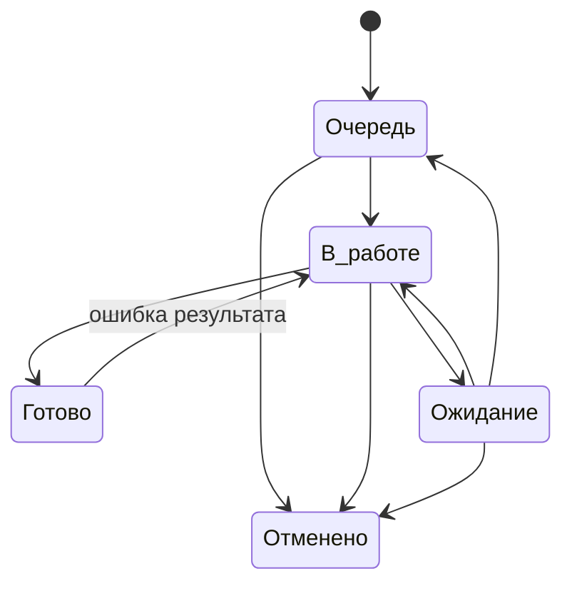

# Правила управления работой

## 1. Что считается работой

Работа — это обязательный результат, который можно отдельно:

- назначить;
- ограничить сроком;
- поставить на ожидание;
- завершить;
- отменить;
- вернуть в работу, если результат оказался неверным.

Одна карточка = один такой результат.

Не создаются отдельные карточки на каждое письмо, файл, звонок, строку данных или технический шаг. Если несколько действий выполняет один человек ради одного результата, это обычно одна работа.

Работу делят на несколько карточек только если части имеют разных исполнителей, разные сроки, могут независимо зависнуть или независимо завершиться.

## 2. Кто за что отвечает

Функций немного. Один человек может совмещать несколько из них.

### Исполнитель

Берёт работу, выполняет её и поддерживает **фактическое состояние** карточки.

Исполнитель обязан:

- при создании работы корректно задать известные на этот момент параметры;
- переводить работу в `В работе` только после реального начала;
- переводить заблокированную работу в `Ожидание`;
- коротко фиксировать, что именно ожидается;
- закрывать работу после достижения результата;
- перед окончанием своего рабочего периода привести активные карточки к фактическому состоянию;
- заранее сообщать, если срок находится под угрозой;
- сообщать старшему, если после регистрации требуется исправить срок, категорию, исполнителя, приоритет или другие зафиксированные параметры.

Исполнитель не обязан получать отдельное разрешение на обычное закрытие и не ведёт второй ручной реестр уже зарегистрированной работы.

### Старший

Старший помогает поддерживать рабочие карточки в корректном состоянии и может исправлять параметры уже зарегистрированной работы, когда для этого есть реальное основание.

В его зону входят:

- исправление ошибочно указанного срока;
- изменение срока при подтверждённом изменении условий;
- исправление категории;
- перераспределение исполнителя;
- корректировка приоритета;
- исправление названия или описания, если регистрация была выполнена неверно или неполно.

Старший **не является обязательной стадией согласования** и не проверяет каждую работу перед закрытием.

Корректировка параметров нужна для поддержания достоверности карточки, а не для административного контроля исполнителя.

Старший не переносит срок только для того, чтобы убрать просрочку. Изменение срока должно иметь реальное основание и быть понятным из истории работы.

### Дежурный по входящим

Разбирает рабочий вход и определяет судьбу каждого сообщения или основания:

- новая работа;
- дополнение к существующей;
- действий не требуется.

Если смысл нельзя выяснить сразу и вопрос требует продолжения позже, создаётся контролируемая работа на уточнение. Неопределённый вход не должен исчезать между почтой и рабочей системой.

### Ответственный за направление

Поддерживает правила устойчивого процесса:

- когда работу можно закрыть;
- как определяется срок;
- когда одну работу нужно делить;
- какие ошибки повторяются;
- какие причины задержек становятся системными.

Он не проверяет вручную каждую обычную карточку.

### Руководитель

Смотрит не весь поток поштучно, а исключения:

- просрочку;
- старые работы;
- длительное ожидание;
- критичные работы;
- бесхозные карточки;
- перегруз;
- возвраты после закрытия;
- повторяющиеся проблемы.

Руководитель принимает управленческие решения, когда обычной корректировки параметров старшим недостаточно: конфликт приоритетов, изменение обязательного срока, перераспределение ресурса, отмена потребности или другое существенное изменение условий.

## 3. Жизненный цикл параметров карточки

Карточка имеет два разных слоя:

1. **параметры работы** — что это за работа, кому она принадлежит, к какому сроку нужна и к какому процессу относится;
2. **состояние работы** — `Очередь`, `В работе`, `Ожидание`, `Готово`, `Отменено`.

Эти слои не смешиваются.

### При создании

Создатель карточки указывает известные параметры:

- название;
- тип;
- категорию;
- исполнителя или групповую очередь;
- срок;
- приоритет;
- необходимое описание и материалы.

До сохранения карточки это обычное заполнение новой работы.

### После регистрации

После создания параметры считаются **зафиксированной исходной постановкой работы**.

Исполнитель дальше ведёт жизненный цикл работы: начинает, ставит на ожидание, возвращает в очередь, завершает, оставляет существенные комментарии и прикладывает необходимые материалы.

Исполнитель не должен произвольно менять зафиксированные параметры только потому, что в процессе стало удобнее другое значение.

Если после регистрации обнаружена ошибка или реально изменились условия, исполнитель сообщает старшему.

### Корректировка после регистрации

Старший может исправить параметр, если:

- при создании допущена ошибка;
- изменились фактические условия работы;
- требуется перераспределение;
- категория выбрана неверно;
- приоритет больше не соответствует реальной ситуации;
- срок официально или фактически изменился по обоснованной причине.

Если изменение является уже не обычной корректировкой, а управленческим решением, вопрос передаётся руководителю.

Корректировка параметра **не создаёт новую стадию workflow и не требует согласования самой работы**.

## 4. Состояния работы

### Очередь

Работа обязательна, но прямо сейчас её никто не выполняет.

Здесь находятся как новые работы, так и ранее начатые, которые будут продолжены позже.

### В работе

Исполнитель реально занимается результатом сейчас.

Назначенная на человека работа не становится `В работе` автоматически. Пока к ней фактически не приступили, она остаётся в `Очередь`.

### Ожидание

Продолжать невозможно из-за внешней причины: не хватает данных, документа, ответа, доступа или другого условия, которое исполнитель сам сейчас снять не может.

При переходе в `Ожидание`:

- исполнитель сохраняется;
- коротко фиксируется, что ждём и что уже сделано для снятия блокировки;
- срок не переносится автоматически.

Когда препятствие снято, работа возвращается либо в `В работе`, либо в `Очередь`.

### Готово

Результат достигнут, и по этой карточке больше нет обязательных действий.

Отправленный запрос, промежуточный файл или частично выполненная операция не являются `Готово`, если работа должна продолжаться.

### Отменено

Результат больше не требуется. Причина отмены фиксируется одной понятной фразой.

Удаление рабочей истории вместо отмены не используется.

## 5. Разрешённые переходы

Дополнительный переход добавляется только если без него нельзя корректно описать реальный процесс.

Изменение срока, категории, исполнителя или приоритета **не является сменой состояния** и не должно порождать дополнительные статусы.

## 6. Владелец работы

Открытая работа должна принадлежать:

- конкретному исполнителю; или
- контролируемой групповой очереди.

Карточка без владельца допустима только как короткое исключение после регистрации и должна попадать в отдельный контрольный список.

## 7. Как выбирается следующая работа

Исполнитель не выбирает только удобные карточки.

Порядок:

1. `Критичная` работа;
2. обычные работы с ближайшим сроком;
3. при одинаковом сроке — более старая;
4. остальные.

Если производственная ситуация требует другого порядка, причина должна быть понятна руководителю без отдельного расследования.

## 8. Приоритет

Методика использует два смысла:

- **Обычный** — работа идёт по сроку и возрасту очереди;
- **Критичный** — задержка создаёт существенное последствие и работа должна быть поднята над обычной очередью.

Критичность не используется как декоративная отметка «важно» и не заменяет срок.

Если приоритет после регистрации указан неверно или ситуация изменилась, его корректирует старший. Если изменение приоритета связано с конфликтом нескольких критичных работ или перераспределением ресурса, решение принимает руководитель.

## 9. Срок

Срок — дата, к которой нужен конечный результат.

Он не используется как дата напоминания, следующего звонка или повторной проверки ответа.

Срок задаётся при создании работы исходя из известного требования или норматива и после регистрации считается контрольной точкой.

Исполнитель не переносит срок только потому, что не успевает. Если срок под угрозой, это управленческое исключение.

Срок меняется, когда:

- изменился реальный требуемый срок результата;
- первоначальный срок был установлен ошибочно;
- принято отдельное управленческое решение.

Обычную обоснованную корректировку выполняет старший. Если перенос срока меняет обязательство, приоритет или затрагивает управленческое решение, он согласуется с руководителем.

Причина изменения должна быть понятна из истории карточки.

## 10. Когда работу можно закрыть

Для каждого устойчивого процесса должно быть коротко определено, какой конечный результат означает `Готово`.

Это не многостраничный чек-лист. Обычно достаточно нескольких условий.

Пример логики:

> Требуемое изменение выполнено, результат сохранён или передан по принятому порядку, открытых обязательных действий больше нет.

Закрытие обычной работы не требует обязательной проверки старшим.

## 11. Передача работы

Перед окончанием рабочего периода активная карточка приводится к факту:

| Факт | Что сделать |
|---|---|
| Следующий исполнитель продолжает сразу | сменить исполнителя, оставить `В работе` |
| Работа будет продолжена позже | вернуть в `Очередь` |
| Продолжать невозможно | `Ожидание` + причина |
| Результат достигнут | `Готово` |

Если при передаче меняется исполнитель, это обычная корректировка параметра работы. Она не означает согласование или создание новой карточки.

Нельзя оставлять карточку `В работе` за отсутствующим человеком, если фактическое выполнение остановилось.

## 12. Ошибка и новый объём

Если первоначальный результат оказался неправильным или неполным — исходная карточка возвращается `Готово → В работе`.

Если первоначальный результат был выполнен корректно, но позже появилось новое требование — создаётся новая работа. При необходимости она связывается с предыдущей.

Это правило защищает историю и сроки от искажения.

## 13. Запрос важного документа или материала

Тип `Запрос` используется не для обычной переписки и не для уточняющего письма внутри уже открытой работы.

Отдельный `Запрос` создаётся, когда подразделение **само инициирует получение важного документа, материала или подтверждения**, которое нужно прежде всего для своей дальнейшей работы и которое нельзя потерять после отправки письма.

Смысл карточки `Запрос` — контролировать не факт отправки, а **факт получения требуемого результата**.

Обязательные правила:

- у запроса есть конкретный владелец;
- срок означает дату, к которой документ или материал должен быть получен;
- после отправки запрос обычно переводится в `Ожидание`;
- владелец не снимается до получения результата или явной отмены потребности;
- отправка письма сама по себе никогда не означает `Готово`;
- открытые запросы в `Ожидание` должны быть видны отдельным контрольным списком;
- просроченный запрос является управленческим исключением и требует действия, а не бесконечного ожидания.

Запрос можно закрыть только когда:

1. требуемый документ, материал или подтверждение фактически получены;
2. полученное соответствует тому, что запрашивалось;
3. при необходимости результат сохранён или привязан к связанной работе;
4. дальнейшее сопровождение самого запроса не требуется.

Если полученный документ запускает отдельную обработку, сам `Запрос` закрывается после получения, а дальнейшая работа ведётся в связанной карточке.

Обычное уточнение, просьба прислать недостающий файл внутри текущей работы или переписка по уже открытой карточке отдельным типом `Запрос` не оформляются.

Типовой путь:

`Очередь → В работе → Ожидание → В работе → Готово`.

Последний переход через `В работе` используется для быстрой проверки полученного результата; если проверка не нужна, допустимо `Ожидание → Готово`.

## 14. Регламентная работа

Плановая или периодическая работа создаётся отдельной карточкой на каждый период.

Нельзя использовать одну вечную карточку на все месяцы, недели или циклы.

Будущие экземпляры создаются заранее на принятый горизонт планирования, чтобы работа существовала в системе до наступления дедлайна.

## 15. Поручение и настоящий проект

Разовое поручение по умолчанию — одна работа.

Если внутри несколько самостоятельно контролируемых результатов, используются родительская и дочерние карточки.

Отдельный проект создаётся только когда реально нужны несколько результатов, несколько участников, этапность, зависимости и отдельный управленческий обзор.

## 16. Идеи и улучшения

Идеи не смешиваются с обязательной очередью.

Идея проходит простой путь:

`Inbox → Наблюдаем → Кандидат → Готово к решению`.

После решения «делаем» создаётся обязательная работа или настоящий проект. До этого идея остаётся вариантом изменения, а не обязательством.

## 17. Как меняется сама методика

Новое поле, статус, роль, отчёт, шаблон или правило добавляется только если оно:

- предотвращает потерю работы;
- делает состояние понятнее;
- помогает контролировать срок или владельца;
- сокращает ручной труд;
- устраняет подтверждённую неоднозначность.

Если пользы нет, усложнение не вводится.