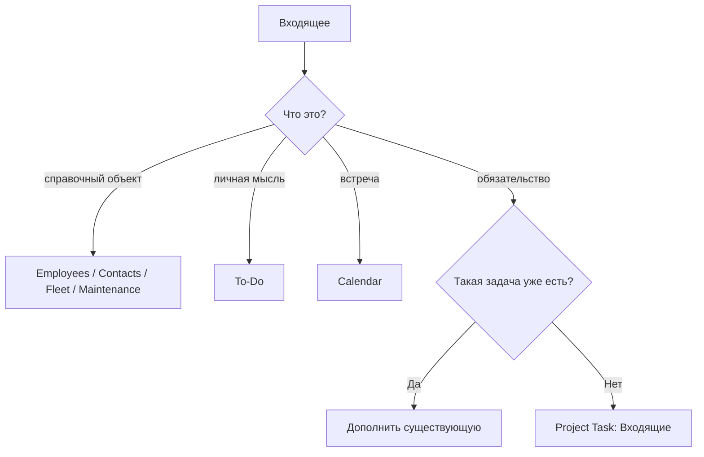

# Рабочие сценарии

[Главная](../README.md) · [00 Возможности Odoo](00-odoo19-community.md) · [01 Модель](01-methodology.md) · **02 Сценарии** · [03 Контроль и аналитика](03-control.md) · [04 Шаблоны](04-templates.md) · [05 Процессы](05-processes.md) · [06 Настройка](06-workspace.md)

---

Сценарии используют только штатные сущности Odoo 19 Community и отдельно отмечают места, где click-only модели недостаточно.

## PS-01. Разобрать входящее

Сначала определить **что это за объект**, а не сразу создавать задачу.

1. Сотрудник → Employees.
2. Внешний человек/организация → Contacts.
3. ТС → Fleet.
4. Оборудование/ремонт → Maintenance.
5. Встреча → Calendar.
6. Личная мысль → To-Do.
7. Самостоятельный контролируемый результат → Project Task.

Если Task нужна:

1. проверить, нет ли задачи на тот же результат;
2. создать в `Входящие`;
3. определить результат, Deadline, `Вид работы` и при необходимости `Процесс`;
4. готовую работу перевести в `Очередь`;
5. если выполнение начинается сразу — назначить одного владельца результата и перевести в `В работе`.



## PS-02. Взять задачу из общей очереди

Общая очередь — неназначенные открытые задачи Stage `Очередь`.

При взятии:

1. назначить себя Assignee;
2. проверить понятность результата и Deadline;
3. перевести в `В работе` только при фактическом старте;
4. если начать нельзя из-за неясного входящего — вернуть на разбор, а не прятать неопределённость в `Ожидание внешнего`.

## PS-03. Назначить работу заранее

Старший может назначить владельца до начала выполнения.

Пока работа не начата:

```text
Stage = Очередь
Assignee = назначенный пользователь
```

При фактическом старте:

```text
Stage = В работе
```

Назначение не равно началу работы.

## PS-04. Ждём внешний ответ или документ

1. Выполнить доступное действие: отправить запрос/письмо/документ.
2. Перевести задачу в `Ожидание внешнего`.
3. Оставить владельца результата.
4. Запланировать Activity на следующую дату контроля.
5. Deadline конечного результата не заменять датой напоминания.

После ответа:

- нужна обработка → `В работе`;
- ответ неполный → новое действие + новая Activity;
- результат достигнут → `Done`.

## PS-05. Ждём другую задачу Odoo

Если работу действительно нельзя продолжить до результата другой задачи:

1. открыть зависимую Task;
2. заполнить `Blocked by`;
3. не переводить вручную в `Ожидание внешнего`;
4. Odoo вычислит `Waiting`.

`Waiting` здесь — результат dependency, а не обычный шестой ручной статус.

Если задачи просто связаны тематически, `Blocked by` не использовать.

## PS-06. Создать контролируемый запрос

Использовать `Вид работы = Запрос`, если отдельно контролируется получение результата.

1. Создать обычную Task.
2. Указать, что требуется получить.
3. Поставить конечный Deadline.
4. Отправить запрос.
5. Stage → `Ожидание внешнего`.
6. Создать Activity на follow-up.
7. После получения проверить результат.
8. При достижении результата → `Done`.

Повторные напоминания остаются в той же задаче.

## PS-07. Срок под угрозой

1. Зафиксировать риск до факта просрочки.
2. Если исходный Deadline ошибочен — исправить его с пояснением.
3. Если внешний срок официально изменился — обновить Deadline и зафиксировать основание.
4. Если нужен ресурс/решение — эскалировать.
5. Если основания для переноса нет — Deadline не менять.

Не двигать срок только ради чистого отчёта.

## PS-08. Критичная работа прерывает обычную

Если `Urgent` требует немедленного переключения:

- старая работа реально остановлена → вернуть в `Очередь`;
- её продолжает другой человек → сменить Assignee, оставить `В работе`;
- она стала зависеть от внутренней задачи → `Blocked by`;
- она ждёт внешнего → `Ожидание внешнего` + Activity.

Не оставлять десятки карточек в `В работе` только потому, что они назначены.

## PS-09. Передать работу

| Ситуация | Действие |
|---|---|
| новый владелец продолжает сразу | сменить Assignee, оставить `В работе` |
| продолжение будет позже | сменить Assignee при необходимости, `Очередь` |
| ждём внешнее | `Ожидание внешнего` + Activity |
| ждём внутреннюю задачу | `Blocked by` |
| результат уже достигнут | `Done`, передача не нужна |

Chatter использовать только для контекста, который нельзя понять из полей и истории.

## PS-10. Регулярная работа

Для одного повторяемого результата:

1. создать первый экземпляр Task;
2. настроить Recurring Task;
3. выполнить текущий экземпляр;
4. закрыть `Done`/`Canceled` по факту;
5. убедиться, что Odoo создал следующую occurrence.

Не создавать параллельно ручную цепочку будущих карточек.

Activities, Chatter, Timesheets, Milestones и Subtasks не считать автоматически копируемым шаблоном recurrence.

## PS-11. Повторяется целый проект

Если повторяется не одна задача, а структура:

- несколько Tasks;
- Subtasks;
- Roles;
- Dependencies;
- Milestones;

использовать Project Template + Project Roles.

Не заменять такой кейс одной гигантской recurring task.

## PS-12. Работа имеет независимые части

Создать Subtask, если часть:

- имеет отдельный результат;
- отдельного владельца;
- отдельный Deadline;
- может самостоятельно блокироваться или зависнуть.

Простой список действий одного человека оставить в описании/Activities.

## PS-13. Нужна проверка результата

Если независимая проверка действительно является устойчивой частью процесса:

1. использовать Stage `На проверке`;
2. назначить проверяющему Activity;
3. при необходимости использовать `Approved` / `Changes Requested`;
4. после принятия результата → `Done`.

Если проверка эпизодическая — отдельный общий Stage не нужен.

## PS-14. Ошибка после Done

Если первоначальный результат оказался неправильным:

1. открыть ту же задачу;
2. вернуть в рабочий Stage;
3. зафиксировать, что было неверно;
4. исправить;
5. снова `Done`.

## PS-15. Новый объём после Done

Если исходный результат был корректным, но позже возникло новое требование:

1. старую Task не переоткрывать;
2. создать новую;
3. при необходимости связать контекст через Chatter/ссылку.

## PS-16. Дубликат

1. Выбрать основную Task.
2. Перенести уникальный контекст при необходимости.
3. Дубликат закрыть `Canceled` с коротким указанием основной задачи.

Не вести две активные карточки на один результат.

## PS-17. Работа больше не нужна

1. Зафиксировать основание, если оно не очевидно.
2. State → `Canceled`.

Не создавать отдельный Stage `Отменено`.

## PS-18. Идея улучшения стала обязательством

До решения `делаем`:

- To-Do;
- Discuss;
- заметка/обсуждение.

После решения:

1. Convert to Task либо создать Task;
2. `Вид работы = Улучшение`;
3. указать конкретный результат и Deadline;
4. вести как обычную работу.

## PS-19. Получили сведения о ТС

Если пришли сведения, которые меняют карточку транспортного средства:

1. найти/создать Vehicle во Fleet;
2. обновить master data во Fleet;
3. не создавать Task только ради хранения новых сведений.

Task нужна только если возникло отдельное обязательство, например:

```text
Проверить расхождение по ТС X
Исправить данные по ТС X
Получить подтверждение по ТС X
```

Если массовая аналитика Tasks по Vehicle обязательна, зафиксировать click-only gap, а не заводить тысячи значений Property.

## PS-20. Получили сведения о сотруднике

Если это изменение справочной информации:

- обновить Employee;
- не создавать Task только ради изменения карточки.

Если требуется отдельный результат:

```text
Получить документ по сотруднику
Исправить ошибку в системе
Провести проверку
```

создать Task.

Не назначать сотрудника Assignee только ради того, чтобы сослаться на него как на объект.

## PS-21. Пришёл запрос на обслуживание оборудования

Если кейс полностью описывается штатной Maintenance Request:

1. выбрать Equipment;
2. указать Corrective/Preventive;
3. Team / Responsible;
4. Scheduled Date / Duration;
5. вести через Maintenance stages.

Не дублировать его Project Task.

Project Task нужна только для отдельного управленческого результата поверх обслуживания.

## PS-22. Сообщение в Discuss породило работу

1. Обсудить вопрос в канале.
2. Если появился самостоятельный обязательный результат — создать/обновить Project Task.
3. Перенести в Task только необходимый контекст.
4. Дальше контроль идёт по Task, а не по непрочитанным сообщениям канала.

## PS-23. Личная To-Do стала работой отдела

1. Открыть To-Do.
2. `Convert to Task`.
3. Выбрать операционный Project.
4. Указать Assignee/Tags при необходимости.
5. Довести Task до нормального состояния `Входящие`/`Очередь`.

Не оставлять общий обязательный результат только в private task.

## PS-24. Входящее создано email alias

После автоматического появления Task:

1. она рассматривается как `Входящие`;
2. проверить дубль;
3. проверить, является ли письмо обязательством;
4. сформулировать результат;
5. поставить Deadline;
6. только потом отправить в `Очередь`/`В работе`.

Автоматическое письмо не отменяет триаж.

## PS-25. Входящее создано Website Form

Использовать тот же triage, что для email:

1. проверить содержимое;
2. исключить дубль/мусор;
3. определить результат;
4. нормализовать классификацию;
5. поставить Deadline;
6. перевести из `Входящие` дальше.

Форма — канал регистрации, а не BPM.

## PS-26. Массово загрузить справочник

1. Выбрать правильную штатную модель.
2. Подготовить CSV/XLSX.
3. Открыть List.
4. `Actions → Import records`.
5. Сопоставить поля.
6. `Test`.
7. Исправить ошибки.
8. Импортировать.

Для повторного массового обновления использовать стабильный External ID.

Не делать массовые справочники вручную через Properties.

## PS-27. Нужна новая автоматизация

Перед созданием Automation Rule проверить по порядку:

1. можно ли решить Activity Type chaining;
2. можно ли Activity Plan;
3. можно ли Recurring Task;
4. можно ли Shared View;
5. есть ли уже штатная предметная модель.

Automation Rule создаётся только если событие и действие однозначны.

## PS-28. Кажется, что нужен кастомный модуль

Зафиксировать:

```text
Что не получается штатно?
Какая сущность уже есть в Odoo?
Какой связи/поля не хватает?
Какой объём данных?
Какое управленческое решение невозможно без этого?
Как выглядит ручной обход?
```

Если проблема решается одним связанным полем, не писать новую систему задач.

Типовой подтверждённый кандидат:

```text
Task → Fleet Vehicle
```

если задачи массово анализируются по ТС.

---

[← 01 — Модель](01-methodology.md) · [03 — Контроль и аналитика →](03-control.md)
