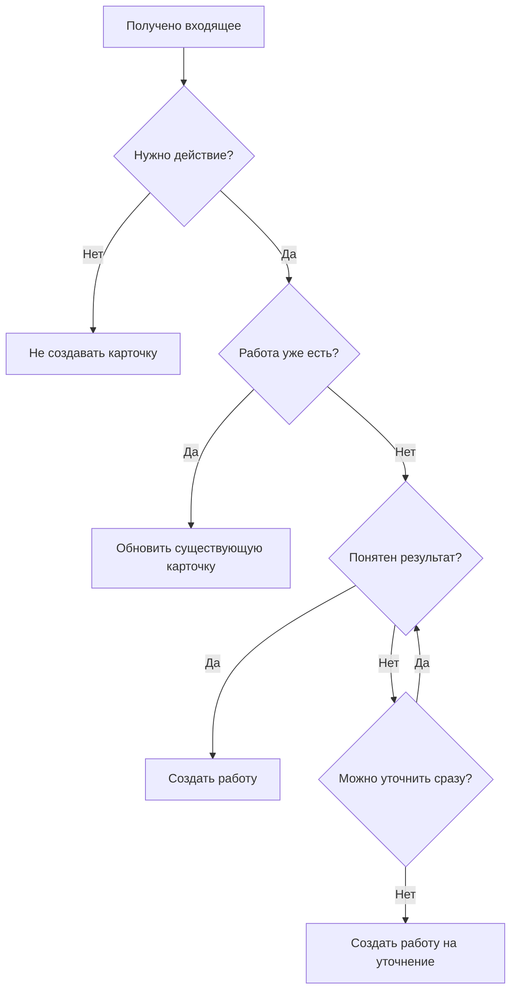
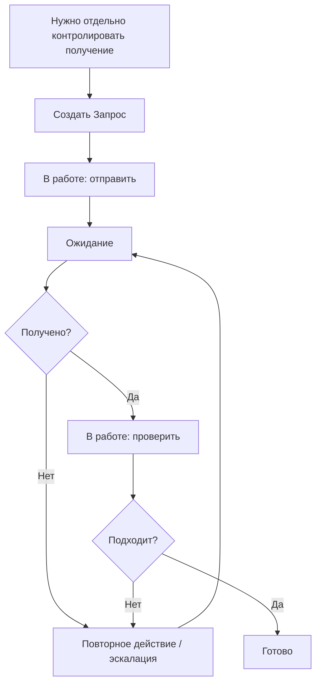

# Скрипты типовых ситуаций

[Главная](../README.md) · [01 Правила](01-methodology.md) · **02 Скрипты** · [03 Контроль](03-control.md) · [04 Шаблоны](04-templates.md) · [05 OpenProject](05-openproject.md) · [06 Процессы](06-processes.md)

---

Состояния, роли и границы применения определены в [основном регламенте](01-methodology.md).

## PS-01. Разбор входящего

Входящие до контрольного времени должны получить судьбу до передачи рабочего периода. Остальные явно передаются следующему дежурному.

**Итог:** обязательное действие зарегистрировано или сознательно признано не требующим работы.

## PS-02. Создание работы

Автор указывает:

- название результата;
- тип;
- категорию;
- исполнителя или групповую очередь;
- срок;
- приоритет;
- описание и материалы — при необходимости.

Начальный статус — `Очередь`.

Если внешнего срока нет, используется внутренний срок процесса.

**Итог:** карточка имеет понятный результат, владельца/очередь, срок и место в процессе.

## PS-03. Взятие из очереди

Порядок:

1. критичные — ближайший срок → более старая;
2. обычные — ближайший срок → более старая.

Из групповой очереди исполнитель:

1. назначает себя;
2. переводит карточку в `В работе`;
3. начинает выполнение.

**Итог:** `В работе` означает реальное выполнение конкретным человеком.

## PS-04. Корректировка параметров

1. Исполнитель сообщает старшему, что нужно изменить и почему.
2. Старший определяет: исправление факта или управленческое решение.
3. Факт — старший исправляет параметр.
4. Решение — передаёт руководителю.
5. Основание остаётся в истории карточки.

Новый результат под видом корректировки не оформляется.

**Итог:** карточка отражает актуальные условия без подмены исходной работы.

## PS-05. Обычное выполнение

Промежуточные письма, файлы, звонки и технические действия остаются в одной карточке.

Результат достигнут → `Готово`.

Проверка старшим перед обычным закрытием не нужна.

**Итог:** карточка закрыта только по конечному результату.

## PS-06. Внешняя блокировка

1. Выполнить действие для снятия блокировки.
2. `В работе → Ожидание`.
3. Оставить исполнителя.
4. Коротко записать, что ждём и что сделано.
5. Срок не переносить автоматически.

После снятия причины:

- продолжаем сразу → `В работе`;
- продолжим позже → `Очередь`.

**Итог:** внешняя блокировка видна, владелец и исходный срок сохранены.

## PS-07. Запрос документа или материала

Создавать отдельный `Запрос` только по критериям раздела 13 [основного регламента](01-methodology.md).

Обязательно:

- что получить;
- срок получения;
- после отправки — конкретный владелец.

Повторное письмо остаётся в той же карточке.

**Итог:** запрос закрыт только после получения и проверки результата.

## PS-08. Новая информация или версия файла

1. Найти существующую карточку.
2. Добавить существенную информацию.
3. Отметить актуальную версию материала.
4. Нужно изменить параметр → PS-04.
5. Появился новый результат → новая карточка.

**Итог:** по одному результату остаётся одна актуальная рабочая история.

## PS-09. Регламентная работа

Каждый период — отдельная карточка.

Ответственный за направление:

- задаёт горизонт будущих карточек;
- следит за наличием следующего периода.

Если период пропущен — создать карточку, проверить соседние периоды, устранить причину пропуска.

**Итог:** следующий обязательный период существует в системе заранее.

## PS-10. Критичная работа прерывает обычную

Если исполнитель переключается:

- прежняя работа остановлена → `Очередь`;
- её продолжает другой человек → старший меняет исполнителя, статус остаётся `В работе`;
- появилась внешняя блокировка → `Ожидание`.

Не держать несколько карточек `В работе`, если реально выполняется одна.

**Итог:** статусы обеих работ соответствуют факту.

## PS-11. Передача работы

Перед окончанием рабочего периода:

- продолжает следующий исполнитель сразу → старший меняет исполнителя, `В работе`;
- продолжат позже → `Очередь`;
- есть внешняя блокировка → `Ожидание`;
- результат готов → `Готово`.

Комментарий нужен только для контекста, которого нет в карточке.

**Итог:** активная работа не остаётся за отсутствующим исполнителем.

## PS-12. Срок под угрозой

1. Исполнитель сообщает старшему.
2. Ошибка исходной даты или подтверждённое внешнее изменение → старший исправляет срок.
3. Нужно самим изменить обязательство или ресурс → руководитель.
4. Оснований нет → срок остаётся прежним, работа становится просроченной.

`Не успеваем` — не основание для переноса.

**Итог:** риск виден, а срок не переписан без основания.

## PS-13. Ошибка после закрытия

Ошибка исходного результата → `Готово → В работе`.

- исполнитель обнаружил сам — возвращает и исправляет;
- ошибка найдена при контроле — возвращает старший или руководитель.

После исправления карточка закрывается обычным порядком.

**Итог:** ошибка исправлена в исходной истории работы.

## PS-14. Новый объём после закрытия

Исходный результат был правильным, но появилось новое требование:

1. старую карточку не переоткрывать;
2. создать новую;
3. при необходимости связать их.

**Итог:** новая работа не искажает срок и историю старой.

## PS-15. Дубликат

1. Выбрать основную карточку.
2. Перенести уникальную информацию.
3. Связать дубликат с основной.
4. Дубликат отменить.
5. Историю не удалять.

**Итог:** один результат контролируется одной основной карточкой.

## PS-16. Отмена

Если есть подтверждение, что результат больше не нужен — старший фиксирует `Отменено` и основание.

Если отмена является новым решением — решает руководитель.

Для `Запроса` отмена допустима только если получение результата больше не требуется.

**Итог:** причина прекращения обязательства остаётся в истории.

## PS-17. Составная работа и проект

Одна карточка — пока результат один.

Дочерняя карточка нужна, если часть имеет отдельного исполнителя, срок или самостоятельный результат.

Отдельный проект — если есть несколько результатов, участников, этапов и зависимостей и нужен отдельный контур управления.

Родительская карточка закрывается только после собственного итогового результата.

**Итог:** масштаб работы соответствует реальной управляемой структуре.

## PS-18. Контроль качества

Два режима:

- обычная выборка завершённых работ;
- риск-контроль критичных и необычных случаев.

Не считать риск-выборку общей долей ошибок.

Ошибка результата → PS-13.

**Итог:** найденные ошибки исправлены, а целевая проверка не выдана за общую статистику качества.

## PS-19. Идея становится работой

После решения `делаем`:

1. создать обязательную работу;
2. выбрать масштаб: одна карточка / иерархия / проект;
3. связать с идеей;
4. после реализации проверить эффект.

**Итог:** идея стала конкретным обязательством с владельцем и сроком.

## Если ситуации нет в скриптах

1. Определить конечный обязательный результат.
2. Проверить, есть ли уже карточка на этот результат.
3. Применить базовые правила из `01-methodology.md`.
4. Если остаётся неоднозначность правила процесса — обратиться к ответственному за направление.
5. Если нужно выбрать между обязательствами, сроками или ресурсами — решение принимает руководитель.

Не создавать новый статус, тип, поле или локальное исключение только для единичного случая.

---

[← 01 — Правила](01-methodology.md) · [Главная](../README.md) · [03 — Контроль →](03-control.md)
