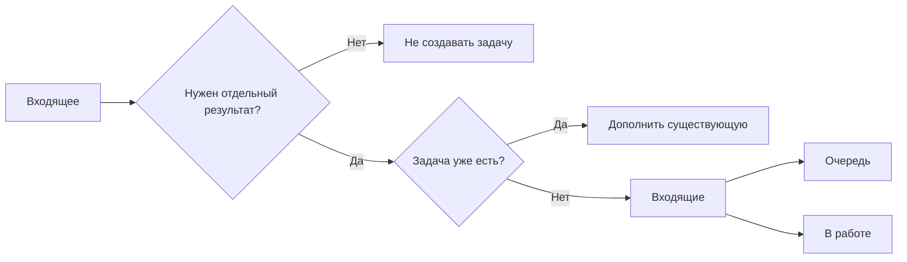
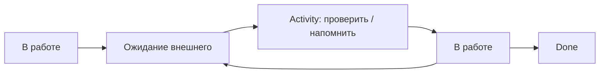

# Рабочие сценарии

[Главная](../README.md) · [00 Возможности Odoo](00-odoo19-community.md) · [01 Модель](01-methodology.md) · **02 Сценарии** · [03 Контроль и аналитика](03-control.md) · [04 Шаблоны](04-templates.md) · [05 Процессы](05-processes.md) · [06 Настройка](06-workspace.md)

---

Сценарии используют только штатные сущности Odoo 19 Community, описанные в [модели управления](01-methodology.md).

## PS-01. Разобрать входящее

1. Если отдельного контролируемого результата нет — задачу не создавать.
2. Если задача на тот же результат уже существует — добавить информацию в неё.
3. Если результат нужно контролировать отдельно — создать задачу в `Входящие`.
4. При разборе определить результат, Deadline, `Вид работы` и при необходимости `Процесс`.
5. Если работа готова к выполнению — перевести в `Очередь`.
6. Если выполнение начинается сразу — назначить одного ответственного и перевести в `В работе`.

## PS-02. Взять задачу из общей очереди

Общая очередь — неназначенные открытые задачи.

При взятии:

1. назначить себя ответственным;
2. перевести задачу в `В работе`;
3. проверить Deadline и описание результата;
4. если без уточнения начать нельзя — получить уточнение либо вернуть задачу старшему для разбора, а не маскировать неопределённость этапом ожидания.

Не использовать нескольких исполнителей просто для обозначения участников.

## PS-03. Назначить работу заранее

Старший может назначить ответственного до начала выполнения.

Пока работа не началась, задача остаётся в `Очередь`.

Когда фактическое выполнение началось — `В работе`.

Назначение пользователя само по себе не означает, что задача выполняется сейчас.

## PS-04. Ждём внешний ответ или документ

1. Выполнить доступное действие: отправить запрос, письмо, документ или обращение.
2. Перевести задачу в `Ожидание внешнего`.
3. Оставить текущего ответственного.
4. Запланировать Activity на дату следующего контроля.
5. Deadline конечного результата не заменять датой напоминания.

После события:

- ответ получен и требуется обработка → `В работе`;
- ответ неполный → выполнить следующее действие и снова `Ожидание внешнего` с новой Activity;
- результат достигнут → `Done`.

## PS-05. Ждём другую задачу Odoo

Если продолжение действительно невозможно до результата другой задачи:

1. открыть зависимую задачу;
2. добавить блокирующую задачу в `Blocked by`;
3. не создавать отдельный ручной статус ожидания;
4. не переносить Deadline автоматически.

Odoo сам устанавливает системный `Waiting`.

Когда блокирующая задача завершена допустимым статусом, зависимая снова становится доступной для продолжения.

Если задачи просто тематически связаны, но одна не блокирует другую, зависимость `Blocked by` не нужна.

## PS-06. Создать отдельно контролируемый запрос

Использовать `Вид работы = Запрос`, если отдельно нужно контролировать получение конкретного результата.

1. Создать обычную задачу.
2. Указать, что именно нужно получить и Deadline получения.
3. Подготовить и отправить запрос в `В работе`.
4. После отправки → `Ожидание внешнего` + Activity.
5. После получения → `В работе`, проверить результат.
6. Если результат подходит → `Done`.

Повторные напоминания остаются в той же задаче.

Небольшое уточнение внутри другой работы отдельным `Запросом` не становится.

## PS-07. Срок под угрозой

1. Исполнитель сообщает старшему о риске.
2. Если исходный Deadline ошибочен — исправить его с пояснением в Chatter.
3. Если подтверждённо изменился внешний срок — обновить его и зафиксировать основание.
4. Если требуется управленческое решение по ресурсу, объёму или сроку — эскалировать руководителю.
5. Если основания для изменения нет — Deadline остаётся прежним и задача становится просроченной.

Не переносить срок только для того, чтобы очистить список просроченных.

## PS-08. Критичная работа прерывает обычную

Если новая `Urgent`-задача требует немедленного переключения:

- прежняя работа реально остановлена → вернуть её в `Очередь`;
- её сразу продолжает другой человек → сменить ответственного, оставить `В работе`;
- она стала зависеть от другой задачи → оформить `Blocked by`;
- она ждёт внешнего события → `Ожидание внешнего` + Activity.

Не держать в `В работе` десятки задач только потому, что они назначены одному сотруднику.

## PS-09. Передать работу другому исполнителю

Перед передачей привести задачу к фактическому состоянию.

| Ситуация | Действие |
|---|---|
| следующий человек продолжает сразу | сменить ответственного, оставить `В работе` |
| продолжение будет позже | сменить ответственного при необходимости, перевести в `Очередь` |
| ждём внешнее событие | `Ожидание внешнего`, ответственный сохраняется/меняется по факту, Activity |
| блокирует другая задача | оформить `Blocked by` |
| результат уже достигнут | `Done`, передавать задачу не нужно |

Комментарий нужен только для контекста, которого нельзя понять из самой карточки и истории.

## PS-10. Регулярная работа

1. Создать первый экземпляр задачи.
2. Настроить штатную рекуррентность.
3. Выполнять текущий экземпляр как обычную задачу.
4. Закрыть его `Done` только после достижения результата.
5. Odoo создаст следующую задачу автоматически.

Если очередной экземпляр не появился:

- проверить, действительно ли предыдущий закрыт;
- проверить настройки рекуррентности;
- не создавать параллельную ручную цепочку, пока причина не понятна.

Важно: Activities, Chatter, Timesheets, Milestones и Subtasks штатной рекуррентностью не копируются. Не проектировать периодический процесс так, будто они гарантированно перейдут в следующий экземпляр.

## PS-11. Работа имеет независимые части

Создать подзадачу, если часть:

- имеет отдельного ответственного;
- имеет отдельный Deadline;
- может отдельно блокироваться;
- имеет самостоятельный результат.

Не создавать подзадачи на действия вроде «открыть файл», «проверить почту», «позвонить», если это не отдельный контролируемый результат.

Для простого следующего действия лучше Activity.

## PS-12. Нужна проверка результата

Если проверка — постоянная часть конкретного процесса:

1. использовать этап `На проверке`;
2. назначить Activity проверяющему;
3. при необходимости использовать `Approved` или `Changes Requested`;
4. после принятия результата закрыть `Done`.

Если проверяются только отдельные рискованные случаи, не создавать общий обязательный этап. Назначить проверяющему Activity в конкретной задаче.

## PS-13. Ошибка обнаружена после Done

Если исходный результат выполнен неправильно:

1. открыть ту же задачу снова;
2. вернуть её в подходящий рабочий этап;
3. зафиксировать, что оказалось неверно;
4. исправить результат;
5. повторно закрыть `Done`.

Не создавать новую задачу только для сокрытия ошибки предыдущего результата.

## PS-14. После Done появился новый объём

Если исходный результат был корректным, а новое требование возникло позже:

1. старую задачу не переоткрывать;
2. создать новую задачу;
3. при необходимости сослаться на предыдущую в описании или Chatter.

История старой задачи должна показывать реальное завершение исходного обязательства.

## PS-15. Дубликат

1. Выбрать основную задачу.
2. Перенести в неё только уникальную информацию, если это необходимо.
3. В дубликате оставить ссылку/пояснение на основную задачу.
4. Закрыть дубликат `Canceled`.

Не вести две активные карточки на один и тот же результат.

## PS-16. Работа больше не нужна

Если подтверждено, что результат больше не требуется:

1. зафиксировать основание в Chatter;
2. установить `Canceled`.

Не использовать отдельный этап `Отменено`: системный статус уже решает эту задачу и закрывает карточку.

## PS-17. Идея улучшения стала обязательством

До решения `делать` идея не попадает в основную обязательную очередь.

После решения:

1. создать задачу;
2. `Вид работы = Улучшение`;
3. определить конкретное изменение как результат;
4. назначить ответственного и Deadline;
5. после внедрения проверить эффект;
6. закрыть `Done` только после результата, а не после обсуждения.

## PS-18. Нужно понять, создавать ли отдельный проект

Создать новый проект, только если нужен самостоятельный контур:

- отдельные участники или видимость;
- собственные этапы/свойства;
- несколько взаимосвязанных задач и вех;
- собственный период жизни и итог проекта.

Если отличается лишь `Процесс`, вид работы или исполнитель — оставить задачи в основном проекте и использовать свойства/фильтры.

## Если ситуации нет в сценариях

1. Сформулировать конечный результат.
2. Проверить, существует ли уже задача на этот результат.
3. Определить: задача, Activity, подзадача, зависимость или отдельный проект.
4. Не создавать новую сущность Odoo, если штатная уже решает задачу.
5. Если остаётся конфликт срока, ресурса или приоритета — это управленческое решение, а не новый статус.

---

[← 01 — Модель управления](01-methodology.md) · [03 — Контроль и аналитика →](03-control.md)
