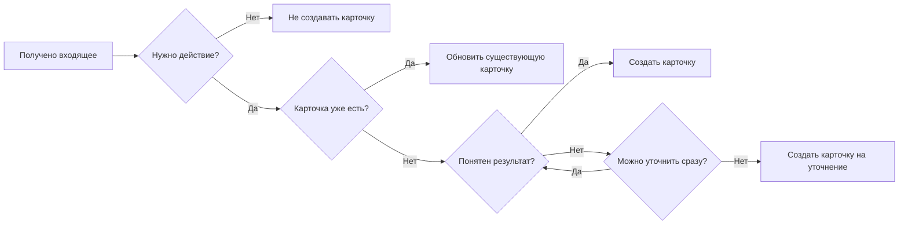
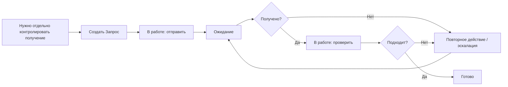

# Рабочие сценарии

[Главная](../README.md) · [01 Модель](01-methodology.md) · **02 Сценарии** · [03 Контроль и улучшение](03-control.md) · [04 Шаблоны](04-templates.md) · [05 Процессы](05-processes.md) · [06 Контур](06-workspace.md)

---

Состояния, роли и границы применения определены в [модели управления](01-methodology.md).

## Карта сценариев

| Блок | Сценарии |
|---|---|
| Появление и корректировка | PS-01–PS-02 |
| Зависимости и запросы | PS-03–PS-04 |
| Периодика, приоритет и передача | PS-05–PS-07 |
| Срок, ошибка и новый объём | PS-08–PS-10 |
| Дубликат, отмена и составная работа | PS-11–PS-13 |

## PS-01. Разбор входящего

Если для входящих установлено контрольное время, поступившие до него разбираются до передачи рабочего периода. Неразобранное входящее явно передаётся следующему ответственному за разбор.

## PS-02. Корректировка параметров

1. Очевидная фактическая ошибка — исправить параметр и оставить основание в истории.
2. Подтверждённое внешнее изменение — обновить параметр и сохранить основание.
3. Назначение и передача — по правилам очереди и передачи.
4. Изменение результата, приоритета или срока без фактического основания — решение руководителя.

Новый результат под видом корректировки не оформляется.

## PS-03. Блокирующая зависимость

1. Выполнить доступное действие для снятия блокировки.
2. Если продолжать нельзя → `В работе → Ожидание`.
3. Оставить исполнителя.
4. Записать, что блокирует продолжение и что уже сделано.
5. Если блокирует другая карточка — связать карточки.
6. Срок не переносить автоматически.

После снятия причины:

- продолжаем сразу → `В работе`;
- продолжим позже → `Очередь`.

Внутренняя загрузка исполнителя = `Очередь`, а не `Ожидание`.

## PS-04. Запрос документа или материала

Создавать отдельный `Запрос` только по критериям раздела 13 [модели управления](01-methodology.md#13-запрос-документа-или-материала).

Обязательно:

- что получить;
- срок получения;
- после отправки — конкретный исполнитель.

Повторное письмо остаётся в той же карточке.

## PS-05. Периодическая работа

Каждый период — отдельная карточка типа `Работа`.

Горизонт будущих карточек задаётся локальным правилом. Старший следит за наличием следующего периода.

Если период пропущен — создать карточку, проверить соседние периоды, устранить причину пропуска.

## PS-06. Критичная работа прерывает обычную

Если исполнитель переключается:

- прежняя работа остановлена → `Очередь`;
- её продолжает другой человек → назначить следующего исполнителя, статус остаётся `В работе`;
- появилась блокирующая зависимость → `Ожидание`.

Не держать несколько карточек `В работе`, если реально выполняется одна.

## PS-07. Передача работы

Перед окончанием рабочего периода:

- продолжает следующий исполнитель сразу → назначить его, `В работе`;
- продолжат позже → `Очередь`;
- есть блокирующая зависимость → `Ожидание`;
- результат готов → `Готово`.

Комментарий нужен только для контекста, которого нет в карточке.

## PS-08. Срок под угрозой

1. Исполнитель сообщает старшему о риске срока.
2. Ошибка исходной даты или подтверждённое внешнее изменение → исправить срок и сохранить основание.
3. Нужно изменить обязательство, ресурс или срок без фактического основания → решение руководителя.
4. Оснований нет → срок остаётся прежним, работа становится просроченной.

`Не успеваем` — не основание для переноса.

## PS-09. Ошибка после закрытия

Ошибка исходного результата → `Готово → В работе`.

- исполнитель обнаружил сам — возвращает и исправляет;
- ошибка найдена при контроле — возвращает старший или руководитель.

После исправления карточка закрывается обычным порядком.

## PS-10. Новый объём после закрытия

Исходный результат был правильным, но появилось новое требование:

1. старую карточку не переоткрывать;
2. создать новую;
3. при необходимости связать их.

## PS-11. Дубликат

1. Выбрать основную карточку.
2. Перенести уникальную информацию.
3. Связать дубликат с основной.
4. Дубликат отменить.
5. Историю не удалять.

## PS-12. Отмена

Если есть подтверждение, что результат больше не нужен — старший фиксирует `Отменено` и основание.

Если отмена является новым решением — решает руководитель.

Для `Запроса` отмена допустима только если получение результата больше не требуется.

## PS-13. Составная работа и проект

Одна карточка — пока результат один.

Дочерняя карточка нужна, если часть имеет отдельного исполнителя, срок или самостоятельный результат.

Отдельный проект — если есть несколько результатов, участников, этапов и зависимостей и нужен отдельный контур управления.

Родительская карточка закрывается только после собственного итогового результата.

## Если ситуации нет в сценариях

1. Определить конечный обязательный результат.
2. Проверить, есть ли уже карточка на этот результат.
3. Применить [модель управления](01-methodology.md).
4. Если остаётся неоднозначность правила процесса — обратиться к старшему; изменение правила решает руководитель.
5. Если нужно выбрать между обязательствами, сроками или ресурсами — решение принимает руководитель.

---

[← 01 — Модель управления](01-methodology.md) · [Главная](../README.md) · [03 — Контроль и улучшение →](03-control.md)
