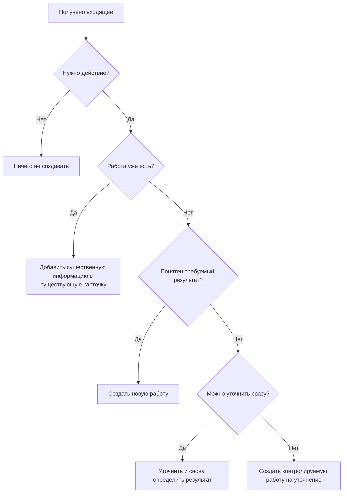
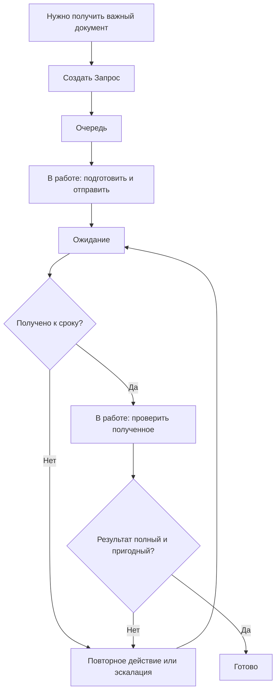

# Скрипты типовых ситуаций

Этот документ отвечает на один вопрос: **что делать в конкретной ситуации**.

Смысл состояний и ролей задаётся в [правилах управления работой](01-methodology.md) и здесь не переопределяется.

---

## PS-01. Разбор входящего

**Триггер:** пришло письмо, документ, сообщение или другое основание.

До передачи рабочего периода входящие до принятого контрольного времени должны получить определённую судьбу. Более поздние явно переходят следующему дежурному.

---

## PS-02. Создание обычной работы

**Триггер:** появился новый самостоятельно контролируемый результат.

Автор карточки задаёт:

- понятное название результата;
- тип;
- категорию процесса;
- исполнителя или групповую очередь;
- срок;
- критичность только при реальном основании;
- описание и материалы только по необходимости.

Начальный статус — `Очередь`.

После сохранения параметры считаются исходной постановкой.

---

## PS-03. Взятие работы из очереди

**Триггер:** исполнитель может начать следующую работу.

Порядок выбора:

1. критичные;
2. ближайший срок;
3. при одинаковом сроке — более старая;
4. остальные.

Если карточка уже назначена исполнителю, он переводит её `Очередь → В работе` только после фактического начала.

Если карточка находится в контролируемой групповой очереди, исполнитель при фактическом взятии:

1. назначает себя исполнителем;
2. переводит `Очередь → В работе`;
3. начинает выполнение.

Такое самоназначение из групповой очереди не считается корректировкой через старшего.

---

## PS-04. Корректировка параметров после регистрации

**Триггер:** после создания выяснилось, что срок, категория, исполнитель, приоритет, название или описание указаны неверно либо условия реально изменились.

1. Исполнитель не переписывает исходную постановку по своему усмотрению.
2. Сообщает старшему, что именно нужно изменить и почему.
3. Старший определяет характер изменения:
   - **исправляем факт** — корректирует параметр;
   - **меняем решение** — передаёт вопрос руководителю.
4. Причина существенной корректировки остаётся понятной из истории карточки.
5. Состояние работы меняется только если изменилось фактическое состояние, а не из-за самой корректировки.

Корректировка может уточнить исходный результат, но не заменить его новым. Новый самостоятельно контролируемый результат оформляется отдельной карточкой.

---

## PS-05. Обычное выполнение

Промежуточные письма, звонки, файлы и технические действия остаются внутри одной карточки, пока ведут к одному результату.

Если работа фактически выполняется — `В работе`.

Когда конечный результат достигнут — `В работе → Готово`.

Обязательного подтверждения старшим перед закрытием нет.

---

## PS-06. Внешняя блокировка

**Триггер:** продолжать сейчас невозможно из-за внешней причины.

1. Выполнить действие для снятия блокировки.
2. Перевести `В работе → Ожидание`.
3. Владельца не снимать.
4. Коротко зафиксировать, что ждём и что уже сделано.
5. Срок автоматически не переносить.

Когда причина снята:

- продолжаем сразу → `Ожидание → В работе`;
- продолжим позже → `Ожидание → Очередь`.

Даже если внешний ответ практически завершил результат, карточка сначала возвращается в `В работе`, результат подтверждается и только затем переводится в `Готово`.

---

## PS-07. Запрос важного документа или материала

**Триггер:** подразделению по собственной инициативе нужен важный документ, материал или подтверждение, получение которого нельзя потерять после отправки.

При создании обязательно определить:

- что именно нужно получить;
- конкретного владельца сопровождения;
- срок получения.

После отправки запрос переводится `В работе → Ожидание` и остаётся открытым.

Просрочка означает, что документ не получен вовремя. Требуется повторное действие, эскалация или новое подтверждённое условие. Простое молчаливое ожидание не применяется.

Повторное письмо не создаёт новую карточку.

Обычное уточнение внутри существующей работы отдельным `Запросом` не является.

---

## PS-08. Пришла дополнительная информация или новая версия файла

1. Найти существующую карточку.
2. Добавить только существенную информацию.
3. Если пришла новая версия материала, однозначно отметить, какая версия актуальна.
4. Если требуется исправить зафиксированный параметр — применить PS-04.
5. Если появился новый самостоятельно контролируемый результат — создать новую карточку.

---

## PS-09. Регламентная работа

Каждый период — отдельная карточка типа `Регламент`.

Название содержит результат и период.

Будущие экземпляры создаются заранее на принятый горизонт планирования.

Если очередная карточка не создана вовремя:

1. создать пропущенную работу;
2. проверить соседние будущие периоды;
3. разобрать причину, почему плановый поток не был подготовлен.

---

## PS-10. Критичная работа прерывает обычную

Если требуется немедленно переключиться:

1. критичную работу взять в `В работе`;
2. по текущей обычной работе зафиксировать факт:
   - выполнение остановлено → `В работе → Очередь`;
   - другой исполнитель продолжает → старший меняет исполнителя, статус остаётся `В работе`;
   - появилась внешняя блокировка → `В работе → Ожидание`.

Нельзя держать несколько карточек `В работе`, если фактически человек выполняет только одну.

---

## PS-11. Передача работы

Перед окончанием рабочего периода каждая карточка `В работе` приводится к факту:

- следующий исполнитель продолжает сразу → старший меняет исполнителя, статус остаётся `В работе`;
- продолжение будет позже → `Очередь`;
- мешает внешняя причина → `Ожидание`;
- результат достигнут → `Готово`.

Комментарий передачи нужен только если следующему исполнителю недостаточно самой карточки.

Запросы документов в `Ожидание` не передаются «из памяти в память»: владелец, срок и история остаются в системе.

---

## PS-12. Срок под угрозой

1. Исполнитель сообщает старшему о риске.
2. Определяется причина.
3. Если исходная дата ошибочна или внешние условия действительно изменились — старший корректирует срок по факту.
4. Если требуется самим изменить обязательство или перераспределить ресурс — решение принимает руководитель.
5. Если оснований для изменения нет, исходный срок сохраняется и при наступлении даты работа становится просроченной.

`Не успеваем` само по себе не является основанием для переноса.

---

## PS-13. Ошибка после закрытия

Если первоначальный результат оказался неверным или неполным:

- исполнитель сам обнаружил ошибку → возвращает исходную карточку `Готово → В работе` и исправляет;
- ошибку обнаружили при контроле → карточку возвращает старший или руководитель, проводивший разбор.

После исправления карточка снова закрывается обычным порядком.

Новый объём так не оформляется.

---

## PS-14. Новый объём после закрытия

Если исходный результат был выполнен правильно, но позже появилось новое требование:

1. исходную карточку не переоткрывать;
2. создать новую работу;
3. при необходимости связать её с предыдущей.

---

## PS-15. Дубликат

1. Определить основную карточку.
2. Перенести в неё уникальную полезную информацию.
3. Связать вторую как дубликат.
4. Дубликат отменить с понятной причиной.
5. Историю не удалять.

---

## PS-16. Отмена работы

Исполнитель не отменяет работу только потому, что считает её неактуальной.

Если есть явное подтверждение, что результат больше не нужен:

1. исполнитель передаёт основание старшему;
2. старший фиксирует `Отменено` и краткую причину.

Если отмена сама является новым управленческим решением, решение принимает руководитель.

Для `Запроса` отмена допустима только когда сам документ больше не нужен или потребность явно снята.

---

## PS-17. Составная работа

Одна карточка сохраняется, пока есть один общий результат и один основной владелец.

Дочерняя карточка создаётся, если часть:

- имеет отдельного исполнителя;
- имеет собственный срок;
- может отдельно зависнуть;
- имеет собственный проверяемый результат.

Технические шаги одного человека дочерними работами не становятся.

---

## PS-18. Закрытие родительской работы

Закрытые дочерние карточки не означают автоматическую готовность родительской.

Родитель закрывается только после достижения **его собственного итогового результата**.

Если отдельные части готовы, но итог ещё нужно собрать, проверить или передать — родитель остаётся открытым по фактическому состоянию.

---

## PS-19. Разовое поручение и выбор масштаба

Разовое поручение по умолчанию — одна обычная карточка.

Использовать дочерние работы, если появились независимые результаты.

Создавать отдельный проект только если одновременно присутствуют несколько признаков:

- несколько самостоятельных результатов;
- несколько участников или направлений;
- этапы;
- зависимости;
- заметная длительность;
- необходимость отдельного управленческого обзора.

---

## PS-20. Выборочный контроль качества

Есть два режима:

- **выборочная проверка** — небольшая обычная выборка завершённых работ;
- **риск-контроль** — целевая проверка критичных, необычных или подозрительных случаев.

Если обнаружена ошибка первоначального результата — применяется PS-13.

Результаты риск-контроля не используются как оценка общей доли ошибок.

Старший может участвовать в контроле, но его роль не делает проверку обязательной стадией каждой работы.

---

## PS-21. Идея становится обязательной работой

До решения о реализации идея остаётся в отдельном списке улучшений и не конкурирует со сроками обязательной работы.

После решения `делаем`:

1. зафиксировать решение по идее;
2. создать обычную работу или проект;
3. связать новую работу с исходной идеей;
4. после реализации проверить, изменился ли исходный процесс.