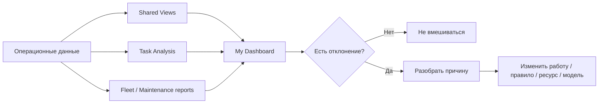

# Контроль и аналитика

[Главная](../README.md) · [00 Возможности Odoo](00-odoo19-community.md) · [01 Модель](01-methodology.md) · [02 Сценарии](02-scripts.md) · **03 Контроль и аналитика** · [04 Шаблоны](04-templates.md) · [05 Процессы](05-processes.md) · [06 Настройка](06-workspace.md)

---

Контроль строится не вокруг ручного отчёта, а вокруг **исключений в тех же данных, где ведётся работа**.

Новая модель аналитики разделяет четыре разных вопроса:

1. что требует действия прямо сейчас;
2. где копится операционный хвост;
3. где системно ломается поток;
4. что происходит с предметными справочниками: сотрудники, ТС, оборудование.

Не нужно пытаться отвечать на все четыре вопроса одним Kanban или одним дашбордом.

## 1. Четыре уровня контроля

| Уровень | Штатный инструмент | Управленческий вопрос |
|---|---|---|
| Личный | My Tasks, Activities, To-Do | что должен сделать конкретный пользователь |
| Операционный | Shared Views, List/Kanban, Rotting | что требует вмешательства сегодня |
| Периодический | Task Analysis, Pivot/Graph, My Dashboard | где меняется поток и копится хвост |
| Предметный | Fleet / Maintenance / Employees / Contacts reports и views | что происходит с объектами, а не задачами |

Spreadsheet Dashboard появляется только после того, как вопросы и показатели стабилизировались.

## 2. Общие рабочие представления должны быть централизованы

Основные очереди не должны существовать только как личные фильтры руководителя.

Использовать:

- Shared Favorites;
- Project Top Bar → `Save View` → `Shared`.

Минимальный набор общих представлений:

- `Входящие`;
- `Очередь`;
- `В работе`;
- `Просрочено`;
- `Ожидание внешнего`;
- `Внутренние блокировки`;
- `Критичные`;
- `Залежавшиеся`;
- `Просроченные активности`.

Это фактически **штатное рабочее место отдела**, собранное кликами.

## 3. `Входящие`

Условия:

- основной операционный проект;
- open tasks;
- Stage = `Входящие`.

Вопрос:

> Есть ли зарегистрированная работа, по которой ещё не принято решение?

Контроль:

- объём входящих;
- возраст входящих;
- наличие откровенных дублей;
- наличие карточек, которые вообще не должны быть задачами.

Если входящие копятся, проблема не у исполнителей, а в триаже.

## 4. `Очередь`

Условия:

- Stage = `Очередь`;
- задача открыта.

Отдельно смотреть:

### Неназначенная очередь

```text
Stage = Очередь
Assignees = empty
```

Это нормальный пул готовой работы.

### Назначенная очередь

```text
Stage = Очередь
Assignee != empty
```

Показывает работу, уже закреплённую за человеком, но ещё не активную.

Не считать сам факт неназначенности ошибкой. Ошибка — неназначенная работа, которую уже нужно было начать.

## 5. `В работе`

Условия:

- Stage = `В работе`;
- open task.

Руководитель смотрит не на «сколько задач у человека вообще», а на:

- чрезмерный активный WIP;
- просроченные активные задачи;
- критичные активные задачи;
- задачи без реального движения;
- задачи, которые фактически ждут, но ошибочно оставлены `В работе`.

Большое число активных карточек у одного человека чаще означает плохую дисциплину статусов, чем высокую производительность.

## 6. `Просрочено`

Использовать штатный Deadline filter.

Просрочка = открытая задача с Deadline в прошлом.

Разбирать минимум по:

- Stage;
- Assignee;
- `Вид работы`;
- `Процесс`;
- Priority.

Просрочка сама по себе не говорит, кто виноват. Она показывает обязательство, по которому срок уже нарушен и требуется решение.

## 7. `Ожидание внешнего`

Условия:

- Stage = `Ожидание внешнего`;
- задача открыта.

Главный контроль — **есть ли следующее действие**.

Красный сигнал:

```text
Ожидание внешнего
+ нет Activity
```

или

```text
Ожидание внешнего
+ Activity overdue
```

Такой хвост имеет высокий риск быть забытым.

## 8. Внутренние блокировки

Использовать Task Dependencies / `Blocked by` и computed Waiting.

Смотреть:

- какие open tasks находятся Waiting;
- какие задачи блокируют много последующих;
- какие блокирующие задачи сами просрочены.

Это другой тип управленческого вмешательства, чем внешний ответ.

## 9. Rotting — сигнал застоя, а не SLA

`Days to rot` показывает отсутствие смены Stage в течение заданного числа дней.

Использовать только после наблюдения нормальной длительности этапа.

Пример:

- `Входящие` обычно разбираются за день → небольшой threshold может быть полезен;
- `Ожидание внешнего` может законно длиться долго → Rotting там может давать много шума.

Не использовать один threshold на все этапы.

Не смешивать:

- Deadline — срок результата;
- Rotting — отсутствие смены этапа;
- Activity Due Date — срок следующего действия.

## 10. Просроченные Activities

Activities — отдельный слой контроля.

Они показывают не просроченный результат, а просроченное **следующее действие**.

В рабочее место руководителя полезно вынести:

- Late Activities;
- Today Activities — при необходимости;
- Activities of конкретного пользователя.

Особенно важно для задач `Ожидание внешнего`.

## 11. Приоритет

В модели Project Community существуют Low / Medium / High / Urgent.

Для контроля важно не распределение красивых звёзд, а исключения:

- Urgent open;
- Urgent overdue;
- Urgent unassigned;
- Urgent waiting.

Если почти всё становится High/Urgent, приоритет перестал быть управленческим сигналом.

## 12. Task Analysis — основной периодический отчёт по работе

Публичная модель Project содержит аналитические поля для:

- creation date;
- assignment date;
- ending date;
- Deadline;
- Stage;
- State;
- Project;
- Assignees;
- Priority;
- Tags;
- Milestone;
- working time to assign;
- working time to close;
- task count.

Поэтому без кастомного BI можно анализировать минимум:

- входящий поток;
- закрытие;
- backlog;
- структуру по Stage;
- структуру по исполнителям;
- структуру по Priority;
- время до назначения;
- время до закрытия.

Properties дополнительно могут использоваться как небольшие аналитические разрезы там, где стандартный view это поддерживает.

## 13. Минимальный набор периодических показателей

### Поток

- создано задач за период;
- закрыто задач за период;
- текущий open backlog;
- изменение backlog к прошлому периоду.

### Риски

- просрочено;
- Urgent open;
- Waiting;
- `Ожидание внешнего`;
- overdue Activities;
- Rotting.

### Распределение

- open по Stage;
- open по Assignee;
- open по `Вид работы`;
- open по `Процесс` — если это Property реально используется;
- closed по периодам.

### Время

- working time to assign;
- working time to close.

Не вводить показатель, если из штатных данных непонятно, как он рассчитывается.

## 14. Что не считать KPI сотрудника

Не использовать напрямую для рейтинга человека:

- число закрытых задач;
- число комментариев;
- количество созданных Activities;
- количество часов Timesheet без контекста;
- Customer Rating;
- число задач в работе.

Разные задачи имеют разный масштаб, сложность и внешние зависимости.

Эти данные полезны для анализа процесса, но не дают автоматической оценки эффективности человека.

## 15. Allocated Time и Timesheets

### Allocated Time

Может использоваться для грубой оценки ожидаемой трудоёмкости.

Полезен, если задача управления звучит:

> У нас слишком много ожидаемого объёма относительно доступной мощности?

Не надо требовать оценку часов у каждой мелкой задачи, если никто потом не использует эти данные.

### Timesheets

Включать, только если нужен факт:

- трудоёмкости;
- загрузки;
- стоимости;
- план/факт времени.

После включения анализировать **процесс и тип работ**, а не строить таблицу «кто больше часов списал».

## 16. My Dashboard — рекомендуемое рабочее место руководителя

После стабилизации Shared Views собрать My Dashboard из живых Odoo-представлений.

Рекомендуемый первый экран:

1. List `Просрочено`;
2. List `Неназначенная очередь`;
3. List `Ожидание внешнего с проблемой Activity`;
4. List `Urgent`;
5. Pivot открытых задач по Stage / Assignee;
6. Graph закрытия по периодам.

My Dashboard удобен тем, что данные остаются интерактивными и ведут обратно к исходным записям.

Не строить Spreadsheet Dashboard раньше этого шага.

## 17. Spreadsheet Dashboard — только для устойчивых вопросов

Когда руководитель несколько периодов подряд использует одинаковые показатели, можно вынести их в Spreadsheet Dashboard.

Кандидаты:

- created vs closed;
- backlog trend;
- overdue share;
- распределение по процессам;
- working time to close;
- open risks.

Дашборд не должен создавать новую параллельную методику расчёта. Его источник — те же Odoo records.

## 18. Fleet имеет собственную аналитику

Если отдел работает с ТС, не нужно оценивать состояние парка через Project Task counts.

Fleet штатно имеет собственные данные и отчёты, включая:

- vehicle records;
- drivers;
- services;
- costs;
- odometer;
- cost analysis;
- odometer analysis.

Вопросы вида:

> Какой пробег у ТС? Какие расходы? Какие сервисы?

решаются во Fleet.

Вопрос:

> Какая управленческая работа по ТС не закрыта?

решается в Project — но строгая аналитика Project Tasks по Fleet Vehicle требует отдельной связи, которой click-only сейчас нет.

## 19. Maintenance имеет собственный контроль

Maintenance Request уже имеет:

- equipment;
- corrective/preventive type;
- maintenance team;
- responsible;
- scheduled date;
- duration;
- priority;
- stages;
- calendar.

Поэтому ремонтный хвост должен контролироваться в Maintenance.

Project analytics не должен дублировать Maintenance analytics.

Project Task появляется только для отдельного результата поверх ремонта, например:

- провести разбор повторяющихся отказов;
- изменить инструкцию;
- согласовать замену класса оборудования.

## 20. Employees и Contacts — справочники, а не рейтинг

Employees используется для актуального состава и структуры сотрудников.

Contacts — для внешних людей и организаций.

Эти приложения дают качественные master data, но не являются самостоятельной системой оценки эффективности отдела.

Главная аналитическая задача здесь — качество справочника:

- дубль;
- неактуальная запись;
- неправильная связь;
- отсутствие нужного атрибута.

## 21. Качество данных контролируется отдельно от производительности процесса

Перед выводами из аналитики проверять:

- корректно ли закрываются задачи Done/Canceled;
- не висят ли фактически ожидающие задачи в `В работе`;
- не используется ли Deadline как напоминание;
- есть ли Activities на внешнем ожидании;
- не создаются ли дубли входящих;
- стабильны ли значения Properties;
- не заведены ли справочники одновременно в двух местах.

Плохие исходные данные дают красивый, но ложный Dashboard.

## 22. Ежедневный контроль руководителя

Не нужен длинный отчёт.

Проверяется только исключение:

1. неразобранные `Входящие`;
2. Urgent;
3. overdue tasks;
4. overdue Activities;
5. очередь, которая должна была уже стартовать;
6. Waiting на критичных зависимостях;
7. внешнее ожидание без следующего действия;
8. Rotting там, где threshold действительно настроен;
9. чрезмерный WIP.

Если исключения отсутствуют, нет причины вручную просматривать каждую задачу.

## 23. Периодический разбор процесса

Раз в выбранный управленческий период смотреть:

- входящий поток;
- закрытие;
- изменение backlog;
- структуру хвоста;
- просрочку;
- время до назначения;
- время до закрытия;
- повторяющиеся Waiting/External Waiting;
- повторяющиеся причины возвратов;
- типы работ, которые системно копятся.

После этого решение может быть не «ускорить сотрудника», а:

- изменить правило входящего;
- убрать лишний шаг;
- изменить распределение работы;
- сделать Activity chain;
- создать Recurring Task;
- ввести шаблон;
- автоматизировать устойчивое действие;
- добавить минимальную связанную модель.

## 24. Контроль проектной инициативы — отдельный режим

Для самостоятельной инициативы вместо операционного dashboard использовать:

- Milestones;
- Project Updates;
- Project Dashboard;
- Burndown;
- Task Dependencies;
- при необходимости Allocated Time / Timesheets.

Project Update нужен для вопроса:

> Проект On Track, At Risk, Off Track или On Hold?

Не использовать его как ежедневный статус всей операционной очереди отдела.

## 25. Принцип управленческой аналитики

Любой показатель включается только если можно закончить фразу:

> Если показатель X изменился, мы принимаем решение Y.

Если решения нет, показатель не нужен.



---

[← 02 — Сценарии](02-scripts.md) · [04 — Шаблоны →](04-templates.md)
