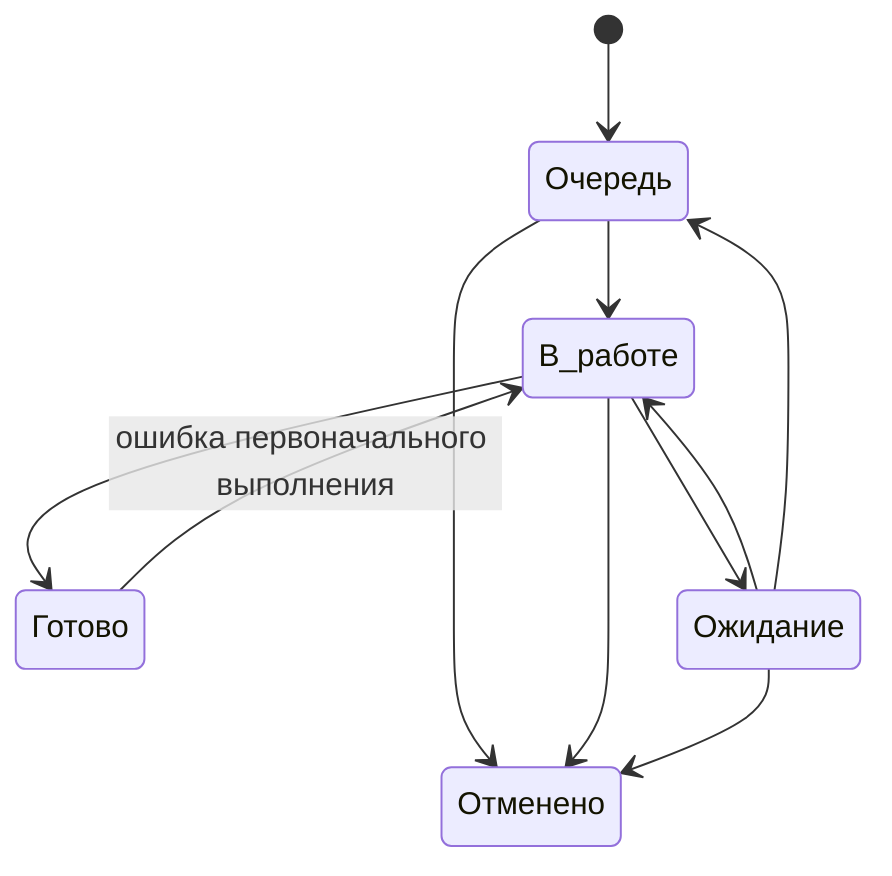

# Жизненный цикл и правила состояний

## 1. Единый lifecycle обязательной работы

## 2. Состояния

### Очередь

Используется, если работа:

- зарегистрирована;
- обязательна к выполнению;
- может быть назначена или уже назначена;
- прямо сейчас фактически не исполняется.

Не означает, что работа новая. Ранее начатая работа может вернуться в очередь.

### В работе

Используется только если исполнитель фактически выполняет работу сейчас.

Недопустимо переводить в `В работе` весь список работ, которые планируется выполнить позже.

### Ожидание

Используется только если дальнейшее выполнение заблокировано внешним условием.

Обязательные правила:

- Assignee сохраняется;
- в Activity фиксируется, что именно ожидается;
- у работы остаётся актуальный Finish date;
- работа продолжает попадать в управленческие представления.

`Ожидание` не означает передачу ответственности внешней стороне.

### Готово

Используется только при достижении Definition of Done соответствующего процесса.

Отправленный запрос, переданная информация или выполненный промежуточный шаг не являются готовностью, если остаётся обязательное действие подразделения.

### Отменено

Используется, если результат больше не требуется.

Причина отмены фиксируется коротким комментарием.

## 3. Разрешённые переходы

| Из | В | Разрешение |
|---|---|---|
| Очередь | В работе | фактическое начало |
| Очередь | Отменено | результат больше не требуется |
| В работе | Ожидание | внешняя блокировка |
| В работе | Готово | достигнут DoD |
| В работе | Отменено | результат больше не требуется |
| Ожидание | В работе | продолжение сразу после снятия блокировки |
| Ожидание | Очередь | блокировка снята, но работа не начинается сразу |
| Ожидание | Отменено | результат больше не требуется |
| Готово | В работе | обнаружена ошибка первоначального выполнения |

Любой дополнительный переход считается исключением и требует методического обоснования.

## 4. Ошибка, новый объём и продолжение переписки

### Ошибка первоначального выполнения

Если результат был закрыт ошибочно или выполнен неверно:

`Готово → В работе → Готово`

Это reopen исходной работы.

### Новый объём после корректного завершения

Если исходная работа была выполнена корректно, а позже возник новый объём или новое требование, создаётся новая Work Package и при необходимости связывается с исходной.

### Дополнительная информация до завершения

Если письмо, файл или уточнение относится к уже открытой работе, новая Work Package не создаётся. Информация добавляется в существующую.

## 5. Правило дубликатов

Если одна и та же работа зарегистрирована повторно:

1. определяется основная Work Package;
2. вторая связывается с основной как дубликат;
3. дублирующая запись закрывается или отменяется;
4. запись не удаляется.

Дубликаты учитываются как признак качества входящего процесса.

## 6. Правило удаления

Обычные рабочие записи не удаляются.

Используются:

- `Отменено` — работа потеряла актуальность;
- relation `Duplicate` — создан повтор;
- reopen — первоначальная работа была выполнена ошибочно.

Удаление допускается только для технической очистки ошибочно созданных тестовых объектов администратором.

## 7. Разбиение работы

Одна Work Package сохраняется, если:

- результат один;
- основной владелец один;
- части не требуют независимых сроков;
- части не должны независимо блокироваться или закрываться.

Работа разбивается на дочерние Work Package, если хотя бы одна часть:

- имеет отдельного исполнителя;
- имеет отдельный срок;
- может независимо перейти в ожидание;
- должна независимо контролироваться;
- имеет самостоятельный результат.

Технологические шаги сами по себе не являются основанием для дробления.

## 8. Исходящий запрос

Отдельный Type `Запрос` используется только для самостоятельного объекта контроля.

### Отдельный запрос нужен, если

- получение ответа само является результатом;
- запрос имеет собственный срок;
- сопровождение запроса выполняет отдельный сотрудник;
- запрос адресован нескольким сторонам и требует самостоятельного контроля;
- результат запроса используется несколькими работами.

### Отдельный запрос не нужен, если

- требуется один дополнительный файл для текущей работы;
- требуется уточнение по уже открытой работе;
- это обычный шаг выполнения основной Work Package.

Типовой путь самостоятельного запроса:

`Очередь → В работе → Ожидание → В работе/Готово`

## 9. Регламентная работа

Каждый период создаёт отдельную Work Package.

Нельзя использовать одну бесконечную карточку для всех месяцев, недель или циклов.

Правильно:

- `Регламентный отчёт — 2026-08`;
- `Регламентный отчёт — 2026-09`.

Неправильно:

- `Ежемесячный отчёт` с бесконечными reopen.

## 10. Поручение и проект

Разовое поручение по умолчанию оформляется одной Work Package.

Если требуется несколько независимо управляемых результатов — используется parent/child.

Отдельный Project создаётся только для настоящей проектной работы, где нужны собственные этапы, несколько результатов, зависимости и отдельный контур управления.

## 11. Backlog идей

Идеи не проходят операционный lifecycle.

Они перемещаются между backlog buckets:

`Inbox → Наблюдаем → Разобрать → Кандидат → Готово к реализации`

`Готово к реализации` не означает автоматический запуск. После управленческого решения создаётся обязательная работа или отдельный Project.

## 12. Контроль смысловой чистоты статусов

При аудите любой Work Package должен выдерживать простой тест:

- `Очередь` — никто сейчас не делает;
- `В работе` — кто-то реально делает сейчас;
- `Ожидание` — сделать сейчас невозможно;
- `Готово` — обязательных действий больше нет;
- `Отменено` — результат больше не нужен.

Если карточка не проходит этот тест, статус используется неверно.