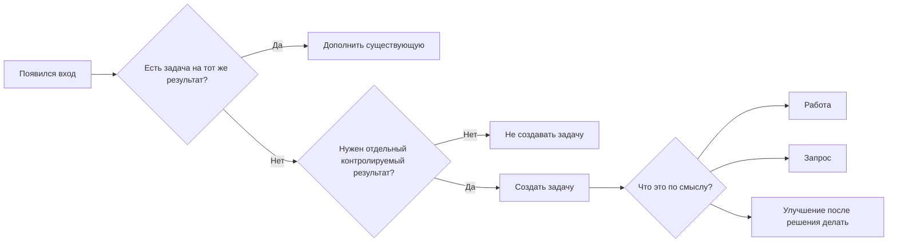

# Описание процессов

[Главная](../README.md) · [00 Возможности Odoo](00-odoo19-community.md) · [01 Модель](01-methodology.md) · [02 Сценарии](02-scripts.md) · [03 Контроль и аналитика](03-control.md) · [04 Шаблоны](04-templates.md) · **05 Процессы** · [06 Настройка](06-workspace.md)

---

Процесс описывается отдельно от рабочих задач. Odoo хранит фактическое исполнение, а этот репозиторий — устойчивое правило процесса.

Не нужно превращать каждое описание процесса в отдельный проект Odoo.

## 1. Карточка процесса

```text
Название: <процесс>
Вход: <событие / данные / документ, который запускает работу>
Результат: <что должно быть получено>
Единица учёта: <что является одной задачей Odoo>
Исполнители: <роль / рабочая группа>
Deadline: <как определяется конечный срок>
Когда нужна подзадача: <критерий самостоятельной части>
Внешнее ожидание: <типовые внешние зависимости>
Внутренние зависимости: <какие задачи могут блокировать эту работу>
Периодичность: <если процесс регулярный>
Контроль: <какие исключения и показатели используются>
```

Описание процесса должно отвечать на вопрос, **как правильно создать и вести задачу**, а не дублировать интерфейс Odoo.

## 2. Как процесс отражается в Odoo

Обычно один устойчивый процесс отражается значением свойства `Процесс` в задачах основного рабочего проекта.

Пример:

```text
Процесс = Сверка топлива
```

Это позволяет:

- фильтровать задачи процесса;
- группировать их;
- анализировать хвост и просрочки;
- не создавать отдельный проект только ради классификации.

Если список процессов небольшой и устойчивый, использовать Selection-свойство.

Если реальной аналитической потребности в разрезе процессов нет, свойство `Процесс` можно вообще не делать обязательным организационным правилом.

## 3. Как вход превращается в задачу



`Работа`, `Запрос`, `Улучшение` — значения свойства `Вид работы`, а не отдельные системные типы карточек.

Источник работы не определяет её вид автоматически. Письмо может породить обычную работу, запрос или вообще не требовать отдельной задачи.

## 4. Единица учёта процесса

Это самое важное решение при описании процесса.

Нужно указать, **что именно является одной задачей Odoo**.

Хорошие примеры:

- одна сверка за один отчётный период;
- одно исправление по одному самостоятельно контролируемому основанию;
- одно получение конкретного документа;
- один итоговый отчёт;
- одно принятое изменение процесса.

Плохие примеры:

- одно письмо;
- один комментарий;
- один файл;
- одно действие пользователя;
- весь процесс навсегда в одной задаче.

Если единица учёта выбрана плохо, аналитика Odoo будет бессмысленной независимо от качества дашборда.

## 5. Когда делить работу

Подзадача нужна, если часть общего результата:

- имеет отдельного ответственного;
- имеет отдельный Deadline;
- может самостоятельно зависнуть;
- имеет самостоятельный проверяемый результат.

Несколько независимых задач одного процесса не требуют общего родителя только ради группировки: для этого есть свойство `Процесс`.

## 6. Внешняя и внутренняя зависимость процесса

В описании процесса разделять:

### Внешнее ожидание

Пример: нужен ответ контрагента, документ с участка, доступ, решение внешней стороны.

В Odoo:

- этап `Ожидание внешнего`;
- ответственный сохраняется;
- следующая контрольная точка — Activity.

### Внутренняя зависимость

Пример: исправление нельзя начать, пока другая внутренняя задача не подготовит данные.

В Odoo:

- `Blocked by`;
- системный статус `Waiting` управляется Odoo.

Не описывать обе ситуации одним словом `Ожидание`.

## 7. Периодический процесс

Если процесс повторяется с устойчивой частотой, описание должно определить:

- что является одним периодом;
- когда результат считается готовым;
- как определяется Deadline;
- какую рекуррентность настроить в Odoo.

Следующий экземпляр штатной повторяющейся задачи создаётся после закрытия предыдущего. Поэтому процесс не должен требовать заранее существующих карточек на много периодов вперёд, если для этого нет отдельной причины.

Если будущие периоды действительно должны существовать одновременно и управляться заранее, это уже отдельное требование, которое нельзя автоматически считать штатной рекуррентностью Odoo.

## 8. Проверка результата

В описании процесса явно указать проверку только если она действительно нужна.

Варианты:

- без отдельной проверки — исполнитель достигает результата и закрывает `Done`;
- постоянная проверка — этап `На проверке` + Activity проверяющему;
- выборочная риск-проверка — Activity проверяющему только по выбранным задачам.

Не добавлять обязательное согласование ко всем процессам по умолчанию.

## 9. Когда процесс требует отдельного проекта

Отдельный проект оправдан, если процесс/инициатива требует собственной границы:

- другой видимости или состава участников;
- другого набора этапов;
- другого набора Properties;
- набора взаимосвязанных задач, вех и общего срока;
- отдельного управления как проектом.

Различие по теме или процессу само по себе недостаточно.

## 10. Пример: периодическая сверка

```text
Название: Периодическая сверка данных

Вход:
данные за очередной отчётный период

Результат:
сверка завершена; обязательные исправления выполнены либо вынесены в самостоятельные задачи

Единица учёта:
одна сверка за один период = одна задача Odoo

Исполнители:
профильная рабочая группа; после взятия задачи — один ответственный

Deadline:
внутренний срок после окончания периода

Когда нужна подзадача:
часть сверки имеет отдельного ответственного/срок/самостоятельный результат

Внешнее ожидание:
получение отсутствующих данных или подтверждения спорного расхождения

Внутренние зависимости:
исправление, без которого сверка не может быть завершена

Периодичность:
штатная Recurring Task

Контроль:
просрочка текущей сверки, внешний хвост, внутренние блокировки, длительность закрытия
```

В Odoo:

```text
Вид работы = Работа
Процесс = Периодическая сверка данных
```

## 11. Проверка описания перед запуском

- понятен конечный результат;
- понятно, что является одной задачей;
- указан принцип Deadline;
- не перепутаны задача и Activity;
- разделены внешнее ожидание и внутренняя зависимость;
- понятно, когда нужна подзадача;
- рекуррентность соответствует штатной модели Odoo;
- процесс не превращён в отдельный проект без причины;
- контроль строится на данных, которые реально есть в Odoo.

---

[← 04 — Шаблоны](04-templates.md) · [06 — Настройка Odoo →](06-workspace.md)
