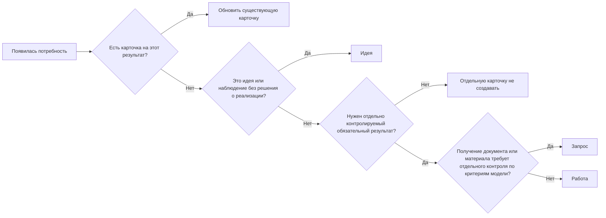

# Описание процессов

[Главная](../README.md) · [01 Модель](01-methodology.md) · [02 Сценарии](02-scripts.md) · [03 Контроль и улучшение](03-control.md) · [04 Шаблоны](04-templates.md) · **05 Процессы** · [06 Контур](06-workspace.md)

---

Процесс описывается отдельно от рабочих карточек.

## 1. Карточка процесса

```text
Название: <процесс>
Вход: <что запускает процесс>
Результат: <что должно быть получено>
Одно обязательство: <единица контролируемого результата>
Кто выполняет: <роль или группа>
Срок: <внешний или внутренний срок>
Когда делить: <критерий>
Типовые блокировки: <что может остановить выполнение>
```

## 2. Связь процесса с рабочим контуром

Процесс создаёт обязательства, каждое отдельно контролируемое обязательство фиксируется карточкой.

Категория необязательна. Она используется только для устойчивой фильтрации, группировки или анализа и не определяет процесс или жизненный цикл карточки.

## 3. Как потребность превращается в карточку



Источник сам по себе не определяет тип карточки. Входящее, документ, поручение или период сначала проверяются по правилам [модели управления](01-methodology.md).

Масштаб: одна карточка / иерархия / проект.

## 4. Типовые случаи

| Случай | Одно обязательство | Готово | Что контролировать |
|---|---|---|---|
| Обработка входящего | один конечный результат | действие выполнено, обязательств нет | неразобранный вход, дубли, сроки, исполнитель |
| Сверка | одна сверка за период/контур | сверка завершена, обязательные исправления вынесены или выполнены | просрочки, возвраты, незакрытые исправления |
| Получение документа | один контролируемый результат получения | документ получен и проверен | срок, исполнитель, повторное действие |
| Периодическое обязательство | один результат за период | результат подготовлен и передан/сохранён | наличие будущих карточек |
| Разовое обязательство | один самостоятельный результат | результат достигнут | срок и исполнитель |
| Изменение процесса | одно принятое изменение | эффект проверен | проблема, действие, результат |

## 5. Когда делить обязательство

Делить, если часть имеет:

- отдельного исполнителя;
- отдельный срок;
- самостоятельную блокировку;
- самостоятельный результат.

Несколько результатов, участников, этапов и зависимостей → отдельный проект.

## 6. Когда описывать отдельный процесс

Отдельное описание нужно, если есть:

- устойчивый вход и результат;
- собственное правило срока, готовности, разбиения или контроля;
- повторяемая работа или устойчивая управленческая граница.

Не являются отдельным процессом:

- разовая тема;
- конкретный документ;
- отдельный сотрудник;
- временная кампания без устойчивой модели работы.

## 7. Пример: периодическая сверка

```text
Название: Периодическая сверка данных
Вход: данные за очередной период
Результат: сверка завершена; исправления выполнены или вынесены в отдельные карточки
Одно обязательство: одна сверка за один период
Кто выполняет: профильная рабочая группа
Срок: внутренний срок после окончания периода
Когда делить: исправление имеет отдельного исполнителя или срок
Типовые блокировки: получение данных; подтверждение спорного расхождения
```

## 8. Проверка описания

- понятны вход и результат;
- определена единица обязательства;
- понятны срок, разделение и типовые блокировки;
- особенности не противоречат модели управления.

---

[← 04 — Шаблоны](04-templates.md) · [Главная](../README.md) · [06 — Настройка рабочего контура →](06-workspace.md)
