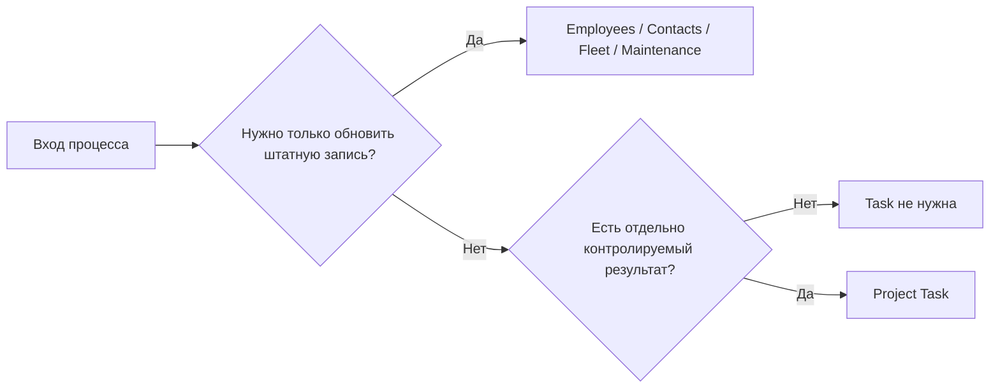

# Описание процессов

[Главная](../README.md) · [00 Возможности Odoo](00-odoo19-community.md) · [01 Модель](01-methodology.md) · [02 Сценарии](02-scripts.md) · [03 Контроль и аналитика](03-control.md) · [04 Шаблоны](04-templates.md) · **05 Процессы** · [06 Настройка](06-workspace.md)

---

Процесс описывается отдельно от фактических записей Odoo.

- **Odoo** хранит исполнение и предметные данные.
- **Репозиторий** хранит устойчивое правило: какие сущности используются, когда создаётся Task и как контролируется результат.

Не нужно превращать каждый процесс в отдельный Project.

## 1. Сначала определить предметные сущности процесса

До описания Kanban нужно ответить:

> С какими реальными объектами работает процесс и где они должны жить в Odoo?

Типовые соответствия:

| Объект процесса | Штатная модель |
|---|---|
| обязательство | Project Task |
| сотрудник | Employees |
| внешний субъект | Contacts |
| ТС | Fleet |
| оборудование | Maintenance Equipment |
| обслуживание | Maintenance Request |
| встреча | Calendar |
| следующее действие | Activity |
| обсуждение записи | Chatter |

Это предотвращает появление собственного псевдореестра внутри Project Properties.

## 2. Полная карточка процесса

```text
Название: <процесс>

Предметные сущности:
<какие объекты участвуют>

Источник истины:
<где в Odoo хранится каждый объект>

Вход:
<событие / данные / документ>

Результат:
<что должно быть получено>

Единица Task:
<что является одной Project Task>

Когда Task не создаётся:
<какие события являются только изменением справочника / сообщением / встречей>

Исполнители:
<роль / рабочая группа>

Deadline:
<как определяется срок результата>

Allocated Time:
<используется / нет и зачем>

Внешнее ожидание:
<типовые причины + правило Activity>

Внутренние зависимости:
<когда использовать Blocked by>

Периодичность:
<Recurring Task / Project Template / нет>

Контроль:
<Shared Views / Task Analysis / предметные отчёты>

Click-only gaps:
<какого поля / связи не хватает>
```

## 3. Решение «создавать Task или нет» является частью процесса

Процесс должен явно разделять:

### Изменение данных

Пример:

```text
получили новый госномер → обновить Fleet Vehicle
```

Task не нужна, если всё действие — обычное обновление справочника без отдельно контролируемого обязательства.

### Управляемая работа

Пример:

```text
обнаружено расхождение по ТС → проверить причину и исправить
```

Здесь появляется самостоятельный результат → Project Task.



## 4. Process Property — только классификация Tasks

Обычно устойчивый процесс может отражаться Property `Процесс` в основном операционном Project.

Пример:

```text
Процесс = Сверка топлива
```

Это полезно для:

- фильтрации Tasks;
- группировки;
- анализа backlog;
- анализа просрочки;
- Shared Views.

`Процесс` не хранит сами предметные объекты процесса.

Если аналитика по процессам не используется, Property не нужно делать обязательным только ради формальности.

## 5. Единица Task — центральное методическое решение

Нужно чётко определить, что является **одним контролируемым результатом**.

Хорошие примеры:

- одна сверка за период;
- одно исправление конкретного основания;
- одно получение конкретного подтверждения;
- один итоговый отчёт;
- одно внедряемое изменение процесса.

Плохие примеры:

- одно письмо;
- один файл;
- одна строка реестра независимо от смысла;
- один комментарий;
- один клик;
- весь вечный процесс в одной карточке.

Если единица Task выбрана плохо, Task Analysis будет методически ложным.

## 6. Справочник и рабочий поток нельзя смешивать

Пример с ТС:

```text
Fleet Vehicle
├── госномер
├── модель
├── водитель
├── одометр
└── сервисы
```

Отдельно:

```text
Project Task
└── Исправить расхождение по ТС X
```

Нельзя пытаться хранить карточку ТС в описании каждой Project Task.

То же правило действует для Employees, Contacts и Equipment.

## 7. Click-only gap фиксируется прямо в описании процесса

Если процесс требует связь, которой штатно нет, это не прячется.

Пример:

```text
Требование:
строить аналитический backlog по каждому ТС.

Штатно:
Fleet Vehicle существует.
Project Task существует.

Не хватает:
Task → fleet.vehicle.

Property workaround:
неприемлем, потому что справочник большой и изменяемый.

Gap:
нужна минимальная Many2one связь после подтверждения пилотом.
```

Это лучше, чем методически притворяться, что Selection Property является нормальным справочником.

## 8. Входящий канал не определяет процесс

Одна и та же работа может прийти:

- вручную;
- email alias;
- Website Form;
- Discuss;
- To-Do → Convert to Task.

Канал отвечает только на вопрос «как зарегистрировали вход».

Он не определяет автоматически:

- `Вид работы`;
- `Процесс`;
- Deadline;
- Assignee;
- необходимость Task.

Поэтому все автоматические входящие сначала проходят triage.

## 9. Внешняя и внутренняя зависимость процесса

### Внешнее ожидание

Пример:

- ответ другой организации;
- документ от внешней стороны;
- решение, которое нельзя представить другой Task Odoo.

В Odoo:

```text
Stage = Ожидание внешнего
Activity = следующая контрольная точка
```

### Внутренняя зависимость

Пример:

- задача B не может начаться до результата задачи A.

В Odoo:

```text
Task B.Blocked by = Task A
→ computed Waiting
```

Не описывать обе причины одним общим `Ожидание`.

## 10. Activity chain является частью процесса, если она устойчива

Если follow-up повторяется каждый раз одинаково, процесс может определять:

```text
Activity Type: Проверить ответ
→ Trigger Next Activity: Напомнить
→ Schedule: 2 days after previous completion date
```

или Activity Plan.

Это предпочтительнее Automation Rule, если задача полностью решается штатным Activity-механизмом.

## 11. Периодический процесс

Нужно определить, что именно повторяется.

### Один результат

```text
ежемесячная сверка
```

→ Recurring Task.

### Целая инициатива

```text
ежеквартальный цикл из нескольких задач, ролей и вех
```

→ Project Template + Project Roles.

Не использовать Project Template для обычной одной периодической задачи.

## 12. Когда будущие периоды нужны заранее

Recurring Task создаёт следующую occurrence после закрытия текущей.

Если процесс требует одновременно видеть несколько будущих периодов заранее, это отдельное требование.

Нельзя автоматически объявлять штатную Recurrence решением такой задачи.

Сначала определить, зачем нужны будущие экземпляры:

- резервирование мощности;
- предварительное назначение;
- календарное планирование;
- внешний контроль.

Только потом выбирать механизм.

## 13. Subtasks в процессе

Subtask нужна, если часть процесса:

- имеет самостоятельный результат;
- отдельного владельца;
- отдельный Deadline;
- отдельную зависимость;
- может зависнуть независимо.

Если это просто последовательность действий одного исполнителя, использовать описание/Activities.

## 14. Проверка результата

Процесс должен прямо ответить:

> Нужна ли независимая проверка каждый раз?

Если да:

```text
Stage = На проверке
+ Activity проверяющему
+ Approved / Changes Requested при необходимости
```

Если нет — не создавать обязательный Stage на весь отдел.

## 15. Maintenance-процесс не должен дублироваться в Project

Если работа полностью описывается Maintenance Request:

- Equipment;
- Maintenance Type;
- Team;
- Responsible;
- Scheduled Date;
- Duration;
- Priority;
- Stage;

этот процесс ведётся в Maintenance.

Project Task появляется только для другого результата поверх него.

## 16. Fleet-процесс и Project-процесс могут существовать рядом

Пример:

### Fleet

```text
обновление карточки ТС
одометр
сервисная запись
затраты
```

### Project

```text
разобрать системное расхождение
получить подтверждение
исправить ошибку другого контура
```

Не делать Project заменой Fleet только потому, что Project удобнее как Kanban.

## 17. Discuss в процессе

Если процесс использует канал для оперативной координации, это допустимо.

Но описание должно определить правило превращения сообщения в обязательство:

```text
если из сообщения следует отдельный результат
→ создать/обновить Project Task
```

Не использовать «найти старое сообщение в чате» как штатный контроль процесса.

## 18. Calendar в процессе

Calendar используется, если событие действительно является встречей/совещанием.

Если требуется только follow-up по существующей записи, Activity лучше.

Если нужен результат — Task.

## 19. Контроль процесса

Для каждого процесса задаётся **минимальный набор вопросов**, а не максимум KPI.

Пример:

```text
Что создано за период?
Что закрыто?
Что осталось open?
Что просрочено?
Что ждёт внешнего?
Что Waiting?
Каково время до закрытия?
```

Если процесс предметный, добавляются его собственные отчёты:

- Fleet reporting;
- Maintenance views/calendar;
- другие штатные представления соответствующей модели.

Не вытаскивать предметную аналитику из Project, если данные живут в другом приложении.

## 20. Пример: периодическая сверка

```text
Название:
Периодическая сверка данных

Предметные сущности:
Project Task + при необходимости Fleet/Employees как master data

Вход:
наступил отчётный период и доступны исходные данные

Результат:
сверка завершена, расхождения разобраны, обязательные корректировки выполнены либо вынесены в отдельные Tasks

Единица Task:
одна сверка за один период

Когда Task не нужна:
обычное обновление одной штатной справочной записи без отдельного обязательства

Вид работы:
Работа

Периодичность:
Recurring Task

Внешнее ожидание:
если нужен ответ → Ожидание внешнего + Activity

Внутренняя зависимость:
если другой результат реально блокирует сверку → Blocked by

Контроль:
Deadline, open/closed, overdue, Waiting, external waiting, working time to close

Gap:
фиксируется только если аналитика требует строгой связи с большим предметным справочником
```

## 21. Процесс считается хорошо описанным, если

Можно однозначно ответить:

1. какие штатные Odoo-сущности используются;
2. где источник истины по справочникам;
3. когда создаётся Project Task;
4. что является одной Task;
5. что означает Done;
6. как определяется Deadline;
7. когда используется Activity;
8. когда используется Blocked by;
9. как устроена периодика;
10. какие Shared Views / reports нужны;
11. какие click-only gaps реально остались.

Если ответа нет, добавление автоматизации или дашборда проблему не исправит.

---

[← 04 — Шаблоны](04-templates.md) · [06 — Настройка →](06-workspace.md)
