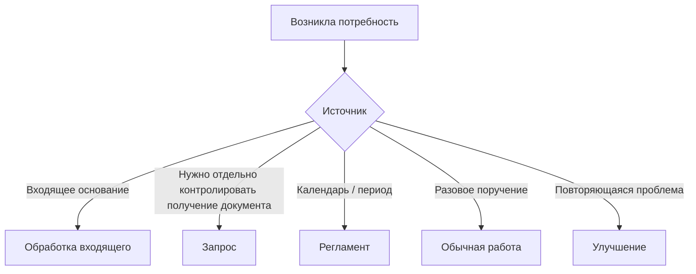

# Описание процессов

[Главная](../README.md) · [01 Модель](01-methodology.md) · [02 Сценарии](02-scripts.md) · [03 Контроль и улучшение](03-control.md) · [04 Шаблоны](04-templates.md) · [05 OpenProject](05-openproject.md) · **06 Процессы**

---

Этот раздел задаёт единую форму описания конкретных бизнес-процессов. Базовая [модель управления](01-methodology.md) здесь не меняется.

## 1. Карточка процесса

```text
Название: <процесс>
Зачем существует: <какую обязательную функцию закрывает>
Категория: <значение в OpenProject>
Что запускает: <условие>
Одна работа: <единица результата>
Когда закрывать: <конечный результат>
Кто выполняет: <роль или группа>
Срок: <внешний или внутреннее правило>
Горизонт регламентов: <если нужен>
Когда делить: <критерий>
Допустимые ожидания: <реальные внешние причины>
Исключения: <только реальные особенности процесса>
```

Новая категория создаётся только вместе с такой карточкой.

## 2. Откуда возникает работа



Масштаб определяется отдельно: одна карточка / иерархия / проект.

## 3. Типовой процесс: обработка входящего

**Зачем существует:** обязательное действие из входящего канала должно попасть в рабочую систему и получить владельца, срок и результат.

**Запуск:** получено основание, требующее действия.

**Одна работа:** один результат с одним основным владельцем.

**Готово:** действие выполнено, результат сохранён или передан, открытых обязательств нет.

**Допустимые ожидания:** внешний ответ, документ, доступ или подтверждение, без которых невозможно продолжить.

**Риски:**

- несколько карточек на одну переписку;
- потеря новой версии материала;
- смешение работ разных исполнителей;
- закрытие по промежуточному действию.

## 4. Типовой процесс: сверка и разбор расхождений

**Зачем существует:** подтвердить корректность сопоставляемых данных и не потерять обязательные исправления.

**Запуск:** период, поступление данных или отдельное поручение.

**Одна работа:** одна сверка за период/контур или один самостоятельный пакет расхождений.

**Готово:** сверка завершена; обязательные исправления выполнены или вынесены в отдельные карточки.

**Когда делить:** анализ и исправление имеют разных исполнителей, сроки или могут закрываться независимо.

**Риски:**

- одна карточка на несколько периодов;
- расхождения остаются только в файле;
- анализ и исправление разных исполнителей смешаны.

## 5. Типовой процесс: получение документа или материала

**Зачем существует:** не потерять контролируемое получение результата после отправки запроса.

**Запуск:** получение соответствует критериям отдельного `Запроса` из [модели управления](01-methodology.md#13-запрос-документа-или-материала).

**Тип:** `Запрос`.

**Одна работа:** один результат получения с владельцем и сроком.

**Готово:** результат получен, проверен и сопровождение больше не нужно.

```text
Очередь → В работе → Ожидание → В работе → Готово
```

**Допустимые ожидания:** ответ адресата, предоставление документа, исправленная версия документа.

**Не относится:** обычное уточнение внутри текущей работы, повторное письмо по существующему запросу, небольшой недостающий материал без самостоятельного контроля получения.

**Риски:**

- закрыть по факту отправки;
- оставить после отправки на групповой очереди;
- не поставить срок;
- потерять среди обычного ожидания;
- создавать новую карточку на каждое напоминание.

## 6. Типовой процесс: периодическая работа

**Зачем существует:** обязательная периодическая работа должна существовать в системе до наступления срока.

**Запуск:** календарь или установленная периодичность.

**Тип:** `Регламент`.

**Одна работа:** один результат за один период.

**Готово:** результат подготовлен и передан/сохранён.

**Горизонт:** устанавливается ответственным за направление.

**Риски:**

- следующая карточка создаётся после наступления срока;
- одна вечная карточка используется на несколько периодов;
- период не указан в результате.

## 7. Типовой процесс: разовая работа

**Зачем существует:** довести разовое поручение или уникальный результат до контролируемого завершения.

**Запуск:** разовое поручение или уникальная потребность.

**Одна работа:** один законченный результат с одним основным владельцем.

Независимые части → дочерние карточки.

Несколько результатов, участников, этапов и зависимостей → отдельный проект.

## 8. Типовой процесс: улучшение

**Зачем существует:** повторяющаяся проблема должна быть отделена от обязательной очереди до решения о реализации.

**Запуск:** повторяющаяся проблема, задержка, ручная операция или дефект.

```text
Входящие идеи → Наблюдаем → Кандидат → Готово к решению
```

После решения `делаем` создаётся обязательная работа. После реализации эффект проверяется по данным процесса и показателям из раздела [Контроль и улучшение](03-control.md).

## 9. Заполненный пример: обработка входящего основания

```text
Название: Обработка входящего основания
Зачем существует: не потерять обязательное действие из входящего канала
Категория: Обработка входящего
Что запускает: получено основание, требующее изменения, проверки или ответа
Одна работа: один конечный результат по одному основанию или связанному пакету оснований
Когда закрывать: требуемое действие выполнено; результат сохранён/передан; открытых обязательств нет
Кто выполняет: профильная рабочая группа
Срок: внешний срок; при его отсутствии — внутренний срок процесса
Горизонт регламентов: не применяется
Когда делить: отдельная часть имеет другого исполнителя, срок или самостоятельный результат
Допустимые ожидания: внешний ответ, документ, доступ
Исключения: информационное сообщение без обязательного действия карточку не создаёт
```

## 10. Заполненный пример: периодическая сверка

```text
Название: Периодическая сверка данных
Зачем существует: регулярно подтверждать корректность данных и фиксировать обязательные расхождения
Категория: Сверка данных
Что запускает: наступление очередного периода
Одна работа: одна сверка за один период
Когда закрывать: сверка завершена; обязательные исправления выполнены или вынесены в отдельные карточки
Кто выполняет: профильная рабочая группа
Срок: внутренний срок процесса после окончания периода
Горизонт регламентов: следующий период создаётся заранее по локальному правилу
Когда делить: исправление конкретного расхождения имеет отдельного владельца или срок
Допустимые ожидания: получение внешних данных, подтверждение спорного расхождения
Исключения: найденное расхождение не остаётся только в файле, если требует отдельного действия
```

## 11. Заполненный пример: контролируемое получение документа

```text
Название: Получение обязательного документа
Зачем существует: контролировать результат после отправки запроса
Категория: Документальное сопровождение
Что запускает: нужно получить конкретный документ к определённой дате, и получение нельзя потерять после отправки
Одна работа: получение одного конкретного результата
Когда закрывать: документ получен, проверен и пригоден для дальнейшей работы
Кто выполняет: конкретный владелец сопровождения
Срок: дата, к которой документ должен быть получен
Горизонт регламентов: не применяется
Когда делить: запрашиваются независимые результаты с разными владельцами или сроками
Допустимые ожидания: ответ адресата, исправленная версия документа
Исключения: повторное напоминание остаётся в той же карточке; обычное уточнение отдельным Запросом не является
```

## 12. Когда добавлять новый процесс

Добавлять только если процесс:

- повторяется;
- имеет устойчивое условие возникновения;
- имеет понятный конечный результат;
- требует собственного правила срока или готовности;
- полезен как отдельная категория.

Не являются отдельным процессом:

- разовая тема;
- конкретный документ;
- отдельный сотрудник;
- временная кампания.

## 13. Проверка описания процессов

- каждой категории соответствует одна карточка процесса;
- одинаковые по правилам категории объединяются;
- принципиально разные процессы не держатся в одной категории;
- по карточке процесса новый сотрудник может определить, что создаёт работу, что считается одной работой, срок и условие закрытия;
- особенности процесса не противоречат базовой модели управления;
- повторяющиеся проблемы процесса могут быть связаны с конкретными работами, показателями и изменениями.

---

[← 05 — Реализация в OpenProject](05-openproject.md) · [Главная](../README.md)
