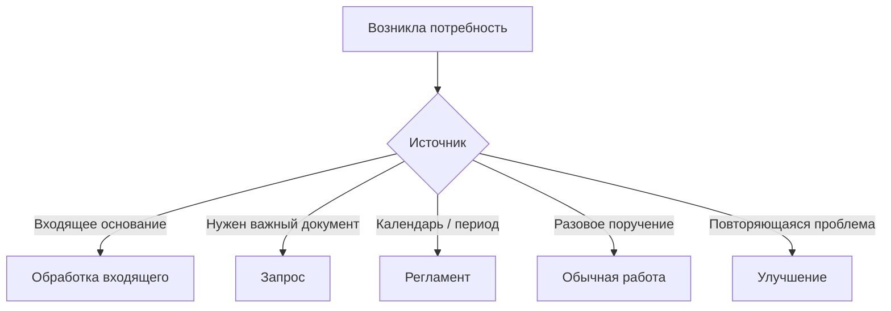

# Каталог процессов

## 1. Карточка процесса

```text
Название: <процесс>
Категория: <значение в OpenProject>
Что запускает: <условие>
Одна работа: <единица результата>
Когда закрывать: <конечный результат>
Кто выполняет: <роль или группа>
Срок: <внешний или внутреннее правило>
Горизонт регламентов: <если нужен>
Когда делить: <критерий>
```

Новая категория создаётся только вместе с такой карточкой.

## 2. Откуда возникает работа



Масштаб определяется отдельно: одна карточка / иерархия / проект.

## 3. Обработка входящего

**Запуск:** получено основание, требующее действия.

**Одна работа:** один результат с одним основным владельцем.

**Готово:** действие выполнено, результат сохранён или передан, открытых обязательств нет.

**Риски:**

- несколько карточек на одну переписку;
- потеря новой версии материала;
- смешение работ разных исполнителей;
- закрытие по промежуточному действию.

## 4. Сверка и разбор расхождений

**Запуск:** период, данные или поручение.

**Одна работа:** одна сверка за период/контур или один самостоятельный пакет расхождений.

**Готово:** сверка завершена; обязательные исправления выполнены или вынесены в отдельные карточки.

**Риски:**

- одна карточка на несколько периодов;
- расхождения остаются только в файле;
- анализ и исправление разных исполнителей смешаны.

## 5. Получение важного документа

**Запуск:** подразделению нужен важный документ, материал или подтверждение.

**Тип:** `Запрос`.

**Одна работа:** один результат получения с владельцем и сроком.

**Готово:** результат получен, проверен и сопровождение больше не нужно.

```text
Очередь → В работе → Ожидание → В работе → Готово
```

**Риски:**

- закрыть по факту отправки;
- оставить после отправки на групповой очереди;
- не поставить срок;
- потерять среди обычного ожидания;
- создавать новую карточку на каждое напоминание.

## 6. Периодическая работа

**Запуск:** календарь или периодичность.

**Тип:** `Регламент`.

**Одна работа:** один результат за один период.

**Готово:** результат подготовлен и передан/сохранён.

Ответственный за направление задаёт горизонт будущих карточек.

## 7. Разовая работа

**Запуск:** разовое поручение или уникальный результат.

**Одна работа:** один законченный результат с одним основным владельцем.

Независимые части → дочерние карточки.

Несколько результатов, участников, этапов и зависимостей → отдельный проект.

## 8. Улучшение

**Запуск:** повторяющаяся проблема, задержка, ручная операция или дефект.

```text
Входящие идеи → Наблюдаем → Кандидат → Готово к решению
```

После решения `делаем` создаётся обязательная работа.

## 9. Когда добавлять новый процесс

Добавлять только если процесс:

- повторяется;
- имеет устойчивое условие возникновения;
- имеет понятный конечный результат;
- требует собственного правила срока или готовности;
- полезен как отдельная категория.

Не являются отдельным процессом:

- разовая тема;
- конкретный документ;
- отдельный сотрудник;
- временная кампания.

## 10. Проверка каталога

- каждой категории соответствует одна карточка процесса;
- одинаковые по правилам категории объединяются;
- принципиально разные процессы не держатся в одной категории.
