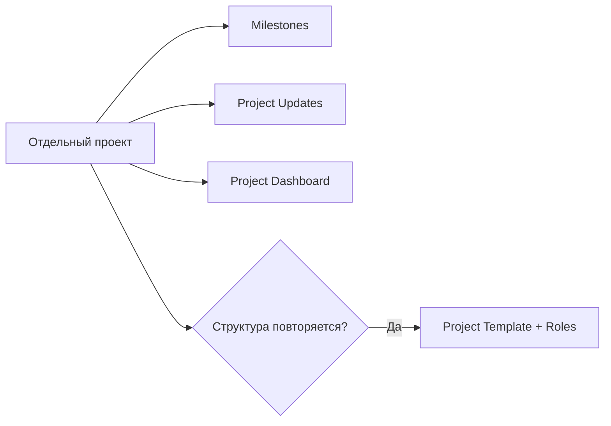

# Настройка Odoo 19 Community

[Главная](../README.md) · [00 Возможности Odoo](00-odoo19-community.md) · [01 Модель](01-methodology.md) · [02 Сценарии](02-scripts.md) · [03 Контроль и аналитика](03-control.md) · [04 Шаблоны](04-templates.md) · [05 Процессы](05-processes.md) · **06 Настройка**

---

Здесь фиксируется **минимальная конфигурация, которую можно собрать штатным интерфейсом Odoo 19 Community**.

Цель первого контура — получить достоверную очередь, ответственность, сроки, ожидание и аналитику без собственного кода. Всё остальное включается по фактической потребности.

## 1. Что установить и что не включать заранее

Обязательная основа:

- `Проекты` (`Project`).

Штатные Chatter и Activities используются как часть платформы Odoo.

Не включать заранее только потому, что функция существует:

- Timesheets;
- Milestones;
- Project Templates;
- Activity Plans;
- Automation Rules;
- Customer Ratings;
- email alias;
- отдельные Dashboards;
- дополнительные проекты.

Для каждой функции ниже указано, когда она действительно нужна.

## 2. Создать основной операционный проект

Создать один проект, например:

```text
Операционная работа
```

Это основной контур постоянной работы подразделения.

На старте **не создавать проекты** на каждый:

- процесс;
- сотрудника;
- участок;
- вид работы;
- период;
- источник поручения.

Для таких разрезов используются Properties, Tags, фильтры и группировки.

Отдельный проект создаётся только для самостоятельной инициативы или отдельной границы доступа/участников/этапов/свойств.

## 3. Настроить видимость проекта

В настройках проекта выбрать фактическую модель доступа.

Для внутреннего рабочего контура обычно нужна одна из штатных моделей:

- только приглашённые внутренние пользователи;
- все внутренние пользователи.

Не использовать публичную/портальную видимость без реальной потребности во внешних участниках.

Права видимости проекта — это не замена методическим ролям `исполнитель / старший / руководитель`.

## 4. Создать этапы задач

В Kanban основного проекта создать в таком порядке:

```text
Входящие
Очередь
В работе
Ожидание внешнего
```

При доказанной потребности конкретного процесса можно добавить:

```text
На проверке
```

Не создавать отдельные этапы:

- `Готово`;
- `Отменено`;
- `Waiting`;
- `Просрочено`;
- `Срочно`.

Причина:

- `Done` и `Canceled` уже закрывают задачу;
- внутренний `Waiting` управляется зависимостями;
- просрочка определяется Deadline;
- срочность определяется Priority.

## 5. Этап и системный статус не объединять

Рабочий этап показывает положение задачи в нашем потоке.

Системный статус Odoo используется по штатному смыслу:

```text
In Progress
Changes Requested
Approved
Waiting
Done
Canceled
```

Нельзя создавать дополнительную ручную систему статусов в Properties только потому, что привычно иметь отдельный справочник `Статус`.

## 6. Настроить Properties задач

Открыть задачу проекта и использовать штатное изменение свойств задачи (`Edit Properties` / `Изменить свойства`).

### `Вид работы`

Тип:

```text
Selection
```

Значения:

```text
Работа
Запрос
Улучшение
```

Это аналитический признак, а не отдельный workflow.

### `Процесс`

Тип:

```text
Selection
```

Добавить только устойчивые процессы, по которым действительно нужен фильтр, группировка или анализ.

Пример, не обязательный справочник:

```text
Сверка данных
Корректировка данных
Учёт документов
Отчётность
```

Если список превращается в десятки постоянно меняющихся записей, Selection уже не является хорошим решением. Это повод проектировать нормальный справочник, а не бесконечно расширять Property.

### Другие Properties

На первом пилоте не добавлять.

Новое свойство допустимо, если одновременно понятно:

1. кто его заполняет;
2. зачем оно нужно;
3. по нему реально фильтруют, группируют или принимают решение;
4. штатный тип Property подходит без костыля.

Не переносить поля Excel-реестра один в один.

## 7. Приоритет

Использовать штатный `Priority`.

Odoo имеет четыре уровня, но методика не обязана использовать все четыре.

Базово:

- минимальный уровень — обычная работа;
- `Urgent` — критичная работа.

Средние уровни подключать только если появится реальная управленческая граница между ними.

Не создавать отдельное Property `Критичность`.

## 8. Исполнитель и общая очередь

Штатное поле Assignees позволяет назначать несколько пользователей, но базовое правило методики:

- `Входящие` и общая `Очередь` могут быть неназначенными;
- после фактического взятия задачи определяется **один ответственный за конечный результат**;
- дополнительные участники не добавляются в Assignees только ради информирования.

Для участия использовать по смыслу:

- Followers;
- Chatter;
- Activity;
- подзадачу с собственным результатом.

Общая очередь = сохранённый фильтр неназначенных открытых задач, а не выдуманный «групповой исполнитель».

## 9. Deadline и Activities

Deadline = дата конечного результата.

Activity = следующее действие с собственной датой.

Типовые Activities:

- проверить ответ;
- напомнить;
- позвонить;
- получить уточнение;
- провести проверку результата;
- эскалировать.

Задача в `Ожидание внешнего` по умолчанию должна иметь следующую Activity, если follow-up требуется к определённой дате.

Не переносить Deadline на дату следующего напоминания.

## 10. Настроить Activity Types только при необходимости

В `Project → Configuration → Activity Types` доступны типы активностей для Project/Task.

Не создавать большой справочник типов.

Имеет смысл добавить только действия, которые:

- регулярно повторяются;
- отличаются по смыслу;
- полезны в фильтрах/организации работы.

Если `To Do`, `Call`, `Email` уже покрывают потребность, новых типов не нужно.

## 11. Activity Plans — для повторяющейся цепочки действий

В `Project → Configuration → Activity Plans` можно настроить план для Project или Task.

Использовать, когда вокруг одного результата стабильно повторяется одна и та же последовательность контрольных действий.

Пример:

```text
Контроль внешнего запроса
1. Проверить получение
2. Напомнить
3. Эскалировать
```

Activity Plan не заменяет подзадачи.

Критерий:

- если это просто последовательные действия одного результата → Activity Plan;
- если каждый пункт имеет самостоятельный результат/срок/ответственного → задачи или подзадачи.

На первом пилоте план можно не создавать. Сначала посмотреть, какие цепочки реально повторяются.

## 12. Включить Task Dependencies при наличии внутренних блокировок

В настройках проекта включить:

```text
Task Dependencies
```

Использование:

```text
Задача → Blocked by → добавить блокирующую задачу
```

Odoo сам использует системный `Waiting`.

Не применять `Blocked by` для простой тематической связи.

Если внутренних блокировок фактически нет, функцию не включать только ради схемы.

## 13. Включить Recurring Tasks для регулярных результатов

В настройках проекта включить:

```text
Recurring Tasks
```

Настроить повторение на первой реальной периодической задаче.

Штатная механика:

- новый экземпляр появляется после `Done` или `Canceled` предыдущего;
- новый экземпляр попадает в первый этап проекта;
- Name, Description, Project, Assignees, Customer и Tags копируются;
- Deadline пересчитывается;
- Milestones, Timesheets, Chatter, Activities и Subtasks не копируются.

Поэтому `Входящие` остаётся первым этапом: новый повтор можно увидеть и проверить перед отправкой в очередь.

Не создавать параллельно ручные задачи на месяцы вперёд.

## 14. Подзадачи

Использовать штатные Subtasks без дополнительной классификации.

Подзадача нужна, если часть общего результата имеет хотя бы одно из следующего:

- самостоятельного ответственного;
- собственный Deadline;
- отдельную блокировку;
- самостоятельный проверяемый результат.

Для простого следующего шага использовать Activity.

## 15. Настроить Rotting только после наблюдения реального потока

В Odoo у Task Stage есть поле:

```text
Days to rot
```

Доступ к полному списку Task Stages находится в `Project → Configuration → Task Stages` при активированном Developer Mode. Этап также можно редактировать из Kanban, если соответствующее действие доступно пользователю.

Порог означает: сколько дней задача может оставаться в этом этапе без смены этапа, прежде чем Odoo пометит её как `Rotting`.

Не задавать произвольные числа на первом дне.

Правильный порядок:

1. несколько недель вести поток достоверно;
2. понять нормальное время нахождения в каждом этапе;
3. отдельно определить разумный порог для конкретного этапа;
4. включить `Days to rot`;
5. контролировать штатным фильтром `Rotting`;
6. после пилота скорректировать порог.

Важно:

```text
Rotting ≠ просрочено
Rotting ≠ просрочена Activity
Rotting = слишком долго не менялся этап
```

## 16. To-Do — личный буфер, а не второй реестр отдела

Приложение `To-Do` можно использовать для:

- личной мысли;
- личного напоминания;
- идеи до решения о постановке общей работы.

Когда результат становится обязательным для отдела:

```text
To-Do → Convert to Task → выбрать основной проект
```

После этого управление идёт уже по общей задаче Project.

Personal Stages в To-Do / My Tasks — личная организация пользователя. Они не заменяют общие этапы проекта и не используются в общей отчётности как состояние процесса.

## 17. Email alias — только после стабилизации входящих

Odoo может создавать задачи проекта из входящих писем.

Включать, только если определены:

- какой адрес является рабочим входом;
- кто разбирает автоматически созданные задачи;
- как отличать новое обязательство от переписки по существующей задаче;
- как устранять дубли;
- какие письма вообще не должны становиться задачами.

Все новые задачи через alias должны попадать в первый этап `Входящие` и проходить обычный разбор.

Не подключать общий ящик «как есть» и надеяться, что Odoo сам поймёт смысл 50–70 писем.

## 18. Автоматические письма при входе в этап

Task Stage в Community может иметь Email Template, который отправляется при достижении этапа.

Использовать только для устойчивого внешнего сценария, например подтверждения клиенту/заявителю.

Не включать для внутренних этапов только ради уведомлений: это быстро создаёт шум.

## 19. Customer Ratings — только для реального внешнего сервиса

Если результат получает внешний пользователь, можно настроить запрос оценки качества через Task Stage.

Не использовать Customer Rating:

- как KPI сотрудника;
- как замену проверке результата;
- во внутреннем потоке, где нет осмысленного получателя сервиса.

## 20. Создать сохранённые рабочие фильтры

Через Search → Filters / Group By → Favorites создать минимум:

### `Входящие`

```text
Open + Stage = Входящие
```

### `Общая очередь`

```text
Open + Stage = Очередь + Unassigned
```

### `Моя очередь`

```text
Open + Stage = Очередь + My Tasks
```

### `Моя работа`

```text
Open + Stage = В работе + My Tasks
```

### `Просрочено`

```text
Open + Deadline = Overdue
```

### `Ожидание внешнего`

```text
Open + Stage = Ожидание внешнего
```

### `Внутренние блокировки`

```text
Open + Status = Waiting
```

### `Критичные`

```text
Open + Priority = Urgent
```

### `Залежавшиеся`

После настройки порогов этапов:

```text
Rotting = true
```

## 21. Kanban и List используют для разных задач

### Kanban

Использовать для:

- визуального движения по этапам;
- понимания структуры потока;
- быстрого управления карточками;
- Activities на карточках.

### List

Использовать для:

- большой очереди;
- сортировки по Deadline;
- массового просмотра исполнителей, приоритетов и Properties;
- оперативного контроля исключений.

Не пытаться сделать Kanban одновременно диспетчерской таблицей, отчётом и дашбордом.

## 22. Базовая аналитика

После того как задачи начали вестись достоверно:

```text
Project → Reporting → Tasks Analysis
```

Использовать Pivot/Graph для вопросов:

- сколько задач создаётся;
- сколько закрывается;
- растёт ли открытый хвост;
- где концентрируется просрочка;
- какие процессы создают основной хвост;
- где растёт внешнее ожидание;
- где есть внутренние блокировки;
- где увеличивается время назначения или закрытия.

Группировать по тем измерениям, которые реально присутствуют в отчёте и дают управленческий ответ.

Не вводить ручное поле только ради одного графика.

## 23. Dashboard — после стабилизации показателей

Когда набор управленческих вопросов перестал меняться каждую неделю, можно собрать штатный Spreadsheet Dashboard.

На дашборд выносятся только показатели, после которых существует понятное действие.

Плохой показатель:

```text
интересно посмотреть
```

Хороший показатель:

```text
если значение вышло за нормальный диапазон — понятно, кто и что разбирает
```

## 24. Отдельная проектная инициатива

Если работа перестала быть одним результатом и стала самостоятельной инициативой с несколькими задачами, создать отдельный Project.

Признаки:

- несколько результатов;
- несколько исполнителей;
- собственный общий срок;
- зависимости;
- контрольные точки;
- проект нужно отдельно оценивать как `On Track / At Risk / Off Track`.

Не создавать такой проект ради одного поручения.

## 25. Milestones для инициатив

В настройках отдельного проекта включить:

```text
Milestones
```

Веха нужна, если есть реальная значимая контрольная точка с Deadline.

Не использовать Milestones как дополнительную категорию задач.

Когда все связанные задачи закрыты как `Done` или `Canceled`, Odoo может считать веху достигнутой.

## 26. Project Updates для управленческого обзора инициатив

В Project Dashboard отдельной инициативы использовать Project Updates.

На периодическом обзоре фиксировать:

```text
Status: On Track / At Risk / Off Track / On Hold / Done
Progress: <фактическая оценка>
Description: <что изменилось, риск, следующее решение>
```

Project Update заменяет отдельный ручной «статус-отчёт проекта», если дополнительного формального документа не требуется внешним регламентом.

Не писать Project Update ежедневно без управленческой потребности. Для большинства инициатив достаточно устойчивого еженедельного/двухнедельного обзора либо обзора по событию.

## 27. Project Templates для повторяемых инициатив

Если **не одна задача, а целый проект** регулярно запускается по одной и той же структуре, использовать Project Template.

Шаблон может переносить:

- этапы;
- задачи;
- подзадачи;
- настройки;
- статусы и структуру;
- роли задач.

### Project Roles

В шаблоне задавать роль задачи вместо привязки структуры к конкретному человеку, если исполнители меняются от запуска к запуску.

При создании нового проекта сопоставить роли конкретным сотрудникам — Odoo распределит задачи по этим ролям.

Это лучше, чем вручную копировать проект и потом искать, где остался старый исполнитель.

Не использовать Project Template для обычной ежемесячной одной задачи: там правильнее Recurring Task.

## 28. Automation Rules — третий этап зрелости

Community содержит `Automation Rules` (`base_automation`). Полный технический раздел доступен администратору после включения Developer Mode:

```text
Settings → Technical → Automation → Automation Rules
```

В Odoo 19 правила могут реагировать, в частности, на:

- создание записи;
- изменение;
- установку этапа;
- установку статуса;
- установку приоритета;
- наступление времени;
- другие поддерживаемые события.

Не начинать проект с Automation Rules.

Разрешённый порядок внедрения:

1. правило процесса работает вручную;
2. данные ведутся достоверно;
3. одно и то же действие повторяется достаточно часто;
4. действие однозначно и не требует решения человека;
5. только тогда создаётся Automation Rule;
6. правило получает понятное имя и описание, зачем оно существует;
7. после запуска проверяются побочные эффекты.

Хорошие кандидаты:

- поставить стандартную Activity при строго определённом событии;
- уведомить о конкретном исключении;
- заполнить однозначное значение;
- выполнить техническое действие, которое пользователь всегда делает одинаково.

Плохие кандидаты:

- автоматически «решить», кому важнее задача;
- скрывать просрочку переносом Deadline;
- сложной автоматизацией имитировать недостающий BPM;
- создавать каскад карточек, смысл которых непонятен пользователю.

## 29. Timesheets — только если нужен учёт трудоёмкости

Включать, если есть конкретный вопрос:

- сколько трудозатрат требует процесс;
- какая фактическая стоимость;
- какова загрузка мощности;
- как соотносится план и факт.

Не включать Timesheets ради контроля присутствия или рейтинга сотрудников.

## 30. Что проверить на пилоте

Перед расширением контура пройти на реальных задачах:

- [ ] входящая задача без исполнителя;
- [ ] разбор и перевод в общую очередь;
- [ ] самоназначение/назначение старшим;
- [ ] фактическая работа;
- [ ] внешний запрос + Activity;
- [ ] внутренняя зависимость `Blocked by` и системный `Waiting`;
- [ ] просрочка без переноса Deadline;
- [ ] `Urgent`;
- [ ] передача другому исполнителю;
- [ ] подзадача;
- [ ] повторяющаяся задача и создание следующего экземпляра;
- [ ] `Done`;
- [ ] `Canceled`;
- [ ] повторное открытие ошибочно закрытого результата;
- [ ] фильтры `Входящие`, `Общая очередь`, `Просрочено`, ожидания;
- [ ] Tasks Analysis / Pivot / Graph;
- [ ] после накопления истории — тест `Days to rot` на одном этапе;
- [ ] если повторяется цепочка follow-up — тест Activity Plan;
- [ ] если есть реальная отдельная инициатива — Milestone + Project Update;
- [ ] если есть повторяемая инициатива — Project Template + Roles;
- [ ] Automation Rule только на одном доказанно рутинном действии.

## 31. Что не делать на первом запуске

- не писать собственный модуль;
- не ставить OCA-модули только ради красивой схемы;
- не создавать десятки Properties;
- не делать проект на каждый процесс;
- не создавать отдельные типы карточек кодом;
- не добавлять ручной `Waiting`;
- не дублировать `Done` этапом `Готово`;
- не создавать будущее периодики вручную;
- не задавать Rotting-пороги из головы;
- не создавать Activity Plans до появления повторяемой цепочки;
- не вводить Timesheets без задачи управления;
- не строить Dashboard до стабилизации данных;
- не автоматизировать ещё неустойчивый процесс;
- не переносить Excel-реестр один в один в форму задачи;
- не проектировать методику вокруг Gantt, Studio или других возможностей, которых нет в базовом Community-контуре.

## 32. Порядок внедрения

```mermaid
flowchart LR
    A[1. Задачи и этапы] --> B[2. Deadline / Priority / Assignee]
    B --> C[3. Properties]
    C --> D[4. Activities / Dependencies / Recurrence]
    D --> E[5. Favorites и контроль исключений]
    E --> F[6. Task Analysis]
    F --> G[7. Rotting / Activity Plans при фактической потребности]
    G --> H[8. Dashboard]
    H --> I[9. Automation Rules]
    I --> J[10. Доработка только подтверждённых ограничений]
```



Для отдельных инициатив параллельно используется отдельная ветка возможностей:



После пилота фиксируются только реальные ограничения. Именно они определяют, нужна ли доработка Odoo и какая.

---

[← 05 — Описание процессов](05-processes.md) · [Главная](../README.md)
