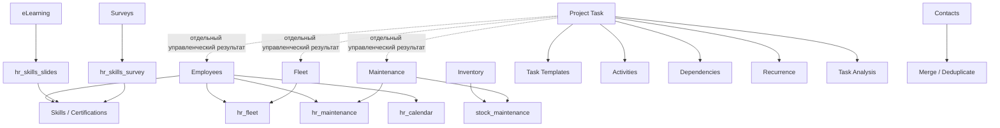

# Углублённый аудит Odoo 19 Community

[Главная](../README.md) · [00 Возможности Odoo](00-odoo19-community.md) · [01 Модель](01-methodology.md) · [02 Сценарии](02-scripts.md) · [03 Контроль и аналитика](03-control.md) · [04 Шаблоны](04-templates.md) · [05 Процессы](05-processes.md) · [06 Настройка](06-workspace.md) · **07 Углублённый аудит**

---

Этот документ — второй проход по возможностям **Odoo 19 Community**.

Его цель не увеличить число установленных приложений, а найти штатные функции и межмодульные связи, которые могут:

- упростить методику;
- заменить ручной обход;
- убрать ложный click-only gap;
- показать реальную границу Community;
- предотвратить ненужную кастомную разработку.

## 1. Правило проверки

Для каждого вывода используются только первичные источники:

1. официальная документация Odoo **19.0** — для пользовательского поведения;
2. публичная ветка [`odoo/odoo:19.0`](https://github.com/odoo/odoo/tree/19.0) — для проверки наличия функции в Community и фактической модели данных;
3. если документация описывает функцию, но соответствующей реализации нет в публичной ветке Community, функция **не включается в CE-методику как подтверждённая**.

Это особенно важно для документации Odoo, которая не всегда разделяет Community и Enterprise.

## 2. Краткая матрица второго прохода

| Возможность | Community 19 | Решение для методики |
|---|---:|---|
| Task Templates | подтверждено | **использовать для типовых разовых задач** |
| Время в каждом Task Stage в карточке | подтверждено | использовать как диагностику конкретной задачи |
| Агрегированный отчёт по времени во всех Stages | штатно не подтверждён | не обещать как click-only KPI |
| Calendar-планирование задачи без Deadline | подтверждено | по потребности, это не ресурсное Planning |
| Skills Management | подтверждено | по потребности |
| Certifications | подтверждено | по потребности |
| eLearning | подтверждено | по потребности |
| Skills ↔ Surveys | подтверждён штатный мост | использовать для сертификаций |
| Skills ↔ eLearning | подтверждён штатный мост | использовать для обучения |
| HR Org Chart | подтверждено | по потребности |
| Resource Working Schedules | подтверждено | использовать как рабочие календари, не как полноценный сменный Planning |
| Work Entries | подтверждено | специализированный HR-контур |
| Remote Work | подтверждено | по потребности |
| Employees ↔ Fleet history | подтверждён штатный мост | учитывать до кастомизации |
| Employees ↔ Maintenance allocation | подтверждён штатный мост | учитывать до кастомизации |
| Inventory ↔ Maintenance | подтверждён штатный мост | **пилотировать для серийного оборудования** |
| Contacts Merge/Deduplicate | подтверждено | **использовать для качества Contacts** |
| Data Recycle | Community | по потребности после политики хранения |
| универсальный Data Cleaning / Data Merge | Enterprise | не считать CE-функцией |
| Canned Responses | подтверждено | по потребности для повторяемой коммуникации |
| Live Chat | подтверждено | только как коммуникационный канал |
| Google Calendar sync | подтверждено | по потребности |
| Outlook Calendar sync | подтверждено | по потребности |
| Analytic Accounting | подтверждено | по потребности для стоимости/доходов |
| Analytic Budget | в общей документации есть, public `account_budget` отсутствует | не считать подтверждённой CE-функцией |
| Purchase | подтверждено | только для реального закупочного процесса |
| Purchase Agreements | подтверждено | только для тендеров/blanket orders |
| Recruitment | подтверждено | только для найма |
| Expenses | подтверждено | только для расходов |
| Attendances | подтверждено | присутствие, не трудозатраты |
| Time Off | подтверждено | отсутствия, не Task workflow |
| Employee Presence Control | подтверждено | **не использовать как KPI производительности** |
| Gamification | подтверждено | не использовать для рейтинга операционной работы |
| полноценное Barcode-приложение Inventory | в public CE не подтверждено | не обещать в методике |
| автоматическое availability scheduling Project Templates | документация описывает, public CE-модель не подтверждает planned-date слой | не считать подтверждённой CE-функцией |

## 3. Task Templates — пропущенная ключевая функция Project

В публичном `project` Odoo 19 есть отдельный механизм **Task Templates** внутри проекта.

Это не то же самое, что:

- Recurring Task;
- Project Template;
- Activity Plan.

Community-код содержит dropdown шаблонов при создании задачи и методы создания обычной задачи из template task.

Официальный тест Odoo подтверждает, что:

- template task создаёт обычную non-template Task;
- subtasks шаблона копируются;
- шаблонные задачи не считаются обычным open backlog проекта;
- при копировании проекта task templates также копируются.

Источники:

- [`ProjectTaskTemplateDropdown`](https://github.com/odoo/odoo/blob/19.0/addons/project/static/src/views/components/project_task_template_dropdown.js);
- [`test_task_templates.py`](https://github.com/odoo/odoo/blob/19.0/addons/project/tests/test_task_templates.py).

### Методическое решение

Task Template — лучший кандидат для повторяемой **разовой** работы с одинаковой структурой, когда дата появления заранее неизвестна.

Пример:

```text
Шаблон задачи:
Разобрать расхождение по данным

Описание:
- проверить источник;
- определить причину;
- выполнить/инициировать исправление;
- проверить результат.

Подзадачи:
<только если действительно нужны самостоятельные результаты>
```

Различие:

```text
повторяется по календарю → Recurring Task
повторяется тип карточки по событию → Task Template
повторяется целый проект → Project Template
повторяется набор follow-up → Activity Plan
```

Это существенно уменьшает потребность в собственных шаблонах описания и Automation Rules.

## 4. Время в каждом Stage уже считается штатно

`project.task` наследует `mail.tracking.duration.mixin` и использует `stage_id` как отслеживаемое поле длительности.

Миксин вычисляет JSON:

```text
stage_id → seconds spent
```

А стандартная форма Project использует widget `rotting_statusbar_duration`.

UI-компонент `StatusBarDurationField` подставляет в каждый элемент status bar короткое и полное время нахождения в соответствующем Stage.

Источники:

- [`mail_tracking_duration_mixin.py`](https://github.com/odoo/odoo/blob/19.0/addons/mail/models/mail_tracking_duration_mixin.py);
- [`project_task_views.xml`](https://github.com/odoo/odoo/blob/19.0/addons/project/views/project_task_views.xml);
- [`statusbar_duration_field.js`](https://github.com/odoo/odoo/blob/19.0/addons/mail/static/src/views/fields/statusbar_duration/statusbar_duration_field.js).

### Что это даёт

В конкретной Task можно диагностировать:

- сколько она находилась во `Входящие`;
- сколько была в `Очередь`;
- сколько была `В работе`;
- сколько находилась в `Ожидание внешнего`.

### Важное ограничение

Стандартные Project Pivot/Graph не выводят `duration_tracking` как нормальную агрегируемую меру по каждому Stage.

В стандартных Pivot/Graph подтверждены, среди прочего:

- Working Hours to Assign;
- Working Hours to Close;
- Allocated Time.

Поэтому:

> **время в Stage штатно видно на конкретной карточке, но полноценный агрегированный SLA-отчёт по каждому Stage не считаем click-only функцией Community.**

Это потенциальный аналитический gap, только если такой отчёт реально нужен.

## 5. Calendar Project умеет планировать неназначенные по дате задачи

Community Project Calendar содержит отдельный механизм `Tasks to Plan` для задач без `date_deadline`.

При планировании из Calendar стандартный код записывает выбранную дату в `date_deadline`.

Источник: [`project_task_calendar_model.js`](https://github.com/odoo/odoo/blob/19.0/addons/project/static/src/views/project_task_calendar/project_task_calendar_model.js).

### Методическое решение

Можно использовать Calendar для визуального распределения **Deadline** задач по датам.

Но это не равно:

- Planning;
- загрузке по часам;
- полноценному capacity planning;
- сменному расписанию сотрудников.

Calendar остаётся календарным представлением Tasks, а не заменой Enterprise Planning.

## 6. Project Templates: структура подтверждена, availability scheduling — нет

Официальная документация Odoo 19 описывает для Project Templates:

- перенос stages/tasks/subtasks/configuration;
- Project Roles;
- planned dates;
- scheduling algorithm с учётом allocated time, dependencies, availability, working schedules, time off и public holidays.

Источник документации: [Project templates](https://www.odoo.com/documentation/19.0/applications/services/project/project_management/project_templates.html).

Однако публичная Community-модель `project.task` не содержит штатного model field `planned_date_begin`, используемого таким planned-date scheduling слоем.

Community Calendar работает с обычным `date_deadline`.

### Методическое решение

Для CE подтверждаем:

- Project Templates;
- Project Roles;
- перенос структуры проекта;
- назначение ролей при создании проекта.

Но **не включаем в гарантированные CE-возможности автоматическое планирование дат по доступности/нагрузке**, пока оно не подтверждено публичной Community-моделью.

## 7. Working Schedules — полезно, но это не Planning

Публичный модуль `resource` содержит Resource Calendar.

Подтверждены:

- fixed working hours;
- flexible schedule;
- average hours per day/week;
- timezone;
- two-week calendar;
- calendar leaves.

Источник: [`resource_calendar.py`](https://github.com/odoo/odoo/blob/19.0/addons/resource/models/resource_calendar.py), [Working schedules](https://www.odoo.com/documentation/19.0/applications/hr/payroll/working_schedules.html).

### Ограничение

Two-week calendar — это двухнедельный повторяющийся рабочий календарь. Нельзя автоматически считать его универсальным движком любого скользящего сменного цикла.

Рабочие календари полезны для:

- нормативного рабочего времени;
- availability в тех функциях Odoo, которые его учитывают;
- HR-контуров.

Не использовать их как псевдо-Planning.

## 8. Work Entries — третье измерение рабочего времени

Community-модуль [`hr_work_entry`](https://github.com/odoo/odoo/blob/19.0/addons/hr_work_entry/__manifest__.py) управляет work entries и связан с Employees/working schedules.

Не смешивать:

| Механизм | Что означает |
|---|---|
| Attendances | фактический check-in / check-out, присутствие |
| Timesheets | фактически заявленные трудозатраты на работу |
| Work Entries | рабочие интервалы/типы занятости HR-контура |
| Project Allocated Time | ожидаемая трудоёмкость Task |
| Deadline | срок результата |

Для операционной методики Work Entries не являются базой Task Management.

## 9. Skills Management — отдельный справочник компетенций

Публичный Community-модуль [`hr_skills`](https://github.com/odoo/odoo/blob/19.0/addons/hr_skills/__manifest__.py) содержит:

- skills;
- skill types;
- skill levels;
- employee resume;
- skill history;
- отчёты по skills;
- certifications reports.

Официальная документация: [Employees — Skills & certifications](https://www.odoo.com/documentation/19.0/applications/hr/employees/new_employee.html).

### Методическое решение

Если компетенции нужны, они живут в Employees/Skills.

Не использовать:

```text
Project Tags = навыки сотрудника
Task Properties = навыки сотрудника
```

Skills сами по себе не являются доказанным механизмом автоматического назначения Project Tasks.

Если позже потребуется skill-based task routing, это отдельная потребность.

## 10. Certifications + Surveys — штатный мост

Модуль [`hr_skills_survey`](https://github.com/odoo/odoo/blob/19.0/addons/hr_skills_survey/__manifest__.py) автоматически связывает Skills и Surveys.

Официальная документация подтверждает:

- Certifications в Employees;
- validity start/end;
- expiration status;
- Certifications report;
- необходимость Surveys для этого слоя.

Источник: [Certifications](https://www.odoo.com/documentation/19.0/applications/hr/employees/certifications.html).

### Возможный контур

```text
Survey / assessment
→ certification
→ Employee resume
→ validity / expiration control
```

Это может закрыть контроль обязательных знаний/сертификатов без собственного регистра.

## 11. eLearning + Skills — второй штатный мост

Публичный Community eLearning: [`website_slides`](https://github.com/odoo/odoo/blob/19.0/addons/website_slides/__manifest__.py).

Модуль [`hr_skills_slides`](https://github.com/odoo/odoo/blob/19.0/addons/hr_skills_slides/__manifest__.py) добавляет завершённые курсы в resume сотрудника.

Официальная документация: [Employees — Learning](https://www.odoo.com/documentation/19.0/applications/hr/employees/learning.html).

### Методическое решение

Для обучения сотрудников возможен штатный контур:

```text
eLearning
→ completion
→ Employee resume / Skills
```

Это не Task Management и не должно смешиваться с операционным backlog.

## 12. HR Org Chart

Community-модуль [`hr_org_chart`](https://github.com/odoo/odoo/blob/19.0/addons/hr_org_chart/__manifest__.py) автоматически расширяет Employee формой организационной иерархии:

- руководитель;
- следующий уровень;
- прямые подчинённые.

Использовать как справочную организационную структуру.

Не выводить из Org Chart автоматически ответственность за Project Tasks.

## 13. Employees ↔ Fleet уже имеют штатный мост

Модуль [`hr_fleet`](https://github.com/odoo/odoo/blob/19.0/addons/hr_fleet/__manifest__.py) автоматически устанавливается при наличии HR и Fleet.

Назначение:

> Get history of driven cars by employees.

### Методический вывод

Связь Employee ↔ Vehicle нельзя считать полностью отсутствующей в Community.

Штатно уже есть история использования автомобилей сотрудниками.

При этом это **не решает** другой вопрос:

```text
Project Task → Fleet Vehicle
```

Такой прямой связи в Project по-прежнему нет.

## 14. Employees ↔ Maintenance также имеют штатный мост

`hr_maintenance` связывает HR и Maintenance и предназначен для:

- Equipment;
- Assets;
- Internal Hardware;
- Allocation Tracking.

Источник: [`hr_maintenance`](https://github.com/odoo/odoo/blob/19.0/addons/hr_maintenance/__manifest__.py).

Перед созданием собственного справочника «оборудование сотрудника» сначала проверять этот штатный контур.

## 15. Inventory ↔ Maintenance — важная поправка модели активов

Community имеет auto-install модуль [`stock_maintenance`](https://github.com/odoo/odoo/blob/19.0/addons/stock_maintenance/__manifest__.py).

Он добавляет в Maintenance Equipment:

- `location_id` → Many2one на `stock.location`;
- проверку совпадения `Equipment.serial_no` с `stock.lot.name`;
- smart button для открытия совпавшего serial/lot.

Источник модели: [`stock_maintenance/models/maintenance.py`](https://github.com/odoo/odoo/blob/19.0/addons/stock_maintenance/models/maintenance.py).

### Что это меняет

Для серийного внутреннего оборудования нужно сначала пилотировать связку:

```text
Inventory
→ serial / lot
→ location / movement

Maintenance
→ Equipment
→ employee allocation
→ maintenance requests

stock_maintenance
→ serial match + stock location
```

Это значительно сильнее, чем два изолированных приложения.

### Ограничение

Связь с lot построена по совпадению серийного номера, а не как отдельный хранимый Many2one `Equipment → stock.lot`.

Поэтому реальное поведение на справочнике оборудования всё равно нужно проверить пилотом.

## 16. Inventory и Maintenance отвечают на разные вопросы

### Inventory

Использовать, если важны:

- serial/lot;
- количество;
- склад;
- location;
- перемещение;
- traceability.

### Maintenance

Использовать, если важны:

- конкретное Equipment;
- ответственный/сотрудник;
- категория оборудования;
- preventive/corrective maintenance;
- maintenance request;
- срок и история обслуживания.

### Вместе

Использовать, если один и тот же физический объект требует и логистической, и сервисной истории.

## 17. Barcode: не обещать Enterprise-функцию

Официальная документация Odoo 19 содержит полноценное Barcode-приложение для Inventory.

Но отдельный модуль `stock_barcode`, соответствующий этому warehouse barcode UI, в публичной ветке `odoo/odoo:19.0` не подтверждён.

В Community есть базовый технический `barcodes`, но это не доказательство наличия полного Inventory Barcode app.

### Методическое решение

Не закладывать в CE-пилот обязательное сканирование через полноценный Barcode UI без отдельной проверки фактической установленной Community-сборки.

## 18. Contacts имеет собственный Merge/Deduplicate

Даже без Enterprise Data Cleaning базовый Odoo умеет объединять Contacts.

Официальная документация подтверждает:

- ручной Merge;
- Deduplicate other Contacts;
- поиск дублей по Email, Name, Is Company, VAT, Parent Company;
- manual check;
- automatic merge.

Источник: [Merge contacts](https://www.odoo.com/documentation/19.0/applications/essentials/contacts/merge.html).

### Методическое решение

Для Contacts качество данных строить сначала на штатном merge/deduplicate.

Не покупать/писать общий dedupe-механизм только ради контактов.

## 19. Data Recycle есть в Community, полный Data Cleaning — нет

Официальная документация Odoo 19 прямо разделяет редакции:

- `data_recycle` — доступен в Community;
- `data_cleaning` — Enterprise;
- `data_merge` — Enterprise.

Источник: [Data Cleaning](https://www.odoo.com/documentation/19.0/applications/productivity/data_cleaning.html).

Публичный Community-модуль: [`data_recycle`](https://github.com/odoo/odoo/blob/19.0/addons/data_recycle/__manifest__.py).

### Data Recycle использовать только когда определено

- что считается устаревшей записью;
- архивировать или удалять;
- какой retention period;
- кто отвечает за правило;
- можно ли восстановить ошибочно очищенные данные.

Не включать автоматическое удаление данных на раннем пилоте.

## 20. Canned Responses

Официальная документация подтверждает canned responses в:

- Live Chat;
- Discuss;
- Chatter;
- direct messages;
- channels.

Источник: [Canned responses](https://www.odoo.com/documentation/19.0/applications/productivity/discuss/canned_responses.html).

### Где полезно

Для повторяемых, но всё ещё человеческих ответов:

```text
запрос принят
нужны дополнительные данные
результат подготовлен
получено, проверяем
```

Это уменьшает ручной набор и вариативность формулировок.

Не использовать canned response вместо изменения State/Stage/Activity.

## 21. Live Chat

Публичный Community-модуль [`im_livechat`](https://github.com/odoo/odoo/blob/19.0/addons/im_livechat/__manifest__.py) содержит:

- website visitor chat;
- operators;
- chatbot scripts;
- tags;
- ratings;
- conversation reports.

Для нашего контура это **коммуникационный канал**, а не Helpdesk.

Если из live chat возникает обязательство, оно должно быть зарегистрировано в правильной рабочей сущности.

Не считать сам диалог Task.

## 22. Google / Outlook Calendar synchronization

Community source содержит:

- `google_calendar`;
- `microsoft_calendar`.

Официальная документация Google подтверждает bidirectional sync событий.

Источники:

- [Google Calendar synchronization](https://www.odoo.com/documentation/19.0/applications/productivity/calendar/google.html);
- [`microsoft_calendar`](https://github.com/odoo/odoo/blob/19.0/addons/microsoft_calendar/__manifest__.py).

Подключать только если пользователи реально ведут внешний корпоративный календарь и нужна единая картина встреч.

Не использовать Calendar sync как механизм синхронизации Project Deadline.

## 23. Analytic Accounting доступен в Community

Публичный модуль [`analytic`](https://github.com/odoo/odoo/blob/19.0/addons/analytic/__manifest__.py) подтверждает:

- Analytic Accounts;
- Analytic Plans;
- Analytic Distribution Models;
- Pivot/Graph views.

Официальная документация описывает анализ costs/revenues по проектам, сервисам и подразделениям.

Источник: [Analytic accounting](https://www.odoo.com/documentation/19.0/applications/finance/accounting/reporting/analytic_accounting.html).

### Методическое решение

Это полезно, если управление должно отвечать на вопросы:

- сколько стоит направление/проект;
- как распределяются затраты;
- какая стоимость работ/сервисов;
- какие доходы/затраты относятся к аналитическому контуру.

Не использовать Analytic Account как замену Process Property или Project Task.

## 24. Analytic Budget нельзя автоматически считать Community

Официальная документация Odoo 19 описывает `Budget Management`.

При этом публичный Community `account` действительно содержит настройку `module_account_budget`, но самого `addons/account_budget` в публичной ветке `odoo/odoo:19.0` нет.

### Методический вывод

Не включать Analytic Budget в список гарантированных Community-возможностей только потому, что переключатель и документация существуют.

Analytic Accounting подтверждён; Budget Management требует отдельной редакционной проверки.

## 25. Purchase и Purchase Agreements

Community содержит:

- [`purchase`](https://github.com/odoo/odoo/blob/19.0/addons/purchase/__manifest__.py);
- [`purchase_requisition`](https://github.com/odoo/odoo/blob/19.0/addons/purchase_requisition/__manifest__.py).

Purchase Agreements поддерживает:

- calls for tenders;
- blanket orders;
- competing vendor offers.

### Методическое решение

Если процесс по смыслу является закупкой, не имитировать его Project Task workflow.

Но Purchase/Purchase Agreements **не являются универсальным механизмом внутренних согласований**.

## 26. Специализированный workflow должен оставаться специализированным

Community уже имеет собственные workflow для ряда предметов:

| Предмет | Штатное приложение |
|---|---|
| найм | Recruitment |
| командировочные/расходы | Expenses |
| отпуска/отсутствия | Time Off |
| закупки | Purchase |
| обслуживание | Maintenance |
| ремонт складского продукта | Repairs |
| опрос/тест | Surveys |

Если запись полностью живёт в таком workflow, **не создавать параллельную Project Task только ради контроля**.

Project Task появляется, только если поверх специализированной записи возник отдельный управленческий результат.

## 27. Employee Presence Control существует, но не является KPI

Публичный модуль [`hr_presence`](https://github.com/odoo/odoo/blob/19.0/addons/hr_presence/__manifest__.py) определяет presence на основе, среди прочего:

- IP address;
- user session;
- sent emails.

Это технический HR-инструмент присутствия.

### Методическое решение

Не использовать его как показатель:

- производительности;
- вовлечённости;
- качества работы;
- фактической загрузки.

Наличие сессии или отправленного письма ничего не говорит о результате работы.

## 28. Gamification существует, но не нужна для операционного рейтинга

Community-модуль [`gamification`](https://github.com/odoo/odoo/blob/19.0/addons/gamification/__manifest__.py) поддерживает:

- goals;
- challenges;
- badges;
- сравнение/мотивационные механики.

Не использовать для рейтинга сотрудников по закрытым Tasks, Activities или часам.

Допустимый сценарий — ограниченная мотивация обучения/освоения системы, если для неё есть отдельная цель и нет искажающих стимулов.

## 29. Remote Work и HR Calendar

Community имеет:

- [`hr_homeworking`](https://github.com/odoo/odoo/blob/19.0/addons/hr_homeworking/__manifest__.py) — Remote Work;
- [`hr_calendar`](https://github.com/odoo/odoo/blob/19.0/addons/hr_calendar/__manifest__.py) — отображение Working Hours в Calendar.

Это полезные HR-контекстные функции, но они не меняют базовый workflow задач.

## 30. Главное правило второго прохода: сначала искать штатный bridge module

Odoo Community часто связывает два установленных приложения отдельным auto-install модулем.

Уже подтверждены:

```text
Employees + Fleet
→ hr_fleet

Employees + Maintenance
→ hr_maintenance

Inventory + Maintenance
→ stock_maintenance

Skills + Surveys
→ hr_skills_survey

Skills + eLearning
→ hr_skills_slides

Employees + Calendar
→ hr_calendar
```

### Следствие

Перед тем как объявлять cross-model связь отсутствующей:

1. проверить обе предметные модели;
2. проверить auto-install bridge modules;
3. проверить, что именно связывает bridge;
4. только затем фиксировать gap.

Это становится обязательным правилом технического аудита.

## 31. Обновлённая иерархия шаблонов и автоматизации

Перед Automation Rule выбирать самый простой штатный механизм:

```text
повторяемый текст ответа
→ Canned Response

следующее действие
→ Activity

повторяемая цепочка действий
→ Activity Type chaining / Activity Plan

одинаковая разовая Task по событию
→ Task Template

одинаковая Task по расписанию
→ Recurring Task

одинаковый набор Tasks / ролей / структуры
→ Project Template

однозначное событие → системное действие
→ Automation Rule
```

Эта иерархия значительно уменьшает объём нужной no-code автоматизации.

## 32. Новые кандидаты для пилотной проверки

Не устанавливать всё сразу. Для функций, способных изменить основную архитектуру, достаточно отдельных тестов.

### Project

- создать Task Template;
- создать новую Task из template;
- проверить копирование subtasks и Properties;
- посмотреть время по Stages в status bar;
- проверить `Tasks to Plan` в Calendar.

### Equipment

- создать serial/lot в Inventory;
- создать Equipment с тем же serial number;
- проверить smart button serial;
- проверить `Used in location`;
- проверить HR allocation через `hr_maintenance`.

### Fleet

- связать Vehicle/driver с Employee;
- проверить Fleet History;
- проверить пригодность модели Fleet для реального состава ТС.

### Skills

- создать Skill Type / Skill / Level;
- создать certification;
- проверить validity и report;
- создать eLearning course и проверить запись завершения сотруднику.

### Data Quality

- создать тестовые дубли Contacts;
- проверить ручной Merge;
- проверить Deduplicate other Contacts;
- не включать Data Recycle до определения retention policy.

## 33. Что пока остаётся непроверенным до конца

Этот проход снижает неопределённость, но не даёт права заявлять, что абсолютно весь Odoo изучен.

Отдельной проверки ещё требуют:

- точная пригодность Fleet для специальной/промышленной техники;
- реальные ограничения Import по каждому нужному справочнику;
- security boundaries между HR/Fleet/Maintenance/Project;
- возможности cross-app Dashboards без кастомных spreadsheet models;
- Project profitability и финансовые мосты в чистой Community;
- масштабируемость Task Templates и Properties на реальном объёме;
- точная доступность функций в русской локализации и названия меню;
- поведение email aliases на реальной почтовой инфраструктуре;
- целесообразность Live Chat/Website intake для внутреннего контура;
- необходимость собственного связующего поля Task → предметный объект после пилота.

## 34. Промежуточный архитектурный вывод

После второго прохода архитектура становится не «Project + несколько справочников», а **композиция штатных моделей и мостов**:



Главный принцип сохраняется:

> **Использовать штатную сущность и штатный мост, если они уже решают задачу. Project Task создаётся для обязательства, а собственный модуль — только для доказанного остаточного gap.**

---

[← 06 — Настройка](06-workspace.md) · [Главная](../README.md)
