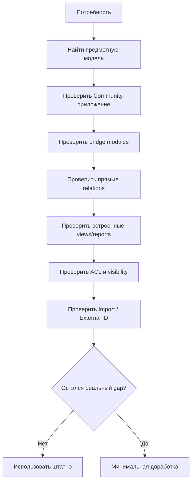

# Штатные интеграции Project в Odoo 19 Community

[Главная](../README.md) · [00 Возможности](00-odoo19-community.md) · [07 Углублённый аудит](07-deep-community-audit.md) · **08 Интеграции Project**

---

Этот документ фиксирует отдельный слой аудита: **штатные Community-модули, которые автоматически связывают Project с другими предметными приложениями**.

Главный вывод:

> Перед созданием собственного поля или интеграционного модуля недостаточно проверить только `project` и целевое приложение. Нужно проверить семейство `project_*`, `hr_*`, `stock_*` и другие auto-install bridge modules.

## 1. Почему это важно

Ранее можно было сделать слишком ранний вывод:

```text
Project существует
Inventory существует
→ связи нет
→ нужен custom module
```

Для Odoo это неверный способ аудита.

Правильная последовательность:

```text
модель A
→ модель B
→ bridge modules
→ реальные встроенные связи
→ встроенная аналитика
→ только затем residual gap
```

## 2. Подтверждённые Project bridge modules

В публичной ветке `odoo/odoo:19.0` подтверждены, среди прочего:

| Установленные контуры | Auto-install bridge | Что добавляет |
|---|---|---|
| Project + Accounting | `project_account` | profitability sections, analytic costs/revenues, vendor bills |
| Project + Purchase | `project_purchase` | Purchase Order → Project и мониторинг закупок проекта |
| Project + Inventory | `project_stock` | Stock Picking → Project |
| Project + Stock Accounting | `project_stock_account` | analytic accounting stock movements по Project |
| Project + Expenses | `project_hr_expense` | расходы analytic account в Project |
| Project + Manufacturing | `project_mrp` / связанные account bridges | manufacturing records → Project; вне базового контура отдела |

Это не означает, что все эти приложения нужно ставить. Это означает, что **их нельзя объявлять несвязанными заранее**.

## 3. Project ↔ Analytic Account — связь уже в базовом Community Project

Публичная модель `project.project` содержит:

```python
account_id = fields.Many2one('account.analytic.account', ...)
analytic_account_balance = fields.Monetary(related="account_id.balance")
```

Сам `project` зависит от `analytic`.

Следовательно, Analytic Account является штатным финансово-аналитическим измерением проекта, а не внешним костылём.

Источник: [`addons/project/models/project_project.py`](https://github.com/odoo/odoo/blob/19.0/addons/project/models/project_project.py).

### Методическое решение

Analytic Account использовать **только если существует финансовый/стоимостной вопрос**:

- затраты инициативы;
- доходы инициативы;
- расходы/закупки/материалы, связанные с Project;
- profitability.

Не использовать Analytic Account вместо:

- Stage;
- Process Property;
- Task classification;
- организационной очереди.

## 4. `project_account`: Project получает profitability из бухгалтерских и analytic данных

Публичный Community bridge [`project_account`](https://github.com/odoo/odoo/blob/19.0/addons/project_account/__manifest__.py):

```text
summary = project profitability items computation
depends = account + project
auto_install = True
```

Модуль добавляет в profitability, среди прочего:

- Vendor Bills;
- Other Costs;
- Other Revenues.

Исходный код использует:

```text
Project.account_id
account.move.line.analytic_distribution
account.analytic.line
```

и умеет открывать связанные bills / analytic lines из секций profitability.

Источник: [`project_account/models/project_project.py`](https://github.com/odoo/odoo/blob/19.0/addons/project_account/models/project_project.py).

### Официальная документация

[Project profitability](https://www.odoo.com/documentation/19.0/applications/services/project/project_management/project_profitability.html) описывает dashboard costs/revenues, формируемые из записей, связанных с Project и его Analytic Account.

Документация перечисляет потенциальные источники:

- Timesheets;
- materials;
- Purchase Orders;
- Expenses;
- Vendor Bills;
- Manufacturing Orders;
- other analytic costs/revenues.

### Важная оговорка Community

Документация описывает итоговый продукт с набором установленных приложений. Наличие каждой строки profitability в конкретной Community-базе зависит от того, установлен ли соответствующий публичный bridge и его зависимости.

Поэтому не пишем:

> «Community всегда показывает полный profitability dashboard».

Пишем:

> **Community Project имеет публичную модульную инфраструктуру profitability, которая расширяется штатными bridge modules в зависимости от установленных приложений.**

## 5. Project ↔ Purchase — прямая штатная связь

Публичный [`project_purchase`](https://github.com/odoo/odoo/blob/19.0/addons/project_purchase/__manifest__.py) автоматически устанавливается при нужных зависимостях.

В `purchase.order` он добавляет:

```python
project_id = fields.Many2one('project.project', ...)
```

Источник: [`project_purchase/models/purchase_order.py`](https://github.com/odoo/odoo/blob/19.0/addons/project_purchase/models/purchase_order.py).

### Методический вывод

Если отдельная Project-инициатива реально имеет закупки, Purchase Order можно связывать с Project штатно.

Не нужно для этого:

- текстовое Property `Проект закупки`;
- ручная ссылка в Chatter;
- собственная таблица соответствий.

Но **Purchase Order не становится Project Task**. Это две разные сущности:

```text
Project Task = обязательство / результат
Purchase Order = закупочный документ
```

## 6. Project ↔ Inventory — прямая связь Stock Picking → Project

Публичный [`project_stock`](https://github.com/odoo/odoo/blob/19.0/addons/project_stock/__manifest__.py) имеет назначение:

```text
Link Stock pickings to Project
```

Он добавляет в `stock.picking`:

```python
project_id = fields.Many2one('project.project', ...)
```

Источник: [`project_stock/models/stock_picking.py`](https://github.com/odoo/odoo/blob/19.0/addons/project_stock/models/stock_picking.py).

### Методический вывод

Если материальное перемещение относится к отдельной инициативе, связь Picking → Project уже предусмотрена Community.

Это **не** означает наличие связи:

```text
Project Task → конкретный serial/lot/equipment
```

Поэтому уровни нужно различать:

```text
Stock Picking → Project       [подтверждено штатно]
Task → Stock Picking          [не считать автоматически существующим]
Task → Serial/Lot             [не подтверждено как штатное поле Project]
Task → Maintenance Equipment  [не подтверждено как штатное поле Project]
```

## 7. `project_stock_account`: stock movements могут участвовать в project analytics

Публичный [`project_stock_account`](https://github.com/odoo/odoo/blob/19.0/addons/project_stock_account/__manifest__.py) описан как:

```text
Handle analytics in Stock pickings with Project
```

Он зависит от Stock Accounting и `project_stock` и устанавливается автоматически.

### Методический вывод

Для инициатив с материальными затратами существует штатная дорога:

```text
Inventory movement
→ Project
→ analytic layer
→ project financial analytics
```

Не следует заранее проектировать отдельную таблицу «затраты материалов проекта», пока штатная связка не проверена на пилоте.

## 8. Project ↔ Expenses

Публичный [`project_hr_expense`](https://github.com/odoo/odoo/blob/19.0/addons/project_hr_expense/__manifest__.py) связывает Project и Expenses через analytic account.

Описание модуля:

```text
Bridge created to add the number of expenses linked to an AA to a project form
```

### Методический вывод

Если расходы сотрудника относятся к отдельной Project-инициативе, сначала использовать штатную analytic integration.

Не создавать дублирующую Project Task на каждый Expense только ради того, чтобы он появился в контроле проекта.

Task нужна только если существует отдельное обязательство поверх expense workflow.

## 9. Project profitability — использовать только в правильном контексте

Официальная документация говорит, что profitability отображается **для billable projects**.

Для нашего постоянного операционного Project это важная граница.

### Операционная очередь отдела

Основные вопросы:

- backlog;
- сроки;
- Waiting;
- external waiting;
- throughput;
- working time to assign/close.

Profitability может вообще быть не нужна.

### Самостоятельная инициатива

Если есть:

- бюджет/затраты;
- закупки;
- материалы;
- расходы;
- экономический результат;

тогда финансово-аналитический слой Project становится осмысленным.

Не включать Accounting/Purchase/Inventory в пилот операционной очереди только ради того, что интеграция существует.

## 10. Budget Management — всё ещё не считаем гарантированной Community-функцией

Официальный Project Dashboard документирует Budget section.

Публичный `account` содержит setting:

```text
module_account_budget = Budget Management
```

Но публичный `addons/account_budget` в `odoo/odoo:19.0` не найден.

Поэтому:

- Analytic Accounting — Community подтверждено;
- Project profitability bridge infrastructure — Community подтверждена частично публичными модулями;
- Budget Management — **не включать в гарантированный CE baseline** без отдельного подтверждения конкретной сборки/редакции.

## 11. Import relational fields сильнее, чем просто «CSV загрузка»

Официальная документация Odoo 19 подтверждает импорт relational fields.

Поддерживаются ссылки через:

- имя связанной записи;
- Database ID;
- External ID.

Для стабильной интеграции справочников рекомендуется External ID.

Пример:

```text
Vehicle External ID = vehicle_000123
Employee External ID = employee_000045
```

Для связанного поля используется формат:

```text
Поле/External ID
```

Документация также подтверждает:

- предварительный импорт связанных records;
- Many2many imports;
- One2many imports;
- повторный массовый update при сохранении External ID;
- import-compatible export.

Источник: [Export and import data](https://www.odoo.com/documentation/19.0/applications/essentials/export_import_data.html).

### Методический вывод

Внешний справочник, который регулярно обновляется из другой системы, должен с первого импорта получать **стабильный External ID**.

Это существенно лучше связывает данные, чем поиск только по наименованию.

### Но это не создаёт отсутствующее поле

Import умеет заполнить существующую Many2one/M2M/O2M связь.

Он **не может создать отношение, которого нет в модели**.

Например, отсутствие стандартного:

```text
project.task.vehicle_id
```

не решается тем, что Fleet Vehicle имеет External ID.

## 12. Security — сначала стандартные права приложений и Project visibility

Официальная документация Odoo 19 разделяет:

1. application/model access rights;
2. более детальные groups;
3. record rules как второй уровень ограничения записей.

Odoo отдельно предупреждает, что неправильные изменения технических access rights могут повредить доступ к базе.

Источник: [Access rights](https://www.odoo.com/documentation/19.0/applications/general/users/access_rights.html).

### Для Project отдельно подтверждены

- Invited internal users;
- All internal users;
- режим с portal collaborators;
- collaborator access `Read`;
- `Edit with limited access`;
- `Edit`.

Источник: [Project management — Visibility and collaboration](https://www.odoo.com/documentation/19.0/applications/services/project/project_management.html).

### Методическое решение

На пилоте:

```text
application access rights
→ Project visibility
→ реальные тестовые пользователи
→ проверка чтения/создания/изменения
```

И только после доказанного ограничения:

```text
custom groups / record rules
```

Не строить техническую security-модель на бумаге без проверки фактических ACL каждого установленного приложения.

## 13. Cross-app security нужно тестировать как отдельный сценарий

При появлении bridge modules вопрос становится сложнее.

Пример:

```text
пользователь видит Project
но не имеет Purchase rights
```

Он не обязан автоматически видеть Purchase Order только потому, что та связана с Project.

То же относится к:

- Accounting;
- Expenses;
- Inventory;
- HR;
- Fleet;
- Maintenance.

### Поэтому для каждой интеграции в пилоте фиксировать

```text
роль
→ исходное приложение
→ связанный Project
→ видит ли smart button/section
→ может ли открыть record
→ может ли изменить record
```

Это безопаснее, чем заранее ослаблять ACL ради «единого окна».

## 14. Обновлённая карта остаточных gaps

После проверки Project bridges часть потенциальных gaps исчезла.

### Уже не gaps

```text
Purchase Order → Project
Stock Picking → Project
Project → Analytic Account
Project profitability from supported analytic/account sources
Employee ↔ Fleet history
Employee ↔ Maintenance allocation
Inventory serial/location ↔ Maintenance Equipment [частично через stock_maintenance]
```

### Всё ещё реальные/возможные gaps

```text
Project Task → Fleet Vehicle
Project Task → arbitrary Employee as analyzed subject
Project Task → Maintenance Equipment
Project Task → Stock Serial/Lot
универсальный Project Task → arbitrary business master record
агрегированный SLA / time-in-stage analytics
arbitrary capacity/shift planning
жёсткая BPM transition matrix по ролям
```

Каждый из них ещё требует проверки реального процесса до разработки.

## 15. Главный архитектурный вывод третьего прохода

Odoo 19 Community — это не набор изолированных приложений. Значительная часть силы платформы находится в небольших **auto-install bridge modules**, которые появляются только при сочетании приложений.

Поэтому технический аудит любой новой потребности теперь выполняется так:



Только последний шаг является основанием для собственного модуля.

---

[← 07 — Углублённый аудит](07-deep-community-audit.md) · [Главная](../README.md)
