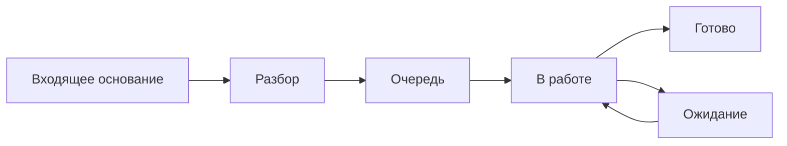
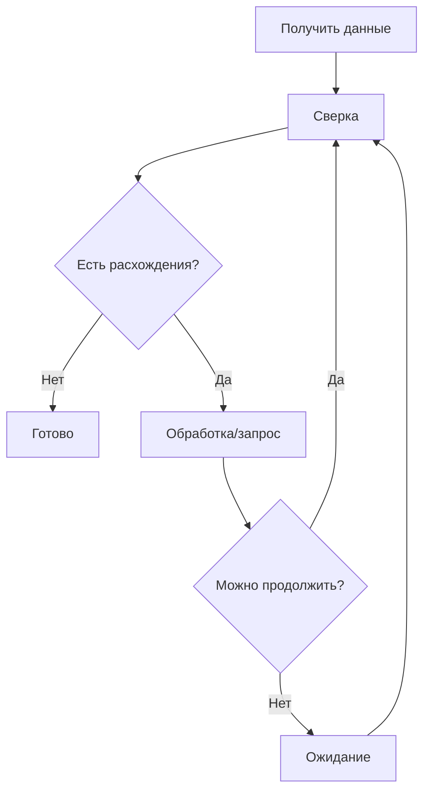
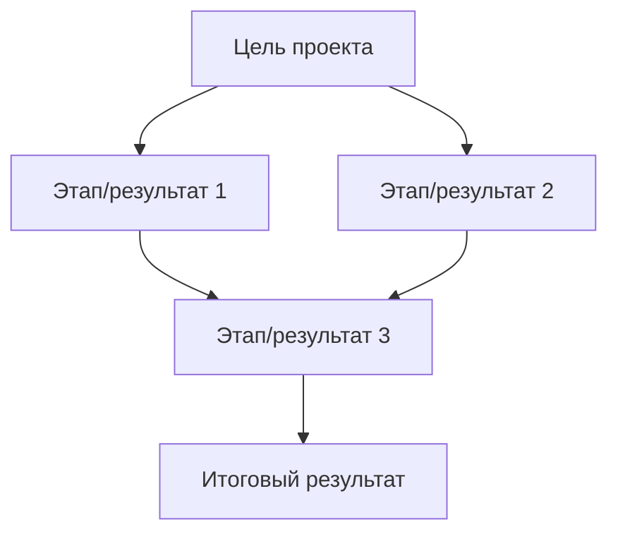

# Каталог бизнес-процессов

## 1. Назначение

Каталог задаёт единый способ описания устойчивых бизнес-процессов подразделения.

Документ намеренно обезличен: в нём используются типовые классы процессов, а не реальные названия функций, систем, документов или подразделений.

Каждый новый процесс описывается по одной структуре и затем связывается с Category рабочего контура.

## 2. Карточка процесса

Для каждого устойчивого процесса должна существовать одна карточка:

```text
Название процесса:
<краткое устойчивое название>

Category:
<точное значение в рабочей системе>

Назначение:
<зачем процесс существует>

Триггер:
<что запускает работу>

Вход:
<какие основания/данные необходимы>

Единица результата:
<что является одной независимо контролируемой работой>

Definition of Done:
<когда работа считается завершённой>

Типовой владелец:
<роль/группа>

Срок:
<внешний или внутренний норматив>

Типовые причины ожидания:
<краткий список>

Правило разбиения:
<когда одна работа делится на несколько>

Контроль качества:
<что проверяется выборочно>

Основные риски:
<где процесс теряет срок/качество/управляемость>

Кандидаты на автоматизацию:
<повторяющиеся ручные операции>
```

---

# 3. Архетип A. Обработка входящего основания

## Назначение

Получить входящее основание, выполнить требуемые изменения или обработку и завершить обязательный результат.

## Триггер

Получено внешнее основание, требующее действий.

## Поток



## Единица результата

Один логический пакет изменений, который имеет одного владельца и может быть независимо завершён.

## DoD

Требуемые действия выполнены, результат сохранён, открытых обязательных действий по основанию нет.

## Основные риски

- неполные входные данные;
- несколько писем по одному основанию;
- потеря дополнительного файла;
- слишком крупный пакет;
- преждевременное закрытие;
- новое требование ошибочно оформляется reopen.

---

# 4. Архетип B. Сверка и контроль расхождений

## Назначение

Сопоставить несколько источников данных, выявить расхождения и довести требуемые корректирующие действия до результата.

## Триггер

Наступление периода, получение набора данных либо отдельное поручение.

## Поток



## Единица результата

Одна сверка за установленный период/контур либо один отдельно контролируемый пакет расхождений.

## DoD

Сверка завершена, обязательные корректирующие действия выполнены либо вынесены в самостоятельные контролируемые Work Package.

## Основные риски

- бесконечная карточка на несколько периодов;
- отсутствие отдельного контроля нерешённых расхождений;
- смешивание анализа и исполнения нескольких владельцев в одной Work Package;
- ручная операция повторяется системно, но не попадает в backlog улучшений.

---

# 5. Архетип C. Самостоятельный исходящий запрос

## Назначение

Получить от внешней стороны результат, необходимый как самостоятельный объект контроля.

## Поток

`Очередь → В работе → Ожидание → В работе/Готово`

## Единица результата

Один запрос с собственным сроком и владельцем.

## DoD

Требуемый ответ/документ/подтверждение получены и дальнейшего сопровождения не требуется.

## Основные риски

- создавать отдельный запрос на каждое письмо;
- после отправки оставлять `В работе`;
- снимать владельца в `Ожидание`;
- забывать запрос после отправки.

---

# 6. Архетип D. Периодический отчёт

## Назначение

Подготовить установленный результат к определённому календарному сроку.

## Триггер

Наступление периода.

## Единица результата

Один отчёт/результат за один период.

## DoD

Результат сформирован, проверен в объёме процесса и передан/сохранён согласно принятому порядку.

## Правило

Каждый период — отдельная Work Package.

## Основные риски

- работа не создана заранее;
- используется одна вечная карточка;
- срок периода не задан;
- процесс подготовки разбит на лишние мелкие карточки одного исполнителя.

---

# 7. Архетип E. Разовая аналитическая работа

## Назначение

Подготовить уникальный аналитический результат по разовому поручению.

## Единица результата

Один законченный аналитический результат.

## Правило декомпозиции

Одна Work Package используется, пока работа имеет одного основного владельца и единый результат.

Parent/child используется при нескольких независимо контролируемых направлениях.

Отдельный Project создаётся только при реальной проектной структуре.

## Основные риски

- создать отдельный Project без необходимости;
- слишком рано дробить работу на технические шаги;
- не определить, что именно является конечным результатом.

---

# 8. Архетип F. Проектная инициатива

## Назначение

Достичь нового комплексного результата через несколько взаимосвязанных работ.

## Признаки

- несколько самостоятельных результатов;
- несколько владельцев;
- этапность;
- зависимости;
- значительная длительность;
- отдельные управленческие решения.

## Структура



## Основные риски

- проект создаётся под обычное поручение;
- операционная рутина смешивается с проектными этапами;
- проект не имеет однозначного конечного результата;
- завершение проекта подменяется закрытием отдельных карточек.

---

# 9. Архетип G. Улучшение/автоматизация

## Назначение

Зафиксировать системную проблему и провести её от наблюдения до решения о реализации.

## Триггер

Повторяющаяся проблема, ручная операция, задержка, дефект качества или предложение.

## Поток backlog

`Inbox → Наблюдаем → Разобрать → Кандидат → Готово к реализации`

## DoD идеи

Идея сама по себе не является обязательной работой. Она считается подготовленной к реализации, когда:

- проблема подтверждена;
- понятен ожидаемый эффект;
- определён реалистичный способ изменения;
- принято решение выделить ресурс.

## Основные риски

- фиксировать решение без описания проблемы;
- хранить неактуальные идеи бесконечно;
- считать весь backlog обязательством;
- запускать автоматизацию до подтверждения повторяемости проблемы.

---

# 10. Правило добавления реального процесса

Новый процесс добавляется в каталог только если:

1. он повторяется;
2. имеет устойчивый триггер;
3. имеет однозначный конечный результат;
4. требует собственного Definition of Done или норматива;
5. его выделение улучшает управляемость.

Разовая тема или конкретный документ не являются бизнес-процессом.

## 11. Контроль консистентности каталога

Для каждого Category должно быть найдено ровно одно описание устойчивого процесса.

Если несколько Category ссылаются на один и тот же процесс без различий в DoD/сроке/владельце, справочник требует укрупнения.

Если одна Category объединяет процессы с принципиально разными результатами и правилами, требуется разделение.