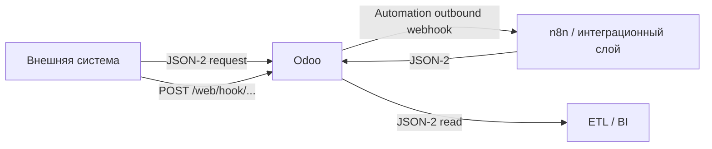

# API и внешние интеграции Odoo 19 Community

[Главная](../README.md) · [07 Углублённый аудит](07-deep-community-audit.md) · [08 Интеграции Project](08-project-integrations.md) · [09 Project и безопасность](09-project-productivity-security.md) · **10 API и интеграции**

---

Этот документ фиксирует штатные способы интеграции **Odoo 19 Community** с внешними системами и будущей аналитикой.

Главный принцип:

> Интеграция должна использовать поддерживаемую модель Odoo и её права доступа. Прямое изменение PostgreSQL не является заменой ORM/API.

## 1. В Odoo 19 появился новый JSON-2 API

Официальная документация Odoo 19 помечает External JSON-2 API как:

```text
New in version 19.0
```

Основной endpoint:

```text
POST /json/2/<model>/<method>
```

Аутентификация:

```text
Authorization: bearer <API key>
```

Источник: [External JSON-2 API](https://www.odoo.com/documentation/19.0/developer/reference/external_api.html).

## 2. JSON-2 реально присутствует в публичном Community source

Коммерческая документация Odoo содержит примечание о pricing plan для hosted-сервиса. Для on-premise Community этого недостаточно, поэтому наличие endpoint проверено по исходному коду.

Публичный модуль [`rpc`](https://github.com/odoo/odoo/blob/19.0/addons/rpc/__manifest__.py):

```text
license = LGPL-3
auto_install = True
```

Публичный controller [`addons/rpc/controllers/json2.py`](https://github.com/odoo/odoo/blob/19.0/addons/rpc/controllers/json2.py) содержит:

```python
@http.route(
    '/json/2/<__model__>/<__method__>',
    methods=['POST'],
    auth='bearer',
    type='json2',
)
```

### Методический вывод

Для **self-hosted Odoo 19 Community** сам JSON-2 endpoint является частью публичного Community-кода.

Не переносить коммерческое ограничение Odoo Online/hosted pricing на on-premise CE без проверки фактической сборки.

## 3. API Keys также присутствуют в базовом Community

Публичный `base` содержит:

- модель/логику API keys;
- `res_users_apikeys_views.xml`;
- bearer authentication через `ir_http`.

Официальная документация JSON-2 рекомендует отдельного dedicated bot user для автоматизированных интеграций.

### Методическое решение

Для внешней интеграции:

```text
отдельный технический пользователь
→ минимально необходимые access rights
→ отдельный API key
→ ограниченный scope интеграции
```

Не использовать API key администратора для BI/n8n только ради удобства.

## 4. `/doc` — динамическая документация конкретной базы

Это одна из наиболее полезных находок Odoo 19.

Публичный auto-install модуль [`api_doc`](https://github.com/odoo/odoo/blob/19.0/addons/api_doc/__manifest__.py) создаёт динамическую страницу:

```text
/doc
```

Она генерируется **из конкретной базы** и показывает:

- установленные модели;
- поля;
- доступные методы;
- примеры API-вызовов;
- playground для HTTP API.

Официальная JSON-2 документация также прямо рекомендует смотреть фактические модели/поля/методы базы через `/doc`.

### Права

Публичный `api_doc/security/res_groups.xml` создаёт группу:

```text
Technical Documentation
```

и предоставляет её системным администраторам.

### Методический вывод

Перед написанием любой интеграции не угадывать API по интернет-статье.

Правильный порядок:

```text
установить нужные Community-модули
→ открыть /doc на тестовой базе
→ проверить model / field / method
→ проверить доступ технического пользователя
→ только затем писать интеграцию
```

## 5. XML-RPC / JSON-RPC — legacy, не новый фундамент

Odoo 19 всё ещё содержит публичный модуль `rpc` с `/xmlrpc` и `/jsonrpc` endpoints.

Однако официальная документация Odoo 19 помечает старый External RPC API как deprecated и направляет новые интеграции на JSON-2.

### Методическое решение

Новая интеграция:

```text
JSON-2
```

Legacy RPC использовать только для существующей интеграции, которую пока экономически нецелесообразно мигрировать.

Не строить новый BI/n8n слой на XML-RPC в Odoo 19.

## 6. API не обходит безопасность Odoo

Официальная JSON-2 документация подчёркивает, что вызовы выполняются с:

- access rights пользователя;
- record rules пользователя;
- allowed companies пользователя;
- указанным context.

### Следствие

API-user должен видеть **ровно те записи**, которые имеет право выгружать/менять.

Не решать ошибку API-доступа выдачей техническому пользователю Administrator без анализа ACL.

## 7. JSON-2 для аналитики

Для внешней аналитики JSON-2 подходит как поддерживаемый слой чтения данных Odoo.

Типовой контур:

```text
Odoo model
→ JSON-2 read/search_read
→ ETL / n8n / Python
→ аналитическое хранилище / BI
```

### Что это даёт

- сохраняется ORM-модель;
- соблюдаются access rights;
- не требуется зависеть от внутренней структуры таблиц PostgreSQL;
- можно использовать технические имена из `/doc`;
- upgrade Odoo меньше привязывает интеграцию к физической схеме таблиц.

### Чего JSON-2 не решает автоматически

- проектирование витрины;
- дедупликацию источников;
- historical snapshots;
- сложную cross-model бизнес-логику;
- высоконагруженную BI-архитектуру.

Это API, а не готовое хранилище данных.

## 8. Import/Export и JSON-2 решают разные задачи

### Import/Export

Лучше для:

- первичной загрузки справочника;
- периодического управляемого bulk update;
- разового переноса данных;
- пользовательского контроля перед импортом.

### JSON-2

Лучше для:

- регулярной системной интеграции;
- автоматизированного чтения;
- автоматизированного обновления;
- BI/ETL;
- интеграции с n8n/Python/другой системой.

Не писать API-интеграцию, если один контролируемый импорт раз в квартал решает задачу дешевле и надёжнее.

## 9. External ID остаётся важным и при API

Даже при JSON-2 внешняя система должна иметь устойчивый способ идентифицировать сущность.

Для справочников предпочтительно сохранять стабильный External ID, если модель интеграции это допускает.

Не связывать долгоживущую интеграцию только по:

- имени;
- ФИО;
- госномеру без нормализации;
- отображаемой строке Many2one.

Натуральный бизнес-ключ можно использовать, если он действительно уникален и контролируется, но это отдельное решение модели данных.

## 10. Входящие webhooks реально присутствуют в Community Automation Rules

Общая пользовательская документация webhooks находится в разделе Studio, поэтому одной документации недостаточно для CE-вывода.

Публичный Community [`base_automation`](https://github.com/odoo/odoo/blob/19.0/addons/base_automation/models/base_automation.py) подтверждает trigger:

```text
on_webhook
```

и поля:

```text
webhook_uuid
url = /web/hook/<uuid>
record_getter
log_webhook_calls
```

Также подтверждены:

- получение JSON payload;
- generated secret URL;
- выбор target record;
- логирование webhook calls;
- выполнение Automation actions после события.

### Методический вывод

В on-premise Community можно использовать входящий webhook как event-driven trigger без собственного controller, **если логика укладывается в безопасную Automation Rule**.

## 11. Исходящие webhooks также подтверждены в публичном Community source

Публичный базовый `ir.actions.server` содержит action type:

```text
Send Webhook Notification
```

и поля:

```text
Webhook URL
Webhook Fields
Sample Payload
```

Отправляется `POST` JSON с:

```text
_model
_id
_action
+ выбранные поля
```

Исходный код специально запрещает включать group-restricted fields в webhook payload, чтобы снизить риск утечки чувствительных данных.

Отправка выполняется post-commit и использует короткий timeout, чтобы медленный webhook не блокировал пользовательскую транзакцию.

Источник: [`odoo/addons/base/models/ir_actions.py`](https://github.com/odoo/odoo/blob/19.0/odoo/addons/base/models/ir_actions.py).

### Методический вывод

Для простого события:

```text
Odoo изменил запись
→ Automation Rule
→ Send Webhook Notification
→ n8n / внешняя система
```

собственный модуль может не потребоваться.

## 12. Webhook и JSON-2 — разные паттерны

### JSON-2

Внешняя система сама спрашивает Odoo:

```text
дай записи / измени запись
```

### Inbound webhook

Внешняя система сообщает Odoo:

```text
событие произошло
```

### Outbound webhook

Odoo сообщает внешней системе:

```text
запись изменилась / событие произошло
```

### Типовая архитектура



## 13. Webhook не должен содержать сложную бизнес-логику

Официальная документация Odoo отдельно предупреждает, что неправильно настроенный webhook может нарушить данные базы.

Правило методики:

Webhook подходит, когда:

```text
событие однозначно
→ payload понятен
→ target record однозначен
→ действие ограничено
→ есть тестовая база
→ можно проверить результат
```

Если требуется:

- сложная транзакционная логика;
- несколько зависимых записей;
- retries/idempotency;
- сложное сопоставление;
- обработка ошибок между системами;

лучше вынести orchestration в интеграционный слой или минимальный модуль.

## 14. Webhook secret URL — это секрет

Inbound webhook URL содержит UUID и фактически является секретом вызова.

Его нельзя:

- публиковать в репозитории;
- вставлять в открытую документацию;
- пересылать без необходимости;
- использовать один URL для разных интеграционных сценариев.

При компрометации URL secret должен быть rotated.

## 15. Automation Rules имеют больше triggers, чем мы первоначально учитывали

Публичный `base_automation` Odoo 19 подтверждает triggers:

- Stage is set to;
- User is set;
- Tag is added;
- State is set to;
- Priority is set to;
- archived / unarchived;
- create;
- create and edit;
- deletion;
- UI change;
- based on date field;
- after creation;
- after last update;
- incoming message;
- outgoing message;
- webhook.

### Методический вывод

Automation Rules технически мощнее, чем текущая базовая методика использует.

Но это **не аргумент автоматизировать больше**.

Сначала Task Template / Activity / Recurrence / штатный workflow; Automation — только на устойчивое детерминированное правило.

## 16. Time-based Automation умеет использовать Working Calendar

В public `base_automation` подтверждено поле:

```text
Use Calendar
```

для day-based timed condition.

Это позволяет считать автоматизацию по рабочим дням конкретного Resource Calendar, а не только по календарным суткам.

### Возможный полезный кейс

```text
через 2 рабочих дня после события
→ создать Activity / эскалировать
```

Но сначала проверить, не решается ли этот follow-up обычной Activity цепочкой проще.

## 17. Email events также могут быть Automation triggers

Community `base_automation` подтверждает:

```text
On incoming message
On outgoing message
```

для моделей с discussion/mail thread.

### Где это может быть полезно

Например, устойчивое правило:

```text
получено входящее сообщение по записи
→ создать конкретную Activity
```

### Ограничение

Не строить сложный email classifier на Automation Rules только потому, что trigger существует.

Для email intake в Project сначала использовать alias + triage.

## 18. Прямые SQL-записи в PostgreSQL не являются интеграционным API

Odoo business logic находится не только в таблицах, но и в:

- ORM methods;
- constraints;
- computed/inverse fields;
- access rights;
- record rules;
- mail tracking;
- automated actions;
- bridge modules.

Поэтому внешний `INSERT/UPDATE/DELETE` в таблицы Odoo может обходить часть этой логики.

### Правило

```text
write integration → ORM / JSON-2 / supported import / own module
```

Не использовать прямой SQL write как штатную интеграцию.

Read-only SQL для отдельной аналитической архитектуры — отдельное инфраструктурное решение, не click-only возможность Odoo и не базовый путь данной методики.

## 19. Интеграционный слой не должен становиться источником истины по Task state

Если n8n/Python интеграция работает вокруг Odoo:

- Stage хранится в Odoo;
- State хранится в Odoo;
- Assignee хранится в Odoo;
- Deadline хранится в Odoo;
- Activities хранятся в Odoo.

Внешний integration engine может преобразовывать события и данные, но не должен вести параллельную скрытую state machine для тех же Tasks без крайней необходимости.

## 20. Рекомендуемая иерархия интеграции

Перед собственной разработкой выбирать по порядку:

```text
ручная разовая загрузка
→ Import/Export

входящее письмо
→ Email Alias

простая web-форма
→ Website Form

внешнее событие → простое действие Odoo
→ Inbound Automation Webhook

событие Odoo → внешний сервис
→ Outbound Webhook Action

регулярный pull/read/write
→ JSON-2

сложная orchestration между системами
→ n8n / интеграционный сервис + JSON-2/Webhooks

требуется новая бизнес-модель или транзакционная логика внутри Odoo
→ минимальный custom module
```

## 21. Что проверить на тестовом стенде

### JSON-2

- открыть `/doc` под администратором;
- найти `project.task`;
- проверить поля и public methods;
- создать dedicated API user;
- создать API key;
- выполнить read/search_read;
- проверить, что пользователь не видит записи вне своих ACL.

### Inbound webhook

- создать тестовую Automation Rule `On webhook`;
- включить Log Calls;
- отправить безопасный test payload;
- проверить target record и действие;
- rotate secret после тестов, если URL использовался вне защищённого контура.

### Outbound webhook

- создать тестовое deterministic событие;
- отправить только безопасные поля;
- принять payload на тестовом n8n/webhook endpoint;
- проверить поведение при недоступном endpoint.

## 22. Итоговый вывод

Odoo 19 Community уже имеет полноценный набор интеграционных кирпичей:

```text
JSON-2
+ API keys
+ dynamic /doc
+ Import/Export
+ Email Alias
+ inbound webhooks
+ outbound webhook actions
+ Automation Rules
+ bridge modules
```

Поэтому будущая интеграция с BI, n8n и внешними справочниками **не требует заранее писать большой API-модуль вокруг Project**.

Сначала нужно испытать стандартные endpoints и права на реальных моделях базы. Собственный код нужен только там, где стандартные public methods/relations и automation actions не обеспечивают требуемую бизнес-логику.

---

[← 09 — Project и безопасность](09-project-productivity-security.md) · [Главная](../README.md)
